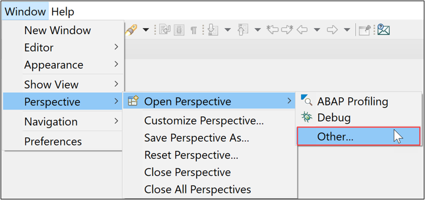
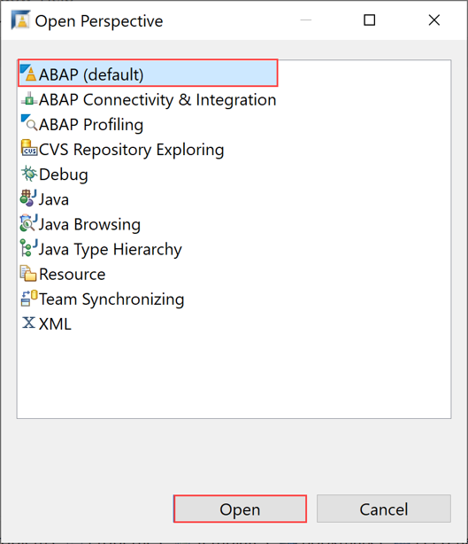
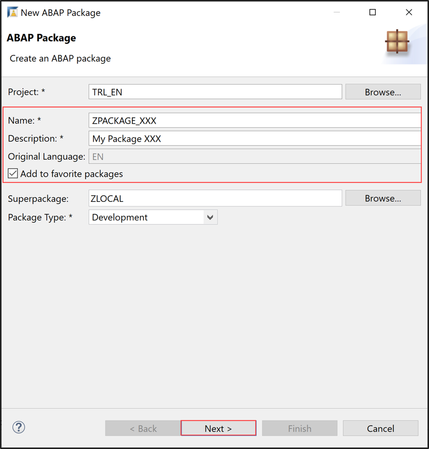
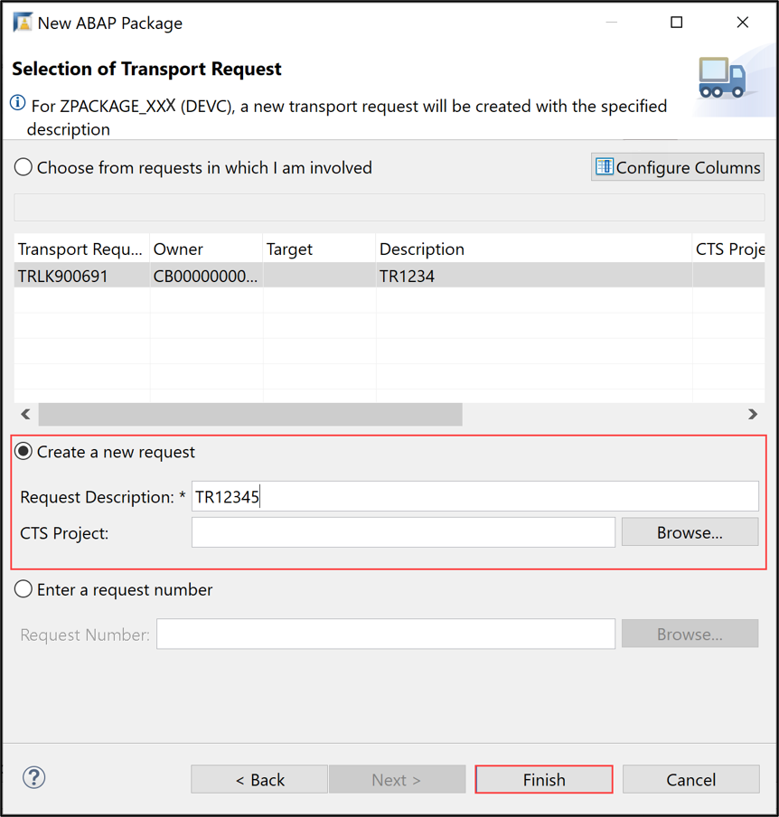

## Prerequisites  
-	You have purchased an entitlement to [SAP Cloud Platform, ABAP environment](https://cloudplatform.sap.com/capabilities/product-info.SAP-Cloud-Platform-ABAP-environment.4d0a6f95-42aa-4157-9932-d6014a68d825.html)
-	You have set up your ABAP environment as described in [Getting Started with a Customer Account: Workflow in the ABAP Environment](https://help.sap.com/viewer/65de2977205c403bbc107264b8eccf4b/Cloud/en-US/e34a329acc804c0e874496548183682f.html)
- You have a user in the ABAP Environment [Connect to the ABAP System](https://help.sap.com/viewer/65de2977205c403bbc107264b8eccf4b/Cloud/en-US/7379dbd2e1684119bc1dd28874bbbb7b.html)
- You have downloaded the ABAP Development Tools (ADT). SAP recommends the latest version of ADT, available from [ABAP Development Tools](https://tools.hana.ondemand.com/#abap)

## Details
### You will learn
  - How to create an ABAP Cloud Project in ADT
  - How to create an ABAP package
  - How to create an ABAP class
  - How to execute the application console

In this tutorial, wherever `XXX` appears, use a number (e.g. `000`) or your initials.

For more information, see:
- [SAP Help Portal: What is SAP Cloud Platform](https://help.sap.com/viewer/65de2977205c403bbc107264b8eccf4b/Cloud/en-US/73beb06e127f4e47b849aa95344aabe1.html)

---

[ACCORDION-BEGIN [Step 1: ](Open the ABAP Development Tools (ADT) )]
Open the ADT and change to the ABAP perspective, using the menu:


.


or the icon:


[DONE]
[ACCORDION-END]

[ACCORDION-BEGIN [Step 2: ](Create an ABAP Cloud project)]
1. In the ADT, select the menu path **File** > **New** > **Other**.

    

2. Search for ABAP Cloud Project, select it and click **Next**.

    

3. If you are using your **SAP Cloud Platform ABAP environment trial user**, then select **Service Key** and click **Next >**.

    If you want to use your **license user**, then skip **step 2.3** and move on with **step 2.4**.

    

    Paste your service key from the SAP Cloud Platform Trial Cockpit you created in [Create an SAP Cloud Platform ABAP Environment Trial User](abap-environment-trial-onboarding) in **Step 3.5**. Click **Next >** and move on with **step 2.5**.

    

4. As a **licensed user** select SAP Cloud Platform Cloud Foundry Environment and click **Next**.

    

    Maintain the SAP Cloud Platform Foundry connection information and click **Next**:
     - Region: **`<your_region>`**
     - Email: **`<your_email_address>`**
     - Password: **`<your_password>`**

     

     Maintain the required Service Instance details by selecting the appropriate values from the drop-down lists and move on with **Next**.
      - Organization: **`<your_organization>`**
      - Space: **`<your_space>`**
      - Service Instance: **`<your_service_instance>`**

    

5. Now provide your login credentials of the SAP Cloud Platform Identity Authentication Service (IAS) tenant to connect to the system and press Log On.

    

7. Connect to service instance by selecting **Next**.

    

8. At this stage you may add your favorite packages and click **Finish** to complete your setup.

    

[DONE]
[ACCORDION-END]


[ACCORDION-BEGIN [Step 3: ](Create ABAP package)]
  1. Right-click on the `ZLocal` package and select New > ABAP Package from the context menu.

      

  2. Provide the required information and move on with **Next**.
      - Name: `ZPackage_XXX`
      - Description: My Package

      

  3. Move on with **Next**.

      

  4. Provide a description for the transport request and click **Finish**.

      
     The ABAP package is now created.

[DONE]
[ACCORDION-END]

[ACCORDION-BEGIN [Step 4: ](Create new ABAP class)]
  1. Add a new ABAP class to your package.

      

  2. Maintain the required information and click **Next** to move on:   
      - Name: `Z_Class_XXX`
      - Description: My Class

      

  3. Provide a transport request and click **Finish**.

      

  4. Your class is now created.

      

[DONE]
[ACCORDION-END]

[ACCORDION-BEGIN [Step 5: ](Implement Interface)]
  1. In the class definition, specify the interface `IF_OO_ADT_CLASSRUN` in the public section as shown on the screenshot. Now go to the class implementation and provide the implementation of the method `IF_OO_ADT_CLASSRUN~MAIN`. As shown on the screenshot, it should output the text Hello World! using the code line below
`out->write('Hello World!').`

    ```ABAP
    CLASS z_class_xxx DEFINITION
      PUBLIC
      FINAL
      CREATE PUBLIC .

      PUBLIC SECTION.
        INTERFACES if_oo_adt_classrun.
      PROTECTED SECTION.
      PRIVATE SECTION.
    ENDCLASS.

    CLASS z_class_xxx IMPLEMENTATION.
      METHOD if_oo_adt_classrun~main.
        out->write('Hello world!').
      ENDMETHOD.
    ENDCLASS.
    ```

  2. Save and activate your changes.

      

[DONE]
[ACCORDION-END]

[ACCORDION-BEGIN [Step 6: ](Execute ABAP application)]
  1. Right-click your class and select **Run As** > **ABAP Application (Console)** or select your class and press **`F9`**.

      

  2. Check your result.

      

[DONE]
[ACCORDION-END]

[ACCORDION-BEGIN [Step 7: ](Test yourself)]
Write only the write statement with following information: Hello SAP Cloud Platform ABAP Environment!

[VALIDATE_1]
[ACCORDION-END]
