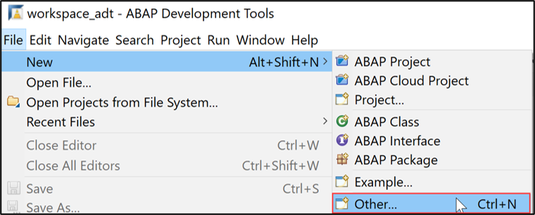
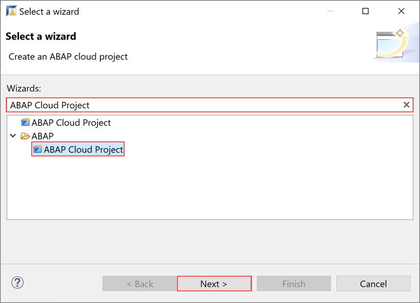
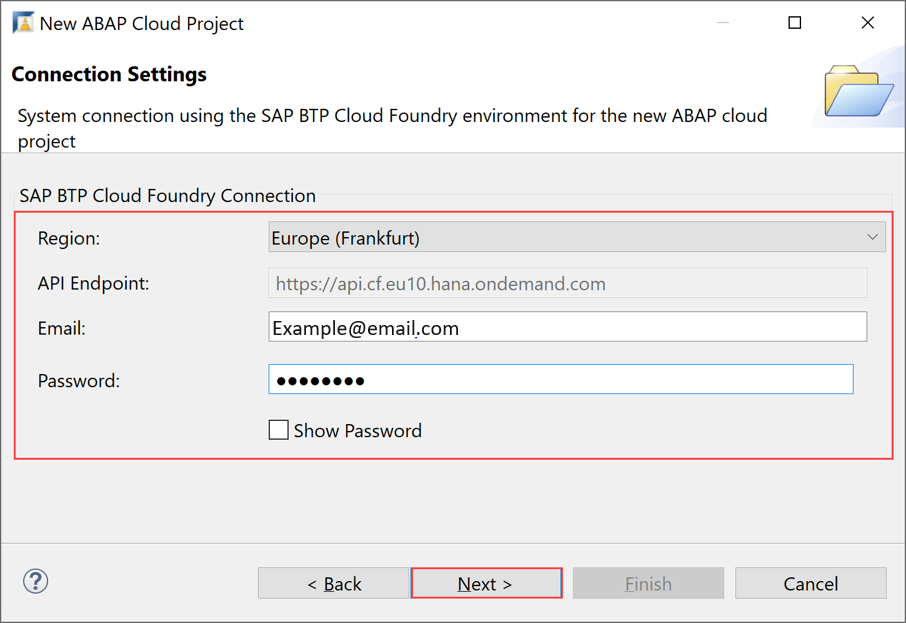
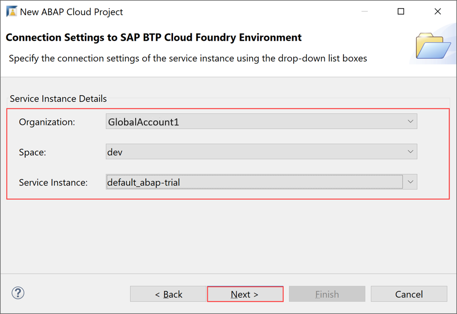
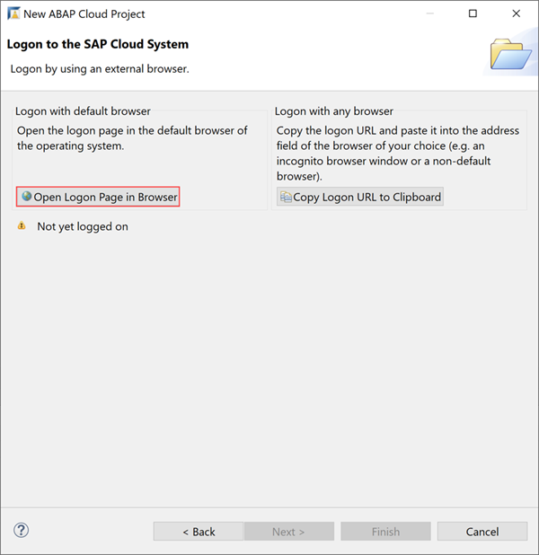
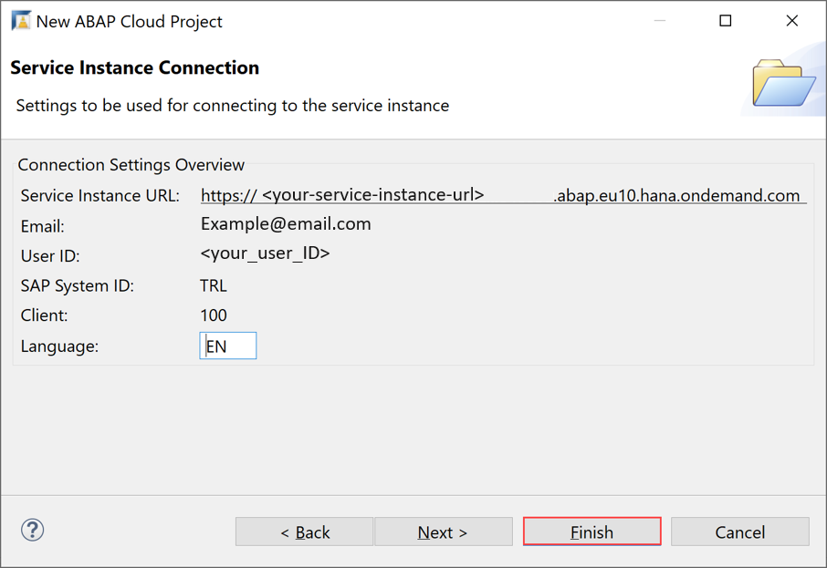
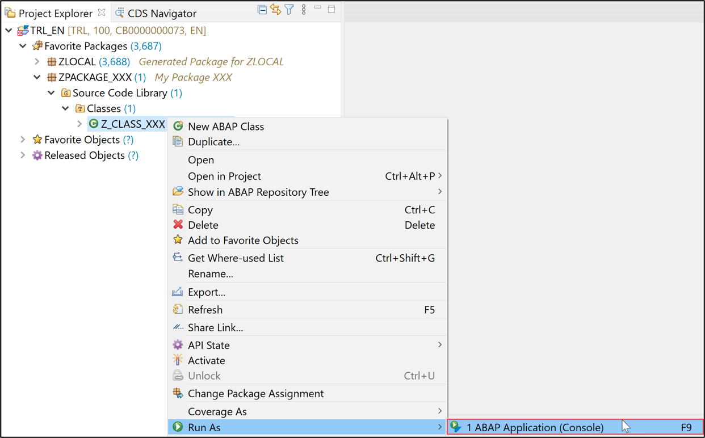
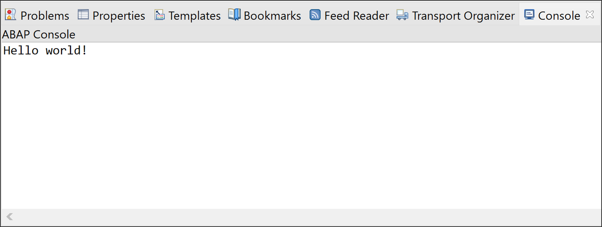

## Prerequisites  

**For ABAP license:**
-	You have set up your ABAP environment as described in [Getting Started with a Customer Account: Workflow in the ABAP Environment](https://help.sap.com/viewer/65de2977205c403bbc107264b8eccf4b/Cloud/en-US/e34a329acc804c0e874496548183682f.html)
- You have a user in the ABAP Environment [Connect to the ABAP System](https://help.sap.com/viewer/65de2977205c403bbc107264b8eccf4b/Cloud/en-US/7379dbd2e1684119bc1dd28874bbbb7b.html)
- You have downloaded the ABAP Development Tools (ADT). SAP recommends the latest version of ADT, available from [ABAP Development Tools](https://tools.hana.ondemand.com/#abap)
**For ABAP Trial:**
- You need an SAP BTP, ABAP environment [trial user](abap-environment-trial-onboarding).
- You have downloaded the ABAP Development Tools (ADT). SAP recommends the latest version of ADT, available from [ABAP Development Tools](https://tools.hana.ondemand.com/#abap)

## Details
### You will learn
  - How to create an ABAP cloud project in ADT
  - How to create an ABAP package
  - How to create an ABAP class
  - How to execute the application console

In this tutorial, wherever `XXX` appears, use a number (e.g. `000`) or your initials.

For more information, see:
- [SAP Help Portal: What is SAP BTP](https://help.sap.com/viewer/65de2977205c403bbc107264b8eccf4b/Cloud/en-US/6a2c1ab5a31b4ed9a2ce17a5329e1dd8.html)

---

[ACCORDION-BEGIN [Step 1: ](Open the ABAP Development Tools (ADT) )]
Open the ADT and change to the ABAP perspective, using the menu.

 

And select **ABAP** and click **Open**.

 

Or select the icon.

 

[DONE]
[ACCORDION-END]

[ACCORDION-BEGIN [Step 2: ](Create an ABAP Cloud project)]
1. In the ADT, select the menu path **File** > **New** > **Other**.

    

2. Search for ABAP Cloud Project, select it and click **Next**.

    

3. Select **Use Cloud Foundry Environment** in section **SAP BTP Cloud Foundry Environment** and click **Next >**

    

4. Enter your **connection settings**:
     - Region: choose your SAP BTP Cloud Foundry Environment region, for e.g. Europe (Frankfurt)
     - Email: your email address
     - Password: your password    

    

      Click **Next >**.

5. Set your **service instance details**:                                                                                             
     - Organization: `<your_organization>`
     - Space: dev
     - Service instance: `<your_service_instance>`

    

    Click **Next >**.

    >**HINT:** Your service instance is **`default_abap-trial`** when you use the **ABAP trial booster** on SAP BTP. If you create a manual instance, use your own instance name.

6. Click **Open Logon Page in Browser**.

    

7. Now you've been authenticated automatically. Provide your credentials if requested. The credentials are the same you used to create your trial account on SAP BTP.

    Go back to ADT.

    

    Click **Finish**.

[DONE]
[ACCORDION-END]


[ACCORDION-BEGIN [Step 3: ](Create ABAP package)]
  1. Right-click on the `ZLOCAL` and select **New** > **ABAP Package** from the context menu.

      

  2. Provide the required information and move on with **Next**.
      - Name: **`ZPACKAGE_XXX`**
      - Description: My Package XXX
      - **Check** Add to favorite packages.

      

      Click **Next >**.

  3. Create a new request and click **Finish**.

      

     The ABAP package is now created.

[DONE]
[ACCORDION-END]

[ACCORDION-BEGIN [Step 4: ](Create new ABAP class)]
  1. Add a new ABAP class to your package.

      

  2. Maintain the required information and click **Next** to move on:   
      - Name: **`Z_CLASS_XXX`**
      - Description: My class XXX

      

      Click **Next >**.

  3. Click **Finish**.

      

  4. Your class is now created.

      

[DONE]
[ACCORDION-END]

[ACCORDION-BEGIN [Step 5: ](Implement Interface)]
  1. In the class definition, specify the interface `IF_OO_ADT_CLASSRUN` in the public section as shown on the screenshot. Now go to the class implementation and provide the implementation of the method `IF_OO_ADT_CLASSRUN~MAIN`. As shown on the screenshot, it should output the text Hello World! using the code line below
`out->write('Hello World!').`

    ```ABAP
    CLASS z_class_xxx DEFINITION
      PUBLIC
      FINAL
      CREATE PUBLIC .

      PUBLIC SECTION.
        INTERFACES if_oo_adt_classrun.
      PROTECTED SECTION.
      PRIVATE SECTION.
    ENDCLASS.

    CLASS z_class_xxx IMPLEMENTATION.
      METHOD if_oo_adt_classrun~main.
        out->write('Hello world!').
      ENDMETHOD.
    ENDCLASS.
    ```

  2. Save and activate your changes.

      

[DONE]
[ACCORDION-END]

[ACCORDION-BEGIN [Step 6: ](Execute ABAP application)]
  1. Right-click your class and select **Run As** > **ABAP Application (Console)** or select your class and press **`F9`**.

      

  2. Check your result.

      

[DONE]
[ACCORDION-END]

[ACCORDION-BEGIN [Step 7: ](Test yourself)]
Write only the write statement with following information: Hello SAP Cloud Platform ABAP Environment!

[VALIDATE_1]
[ACCORDION-END]
