## Prerequisites  
- SAP Cloud Platform ABAP environment user
- Tutorial: Create Simple Database Table for ABAP Environment
- Business Catalog `SAP_CORE_BC_EXT_TST` assigned to your business user
- Initial development setup

## Details
### You will learn
- How to create a database table
- How to create a Core Data Service


---

[ACCORDION-BEGIN [Step 1: ](Open Eclipse)]
Select to your ABAP package created in tutorial **Create Simple Database Table for ABAP Environment** and create a Core Data Services (CDS) data definition.


[ACCORDION-END]

[ACCORDION-BEGIN [Step 2: ](Create data definition)]
1. Search for **data definition**, select it and click **Next**.


2. Enter a name and a description for your data definition `ZI_BOOKING_XXX`.
You may replace **`XXX`** with a number of your choice (e.g. 001).


3. Select a new transport request and click **Next**.


4. Select **Define View template** and press **Finish**.


[ACCORDION-END]

[ACCORDION-BEGIN [Step 3: ](Specify SQL view)]
1. Specify the `sql view name` in the view definition as **`ZV_BOOKING_XXX`**.
You may replace **`XXX`** with a number of your choice (e.g. 001).


2. Specify your data source after the select from statement as **`ztbooking_xxx`**.
You may replace **`XXX`** with a number of your choice (e.g. 001).


3. Specify your data definition as shown below.
The keyword key is used to specific a key element and the keyword as is used to define alias names. The two associations `I_Country` and `I_Currency` are defined and exposed in the projection. The element `CurrencyCode` is specified as currency key for the element Cost which is an amount field. The view entity is specified as searchable using the view annotation `@Search.searchable: true` and the element `CustomerName` is specified as default search element using the element annotation `@Search.defaultSearchElement: true`.

```swift

@AbapCatalog.sqlViewName 'ZV_BOOKING_XXX'
@AbapCatalog.compiler.compareFilter : true
@AbapCatalog.preserveKey: true
@AccessControl.authorizationCheck: #CHECK
@EndUserText.label : 'Data Definition Booking'
@Search.searchable : true
define view ZI_BOOKING_XXX
   as select from ztbooking_xxx as Booking
   association [0..1] to I_Country  as _Country  on $projection.country = _Country.country
   association [0..1] to I_Currency as _Currency on $projection.CurrencyCode = _Currency.Currency

   {
     key booking              as Booking,
         @Search.defaultSearchElement: true
         customername         as CustomerName,
         numberofpassengers   as NumberOfPassengers,
         emailaddress         as EmailAddress,
         country,
         dateofbooking        as DateOfBooking,
         dateoftravel         as DateOfTravel,
         @Semantics.amount.currencyCode: 'CurrencyCode'
         cost,
         @Semantics.currencyCode: true
         currencycode          as CurrencyCode,
         lastchangedat         as LastChangedAt,

         _Country,
         _Currency       
}

```
Save and activate.
[ACCORDION-END]

[ACCORDION-BEGIN [Step 4: ](Add UI annotation)]
1. Go back to the data definition and used the **`@UI`** annotations to add the UI-specific semantics. Add following UI annotation in front of your data definition.

```swift
@UI: {
  headerInfo: {
  typeName: 'Booking',
  typeNamePlural: 'Bookings',
  title: { type: #STANDARD, value: 'Booking' }
  }
}
```

2. Replace your code with following:

```swift
define root view ZI_Booking_XXX
  as select from ztbooking_xxx as Booking
  association [0..1] to I_Country  as _Country  on $projection.country = _Country.Country
  association [0..1] to I_Currency as _Currency on $projection.CurrencyCode = _Currency.Currency
{

      @UI.facet: [
        {
          id:       'Booking',
          purpose:  #STANDARD,
          type:     #IDENTIFICATION_REFERENCE,
          label:    'Booking',
          position: 10 }
      ]


      @UI: {
          lineItem: [ { position: 10, importance: #HIGH, label: 'Booking ID' } ],
          identification:[ { position: 10, label: 'Booking ID' } ]
          }
  key booking                                as Booking,

      @UI: {
        lineItem: [ { position: 20, label: 'Customer', importance: #HIGH } ],
        identification:[ { position: 10, label: 'Customer' } ]
      }
      @Search.defaultSearchElement: true
      customername                           as CustomerName,

      @UI: {
      lineItem: [ { position: 30, label: 'No of Passengers', importance: #HIGH } ],
      identification:[ { position: 30, label: 'No of Passengers' } ]
      }
      numberofpassengers                     as NumberOfPassengers,

      @UI: {
           identification:[ { position: 40, label: 'Email' } ]
       }
      emailaddress                           as EmailAddress,

      @UI: {
           identification:[ { position: 50, label: 'Country' } ]
       }
      country,

      @UI: {
           identification:[ { position: 60, label: 'Booked On' } ]
       }
      dateofbooking                          as DateOfBooking,

      @UI: {   identification:[ { position: 70, label: 'Traveling on' } ]    }
      dateoftravel                           as DateOfTravel,


      @UI: {
      lineItem: [ { position: 40, label: 'Cost', importance: #HIGH } ],
      identification:[ { position: 80, label: 'Cost' } ]
      }
      @Semantics.amount.currencyCode: 'CurrencyCode'
      cost,

      @UI: { identification:[ { position: 90, label: 'Currency' } ]     }
      @Semantics.currencyCode: true
      currencycode                           as CurrencyCode,

      @UI: { identification:[ { position: 100, label: 'Last Changed At' } ] }
      lastchangedat                          as LastChangedAt,

      //publich associations
      _Country,
      _Currency
}

```
Save and activate your data definition.
[ACCORDION-END]

[ACCORDION-BEGIN [Step 5: ](Open other repository object)]
Right-click on your package and navigate to **New** > **Other ABAP Repository Object** from the appearing context menu.


[ACCORDION-END]

[ACCORDION-BEGIN [Step 6: ](Create service definition)]
1. Search for **service definition**, select the appropriate entry and click **Next**.
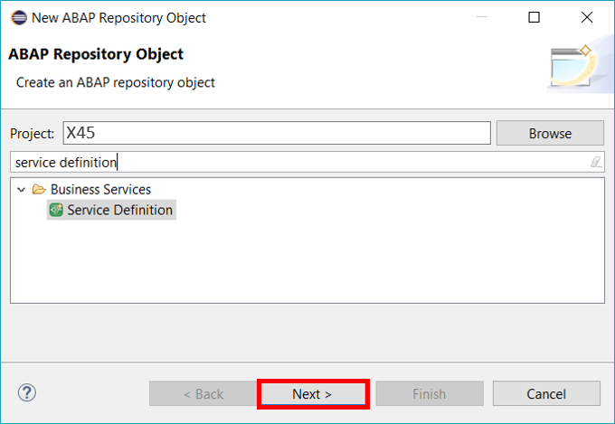

2. Create a Service definition:

 - Name: **`Z_I_BOOKING_XXX`**
You may replace **`XXX`** with a number of your choice (e.g. 001).


3. Click **Finish** to complete your transport request.


[ACCORDION-END]

[ACCORDION-BEGIN [Step 7: ](Expose entities)]
Expose the **`Z_I_Booking`** and the **`I_Country`** view entities.


Save and active your service definition.

[ACCORDION-END]

[ACCORDION-BEGIN [Step 8: ](Open other repository object)]
Right-click on your package and navigate to **New** > **Other ABAP Repository Object** from the appearing context menu.


[ACCORDION-END]

[ACCORDION-BEGIN [Step 9: ](Create service binding)]
1. Search for **service binding**, select the appropriate entry and click **Next**.
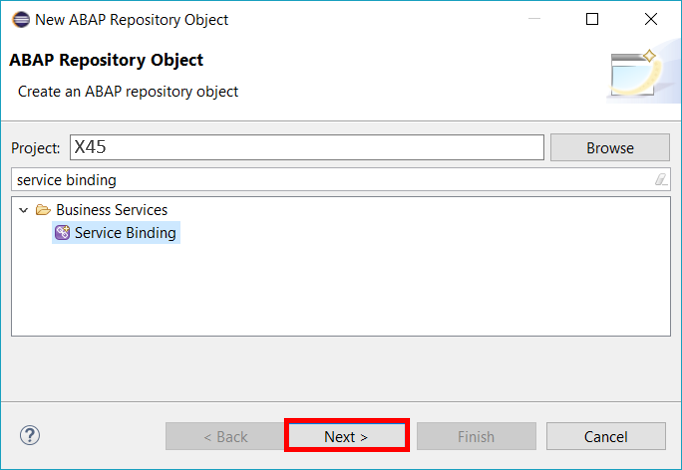

2. Create a service binding definition:
- Name: **`Z_I_BOOKING_XXX`**
You may replace **`XXX`** with a number of your choice (e.g. 001).


3. Click **Finish** to complete your transport request.


 Save and activate your service binding.
[ACCORDION-END]

[ACCORDION-BEGIN [Step 10: ](Publish locally)]
Click **Publish Locally** to publish your service binding.
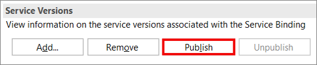

[ACCORDION-END]

[ACCORDION-BEGIN [Step 11: ](Check your metadata)]
1. Click on the created URL to see your result.
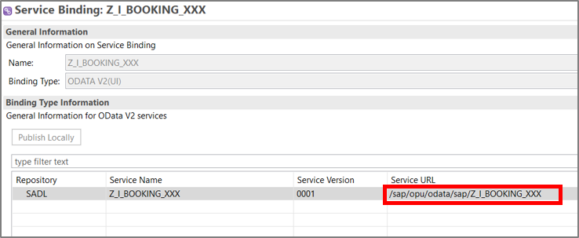

2. Sign in with your communication user and password.
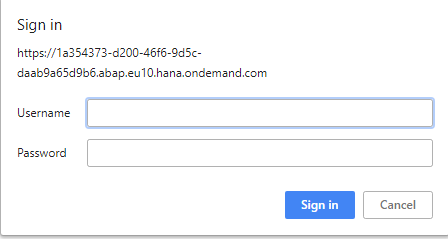

3. Check your result:


[ACCORDION-END]

[ACCORDION-BEGIN [Step 12: ](Open Fiori Element View)]
1. Go back to your service binding **`Z_I_BOOKING_XXX`**
   Open the preview for Fiori Elements App on the right side.
   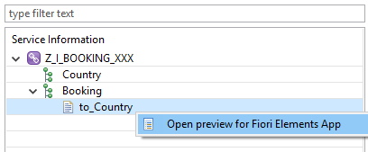

2. Check your result:
   

[ACCORDION-END]

[ACCORDION-BEGIN [Step 13: ](Open SAP Web IDE Full-Stack)]
1. Switch to your SAP Cloud Platform subaccount, select **Services** and search for **Web IDE Full-Stack** to select it.
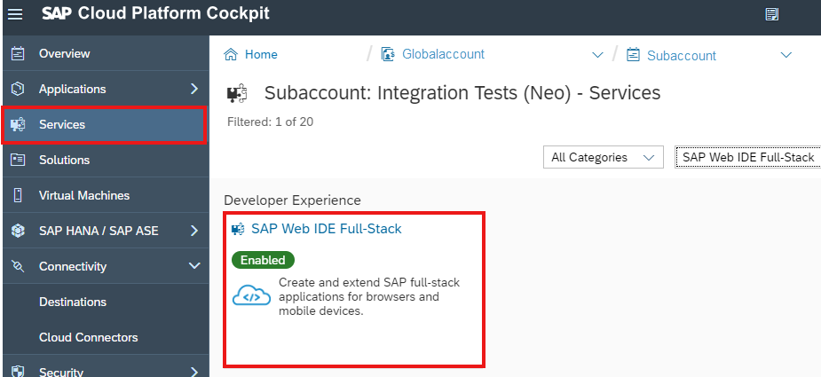

2. Click **Go to Service** to switch to SAP Web IDE Full-Stack.
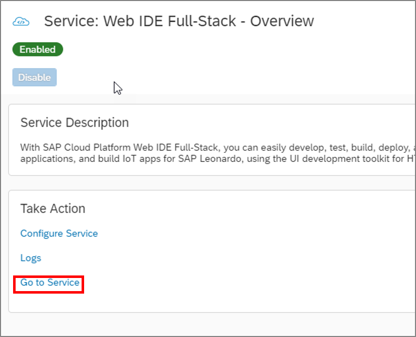

[ACCORDION-END]

[ACCORDION-BEGIN [Step 14: ](Create SAP Fiori List Report Application)]
1. Click on **New Project from Template** on the overview page.
 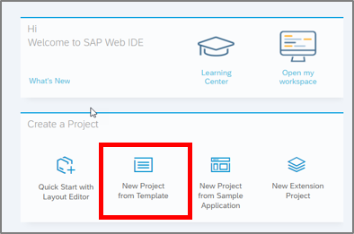

2. Select **List Report Application** and click **Next**.
 
3. Insert following data to your list report application and click **Next**:
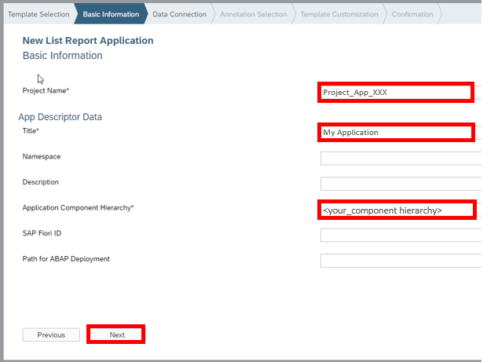
- Project Name: **`Project_App_XXX`**
- Title: **My Application**
- Application Component Hierarchy: **`<your_component_hierachy>`**

4. Click on **Service Catalog** and choose your system, which has already been created with your initial system setup. Search for your service **`Z_I_BOOKING_XXX`**, select it and click **Next**.
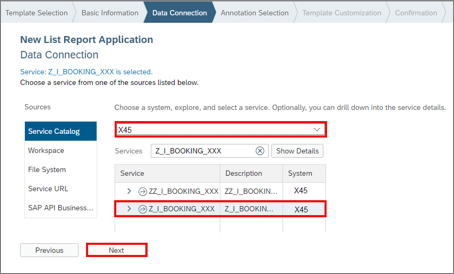

5. Select following annotation and click **Next**.
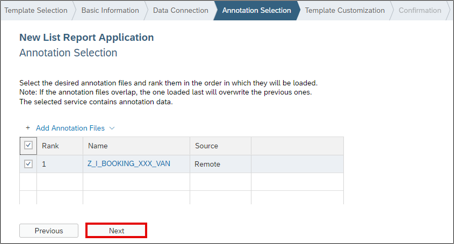

6. Select **Booking for OData Collection** and click **Finish**.
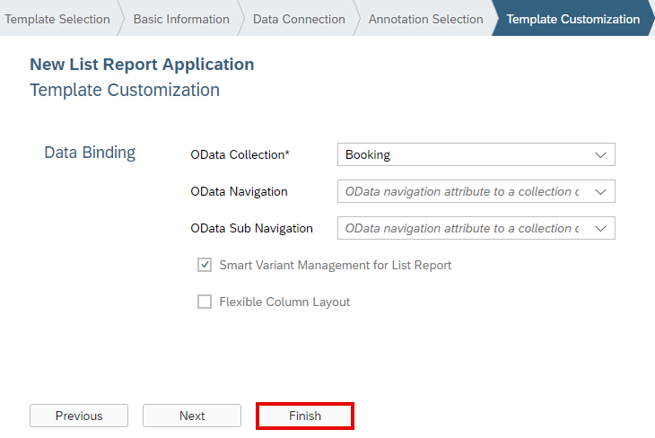

[ACCORDION-END]

[ACCORDION-BEGIN [Step 15: ](Check your result)]

1. Select your `js` file and click on the corresponding symbol to test your application.
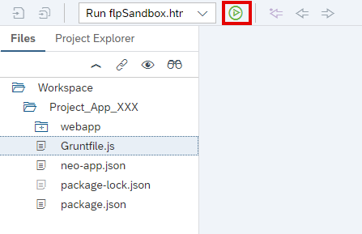

2. Click on your application **`Project_App_XXX`** to check your result.
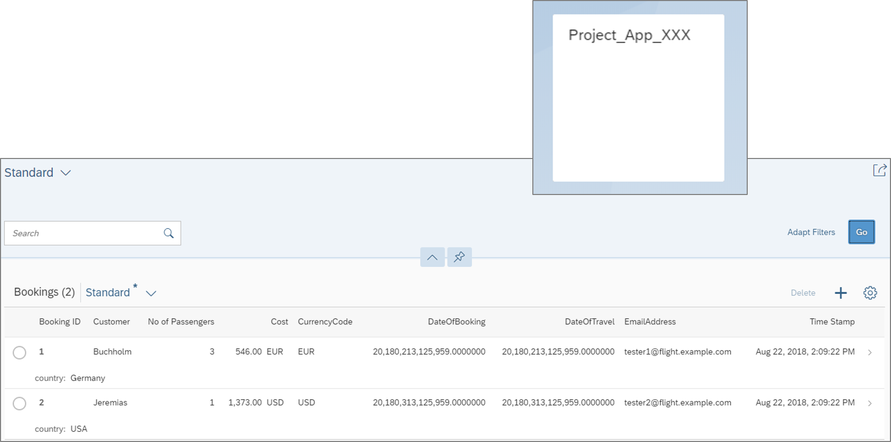

[ACCORDION-END]
