## Prerequisites  
- SAP BTP, ABAP Environment user
- Business Catalog `SAP_CORE_BC_EXT_TST` assigned to your business user
- Initial development setup

## Details
### You will learn
- How to create a database table
- How to create Core Data Services

In this tutorial, wherever `XXX` appears, use a number (e.g. `000`).

---

[ACCORDION-BEGIN [Step 1: ](Open Eclipse)]
Select to your ABAP package created in tutorial **Create Simple Database Table for ABAP Environment** and create a Core Data Services (CDS) data definition.
Therefore right-click on your package **`Z_BOOKING_XXX`** and select **New** > **Other Repository Object**.


[DONE]
[ACCORDION-END]

[ACCORDION-BEGIN [Step 2: ](Create data definition)]
  1. Search for **data definition**, select it and click **Next**.

      

  2. Enter a name and a description for your data definition `ZI_BOOKING_XXX`.

      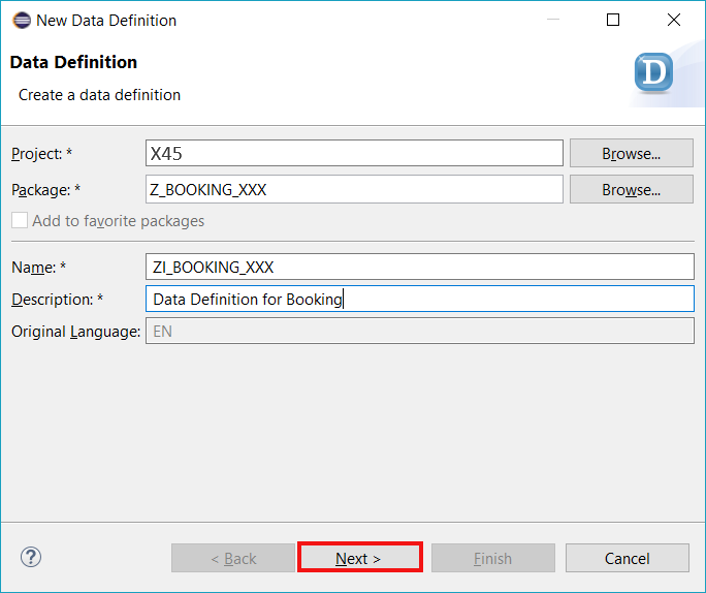

  3. Select a new transport request and click **Next**.

      

  4. Select **Define View template** and press **Finish**.

      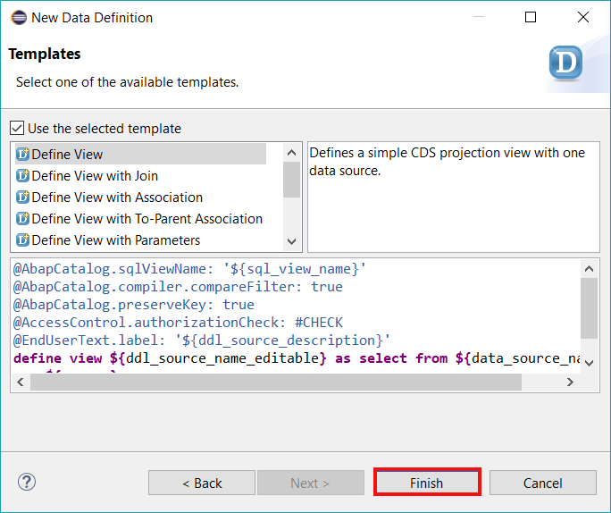

[DONE]
[ACCORDION-END]

[ACCORDION-BEGIN [Step 3: ](Specify SQL view)]
  1. Specify the `sql view name` in the view definition as **`ZV_BOOKING_XXX`**.

      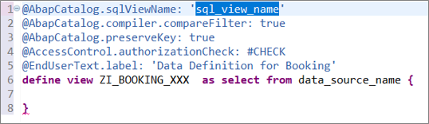

  2. Specify your data source after the select from statement as **`ztbooking_xxx`**.

      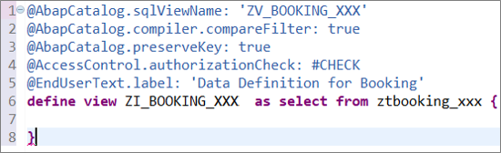

  3. Specify your data definition as shown below. The keyword key is used to specific a key element and the keyword as is used to define alias names. The two associations `I_Country` and `I_Currency` are defined and exposed in the projection. The element `CurrencyCode` is specified as currency key for the element Cost which is an amount field. The view entity is specified as searchable using the view annotation `@Search.searchable: true` and the element `CustomerName` is specified as default search element using the element annotation `@Search.defaultSearchElement: true`.

    ```ABAP
    @AbapCatalog.sqlViewName: 'ZV_BOOKING_XXX'
    @AbapCatalog.compiler.compareFilter : true
    @AbapCatalog.preserveKey: true
    @AccessControl.authorizationCheck: #CHECK
    @EndUserText.label : 'Data Definition Booking'
    @Search.searchable : true
    define view ZI_BOOKING_XXX
       as select from ztbooking_xxx as Booking
       association [0..1] to I_Country  as _Country  on $projection.country = _Country.country
       association [0..1] to I_Currency as _Currency on $projection.CurrencyCode = _Currency.Currency

       {
         key booking              as Booking,
             @Search.defaultSearchElement: true
             customername         as CustomerName,
             numberofpassengers   as NumberOfPassengers,
             emailaddress         as EmailAddress,
             country,
             dateofbooking        as DateOfBooking,
             dateoftravel         as DateOfTravel,
             @Semantics.amount.currencyCode: 'CurrencyCode'
             cost,
             @Semantics.currencyCode: true
             currencycode          as CurrencyCode,
             lastchangedat         as LastChangedAt,

             _Country,
             _Currency       
    }
    ```
  4. Save and activate.

      

[DONE]
[ACCORDION-END]

[ACCORDION-BEGIN [Step 4: ](Add UI annotation)]
  1. Go back to the data definition and used the **`@UI`** annotations to add the UI-specific semantics. Add following UI annotation in front of your data definition.

      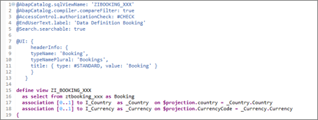

    ```ABAP
        @UI: {
      headerInfo: {
      typeName: 'Booking',
      typeNamePlural: 'Bookings',
      title: { type: #STANDARD, value: 'Booking' }
      }
    }
    ```

  2. Replace your code with following:

    ```ABAP
    @AbapCatalog.sqlViewName: 'ZV_BOOKING_XXX'
    @AbapCatalog.compiler.compareFilter : true
    @AbapCatalog.preserveKey: true
    @AccessControl.authorizationCheck: #CHECK
    @EndUserText.label : 'Data Definition Booking'
    @Search.searchable : true

    @UI:
    {
     headerInfo:
      {
        typeName: 'Booking',
        typeNamePlural: 'Bookings',
        title: { type: #STANDARD, value: 'Booking' }
      }
     }

    define view ZI_Booking_XXX
      as select from ztbooking_xxx as Booking
      association [0..1] to I_Country  as _Country  on $projection.country = _Country.Country
      association [0..1] to I_Currency as _Currency on $projection.CurrencyCode = _Currency.Currency
    {

          @UI.facet: [
            {
              id:       'Booking',
              purpose:  #STANDARD,
              type:     #IDENTIFICATION_REFERENCE,
              label:    'Booking',
              position: 10 }
          ]


          @UI: {
              lineItem: [ { position: 10, importance: #HIGH, label: 'Booking ID' } ],
              identification:[ { position: 10, label: 'Booking ID' } ]
              }
      key booking                                as Booking,

          @UI: {
            lineItem: [ { position: 20, label: 'Customer', importance: #HIGH } ],
            identification:[ { position: 10, label: 'Customer' } ]
          }
          @Search.defaultSearchElement: true
          customername                           as CustomerName,

          @UI: {
          lineItem: [ { position: 30, label: 'No of Passengers', importance: #HIGH } ],
          identification:[ { position: 30, label: 'No of Passengers' } ]
          }
          numberofpassengers                     as NumberOfPassengers,

          @UI: {
               identification:[ { position: 40, label: 'Email' } ]
           }
          emailaddress                           as EmailAddress,

          @UI: {
               identification:[ { position: 50, label: 'Country' } ]
           }
          country,

          @UI: {
               identification:[ { position: 60, label: 'Booked On' } ]
           }
          dateofbooking                          as DateOfBooking,

          @UI: {   identification:[ { position: 70, label: 'Traveling on' } ]    }
          dateoftravel                           as DateOfTravel,


          @UI: {
          lineItem: [ { position: 40, label: 'Cost', importance: #HIGH } ],
          identification:[ { position: 80, label: 'Cost' } ]
          }
          @Semantics.amount.currencyCode: 'CurrencyCode'
          cost,

          @UI: { identification:[ { position: 90, label: 'Currency' } ]     }
          @Semantics.currencyCode: true
          currencycode                           as CurrencyCode,

          @UI: { identification:[ { position: 100, label: 'Last Changed At' } ] }
          lastchangedat                          as LastChangedAt,

          //public associations
          _Country,
          _Currency
    }
    ```

  3. Save and activate your data definition.

      

[DONE]
[ACCORDION-END]


[ACCORDION-BEGIN [Step 5: ](Create service definition)]
  1. Right-click on your data definition **`ZI_BOOKING_XXX`** and select **New Service Definition**

      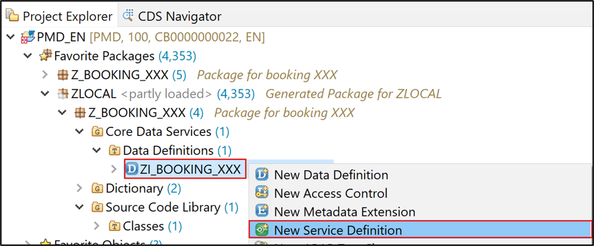

  2. Create a service definition and call it **`Z_I_BOOKING_XXX`**.

      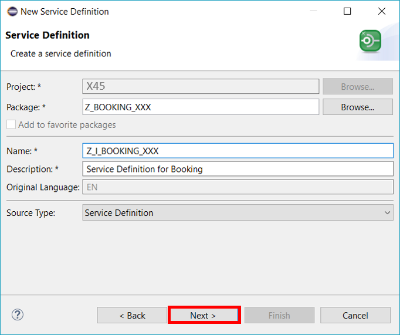

  3. Click **Finish** to complete your transport request.

      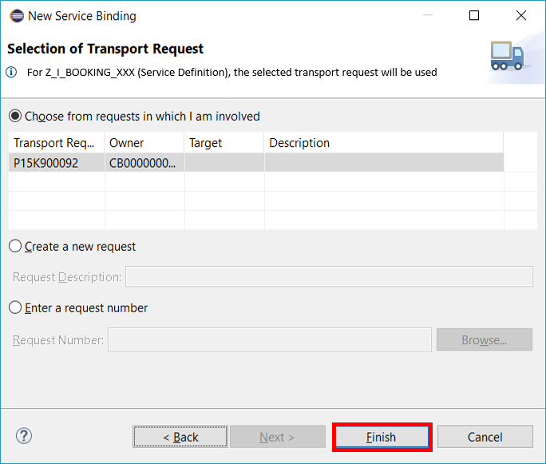

[DONE]
[ACCORDION-END]

[ACCORDION-BEGIN [Step 6: ](Expose entities)]
  1. Expose the **`ZI_Booking_XXX`** and the **`I_Country`** view entities.

    ```ABAP
      @EndUserText.label: 'Service Definition for Booking'

      define service Z_I_Booking_XXX {
      expose ZI_Booking_XXX as Booking;
      expose I_Country  as Country;
      }
    ```

  2. Save and activate your service definition.

      

[DONE]
[ACCORDION-END]


[ACCORDION-BEGIN [Step 7: ](Create service binding)]
  1. Right-click on your service definition **`Z_I_BOOKING_XXX`** and select **New Service Binding**.

      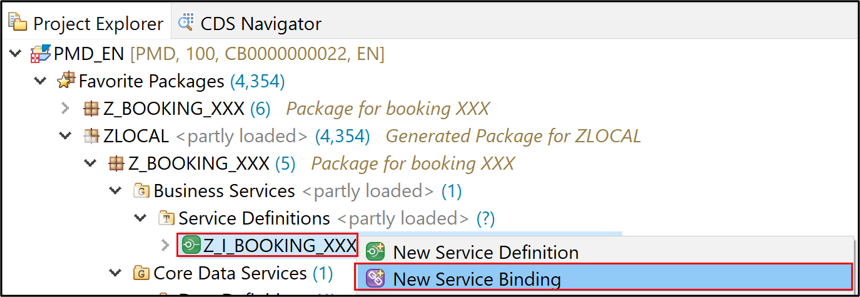

  2. Create a service binding and name it **`Z_I_BOOKING_XXX`**.
     Make sure that **`OData V2 - UI`** is selected as binding type.

      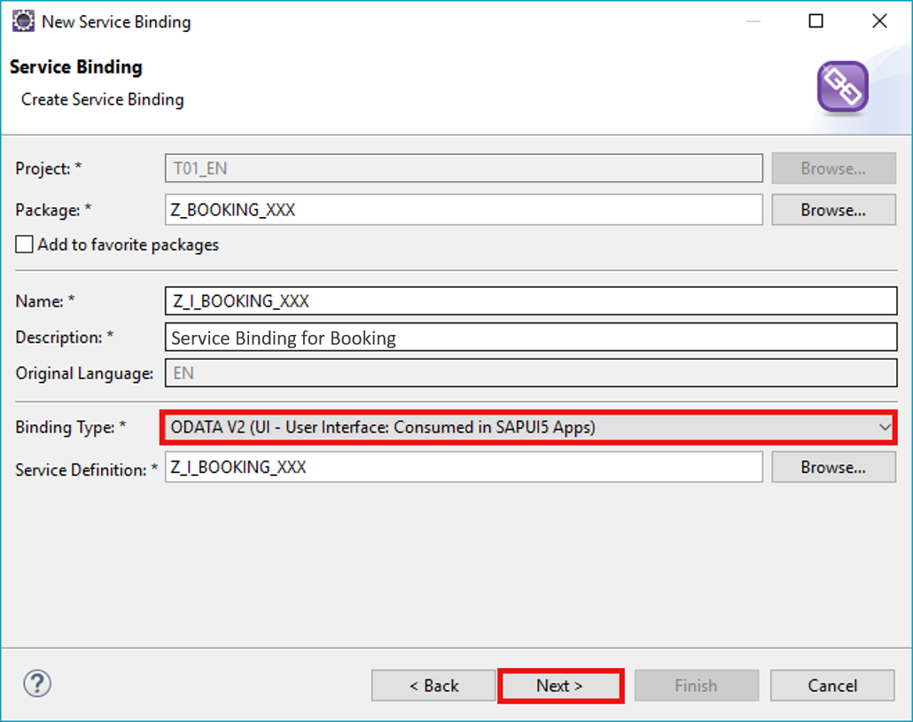
      Click **Next >**.

  3. Click **Finish** to complete your transport request.

      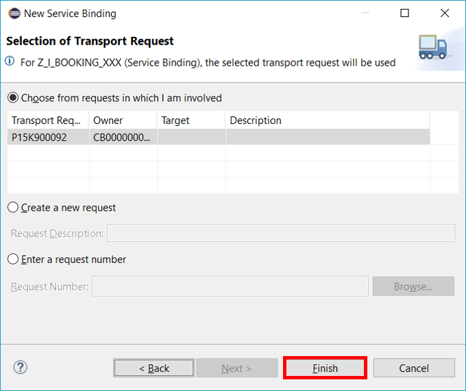

[DONE]
[ACCORDION-END]

[ACCORDION-BEGIN [Step 8: ](Activate your service binding)]
Click **Activate** to publish your service binding.

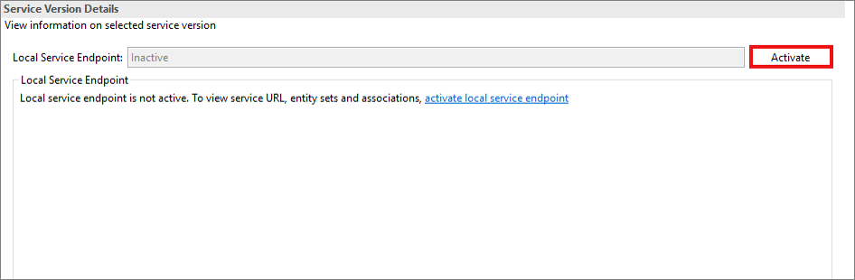

[DONE]
[ACCORDION-END]

[ACCORDION-BEGIN [Step 9: ](Check your metadata)]
  1. Click on the Service URL to see your result.

      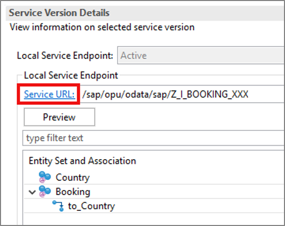

  2. Sign in with your communication user and password.

      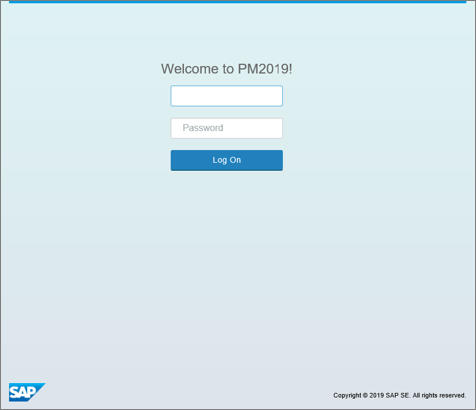

  3. Check your result:

      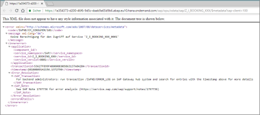

[DONE]
[ACCORDION-END]

[ACCORDION-BEGIN [Step 10: ](Open SAP Fiori elements view)]
  1. Go back to your service binding **`Z_I_BOOKING_XXX`**
   Open the preview for SAP Fiori elements app on the right side with double-clicking or right click.

      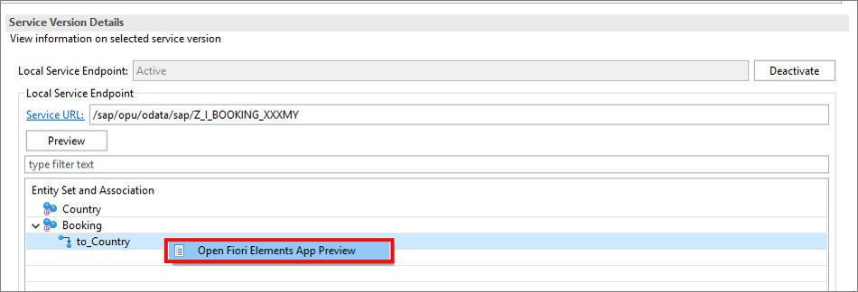

  2. Login with your username and password.

      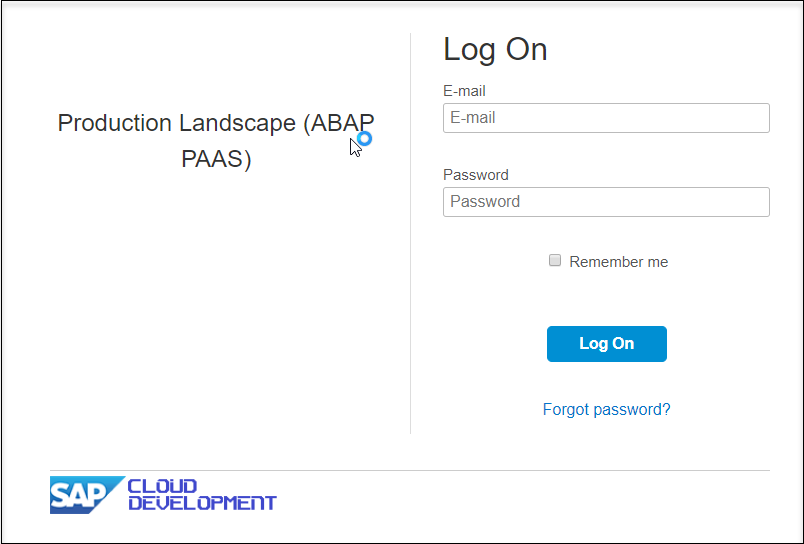

  3. To set some filter click on settings icon.

      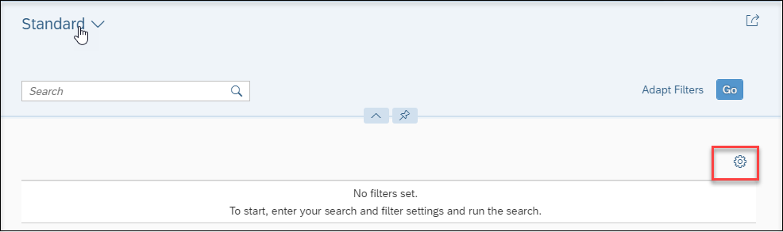

  4. Select fields that shall be displayed or select all and click on **OK**.

      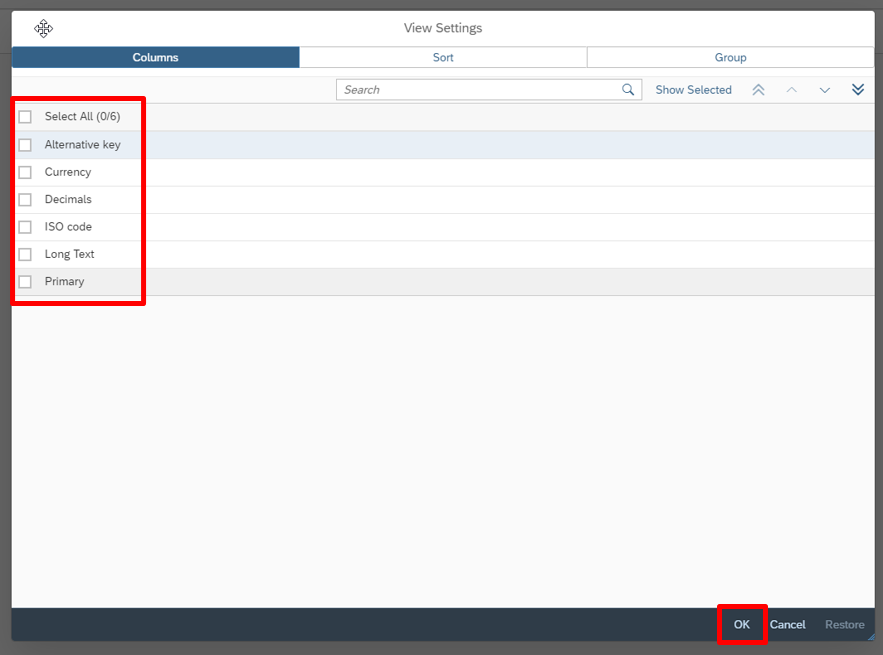

  5. Click on **GO**.

      

  6. Check your result:

      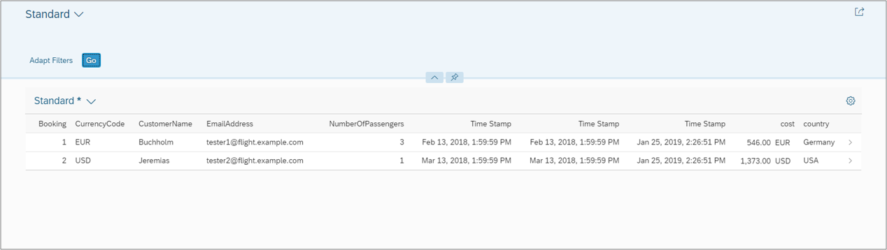

[DONE]
[ACCORDION-END]

[ACCORDION-BEGIN [Step 11: ](Test yourself)]
Write following UI annotation as a header Information:

- `typeName`: `Test`
- `typeNamePlural`: `Tests`
- `title`:
  - `type`: `#STANDARD`
  - `value`: `testyourself`

[VALIDATE_1]
[ACCORDION-END]
