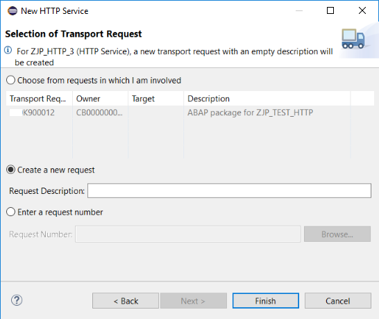
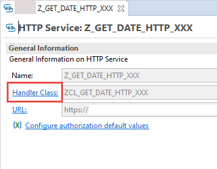
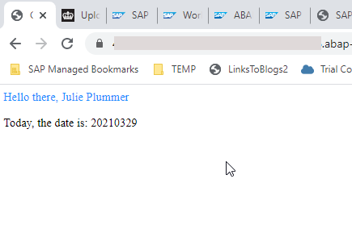

---

title: Create an HTTP Service  
description: Create an HTTP service in the ABAP environment that can be called from the browser.
auto_validation: true
time: 15
tags: [ tutorial>beginner, products>sap-btp--abap-environment, products>sap-business-technology-platform, topic>abap-connectivity, tutorial>license]
primary_tag: topic>abap-development
author_name: Julie Plummer
author_profile: https://github.com/julieplummer20
---

##Prerequisites
- **IMPORTANT**: This tutorial cannot be completed on a trial account

## Details
### You will learn  
  - How to create an HTTP service that can be accessed from a browser
  -	How to return system data using a (whitelisted) ABAP utility class
  - How to expose the service for external consumption, by defining the necessary inbound communication artifacts

**Important**: If you are working in SAP S/4HANA:
ICF services are direct entry points into the ABAP system via the HTTP protocol. Implementing ICF services is a security-critical task with implications on the system and landscape configuration.

Therefore, to follow the best practices adopted by SAP internally, consider implementing your service as an OData service.

---

[ACCORDION-BEGIN [Step 1: ](Create an HTTP service)]
1. Select a package and choose **New > Other Repository Object** from the context menu:

    

2. Enter the filter text **HTTP** and choose **Next**:

    

3. Enter a **Name:`Z_GET_DATE_HTTP_XXX`** and **Description:Get system date** for your service and choose **Next**:

    !

4. Choose or create a **transport request**:

    !

The new HTTP service is displayed on a new tab. The handler class and URL are generated automatically, in the form:
**`https://<server:port>/sap/bc/http/sap/<service_name>?sap-client=100`**

!

[DONE]

[ACCORDION-END]

[ACCORDION-BEGIN [Step 2: ](Implement the handler class)]
Now, you will implement the handler class, starting with a simple text output.

1. Open the handler class by clicking on the hyperlink:

    

2. The structure of the class and the interfaces statement for `IF_HTTP_SERVICE_EXTENSION` are generated automatically.
3. Go to the class implementation section and insert the following statement in the method:

    **`response->set_text('Hello!').`**

    

[DONE]

[ACCORDION-END]

[ACCORDION-BEGIN [Step 3: ](Save and activate)]
**Save (`Ctrl+S`)** and **Activate (`Ctrl+F3`)** your class.

[DONE]

[ACCORDION-END]

[ACCORDION-BEGIN [Step 4: ](Test the service)]
1. Go back to your HTTP Service. Test your service in the browser by clicking the URL link:

    

2. If necessary, log in again. The preview open automatically in a new tab and display something like this:

    

[DONE]

[ACCORDION-END]

[ACCORDION-BEGIN [Step 5: ](Add method `get_html`)]
Now you will add a method to get system data and format this in HTML

In the ABAP environment, you can only use whitelisted APIs. Therefore, for example, you cannot use `SY-UNAME`. Instead, you call the appropriate method of the class `CL_ABAP_CONTEXT_INFO`.

1. In your class definition, add the following statement:

    ```ABAP
    METHODS: get_html RETURNING VALUE(ui_html) TYPE string.

    ```
2. You will get the error "Implementation missing...". Resolve this by choosing **Quick Assist ( `Ctrl+1` )** and choosing **Add implementation...**. Ignore the two warnings for now.

    ```ABAP

    DATA(user_formatted_name) = cl_abap_context_info=>get_user_formatted_name( ).
    DATA(system_date) = cl_abap_context_info=>get_system_date( ).

    ui_html =  |<html> \n| &&
    |<body> \n| &&
    |<title>General Information</title> \n| &&
    |<p style="color:DodgerBlue;"> Hello there, { user_formatted_name } </p> \n | &&
    |<p> Today, the date is:  { get_system_date }| &&
    |<p> | &&
    |</body> \n| &&
    |</html> | .

    ```

3. Now change the method implementation of the method **`handle_request`**

    ```ABAP
    response->set_text( get_html(  ) ).

    ```

4. Now select the warning for the method **`get_html`** and choose **Quick Assist `( Ctrl + 1 )`**. (You cannot resolve the warning for the method `handle_request`).

5. Choose **Add raising declaration**, then choose **Finish**.

6. Format, save, and activate the class **( `Shift + F1, Ctrl + S, Ctrl + F3` )**.

6. Test the service again using the URL. Your page should look roughly like this:

    !

[DONE]

[ACCORDION-END]


[ACCORDION-BEGIN [Step 8: ](Check code)]
Your code should look like this:

```ABAP
CLASS Z_GET_DATE_HTTP_XXX DEFINITION
  PUBLIC
  CREATE PUBLIC .

  PUBLIC SECTION.

    INTERFACES if_http_service_extension .

    METHODS: get_html RETURNING VALUE(ui_html) TYPE string
    RAISING
        cx_abap_context_info_error.

  PROTECTED SECTION.
  PRIVATE SECTION.
ENDCLASS.


CLASS Z_GET_DATE_HTTP_XXX IMPLEMENTATION.


  METHOD if_http_service_extension~handle_request.
    response->set_text( get_html(  ) ).
  ENDMETHOD.

  METHOD get_html.

    DATA(user_formatted_name) = cl_abap_context_info=>get_user_formatted_name( ).
    DATA(system_date) = cl_abap_context_info=>get_system_date( ).

    ui_html =  |<html> \n| &&
    |<body> \n| &&
    |<title>General Information</title> \n| &&
    |<p style="color:DodgerBlue;"> Hello there, { user_formatted_name } </p> \n | &&
    |<p> Today, the date is:  { get_system_date }| &&
    |<p> | &&
    |</body> \n| &&
    |</html> | .

  ENDMETHOD.

ENDCLASS.
```

[DONE]
[ACCORDION-END]


[ACCORDION-BEGIN [Step 9: ](Create an inbound Communication Scenario)]
You will now create the artifacts you need to allow other systems to call your service compliantly. This involves some overhead for one consumer; however, the advantage is that you can add several consumer systems, or users (for example, with different authentication) pointing to the same HTTP service, wrapped in the same Communication Scenario.


 First, create the **Communication Scenario**.

1. Select your package, then choose **New > Other Repository Object...** from the context menu.

    

2. Add the filter **`scen`**, then choose **Communication Scenario**, then choose **Next**.

    

3. Add a **Name: `Z_WRAP_HTTP_INBOUND_XXX`** and **Description**, choose a transport request, then choose **Finish**.

Your Communication Scenario appears.


[DONE]
[ACCORDION-END]

[ACCORDION-BEGIN [Step 10: ](Add the HTTP service)]
1. On the **Inbound** tab, choose **Add...**.

    

2. **IMPORTANT**: Choose **Browse**. You cannot simply enter the name. Then add a filter, such as **`Z_HTTP`**, select your service, then choose **Finish**.

    

3. Your service appears. Choose **Publish Locally**.

    

[DONE]
[ACCORDION-END]


[ACCORDION-BEGIN [Step 11: ](Create Communication Arrangement)]
1. Open the dashboard for your system. You can find the URL for the dashboard by selecting your system (that is, ABAP Project in Project Explorer), then choosing **Properties > ABAP Development** from the context menu.

    

2. From **Communication Management**, choose **Communication Arrangement**. Then choose **New**.

    

3. Choose your scenario, **`Z_WRAP_HTTP_INBOUND_XXX`** from the drop-down list. Accept the default (identical) Arrangement name.

    

[DONE]
[ACCORDION-END]


[ACCORDION-BEGIN [Step 12: ](Create Communication System)]
1. From the Dashboard Home screen, choose **Communication Systems**.

2. Enter the name of your **Communication Arrangement**, then for **Communication System**, choose **New**.

3. Enter a **System ID** and Accept the default (identical) System name, then choose **Create**.

4. In **Technical Data > General > Host Name**, enter **Dummy**. Leave the other defaults and choose **Save**.

    

[DONE]
[ACCORDION-END]

[ACCORDION-BEGIN [Step 13: ](Create Communication User)]
1. Scroll down to **Users for Inbound Communication**, then create a new user by choosing the **+** icon.

    

2. Choose **New User** and the **Authentication Method: User name and password**.

    

3. Enter a name and description, then choose **Propose password**, then choose **Create > OK > Save**.

[DONE]
[ACCORDION-END]

[ACCORDION-BEGIN [Step 14: ](Save Communication Arrangement)]


[DONE]
[ACCORDION-END]


[ACCORDION-BEGIN [Step 15: ](Test yourself)]

[VALIDATE_1]
[ACCORDION-END]

## More Information

- [SAP Help Portal: HTTP Communication](https://help.sap.com/viewer/65de2977205c403bbc107264b8eccf4b/Cloud/en-US/dee3a93a2b8d4018b3c4910f745b744f.html)

- [SAP Help Portal: Components of SAP Communication Technology - HTTP Service](https://help.sap.com/doc/saphelp_nwpi71/7.1/en-US/1f/93163f9959a808e10000000a114084/frameset.htm)

- [SAP ABAP Keyword Documentation: Calling an HTTP Service](https://help.sap.com/doc/abapdocu_752_index_htm/7.52/en-US/abenicf_service_abexa.htm)

---
