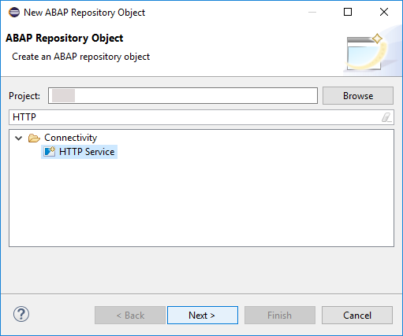
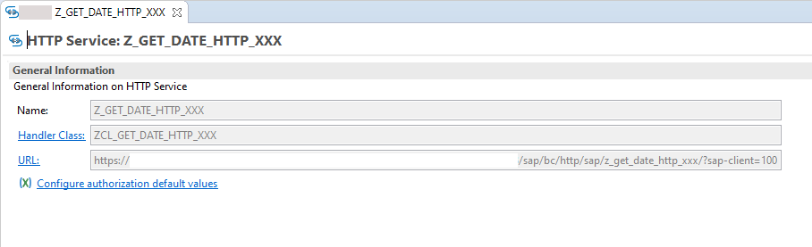
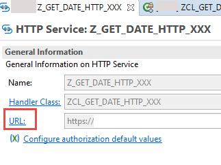
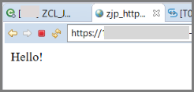

## Prerequisites  
 -	You have created an ABAP package

## Details
### You will learn  
  - How to create an HTTP service
  -	How to return system data using a (whitelisted) ABAP utility class

You can then access the ABAP system from the browser, for example to fetch a report. In this tutorial, you will simply fetch your user name and the date and time for simplicity.


### Time to Complete
**15 Min**

---

[ACCORDION-BEGIN [Step 1: ](Create an HTTP service)]
1. Select your package and choose **New > Other Repository Object** from the context menu:

    

2. Enter the filter text **HTTP** and choose **Next**:

    

3. Enter a **name** and **description** for your service and choose **Next**:

    

4. Choose or create a **transport request**:

    

The new HTTP service is displayed on a new tab. The handler class and URL are generated automatically, in the form:
**`https://<server:port>/sap/bc/http/sap/<service_name>?sap-client=100`**



[DONE]

[ACCORDION-END]

[ACCORDION-BEGIN [Step 2: ](Implement the handler class)]
Now, you will implement the handler class, starting with a simple text output.

1. Open the handler class by clicking on it:

    

2. The structure of the class and the interfaces statement for `IF_HTTP_SERVICE_EXTENSION` are generated automatically.
3. Go to the class implementation section and insert the following statement in the method:

    **`response->set_text('Hello again!').`**

    

[DONE]

[ACCORDION-END]

[ACCORDION-BEGIN [Step 3: ](Save and activate)]
Save (`Ctrl+S`) and activate (`Ctrl+F3`) your class.

[DONE]

[ACCORDION-END]

[ACCORDION-BEGIN [Step 4: ](Test the service)]
1. Test your service in the browser by clicking the URL link:

    

2. If necessary, log in again. The preview open automatically in a new tab and display something like this:

    

[DONE]

[ACCORDION-END]

[ACCORDION-BEGIN [Step 5: ](Add system date to the method)]
Now you will add to the method by fetching the date from the back end first.

In the ABAP environment, you can only use whitelisted APIs. Therefore, you cannot use `SY-DATUM`. Instead, you call the appropriate method of the class `CL_ABAP_CONTEXT_INFO`.

You then cast this date variable to a string variable and output that as before.

Delete the statement `response->set_text('Hello again!').` and add the following to your code:

```ABAP
DATA(lv_date) = CL_ABAP_CONTEXT_INFO=>get_system_date( ).
DATA: lv_text type string.

lv_text = lv_date.
response->set_text( lv_text ).
```

[DONE]

[ACCORDION-END]

[ACCORDION-BEGIN [Step 6: ](Test the service again)]
1. Save (`Ctrl+S`) and activate (`Ctrl+F3`) your class.
2. Test your service by clicking the URL link again. This time, the preview should display something like this:

    

[DONE]

[ACCORDION-END]

[ACCORDION-BEGIN [Step 7: ](Test yourself)]
Implement the method `IF_HTTP_SERVICE_EXTENSION~HANDLE_REQUEST` so that it returns the current user name (`UNAME`), not the system date.

Use the variable `user_name` and the method `get_user_formatted_name`.

[VALIDATE_1]

[ACCORDION-END]

[ACCORDION-BEGIN [Step 8: ](Copy code (optional))]
Your code should look like this:

```ABAP
class ZCL_JP_TEST_HTTP definition
  public
  create public .

public section.

  interfaces IF_HTTP_SERVICE_EXTENSION .
protected section.
private section.
ENDCLASS.

CLASS ZCL_JP_TEST_HTTP IMPLEMENTATION.
  method IF_HTTP_SERVICE_EXTENSION~HANDLE_REQUEST.
     response->set_text('Hello again!').

      DATA(lv_date) = CL_ABAP_CONTEXT_INFO=>get_system_date( ).
      DATA: lv_text type string.

      lv_text = lv_date.
      response->set_text( lv_text ).

  endmethod.
ENDCLASS.
```

[DONE]

[ACCORDION-END]

---
