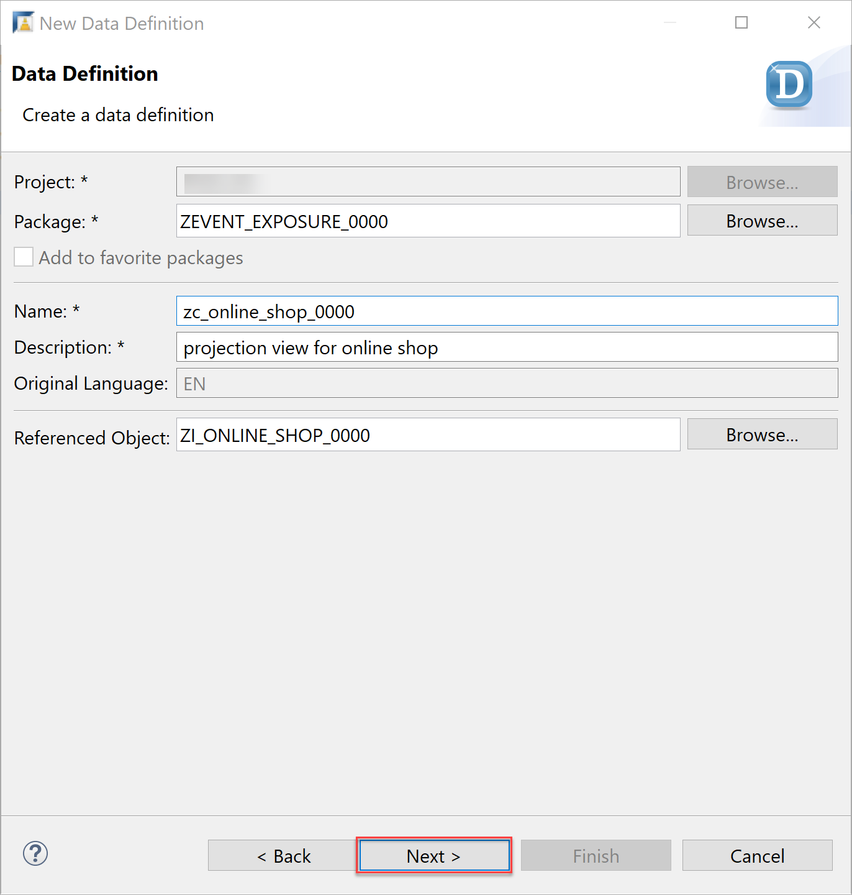
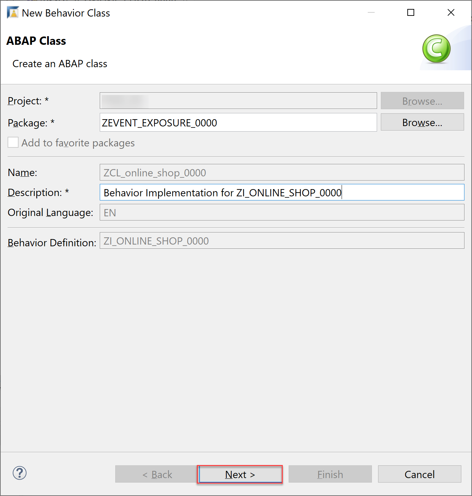
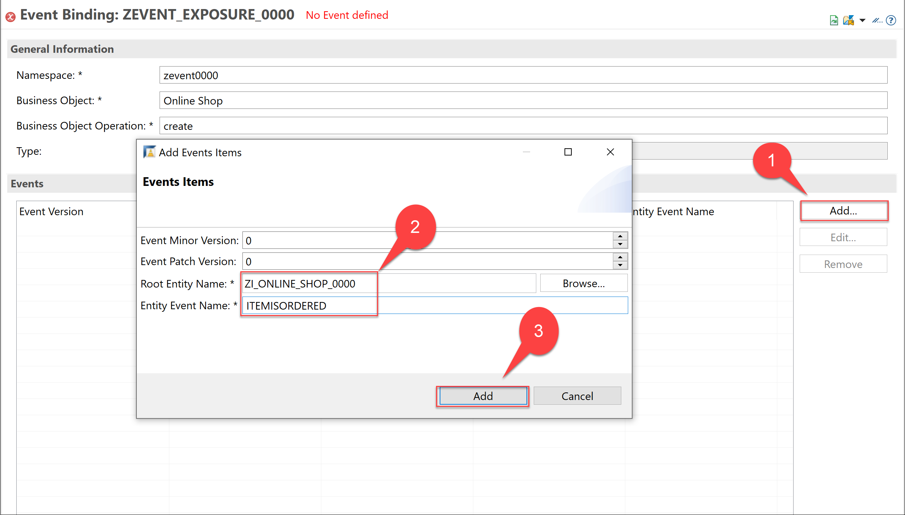
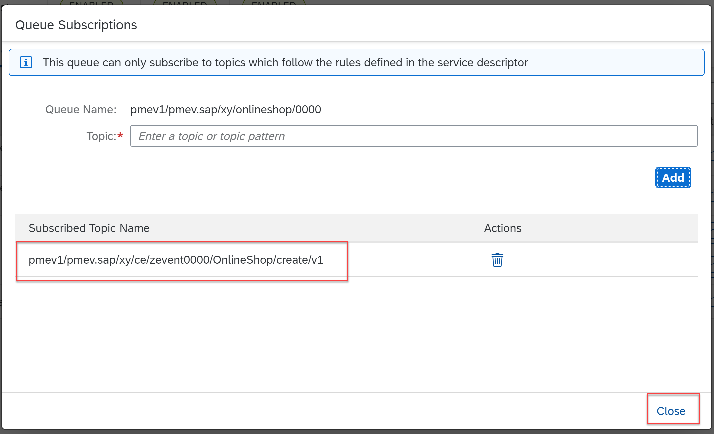

# How to Create RAP Business Events in SAP BTP ABAP Environment
<!-- description --> Create and exposure of business events in SAP BTP ABAP Environment

## Prerequisites
 - You need to have access to a SAP BTP ABAP environment system.
 - You need to prepare an event mesh instance in your SAP business technology platform system and download the service key of this instance. For more information see the [Create Instance of SAP Event Mesh] (https://developers.sap.com/tutorials/cp-enterprisemessaging-instance-create.html)
 - You need a user with access to maintain communication arrangement.

## You will learn
  - How to create RAP Events Business
  - How to set up a channel to connect to SAP Event Mesh

## Intro
>Always replace `####` with your initials or group number.

The ABAP RESTful Application Programming Model (RAP) now supports the native consumption and exposure of business events. For exposure, an event can be defined and raised in a RAP business object or in the behavior extension and then published via Event Bindings.


### Create database table

To produce and raise an event you need first to define your RAP Business Object which produce the event. For this, you will create a simple online shop application. The event will be sent whenever a new order is created.

  1. Open ADT and open your SAP BTP ABAP environment system.

  2. If you do not have an **ABAP Package** create a new one. Please be sure if your package name is with **Z** like

    - Name: `ZEVENT_EXPOSURE_####`
    - Description: `define a RAP event`

    

  3. Right-click on your package and create a new database table

    - Name: `ZONLINESHOP_####`
    - Description: `DB for onlineshop`

    

    

  4. Copy the code below to the Database and replace `####` with your number


    ```ZONLINESHOP_####
      define table zonlineshop_#### {
      key client     : abap.clnt not null;
      key order_uuid : sysuuid_x16 not null;
      order_id       : abap.char(10) not null;
      ordereditem    : abap.char(10) not null;
      deliverydate   : abap.dats;
      creationdate   : abap.dats;
      }

    ```

  5. Save and activate your table.

    


### Create CDS data model and projection view

  1. Right-click on your package and create a data definition

    - Name: `ZI_ONLINE_SHOP_####`
    - Description: `data model for online shop`

    

    

  2. Copy the code below to your CDS data model and replace `####` with your number


    ```ZI_ONLINE_SHOP_####
       define root view entity zi_online_shop_#### as select from zonlineshop_#### {
       key order_uuid as Order_Uuid,
       order_id as Order_Id,
       ordereditem as Ordereditem,
       deliverydate as Deliverydate,
       creationdate as Creationdate  
      }
    ```

  3. Save and activate your data model.

    

  4. Right-click on your package and create a new data definition

    - Name: `ZC_ONLINE_SHOP_####`
    - Description: `projection view for online shop`

    

  5. After choosing a transport request click **Next** and choose **Define Projection View**

    

    


  6. Copy the code below to your projection view and replace `####` with your number.


    ```ZC_ONLINE_SHOP_####
      @EndUserText.label: 'projection view for online shop'
      @AccessControl.authorizationCheck: #NOT_REQUIRED
      @AbapCatalog.viewEnhancementCategory: [#NONE]
      @Search.searchable: true
      @UI: { headerInfo: { typeName: 'Online Shop',
                         typeNamePlural: 'Online Shop',
                         title: { type: #STANDARD, label: 'Online Shop', value: 'order_id' } },

           presentationVariant: [{ sortOrder: [{ by: 'Creationdate',
                                                 direction: #DESC }] }] }
      define root view entity zc_online_shop_####
      as projection on ZI_ONLINE_SHOP_####
      {
          @UI.facet: [          { id:                  'Orders',
                                       purpose:         #STANDARD,
                                       type:            #IDENTIFICATION_REFERENCE,
                                       label:           'Order',
                                       position:        10 }      ]
      key Order_Uuid,

          @UI: { lineItem:       [ { position: 10,label: 'order id', importance: #HIGH } ],
                   identification: [ { position: 10, label: 'order id' } ] }
          @Search.defaultSearchElement: true
          Order_Id,

          @UI: { lineItem:       [ { position: 20,label: 'Ordered item', importance: #HIGH } ],
                  identification: [ { position: 20, label: 'Ordered item' } ] }
          @Search.defaultSearchElement: true
          Ordereditem,

          Deliverydate as Deliverydate,

          @UI: { lineItem:       [ { position: 50,label: 'Creation date', importance: #HIGH },
                                   { type: #FOR_ACTION, dataAction: 'update_inforecord', label: 'Update IR' } ],
                 identification: [ { position: 50, label: 'Creation date' } ] }
          Creationdate as Creationdate
      }
    ```

    >Add **root** in the line of **define view entity**


  7. Save and activate your projection view.

    


### Create behavior definition for CDS data model

  1. Right-click on your data definition `ZI_ONLINE_SHOP_####` and select **New Behavior Definition**.

        

    Event is triggered in a save sequence. So, to raise an event, you need to enhance the existing behavior definition further **with additional save** phrase.
    Copy the copy below to your behavior definition and replace `####` with your number

    ```ZI_ONLINE_SHOP_####
      managed with additional save implementation  in class ZCL_online_shop_#### unique;
      strict;
      define behavior for ZI_online_shop_#### alias Online_Shop
      persistent table ZONLINESHOP_####
      lock master
      authorization master ( instance )
      {
       field ( numbering : managed, readonly ) order_Uuid;
       field ( mandatory ) Ordereditem;
       field ( readonly ) Creationdate, order_id, deliverydate;
       determination calculate_order_id on modify { create; }

        create;
        update;
        delete;
      }

    ```

  2. Now you add a new event to the business object as well. Here, you will create an event which is raised when a new item is ordered. You can call the event as `ItemIsOrdered`. To do so, add this code line to your behavior definition

    ```
      event ItemIsOrdered parameter ZD_ItemOrdered_####;
    ```

    Your behavior definition will be looking like this:

    

  3. In addition, you can  provide further information like the name of the item which is ordered in your message. This can be done via a parameter define as a data definition (abstract entity) called `ZD_ItemOrdered`.

    

    

  4. Copy the code below in this definition. Do not forget to save and activate.

    ```ZD_ItemOrderd_####
     @EndUserText.label: 'event parameter'
     define abstract entity ZD_ItemOrderd_####
     {
       ItemName : abap.char(25);
     }

    ```

    

    Now create the implementation class in the next step.


### Create behavior implementation class

  1. In your behavior definition `ZI_ONLINE_SHOP_####` set the cursor before the implementation class `ZCL_online_shop_####` and click **CTRL + 1**. Double-click on **Create behavior implementation class** `ZCL_online_shop_####` to create your implementation class.

    

    

    

  2. In this class navigate to **Local Types** and add the implementation for method `calculate_order_id` which fill the fields of order id and the creation date as the order is created (optional).

    

    ```calculate_order_id
      METHOD calculate_order_id.
      DATA:
      online_shops TYPE TABLE FOR UPDATE zi_online_shop_####,
      online_shop  TYPE STRUCTURE FOR UPDATE zi_online_shop_####.
      * delete from zonlineshop_#### UP TO 15 ROWS.
      SELECT MAX( order_id ) FROM zonlineshop_#### INTO @DATA(max_order_id).
      READ ENTITIES OF zi_online_shop_#### IN LOCAL MODE
      ENTITY Online_Shop
      ALL FIELDS
      WITH CORRESPONDING #( keys )
      RESULT DATA(lt_online_shop_result)
      FAILED DATA(lt_failed)
      REPORTED DATA(lt_reported).
      DATA(today) = cl_abap_context_info=>get_system_date( ).
      LOOP AT lt_online_shop_result INTO DATA(online_shop_read).
        max_order_id += 1.
        online_shop = CORRESPONDING #( online_shop_read ).
        online_shop-order_id = max_order_id.
        online_shop-Creationdate = today.
        online_shop-Deliverydate = today + 10.
        APPEND online_shop TO online_shops.
      ENDLOOP.

      MODIFY ENTITIES OF zi_online_shop_#### IN LOCAL MODE
      ENTITY Online_Shop UPDATE SET FIELDS WITH online_shops
      MAPPED DATA(ls_mapped_modify)
      FAILED DATA(lt_failed_modify)
      REPORTED DATA(lt_reported_modify).

      ENDMETHOD.
    ```

  3. Your class will look like the following:

    

  3. Now implement the additional save method to raise the entity event.

    ```save
      METHOD save_modified.

      IF create-online_shop IS NOT INITIAL.
        RAISE ENTITY EVENT ZI_online_shop_####~ItemOrdered
      FROM VALUE #( FOR online_shop IN create-online_shop ( %key              = online_shop-%key
                                                            %param-ItemName   = online_shop-Ordereditem ) ).
      ENDIF.
     ENDMETHOD.
    ```

  3. Save and activate your class.

    


### Create behavior definition for projection view


  1. Right-click on your data definition `ZC_ONLINE_SHOP_####` and select **New Behavior Definition**.

    

  2. Save and activate the definition.

    


### Create service definition and service binding


  At last, you need to define the service definition and the service binding. Then your application will be ready to use.

  1. Right-click on **Business Services** > **New** > **Service Definition**.

    - Name: `ZUI_ONLINE_SHOP_####`
    - Description: `service definition for online shop`

    

    

    Click **Next** and after choosing a transport request click **Finish**.

  2. Here you can expose your data definition `zc_online_shop_####`

    

  3. Save and activate your service definition.

  4. Right-click on your service definition and choose **New Service Binding**.

    - Name: `ZUI_ONLINE_SHOP_####`
    - Description: `service Binding for online shop`
    - Binding Type: `OData V2 - UI`
    - Service Definition: `ZUI_ONLINE_SHOP_####`

    
    

  5. Activate your service binding and click **Publish**.

    


### Create an Event Binding for the Business Event


  Now create the event binding for your newly created business event. This event binding is needed to map an event to a RAP entity event.

  1. Right-click on your package and create an event binding

    - Name: `ZEVENT_EXPOSURE_####`
    - Description: `RAP business event`

    

    

  3. Here fill all fields out, to get errors gone. You can freely choose these names to specify your event with some considerations explained below

    - Namespace: `zevent####` (No camel case and no space)
    - Business Object: `OnlineShop` (No Space)
    - Business Object Operation: `create`

    

  4. Click **Add** to add items.

    - Root Entity Name: `ZI_ONLINE_SHOP_####` (your behavior definition)
    - Entity Event Name: `ITEMISORDERED` (Event name in your behavior definition)

    

  5. Save and activate your event binding.

  6. As you can see at the screenshot, **Type** (aka topic) is a concatenation of the three attributes (name space, business object, business object operation) and ends with the version of the event. The wildcard * points to the corresponding event e.g. created. This is relevant for addressing the events to the Event Mesh. Copy this address for later use `zevent####.OnlineShop.create.v*`.

    


### Create a communication arrangement

  After an event is raised, it should arrive at the Event Mesh to be consumed later. The connection between the system and the SAP Event Mesh is achieved through a channel. For this, you need to create a communication arrangement in your cloud system with `sap_com_0092` scenario which is built for an event enablement and also an event mesh instance's service key.

  One requirement is that you have an existing SAP Event Mesh service instance of the default plan. You can create an instance of SAP Event Mesh provided that you already subscribe to the event mesh service.

>For more information about how to create instance of SAP Event Mesh [link] (https://developers.sap.com/tutorials/cp-enterprisemessaging-instance-create.html)

  1. Log on to your cloud system and navigate to **communication Arrangement**.

    

  2. Click **New** to create a new communication arrangement.

    

    

  3. Choose `sap_com_0092` as **Scenario** and copy the service key of your event mesh instance under **Service Key**.

     

     

  4. Create a **Communication User**. Click **New** and enter a **User Name**, **Description** and **Propose Password**. Copy the generated password and save it for later. Click **Create**.

    

    

  5. Now change the **Arrangement Name** to `Z_EVT_0092_####` and replace `####` with your initials or group number. This Arrangement Name will also be the name of the channel which is used later to send events.

    Click **Create** communication arrangement.

      

  6. Open your newly created communication arrangement and check the connection under **Outbound Services**.

    

    


### Assign the event to an outbound channel


  1. Search for **Enterprise Event Enablement** App and open it.

    

  2. Click **Go** to open a list of channels and choose your channel in this list.

    

  3. Now add the outbound topic, which is generated during the event binding generation, in to this channel:

    Click **Create**  

      

    On the next page click **Topic** value help

      

    In this popup search for `zevent####/OnlineShop/create/*` what you copied in step 8-5 and choose it. Replace `####` with your number.

      

    Click **Create**

      

      

  4. In your channel scroll down to **Event Metadata** and copy the channels data for later use.

    

    >If the metadata is empty please reload the page with F5 and try again.

  5. Open your cloud system cockpit and navigate to **Instances and Subscriptions** and open your SAP event mesh service.

    

  6. Open the message client, navigate to **Queues** and click **Create Queue**.

    

    

  7. Enter a queue name and click **Create**.

    - Queue Name: `onlineshop/####` (replace `####` with your number)

    

  8. Open **Actions** of your newly created queue and click **Queue Subscriptions**. Here enter the topic what you copied from the event metadata and click **Add** and then **Close** the popup.

    

    

    


### Create a Message in Application


  1. Open ADT and open your SAP BTP ABAP environment system.

  2. Navigate to your service binding `ZUI_ONLINE_SHOP_####` and click **Preview** to open your application.

    

  3. Click **Create** to order a new item.

    

    

    

  4. Back to your cockpit and check in your event mesh under **Queues** if this event has reached the system. If you check the queue, a new message is arrived at the queue.

    

  5. Navigate to **Test** and choose your queue under **Queue**.

    


  6. Click **Consume Message** to consume this event in your applications. Here you can see that you have the type which you have find in the event binding and the transported data is the parameter structure.

    

  You can also consume this event using [Event Consumption Model within a Business Application] (https://developers.sap.com/tutorials/abap-environment-event-enablement-consumption.html#top)


### Test yourself
