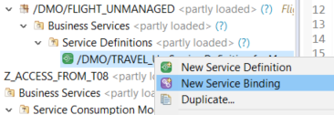
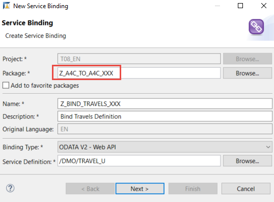
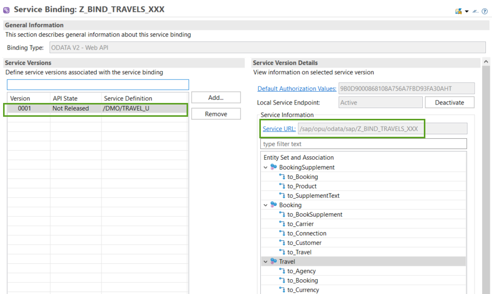
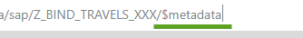

## Prerequisites  
- **IMPORTANT**: This tutorial cannot be completed on a trial account
- The service definition **`/DMO/TRAVEL_U`** is available in the **provisioning** system - You can download the service as part of the ABAP Flight Reference Scenario, see [Downloading the ABAP Flight Reference Scenario](https://help.sap.com/viewer/923180ddb98240829d935862025004d6/Cloud/en-US/def316685ad14033b051fc4b88db07c8.html)

## Details
### You will learn
  - How to create an XML file representing the remote service and save this locally
  - How to create proxy artefacts representing the remote service in the client system, using this `metadata` file

  This tutorial is based on:

  - SAP Help Portal: [Preparing Access to the Remote OData Service](https://help.sap.com/viewer/923180ddb98240829d935862025004d6/Cloud/en-US/59a91c95137e4c42946d50b25dba3fd7.html)
  - SAP Help Portal: [SAP Help Portal: Creating a Service Consumption Model](https://help.sap.com/viewer/923180ddb98240829d935862025004d6/Cloud/en-US/96132822b3554016b653d3601bb9ff1a.html)

---

[ACCORDION-BEGIN [Step 1: ](Create package in provisioning system)]
1. Create a new package for the mission, by:
    - selecting your project
    - selecting **ZLOCAL**
    - if necessary, selecting your user package
    - then choosing **New > ABAP Package** from the context menu.

2. Enter a name, **`Z_A4C_TO_A4C_XXX`**, and description, **Access service from ABAP `Environment`** and choose **Next**.

3. If asked, specify the software component **ZLOCAL** and choose **Next**.

4. Accept or create a transport request and choose **Finish**.

5. Add the package to **Favorite Packages** by choosing this from the context menu.

[DONE]
[ACCORDION-END]

[ACCORDION-BEGIN [Step 2: ](Create service binding)]
Now you need to access the OData service metadata. You derive this from the service URL, available from the service binding.
Later you will use the service metadata to create the service consumption model file (`EDMX` file), for consumption on the client system.

1. First, create a new **Service Binding** from the Service Definition, **`/DMO/TRAVEL_U`**, by selecting **`/DMO/TRAVEL_U`** and choosing **New Service Binding** from the context menu. Search for this object by choosing **Open ABAP Development Object ( **`Ctrl+Sh+A`** ).

    !

2. In the wizard:
    - Choose the correct package, that is, **your** package, not **`/DMO/...`**
    - Delete the namespace `/DMO/` and enter a name: **`Z_BIND_TRAVELS_XXX`** and description **Bind Travels Service**
    - Enter the binding type: **`ODATA V2 - Web API`**
    - Choose **Next**

    !

3. Accept the transport request and choose **Finish**.    

The service binding opens in a new editor.


[DONE]
[ACCORDION-END]

[ACCORDION-BEGIN [Step 3: ](Save service metadata file)]
1. Choose **Activate**.

    On the left is the Service Definition, `/DMO/TRAVEL_U`.
    Now, on the right, is the active service, including the Entity Set and the Service URL.

    !

2. Click on the link **Service URL**. The `XML` file is shown in the browser.

3. Add the suffix **`/$metadata`** to the Service URL (deleting parameters, such as `sap-client`).

    !

    The service metadata appears.

4. Choose **Save As...** from the context menu. The file name should be pre-filled as **`$metadata.xml`**.

5. Navigate to an appropriate folder and choose **Save**.


[DONE]
[ACCORDION-END]

[ACCORDION-BEGIN [Step 4: ](Create package in client system)]
1. As in step 1, create a package in your `ZLOCAL` package, in the **client** system: `Z_A4C_TO_A4C_XX2`.

2. Add it to **Favorite Packages**.

[DONE]
[ACCORDION-END]

[ACCORDION-BEGIN [Step 5: ](Create proxy artefacts)]
You will now use the `EDMX` file that you stored locally to create the necessary ABAP proxy artefacts in the client system.

1. Select your package and choose **New > Other ABAP Repository Object** from the context menu.

2. Enter the filter text **service** and choose **Service Consumption Model**.

3. Enter a name, **`Z_MODEL_TRAVELS_XXX`** , and description **Consumption model for Travels - client**.

4. Using **Browse...**, navigate to your `$metadata` file, choose **Open**, then choose **Next**.

5. Again, deselect all entity sets except **Travel**, make sure **`ETag` Support** is selected for it, then choose **Next**.

6. The same list of ABAP artefacts appears. Choose **Next**.

7. Accept the transport request and choose **Finish**.

Again, the Service Consumption Model appears in a new editor.

[DONE]
[ACCORDION-END]


[ACCORDION-BEGIN [Step 6: ](Check code)]
The code for your abstract entity, **`ZTRAVEL** or **`ZTRAVEL<10-digit-GUID>`** should look like this:

```CDS

/********** GENERATED on 01/21/2020 at 12:05:38 by CB0000000016**************/
 @OData.entitySet.name: 'Travel'
 @OData.entityType.name: 'TravelType'
 define root abstract entity ZTRAVELF7FB77AE54 {
 key TravelID : abap.numc( 8 ) ;
 @Odata.property.valueControl: 'AgencyID_vc'
 AgencyID : abap.numc( 6 ) ;
 AgencyID_vc : RAP_CP_ODATA_VALUE_CONTROL ;
 @Odata.property.valueControl: 'AgencyID_Text_vc'
 AgencyID_Text : abap.char( 80 ) ;
 AgencyID_Text_vc : RAP_CP_ODATA_VALUE_CONTROL ;
 @Odata.property.valueControl: 'CustomerID_vc'
 CustomerID : abap.numc( 6 ) ;
 CustomerID_vc : RAP_CP_ODATA_VALUE_CONTROL ;
 @Odata.property.valueControl: 'CustomerID_Text_vc'
 CustomerID_Text : abap.char( 40 ) ;
 CustomerID_Text_vc : RAP_CP_ODATA_VALUE_CONTROL ;
 @Odata.property.valueControl: 'BeginDate_vc'
 BeginDate : RAP_CP_ODATA_V2_EDM_DATETIME ;
 BeginDate_vc : RAP_CP_ODATA_VALUE_CONTROL ;
 @Odata.property.valueControl: 'EndDate_vc'
 EndDate : RAP_CP_ODATA_V2_EDM_DATETIME ;
 EndDate_vc : RAP_CP_ODATA_VALUE_CONTROL ;
 @Odata.property.valueControl: 'BookingFee_vc'
 @Semantics.amount.currencyCode: 'CurrencyCode'
 BookingFee : abap.curr( 17, 3 ) ;
 BookingFee_vc : RAP_CP_ODATA_VALUE_CONTROL ;
 @Odata.property.valueControl: 'TotalPrice_vc'
 @Semantics.amount.currencyCode: 'CurrencyCode'
 TotalPrice : abap.curr( 17, 3 ) ;
 TotalPrice_vc : RAP_CP_ODATA_VALUE_CONTROL ;
 @Odata.property.valueControl: 'CurrencyCode_vc'
 @Semantics.currencyCode: true
 CurrencyCode : abap.cuky ;
 CurrencyCode_vc : RAP_CP_ODATA_VALUE_CONTROL ;
 @Odata.property.valueControl: 'Memo_vc'
 Memo : abap.char( 1024 ) ;
 Memo_vc : RAP_CP_ODATA_VALUE_CONTROL ;
 @Odata.property.valueControl: 'Status_vc'
 Status : abap.char( 1 ) ;
 Status_vc : RAP_CP_ODATA_VALUE_CONTROL ;
 @Odata.property.valueControl: 'LastChangedAt_vc'
 LastChangedAt : tzntstmpl ;
 LastChangedAt_vc : RAP_CP_ODATA_VALUE_CONTROL ;
 ETAG__ETAG : abap.string( 0 ) ;

 }

```

[DONE]
[ACCORDION-END]


[ACCORDION-BEGIN [Step 7: ](Create CDS custom entity)]
Since you are implementing the query manually, you need to use a custom entity as your data model.

1. Select your package and choose **New > Other > Core Data Services > Data Definition** from the context menu.

2. Enter a name, ``ZCE_TRAVEL_DATA_XXX``, and description, **Travel data custom entity - client**, then choose **Next**.

3. Accept the transport request and choose **Next** (not **Finish**).

4. Choose the template **Define custom entity with Parameters**, then choose **Finish**.

    The CDS custom entity appears in a new editor.

5. Remove the parameters statement and paste in the code below, between the curly brackets. Afterwards, your custom entity should now look as follows. Make sure the types of the fields match those in the abstract entity.

    > Custom entities do not come with a select on the data source. Therefore, you will later implement the data retrieval logic in a new ABAP class, referenced in an entity annotation.


    ```ABAP
    @EndUserText.label: 'Travel data custom entity - client'
    define custom entity ZCE_TRAVEL_DATA_XXX
     {
       key TravelID               : abap.numc( 8 ) ;
          AgencyID               : abap.numc( 6 ) ;
          CustomerID             : abap.numc( 6 ) ;
          BeginDate              : rap_cp_odata_v2_edm_datetime ;
          EndDate                : rap_cp_odata_v2_edm_datetime ;
          @Semantics.amount.currencyCode: 'CurrencyCode'
          BookingFee             : abap.dec( 17, 3 ) ;
          @Semantics.amount.currencyCode: 'CurrencyCode'
          TotalPrice             : abap.dec( 17, 3 ) ;
          @Semantics.currencyCode: true
          CurrencyCode           : abap.cuky( 5 ) ;
          Description            : abap.char( 1024 ) ;   //renamed element
          Status                 : abap.char( 1 );
          LastChangedAt          : tzntstmpl ;

          CalculatedEtag         : abap.string( 0 ) ;  
    }

    ```


[DONE]
[ACCORDION-END]

[ACCORDION-BEGIN [Step 8: ](Test yourself)]

[VALIDATE_1]
[ACCORDION-END]


---
