## Prerequisites  
- You need an SAP BTP, ABAP environment [trial user](abap-environment-trial-onboarding) or license.

## Details
### You will learn
- How to create a database table
- How to `prefill` your database table with data

In this tutorial, wherever `XXX` appears, use a number (e.g. `000`).

---

[ACCORDION-BEGIN [Step 1: ](Open Eclipse)]
Open Eclipse, and select **New** > **ABAP Package**.

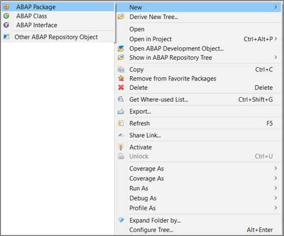

[DONE]
[ACCORDION-END]

[ACCORDION-BEGIN [Step 2: ](Create ABAP package)]
  1. Maintain following information in the appearing dialog and  click **Next**.

      - Name: **`Z_Booking_XXX`**
      - Description: **Package Booking**

      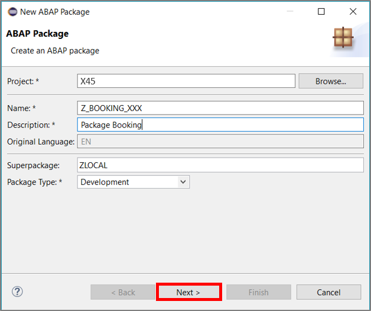

  2. Move on with **Next**.

      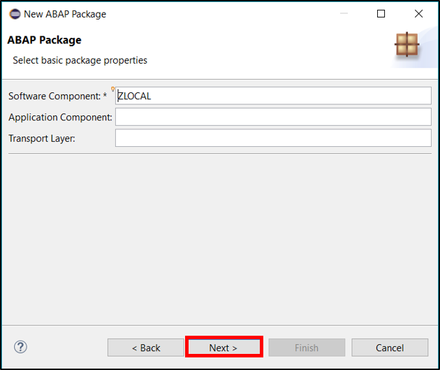

  3. Select transport request and click **Finish**.

      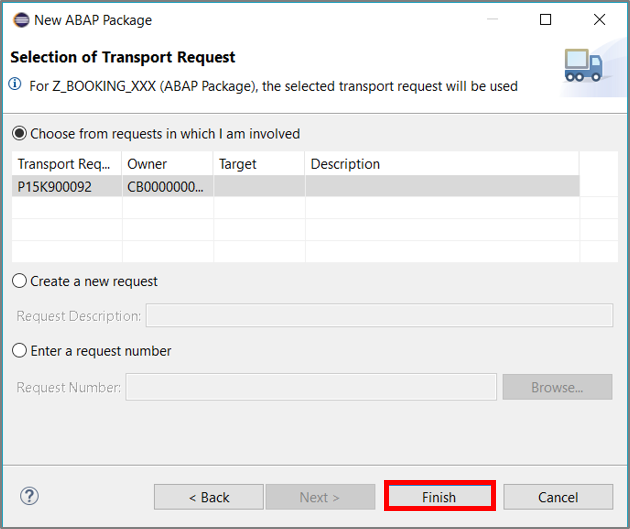

[DONE]
[ACCORDION-END]

[ACCORDION-BEGIN [Step 3: ](Open ABAP repository object)]
Right-click on your package and navigate to **New** > **Other ABAP Repository Object** from the appearing context menu.

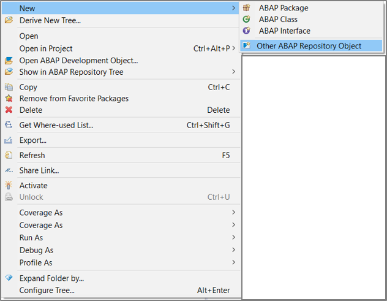

[DONE]
[ACCORDION-END]

[ACCORDION-BEGIN [Step 4: ](Create database table)]
  1. Search for **database table**, select the appropriate entry and click **Next**.

      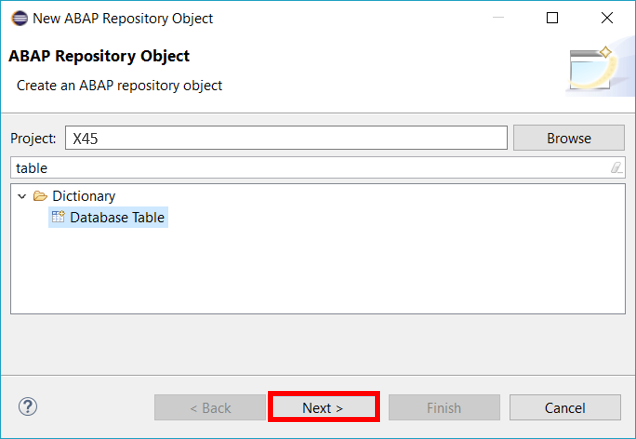
  2. Maintain the required information and click **Next**.

      - Name: **`ZTBOOKING_XXX`**
      - Description: **Table Booking**

      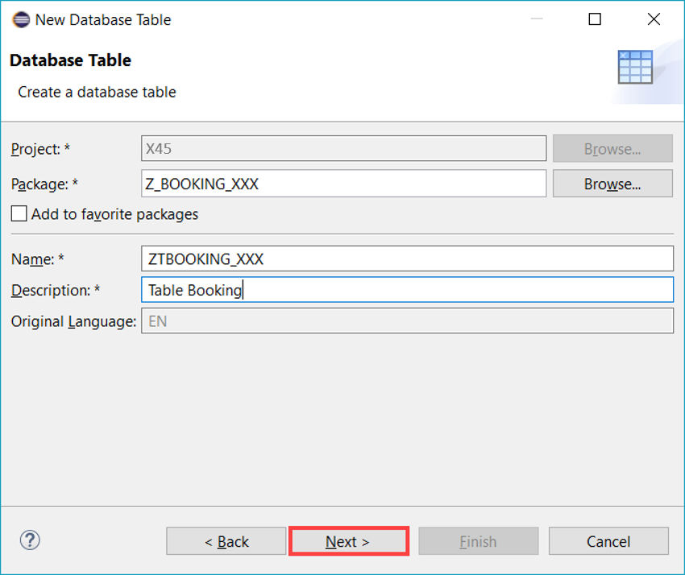

  3. On the next dialog, provide a transport request and click **Finish**.

      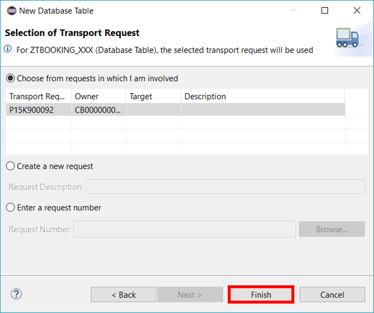

  4. Check result. An empty table is now created.

      

[DONE]
[ACCORDION-END]

[ACCORDION-BEGIN [Step 5: ](Define database table)]
  1. Define the table columns (client, booking, `customername`, `numberofpassengers`, …). Specify client and booking as key fields, and the field `currencycode` as currency key for cost as displayed below. The table annotations (beginning with @) remain unchanged. For that, you can copy the database table definition provided below.

    ```ABAP

    @EndUserText.label : 'Demo: Booking Data'
    @AbapCatalog.enhancementCategory : #NOT_EXTENSIBLE
    @AbapCatalog.tableCategory : #TRANSPARENT
    @AbapCatalog.deliveryClass : #A
    @AbapCatalog.dataMaintenance : #LIMITED
    define table ztbooking_xxx {
    key client         : abap.clnt not null;
    key booking        : abap.int4 not null;
    customername       : abap.char(50);
    numberofpassengers : abap.int2;
    emailaddress       : abap.char(50);
    country            : abap.char(50);
    dateofbooking      : timestampl;
    dateoftravel       : timestampl;
    @Semantics.amount.currencyCode : 'ztbooking_xxx.currencycode'
    cost               : abap.curr(15,2);
    currencycode       : abap.cuky;
    lastchangedat      : timestampl;
    }

    ```

  2. Save and activate the database table.

      

[DONE]
[ACCORDION-END]

[ACCORDION-BEGIN [Step 6: ](Create ABAP class)]
  1. Create a class in order to `prefill` our created database table. Right-click on your package and navigate to **New** > **ABAP Class** in the appearing context menu.

      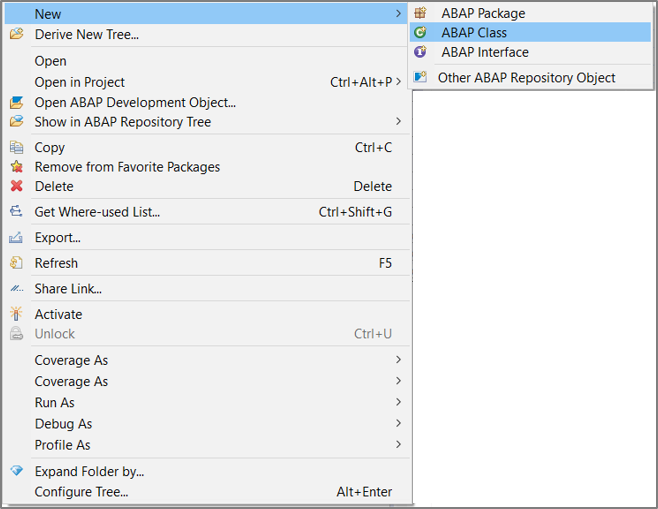

  2. Provide the required information and click **Next**.

    - Name: **`ZCL_GENERATE_BOOKINGS_XXX`**
    - Description: **Class to generate bookings**

      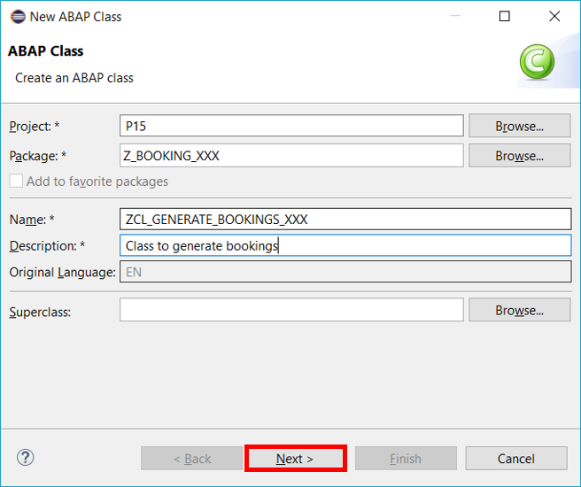

  3. Provide a transport request and click **Finish**.

      

[DONE]
[ACCORDION-END]

[ACCORDION-BEGIN [Step 7: ](Replace source code)]
  1. Replace the source code of your class with the one provided below:

    ```ABAP

    CLASS zcl_generate_bookings_xxx DEFINITION
      PUBLIC
      FINAL
      CREATE PUBLIC .

      PUBLIC SECTION.
        INTERFACES if_oo_adt_classrun.
      PROTECTED SECTION.
      PRIVATE SECTION.
    ENDCLASS.


    CLASS zcl_generate_bookings_xxx IMPLEMENTATION.

      METHOD if_oo_adt_classrun~main.
        DATA:it_bookings TYPE TABLE OF ztbooking_xxx.

    *    read current timestamp
        GET TIME STAMP FIELD DATA(zv_tsl).
    *   fill internal table (itab)
        it_bookings = VALUE #(
            ( booking  = '1' customername = 'Buchholm' numberofpassengers = '3' emailaddress = 'tester1@flight.example.com'
              country = 'Germany' dateofbooking ='20180213125959' dateoftravel ='20180213125959' cost = '546' currencycode = 'EUR' lastchangedat = zv_tsl )
            ( booking  = '2' customername = 'Jeremias' numberofpassengers = '1' emailaddress = 'tester2@flight.example.com'
              country = 'USA' dateofbooking ='20180313125959' dateoftravel ='20180313125959' cost = '1373' currencycode = 'USD' lastchangedat = zv_tsl )
         ).

    *   Delete the possible entries in the database table - in case it was already filled
        DELETE FROM ztbooking_xxx.
    *   insert the new table entries
        INSERT ztbooking_xxx FROM TABLE @it_bookings.

    *   check the result
        SELECT * FROM ztbooking_xxx INTO TABLE @it_bookings.
        out->write( sy-dbcnt ).
        out->write( 'data inserted successfully!').

      ENDMETHOD.

    ENDCLASS.


    ```

  2. Save and active your class.

      

[DONE]
[ACCORDION-END]

[ACCORDION-BEGIN [Step 8: ](Run ABAP application)]
  1. Run your class as an ABAP application (console) or press **F9**.

      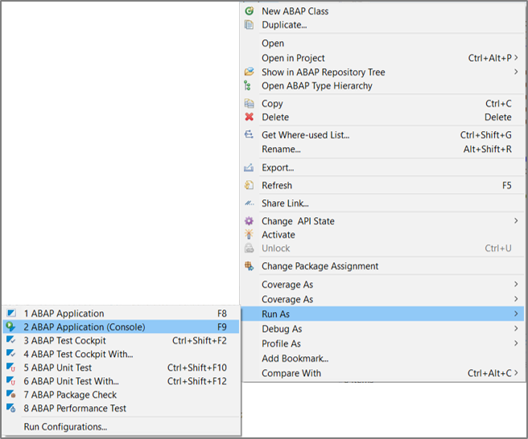

  2. Check console output.

      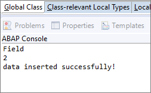

  3. Switch back to your data definition and press **F8** to see the inserted data.

      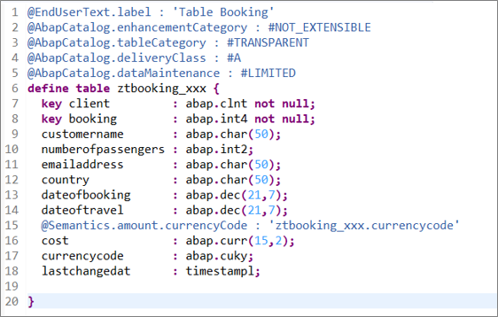

  4. Now check your result.

      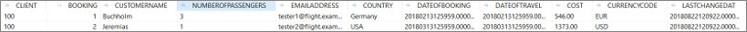

[DONE]
[ACCORDION-END]

[ACCORDION-BEGIN [Step 9: ](Test yourself)]

[VALIDATE_1]
[ACCORDION-END]
