# Inspect Your Class in the ABAP Debugger
<!-- description --> Work with ABAP classes in the ABAP Debugger in (ADT) for both a console application and SAP Fiori application.

##Prerequisites
- You have done one of the following:
    - **Mission**: [Get Data from a Remote System Using a Custom Entity](mission.abap-env-connect-onpremise)
    - Created a new ABAP class in SAP BTP, ABAP Environment

## You will learn
  - How to debug an ABAP Console application in ABAP Development Tools (ADT)
  - How to debug an ABAP class that provides the business logic for a SAP Fiori application


## Intro
This tutorial will get you familiar with the relevant tools, whether you are an ABAP newbie, experienced in SAPUI5 development, or an ABAP developer who is new to ADT / SAP Cloud Platform, ABAP Environment.

For more information, see:

- [SAP Help Portal: SAP Cloud Platform (Concepts): ABAP Debugger](https://help.sap.com/viewer/5371047f1273405bb46725a417f95433/Cloud/en-US/4ec365a66e391014adc9fffe4e204223.html)
- [SAP Help Portal: SAP Cloud Platform (Tasks): Debugging ABAP Code](https://help.sap.com/viewer/5371047f1273405bb46725a417f95433/Cloud/en-US/4ec33a996e391014adc9fffe4e204223.html)

---

### Duplicate existing class or add code to new class

If you have completed the mission:
1. Select your class, `ZCL_OUTPUT_TEST_XXX` and choose **Duplicate** from the context menu.

    This is clearly not standard practice. However, you are working with the ABAP Debugger for the first time, and also adding some dummy code to your class.

2. Enter a name, e.g. `ZCL_OUTPUT_TEST_DEBUG_XXX` and choose **Finish**.

If you have not completed the mission:
1. Open your new ABAP class and copy the following code into it:

    ```ABAP
    CLASS zjp_out_test DEFINITION
      PUBLIC
      FINAL
      CREATE PUBLIC .

      PUBLIC SECTION.
         INTERFACES if_oo_adt_classrun.
      PROTECTED SECTION.
      PRIVATE SECTION.
    ENDCLASS.


    CLASS zjp_out_test IMPLEMENTATION.

      METHOD if_oo_adt_classrun~main.


        " ABAP source code for type definition for BAPI_EPM_PRODUCT_HEADER
        " generated on: ...

        TYPES : BEGIN OF ty_bapi_epm_product_header,
                  productid     TYPE c LENGTH 10,
                  typecode      TYPE c LENGTH 2,
                  category      TYPE c LENGTH 40,
                  name          TYPE c LENGTH 255,
                  description   TYPE c LENGTH 255,
                  supplierid    TYPE c LENGTH 10,
                  suppliername  TYPE c LENGTH 80,
                  taxtarifcode  TYPE int1,
                  measureunit   TYPE c LENGTH 3,
                  weightmeasure TYPE p LENGTH 7 DECIMALS 3,
                  weightunit    TYPE c LENGTH 3,
                  price         TYPE p LENGTH 12 DECIMALS 4,
                  currencycode  TYPE c LENGTH 5,
                  width         TYPE p LENGTH 7 DECIMALS 3,
                  depth         TYPE p LENGTH 7 DECIMALS 3,
                  height        TYPE p LENGTH 7 DECIMALS 3,
                  dimunit       TYPE c LENGTH 3,
                  productpicurl TYPE c LENGTH 255,
                END OF ty_bapi_epm_product_header.

        TRY.

            DATA(lo_rfc_dest) = cl_rfc_destination_provider=>create_by_cloud_destination(
              i_name = |ES5_RFC_XXX|
              ).
            DATA(lv_rfc_dest_name) = lo_rfc_dest->get_destination_name( ).


            "variables needed to call BAPI

            DATA lt_product TYPE STANDARD TABLE OF  ty_bapi_epm_product_header.
            DATA ls_product TYPE ty_bapi_epm_product_header.
            DATA msg TYPE c LENGTH 255.

            "Exception handling is mandatory to avoid dumps
            CALL FUNCTION 'BAPI_EPM_PRODUCT_GET_LIST'
              DESTINATION lv_rfc_dest_name
              EXPORTING
                 max_rows              = 25
              TABLES
                headerdata            = lt_product
              EXCEPTIONS
                system_failure        = 1 MESSAGE msg
                communication_failure = 2 MESSAGE msg
                OTHERS                = 3.

            CASE sy-subrc.
              WHEN 0.
                LOOP AT lt_product INTO ls_product.
                  out->write( ls_product-name && ls_product-price && ls_product-currencycode ).
                ENDLOOP.
              WHEN 1.
                out->write( |EXCEPTION SYSTEM_FAILURE | && msg ).
              WHEN 2.
                out->write( |EXCEPTION COMMUNICATION_FAILURE | && msg ).
              WHEN 3.
                out->write( |EXCEPTION OTHERS| ).
            ENDCASE.

          CATCH cx_root INTO DATA(lx_root).
            out->write(  lx_root->get_longtext( ) ).

        ENDTRY.
      ENDMETHOD.
    ENDCLASS.

    ```

2. Format, save, and activate your class ( **`Ctrl+F1, Ctrl+S, Ctrl+F3`** ).


### Change ABAP Debugger setting to user


1. In the Project Explorer, select your project and choose **Properties** from the context menu.

    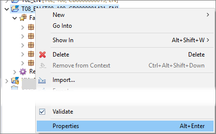

2. Choose  **ABAP Development > Debug**.

3. Change the setting **Breakpoint activation ...** to **User** and enter your logon user.

    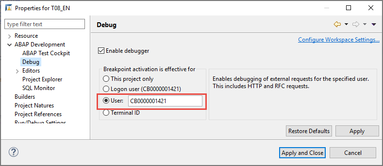

4. Choose **Apply and Close**.
Your class, which includes an RFC request, that is an external request to a different system / project. This enables you to debug the class.

Note that breakpoints in the ABAP Development Tools (ADT) are by default external user breakpoints. For more information, see: [Breakpoints - Characteristics](https://help.sap.com/viewer/5371047f1273405bb46725a417f95433/Cloud/en-US/4ec121276e391014adc9fffe4e204223.html?q=external)


### Add dummy code and breakpoints

1. Right at the start of the method, add some simple code, e.g.

    ```ABAP
    IF 0 = 1.
    ENDIF.
    ```

2. At the statement `IF 0 = 1.`, set a breakpoint by double-clicking the ruler.

    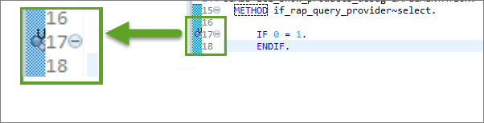

3. Repeat this - add the same code, then add a breakpoint - right at the end of the code, just before `ENDTRY`.


### Run your application

1. Run your application in the console by choosing **`F9`**.

2. As soon as the first breakpoint is reached, a pop-up window suggests that you switch to the **Debug** perspective. Choose **Switch**.

    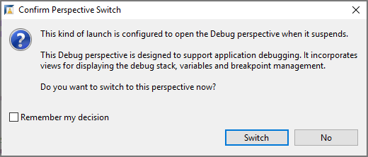

The Debugger perspective opens.

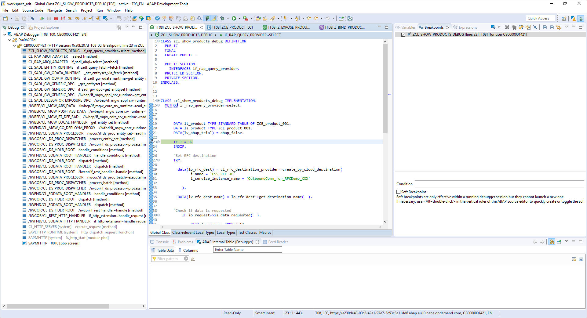


### Add variable to list

1. Switch to the **Variables** tab (to the right of the Class Editor).

2. Add the system field **`SY-TABIX`** to the list, by clicking: **` < Enter Variable > `**

    This field is filled by the runtime system. You can then use them in programs to query the system status.

    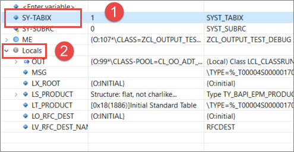

    For a list of system variables, see: [ABAP System Fields](https://help.sap.com/doc/saphelp_nw70ehp3/7.03.19/en-US/7b/fb96c8882811d295a90000e8353423/frameset.htm)

3. Expand **Locals**.

4. Select the internal table **`lt_product`** and choose **Show in Table View** from the context menu.

    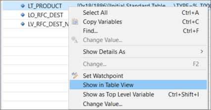

The internal table appears in a new tab in the bottom panel.

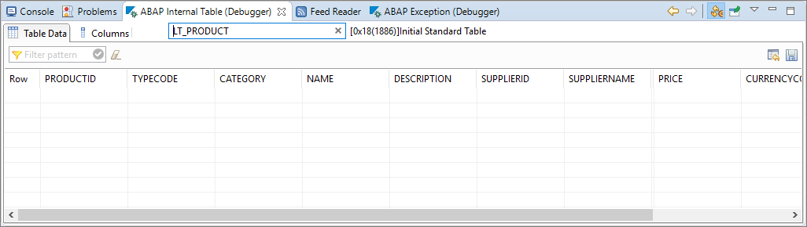    


### Step through the program

1. Switch to the Class Editor. You have 4 options for stepping through the program.

    - Step Into (`F5`)	Execute the next single ABAP instruction in the program in the debugger. Step into a called procedure.

    - Step Over (`F6`)	Execute the next ABAP statement. If the next step is a procedure call, run the entire procedure.

    - Step Return (`F7`)	Run until the current procedure returns to its caller or until the program ends.

    - Run to Line (`Shift F8`)	Run to the statement on which the cursor is positioned.

    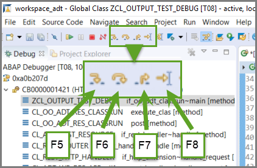


2. Step through the first few lines of the program line by line using **`F5`** - **UNTIL** you get to the statement `DATA(lo_rfc_dest) = cl_rfc_destination_provider=>create_by_cloud_destination...`.

3. Since this statement calls a system class, which you **do not** want to debug it. Execute these two `DATA` statements using **`F6`**.

4. When you get to `CALL FUNCTION`, **STOP**.
You cannot execute this remote function in the Debugger, but you cannot debug it. If you choose `F5`, the Debugger will hang. You will have to terminate the Debugger session.
Therefore, simply execute this using `F7`.

Look at the **Table View**. `lt_product` is filled with the data from the BAPI.

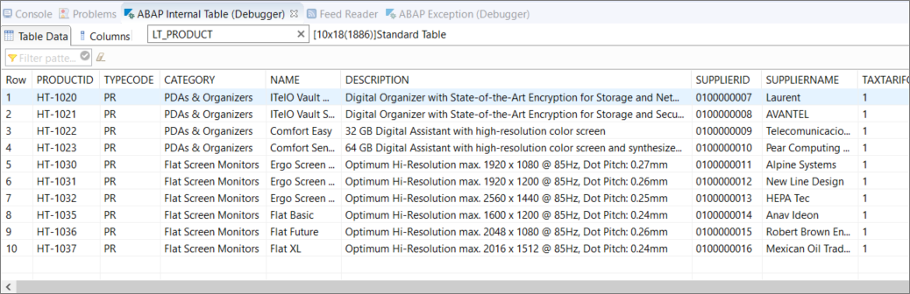

However, in the **Variables View**, `ls_product` is still empty. `SY-TABIX` = 25, the total rows in the table imported.

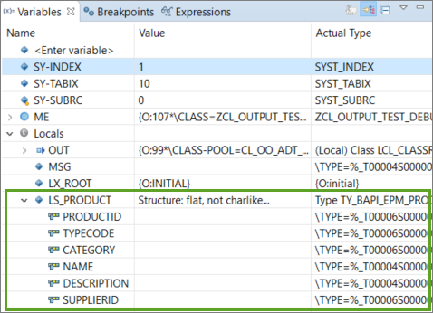


### Step through LOOP statement

1. Proceed until you get to the statement `LOOP AT lt_product INTO ls_product.`.

2. Step through the `LOOP...ENDLOOP.` using `F5`. Note that the variable `SY-TABIX` starts at **1**, then increments by 1 for each loop pass.

3. Exit the Debugger by choosing **Terminate** from the main tool bar.

    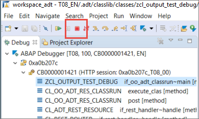


### Set breakpoint for an ABAP statement

To jump straight from your first breakpoint to the `CASE` statement:

1. Choose **Run > ABAP Breakpoints > Add Statement Breakpoint...**

    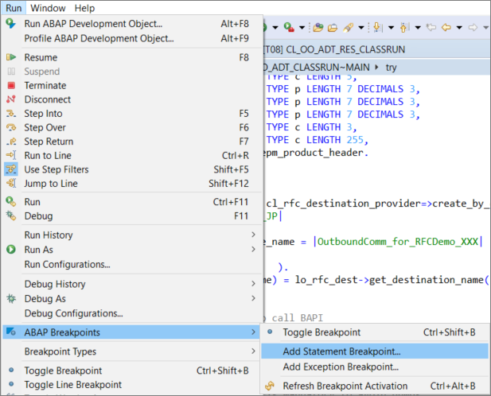

2. Enter `CASE`, keep the setting **Soft Breakpoint** (so that you debug `CASE ` statements only in your own class, not the whole stack), then choose **OK**.

    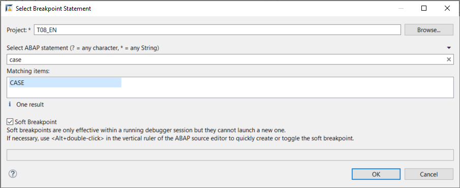

3. Run the Debugger again by choosing `F9`.


### Set watchpoint for variable with a condition

You may want to stop, not at a specific statement, but when a variable hits a specific value.
To do this, run the Debugger again and proceed as follows:


1. For clarity, you may wish to deactivate your `CASE` statement breakpoint in the **Breakpoints View**.

    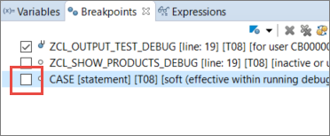

2. In the **Class Editor**, select the field `ls_product-suppliername` and choose **Set `Watchpoint`** from the context menu.

    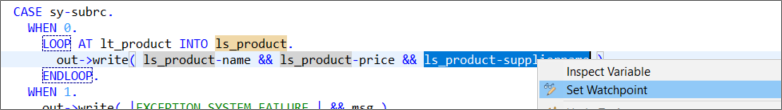

3. In the **Breakpoints View**, choose the `watchpoint` and enter the condition **`LS_PRODUCT-SUPPLIERNAME = 'AVANTEL'`**. Do not forget the single quotation marks.

    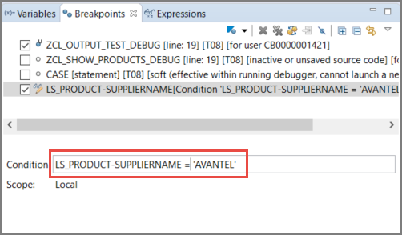  

4. If you switch to the **Variables View**, you can monitor the values of the variable as you step through the loop.

    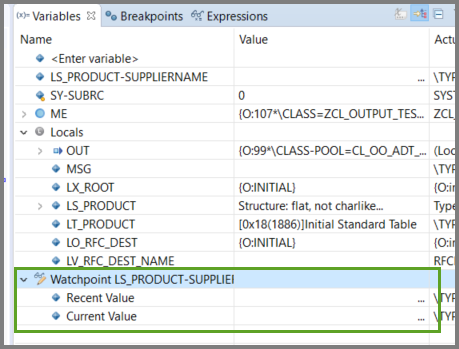

5. When the Debugger hits the correct row in the table, it stops.

    

6. When you are satisfied, terminate the Debugger.

You can define a wide range of complex conditions for breakpoints and `watchpoint`. For more information, see [SAP Help Portal: SAP Cloud Platform: ABAP Development User Guide: Adding Conditions to Breakpoints](https://help.sap.com/viewer/5371047f1273405bb46725a417f95433/Cloud/en-US/162f24582b7540d2b1dc05a87b4874da.html)


### Set watchpoint for  variable with condition for table row index

You can also specify a specific value for a different variable.

1. Start the Debugger again. Unlike a breakpoint, a `watchpoint` lasts only for the current Debugger session.

2. In the **Class Editor**, select `ls_product-suppliername` and choose **Set `Watchpoint`** again.

    

3. In the **Breakpoints View**, choose the `watchpoint` again. This time, enter the condition `SY-TABIX = 4`.

    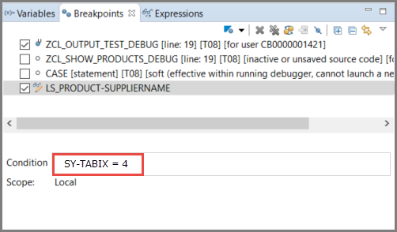

4. When the Debugger hits the correct row in the table, it stops.

    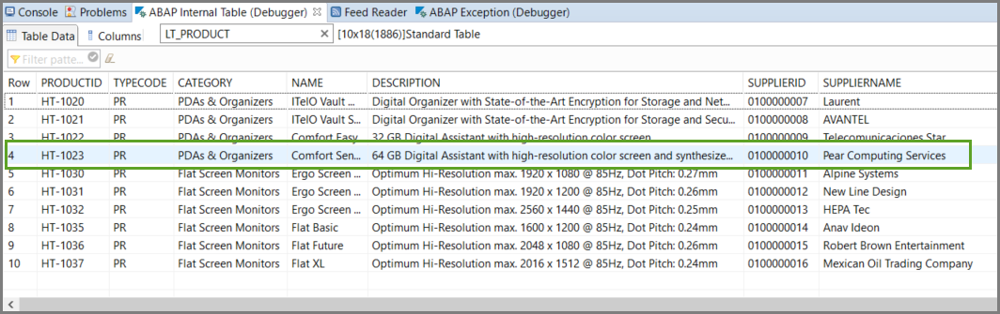


### Open ABAP Debugger from Fiori Elements Preview

The class that you created previously (in [Get Data from a Remote System Using a Custom Entity](abap-environment-rfc-custom-entity)) is not displayed in the ABAP Console. However, you can start the ABAP Debugger for it as follows:

1. Again, duplicate the class, in this case `zcl_product_via_rfc_xxx`.

2. Open your custom entity, `zce_product_xxx`.

3. Change the name of the implementing class to, e.g. `ZCL_PRODUCT_DEBUG_XXX` (upper case); then **Save and Activate ( Ctrl+S, Ctrl+F3 )** the custom entity.

    ```CDS

    @ObjectModel.query.implementedBy: 'ABAP:ZCL_PRODUCT_DEBUG'

    ```

4. Open your service binding, `ZSB_PRODUCT_XXX` and choose **Preview**.

    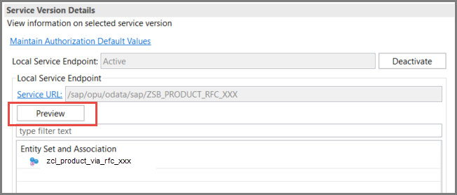

5. Log in using your ABAP Environment user and password.

    The SAP Fiori elements preview then appears.

6. Display the data by choosing **Go**.

    

You can also debug your application, displayed in the SAP Fiori elements preview, in the browser. This is  beyond the scope of this tutorial, but for more information, see:

- [SAPUI5: UI Development Toolkit for HTML5: `Walkthrough` : Debugging](https://help.sap.com/doc/saphelp_uiaddon20/2.05/en-US/c9/b0f8cca852443f9b8d3bf8ba5626ab/frameset.htm)
- [Browser Debugging for ABAP Developers](https://help.sap.com/doc/saphelp_uiaddon20/2.05/en-US/c9/b0f8cca852443f9b8d3bf8ba5626ab/frameset.htm)


### Test yourself


### More Information

- [Blog post: Find Errors in Metadata Extensions, by Andre Fischer](https://blogs.sap.com/2020/07/09/how-to-find-errors-in-metadata-extensions-no-item-data-shown-in-object-page/)
- [Use the SAP Gateway Error Log in ADT, by Andre Fischer](https://blogs.sap.com/2020/07/22/how-to-use-the-sap-gateway-error-log-in-adt/)
---
