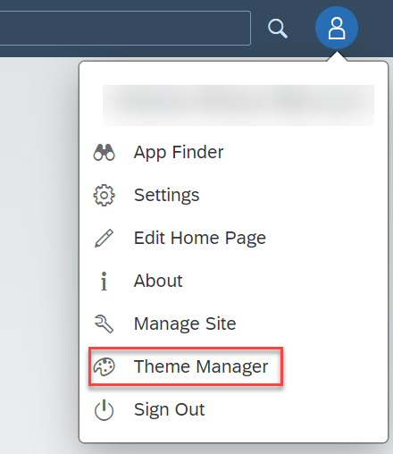
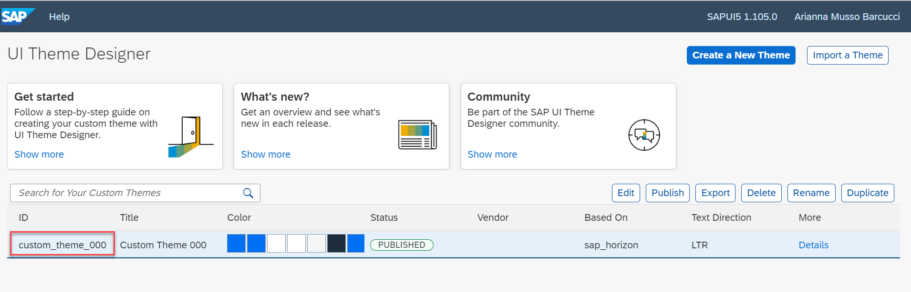
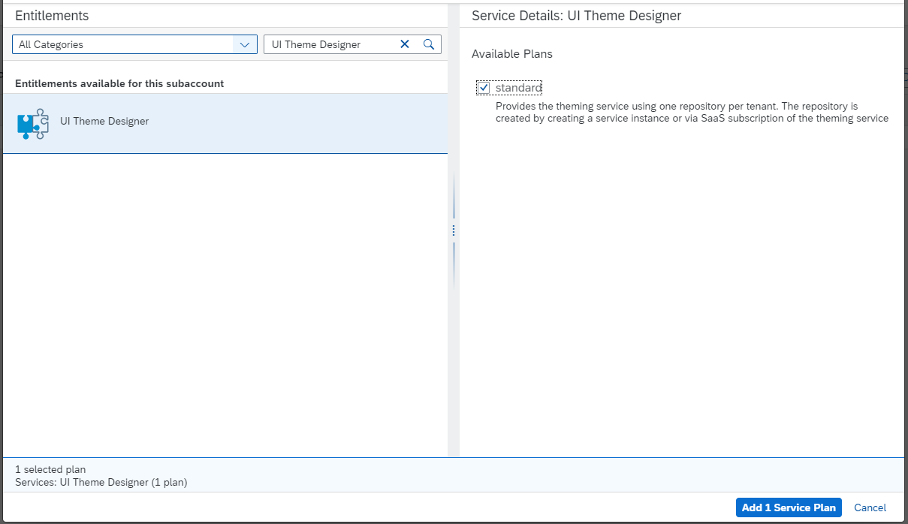
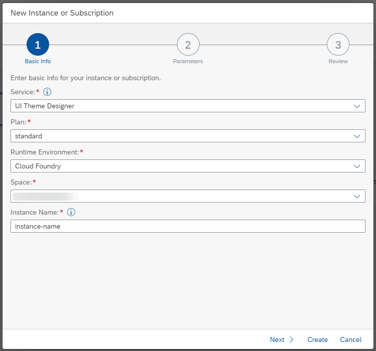
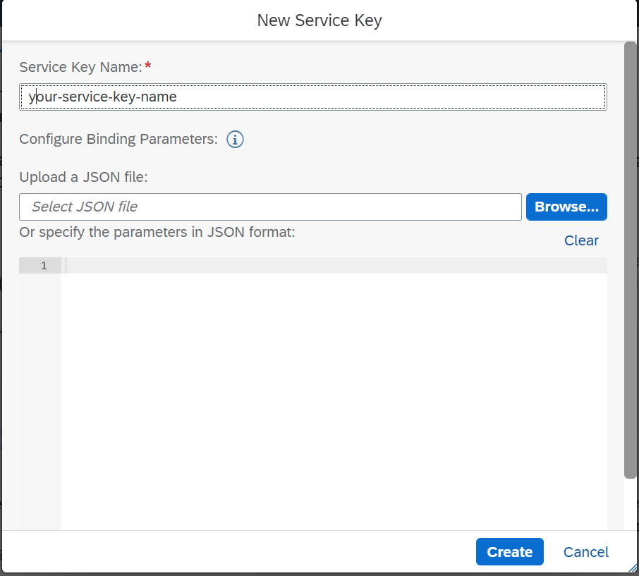
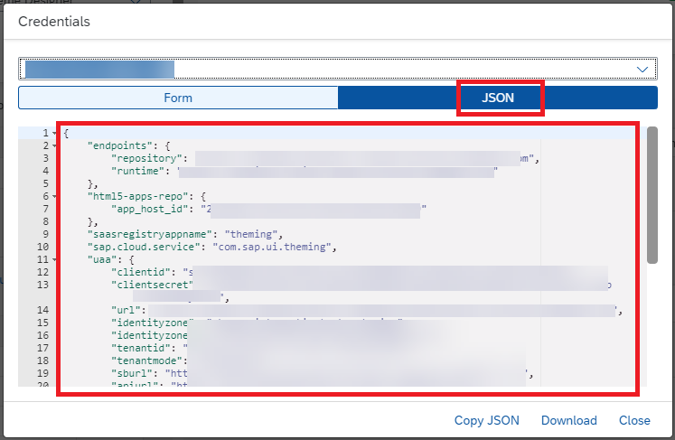
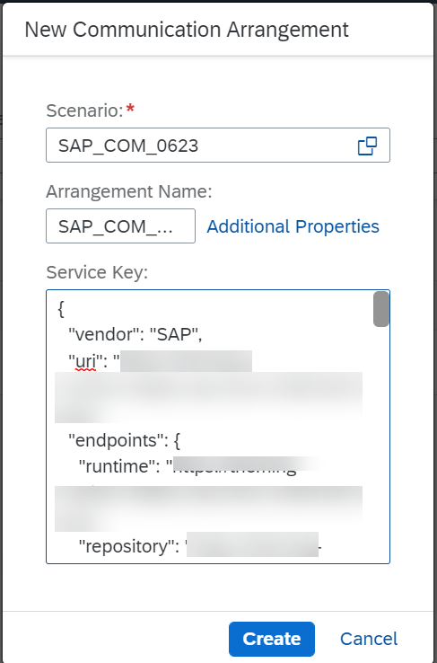
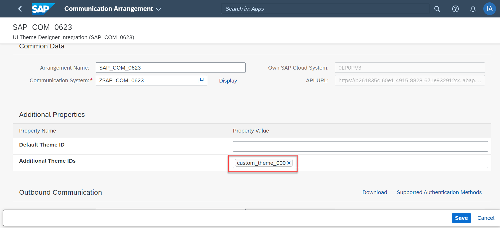
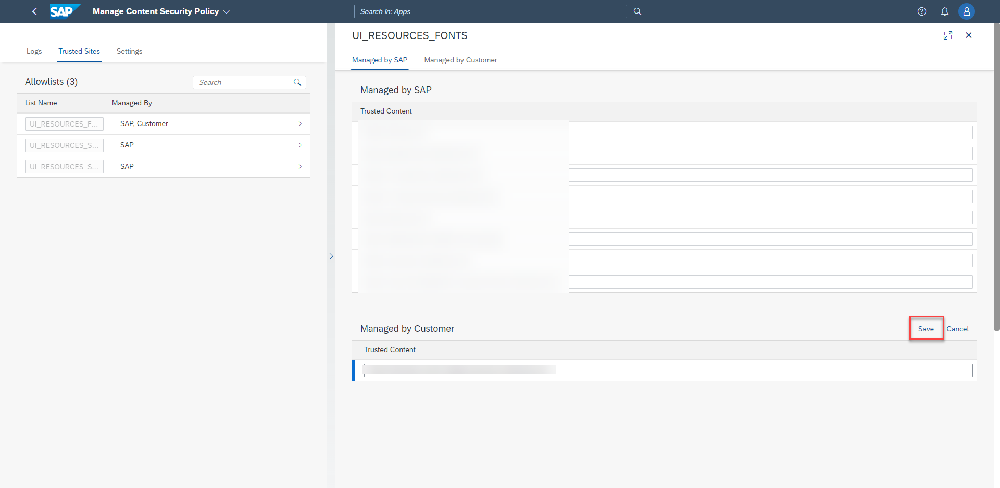
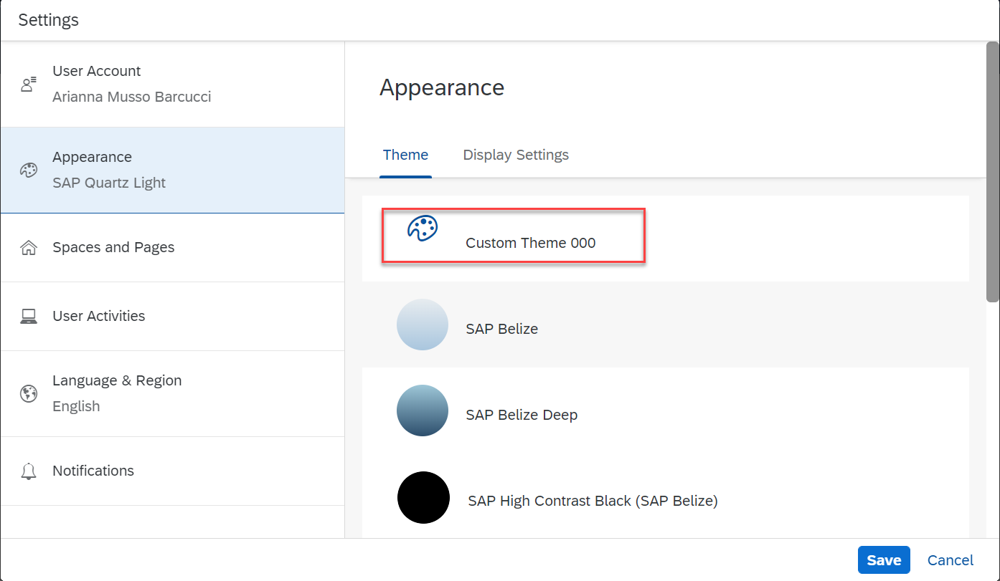

## Prerequisites
 - [You have set up the SAP Launchpad Service](btp-app-launchpad-service)
  - You have a user with the **Subaccount Administrator** role collection in the subaccount where you set up the SAP Launchpad Service.
 - You have access to a SAP BTP ABAP Environment in a Cloud Foundry space.
 - You are a member of the Cloud Foundry space where your SAP BTP ABAP Environment resides, and you have **Space Developer** role.
 - You have a user in your SAP BTP ABAP Environment with the following business catalogs: `SAP_CORE_BC_SEC` and `SAP_CORE_BC_COM`.

## You will learn
- How to integrate the Theme Designer with your SAP BTP ABAP Environment.
- How to use the Theme Designer to create and maintain custom themes.
- How to enable the usage of custom themes in your SAP BTP ABAP Environment.

---
### Access the Theme Designer

The **UI Theme Designer** is a business service integrated in the launchpad service. It can be accessed from your launchpad site, and offers an overview of the available themes.

1. Access any launchpad site.
2. Click on the user profile icon in the top-right corner to open the dropdown menu. Click on **Theme Manager**. 

3. Click on **Launch Theme Designer** in the bottom-left corner. In the **UI Theme Designer** you can see an overview of all the available custom themes, as well as create new ones. 
4. The **ID** column shows the ID's of the custom themes. Make a note of them, you will need these ID's in a later step.

>For the purpose of this tutorial, one custom theme was created with ID: `custome_theme_000`. If you wish to use the Theme Designer to create and publish your own themes, you will need a user with the role collection `Launchpad_Advanced_Theming` in the subaccount where you set up the SAP Launchpad Service.

### Assign entitlements for UI Theme Designer service

You now need to integrate the Theme Designer with your SAP BTP ABAP Environment. For this purpose, you need to assign the correct entitlements for the **UI Theme Designer** service to your chosen subaccount.

1. Open the SAP BTP cockpit of your global account.
2. In the **Account Explorer** tab, open the subaccount where you have subscribed to the SAP Launchpad service.
3. Open the **Entitlements** tab and check if the **UI Theme Designer** service is already assigned. If the service has not been assigned yet, click on **Configure Entitlements** > **Add Service Plans**. Search for the **UI Theme Designer** service, select the **standard** plan and click on **Add 1 Service Plan**. 
4. Click on **Save**.

### Create the service instance

You now need to create an instance of the **UI Theme Designer** service in your chosen subaccount.

1. Open the **Service Marketplace** tab and look for the **UI Theme Designer** service.
2. Click on **Create**.
3. Select the **standard** plan, specify the Cloud Foundry space where your SAP BTP ABAP Environment resides, and choose a name for your instance. 

4. No additional parameters are needed. Click on **Create**.
5. The creation of the service instance might take up to a few minutes. The newly created service instance will appear in the **Instances and Subscriptions** > **Instances** tab.

### Create the service key

1. In the **Instances and Subscriptions** > **Instances** tab, click on the newly created **UI Theme Designer** service instance.
2. In the **Service Keys** tab, click on **Create**. Choose a **Service Key Name** and click on **Create** (no additional parameters needed). 

3. Open the newly created service key and copy it in JSON format. You will need it in a later step.

>Once the service key is created, you can always retrieve it at a later stage if needed.

### Create the communication arrangement

You now need to setup a communication between your SAP BTP ABAP Environment and your instance of the **UI Theme Designer** service.

1. Access your SAP BTP ABAP Environment.
2. Navigate to the **Communication Arrangements** Fiori app.
3. Click on **New**. Choose ``SAP_COM_0623`` as **Scenario**, choose a name for the arrangement and paste the previously created service key. 

4. Click on **Create**.

>A **Communication System** is automatically created with the name: 'Z' + **`communication arrangement name`**, and features the theming runtime service as the host name.

### Maintain custom theme

The communication scenario created in the previous step allows you to maintain both a default custom theme, as well as further additional custom themes that shall be available to business users.

1. Navigate to the **Communication Arrangements** Fiori app and click on the communication arrangement created in the previous step. Click on **Edit**.
2. You can now maintain the desired custom themes adding the corresponding theme ID's in the **Additional Properties** section of the communication arrangement. 
For the scope of this tutorial, the custom theme with ID `custome_theme_000` is added in the **Additional Theme IDs** section.
>You can add as many custom themes as you want in the **Additional Theme IDs** section. You can also add one custom theme ID in the **Default Theme ID** section, but be aware that this custom theme is then automatically applied to all users except those that have already manually chosen a different theme.

3. After you have maintained the desired themes, click on **Save**.

### Maintain content security policy

In order to be able to correctly display custom themes, the host name of the theming service has to be trusted by your SAP BTP ABAP Environment.

1. Navigate to the **Manage Content Security Policy** Fiori app.
2. Select the **Trusted Sites** tab and click on the **`UI_RESOURCE_FONTS`** allowlist.
3. Click **Add**, scroll down to the **Managed by Customer** section and click **New**. Input the theming runtime host name for your landscape and click **Save**. 

>The theming runtime host name can be retrieved from the service key of the **UI Theme Designer** service instance: it is the value of the **endpoint** → **runtime** property.

### Select the custom theme

As a business user, you can now select your desired custom theme in your SAP BTP ABAP Environment.

1. Access your SAP BTP ABAP Environment.
2. Click on the user profile icon in the top-right corner to open the dropdown menu. Click on **Settings** > **Appearance**.
3. The custom theme that you added will now appear in the **Theme** tab. It is marked with a painter palette icon to distinguish it from the standard available themes. 

4. Select the desired custom theme and click on **Save**.

The desired custom theme is displayed.

>**WARNING:** If a custom theme (currently in use) is removed from the communication arrangement the Fiori Launchpad UI will appear broken. To fix this the custom theme must be included again in the communication arrangement, or a new theme must be selected. Since navigating a broken UI is challenging, it is possible to specify a new theme directly in the URL of the launchpad site. Add the following parameter after the top level domain in the URL: `ui?sap-theme=chosen_theme_ID`.

---
