## Prerequisites  
- OData Service in ABAP System created 
- you are a Space Developer in the Space your ABAP Instance is running in

## Details
### You will learn  
- How to add ABAP services to multi-target application
- How to create HTML5 module
- How to deploy UI to Cloud foundry
- How to check application existence

---
[ACCORDION-BEGIN [Step 1: ](Create multi-target application)]

  1. Login to your SAP Cloud Platform Cockpit with your global account and choose your Neo subaccount.

  2. Click **Services** and choose **SAP Web IDE Full-Stack**.

      

  3. Click **Go to Service**.

      

  4. Login to your SAP Web IDE account and choose **Project from Template**.

      

  5. Search for MTA, select **Cloud Foundry** as environment and click **Multi-Target Application** and **Next**.

      

  6. Enter project name **`MTA_Project_XXX`** and click **Next**.

      

  7. Enter **`MTA_Project_XXX`** as application ID, select **`0.0.1`** as application version. Check **Use HTML5 Application Repository** and click  **Finish**.

      

[DONE]
[ACCORDION-END]

[ACCORDION-BEGIN [Step 2: ](Copy API endpoint)]

  1. Login to your SAP Cloud Platform Cockpit and select your global account.

      

  2. Select **Subaccounts**.

      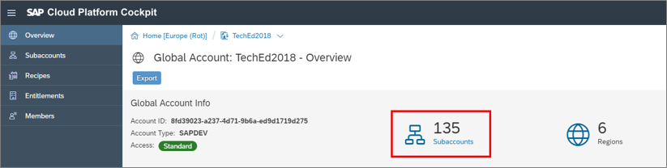

  3. Select your subaccount.

      

  4. Copy your API endpoint for later use.

      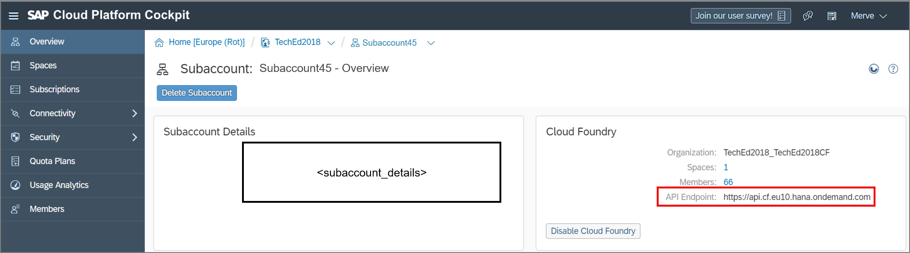

[DONE]
[ACCORDION-END]


[ACCORDION-BEGIN [Step 3: ](Configure project settings and SAP Web IDE Builder)]

  1. Right-click on your project **`MTA_Project_XXX`** select **Project** > **Project Settings**.

      

  2. Select **Cloud Foundry** as Project and custom Cloud Foundry settings.
     - API Endpoint: **`<your_api_endpoint>`**
     - Organization: **`<your_organization>`**
     - Space: **`<your_space>`**

     Click **Save**.

      

[DONE]
[ACCORDION-END]

[ACCORDION-BEGIN [Step 4: ](Add ABAP service to multi-target application)]

  1. Select **File** > **New** > **SAP Cloud Platform Service**.

      

  2. Search for **ABAP**, select it and click **Next**.

      

  3. Select **Use an existing instance**, your instance, provide a resource name and click **Finish**.

      

[DONE]
[ACCORDION-END]

[ACCORDION-BEGIN [Step 5: ](Create HTML5 module)]

  1. Right-click on your project **`MTA_Project_XXX`** and select **New** > **HTML5 Module**.

      

  2. Choose **List Report Application** and click **Next**.

      

  3. Provide following information:
     - Module Name: **`MTA_Project_XXX`**
     - Title: **`MTA_Project_XXX`**

     Click **Next**.

      

  4. Select **SAP Cloud Platform Service**, then click on your service instance.

      

  5. Logon to SAP Cloud Platform ABAP environment and switch back to SAP Web IDE.

      

  6. Select **SAP Cloud Platform Service** and your service instance **`Z_I_BOOKING_XXX`** and click **Next**.

      

  7. Select **Selected Service Metadata** and click **Next**.

      

  8. Select **Booking** as OData collection and click **Finish**.

      


[DONE]
[ACCORDION-END]

[ACCORDION-BEGIN [Step 6: ](Disable csrfProtection)]

  1. 	In the HTML5 module open the file `xs-app.json`.

      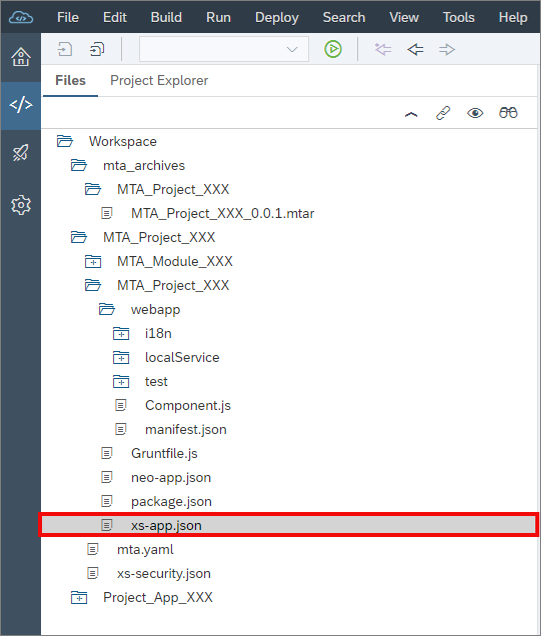

  2.  Find the route to the service `Z_I_BOOKING_XXX`.

      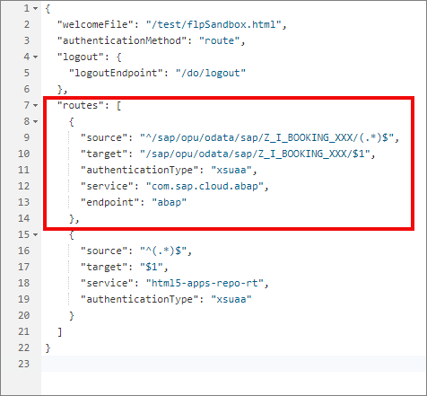

  3. Add the `csrfProtection` property to the route in order to disable `csrf` token protection in the UI. Create your run configuration. Therefore replace your coding with following in your `xs-app.json` file:

    ```JSON
        {
          "welcomeFile": "/test/flpSandbox.html",
          "authenticationMethod": "route",
          "logout": {
            "logoutEndpoint": "/do/logout"
          },
          "routes": [
            {
              "source": "^/sap/opu/odata/ Z_I_BOOKING_XXX/(.*)$",
              "target": "/sap/opu/odata/ Z_I_BOOKING_XXX/$1",
              "authenticationType": "xsuaa",
              "service": "com.sap.cloud.abap",
              "endpoint": "abap",
              "csrfProtection": false
           },
            {
              "source": "^/sap/opu/odata/IWFND/CATALOGSERVICE;v=2/(.*)$",
              "target": "/sap/opu/odata/IWFND/CATALOGSERVICE;v=2/$1",
              "authenticationType": "xsuaa",
              "service": "com.sap.cloud.abap",
              "endpoint": "abap",
              "csrfProtection": false
            },
            {
              "source": "^(.*)$",
              "target": "$1",
              "service": "html5-apps-repo-rt",
              "authenticationType": "xsuaa"
            }
          ]
        }
    ```

  5. Open your `webapp/manifest.json` file to add the annotations. Replace your code with following:

    ```JSON
      {
    	"_version": "1.8.0",
    	"sap.app": {
    		"id": "MTA_Project_XXX",
    		"type": "application",
    		"i18n": "i18n/i18n.properties",
    		"applicationVersion": {
    			"version": "1.0.0"
    		},
    		"title": "{{appTitle}}",
    		"description": "{{appDescription}}",
    		"tags": {
    			"keywords": []
    		},
    		"dataSources": {
    			"mainService": {
    				"uri": "/sap/opu/odata/sap/Z_I_BOOKING_XXX/",
    				"type": "OData",
    				"settings": {
    					"localUri": "localService/metadata.xml",
    					   "annotations": ["Z_I_BOOKING_XXX_VAN"]
    				}
    			},
    			    "Z_I_BOOKING_XXX_VAN": {
                     "uri": "/sap/opu/odata/IWFND/CATALOGSERVICE;v=2/Annotations(TechnicalName=' Z_I_BOOKING_XXX_VAN',Version='0001')/$value/",
                     "type": "ODataAnnotation"
                      }
    		},
    		"offline": false,
    		"sourceTemplate": {
    			"id": "html5moduletemplates.smartTemplateModule",
    			"version": "1.40.12"
    		}
    	},
    	"sap.ui": {
    		"technology": "UI5",
    		"icons": {
    			"icon": "",
    			"favIcon": "",
    			"phone": "",
    			"phone@2": "",
    			"tablet": "",
    			"tablet@2": ""
    		},
    		"deviceTypes": {
    			"desktop": true,
    			"tablet": true,
    			"phone": true
    		},
    		"supportedThemes": [
    			"sap_hcb",
    			"sap_belize"
    		]
    	},
    	"sap.ui5": {
    		"resources": {
    			"js": [],
    			"css": []
    		},
    		"dependencies": {
    			"minUI5Version": "1.38.34",
    			"libs": {},
    			"components": {}
    		},
    		"models": {
    			"i18n": {
    				"type": "sap.ui.model.resource.ResourceModel",
    				"uri": "i18n/i18n.properties"
    			},
    			"@i18n": {
    				"type": "sap.ui.model.resource.ResourceModel",
    				"uri": "i18n/i18n.properties"
    			},
    			"i18n|sap.suite.ui.generic.template.ListReport|Booking": {
    				"type": "sap.ui.model.resource.ResourceModel",
    				"uri": "i18n/ListReport/Booking/i18n.properties"
    			},
    			"i18n|sap.suite.ui.generic.template.ObjectPage|Booking": {
    				"type": "sap.ui.model.resource.ResourceModel",
    				"uri": "i18n/ObjectPage/Booking/i18n.properties"
    			},
    			"": {
    				"dataSource": "mainService",
    				"preload": true,
    				"settings": {
    					"metadataUrlParams": {
    						"saml2": "disabled"
    					},
    					"serviceUrlParams": {
    						"saml2": "disabled"
    					},
    					"defaultBindingMode": "TwoWay",
    					"defaultCountMode": "Inline",
    					"refreshAfterChange": false
    				}
    			}
    		},
    		"extends": {
    			"extensions": {}
    		},
    		"contentDensities": {
    			"compact": true,
    			"cozy": true
    		}
    	},
    	"sap.ui.generic.app": {
    		"_version": "1.3.0",
    		"settings": {},
    		"pages": {
    			"ListReport|Booking": {
    				"entitySet": "Booking",
    				"component": {
    					"name": "sap.suite.ui.generic.template.ListReport",
    					"list": true,
    					"settings": {
    						"smartVariantManagement": true
    					}
    				},
    				"pages": {
    					"ObjectPage|Booking": {
    						"entitySet": "Booking",
    						"component": {
    							"name": "sap.suite.ui.generic.template.ObjectPage"
    						}
    					}
    				}
    			}
    		}
    	},
    	"sap.platform.hcp": {
    		"uri": ""
    	}
    }
    ```  

[DONE]
[ACCORDION-END]

[ACCORDION-BEGIN [Step 7: ](Test UI on Cloud Foundry)]

  1. Right-click on **`MTA_Project_XXX`** and select **Run** > **Run Configurations**.

      

  2. Click **`+`** to add a new run configuration.

      

  3. Select **Run as Web Application**.

      

  4. Create your run configuration.
     - Name: **`Run index.html on Cloud Foundry`**
     - Select your **`flpSandbox.html`** file.

     Click **Run on Cloud Foundry**, select **Without Frame** and click **Save and Run**.

     

  5. Logon to your SAP Cloud Platform ABAP environment.

      

  6. Select the **`MTA_Project_XXX`** tile to test your application.

      

  7. Select the gear symbol to add columns.

      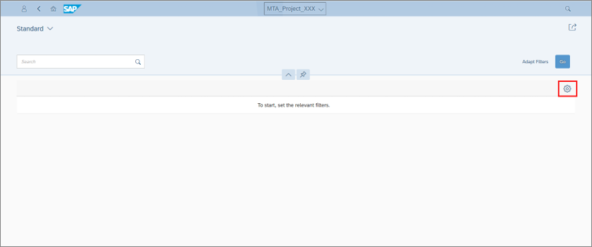

  8. Click **Select All** to add all columns, then click **OK**.

      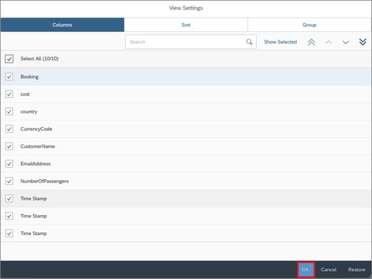

  9. Select **Go**, to see your result.

      

  10. Check your result.

      

[DONE]
[ACCORDION-END]

[ACCORDION-BEGIN [Step 8: ](Deploy UI to Cloud Foundry)]

  1. Right-click on your project **`MTA_Project_XXX`** and select **Build** > **Build**.

      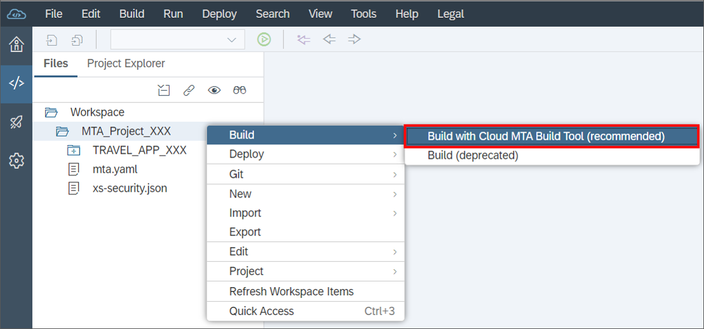

  2. Click on the **`+`** symbol to open **`mta_archives`**.

      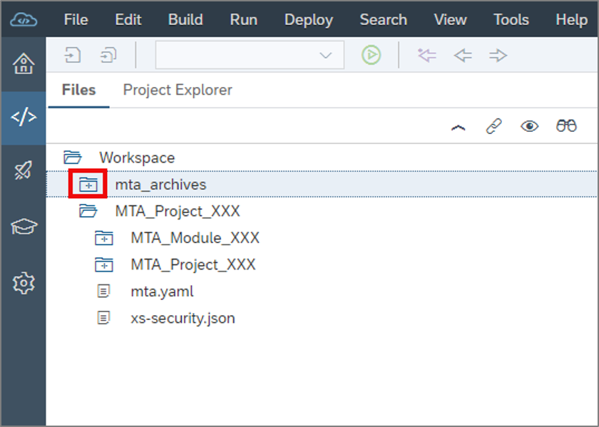

  3. Right-click on your `mtar` file **`MTA_Project_XXX_0.0.1.mtar`** and select **Deploy** > **Deploy to SAP Cloud Platform**.

      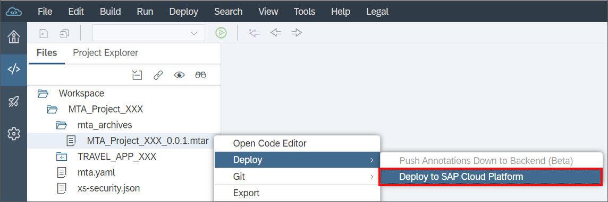

  4. Deploy your **`mtar`** file to SAP Cloud Platform.

     - Cloud Foundry API Endpoint: **`<your_api_endpoint>`**
     - Organization: **`<your_organization>`**
     - Space: **`<your_space>`**

     Click **Deploy**.

    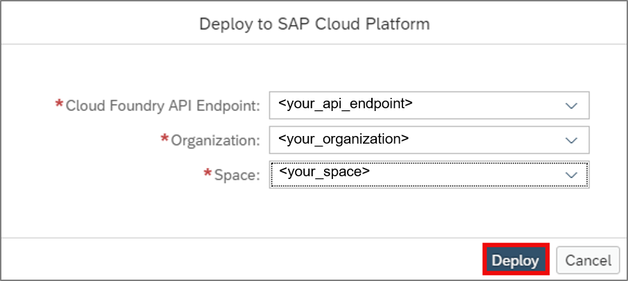

  5. Check your deployment.

      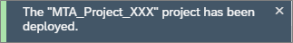

[DONE]
[ACCORDION-END]

[ACCORDION-BEGIN [Step 9: ](Check app existence on Cloud Foundry and run as a business user)]

  1. Login to your SAP Cloud Platform Cockpit and select your global account.

      

  2. Select **Subaccounts**.

      

  3. Select your subaccount.

      

  4. Click Spaces.

      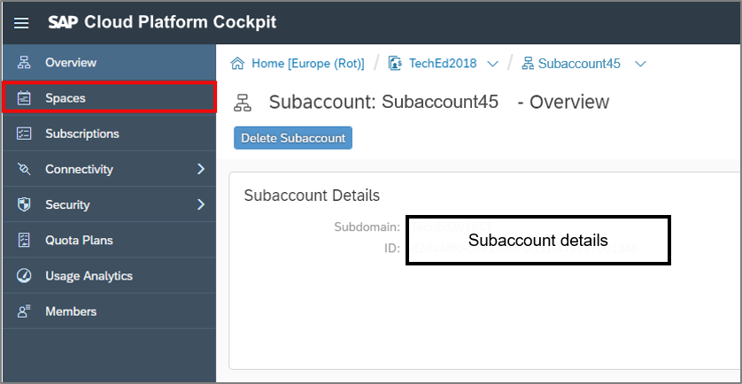

  5. Select your space.

      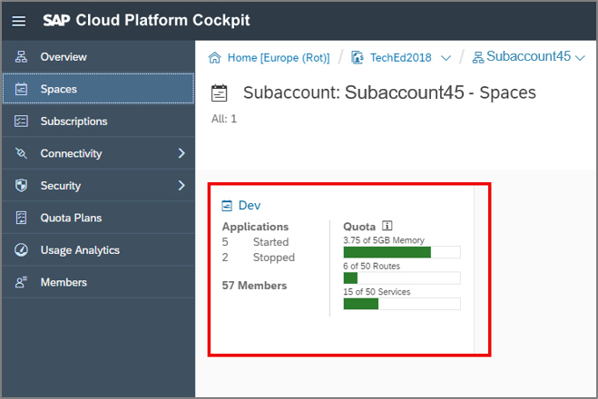

  6. Select your application **`MTA_Project_XXX_appRouter`**.

      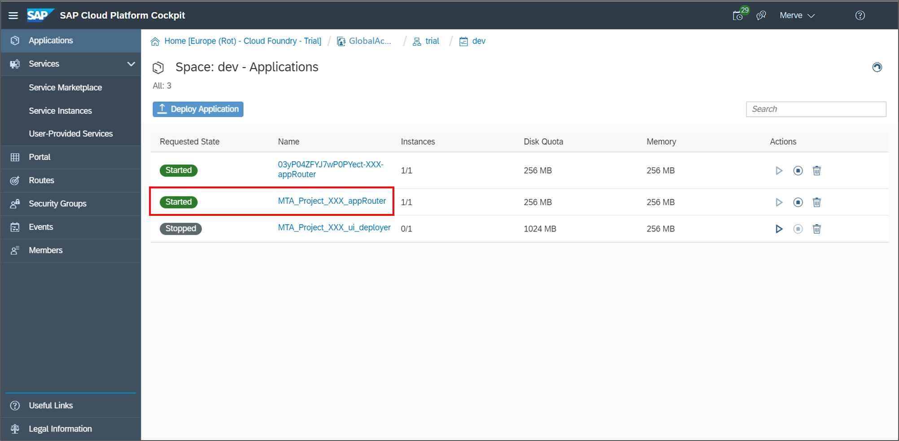

  7. Copy application routes URL for later use.

      

  8. Switch to SAP Web IDE, select your **`MTA_Project_XXX`** and open the **`manifest.json`** file. Copy the ID and application version for later use.

      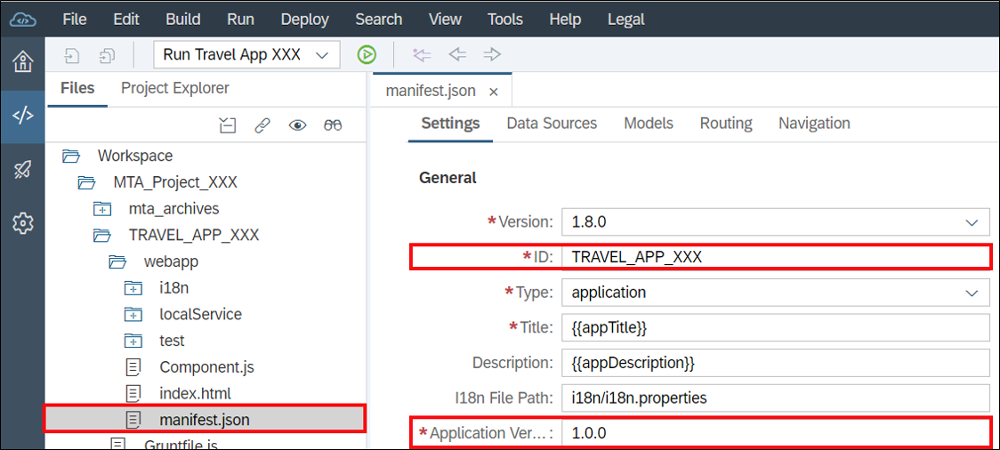

  9. Create your URL by using following:
     `<application_routes>/<id>-<version>/`
```Example
              Example: <application_routes>/MTA_Project_XXX-1.0.0/
```

  10. Copy your URL into a browser of choice and logon to SAP Cloud Platform ABAP environment.

      

  11. Select your Application **`MTA_Project_XXX`**.

      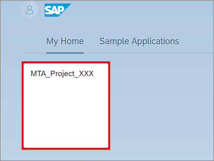

  12. Check your result.

      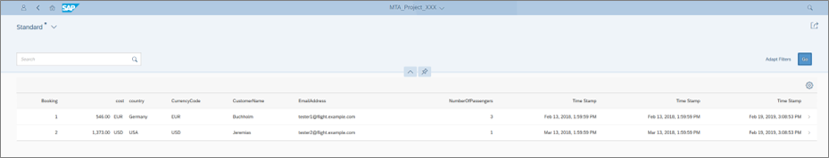

[DONE]
[ACCORDION-END]

[ACCORDION-BEGIN [Step 10: ](Test yourself)]

[VALIDATE_1]
[ACCORDION-END]


---
