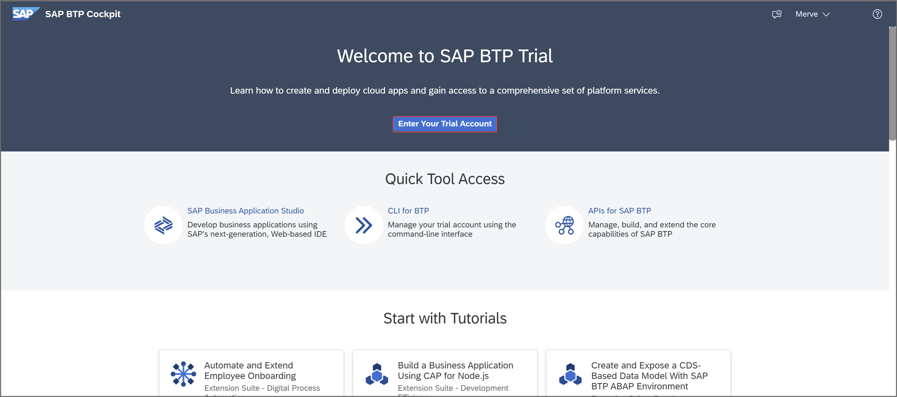
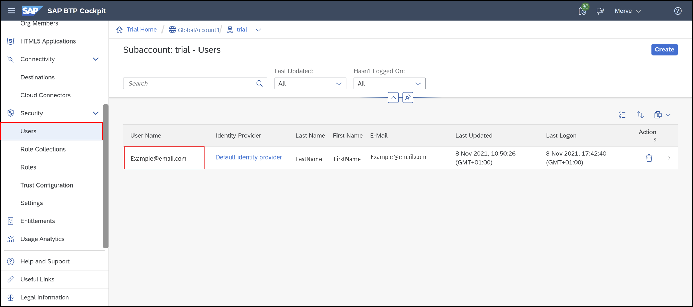
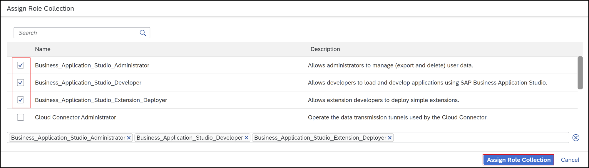
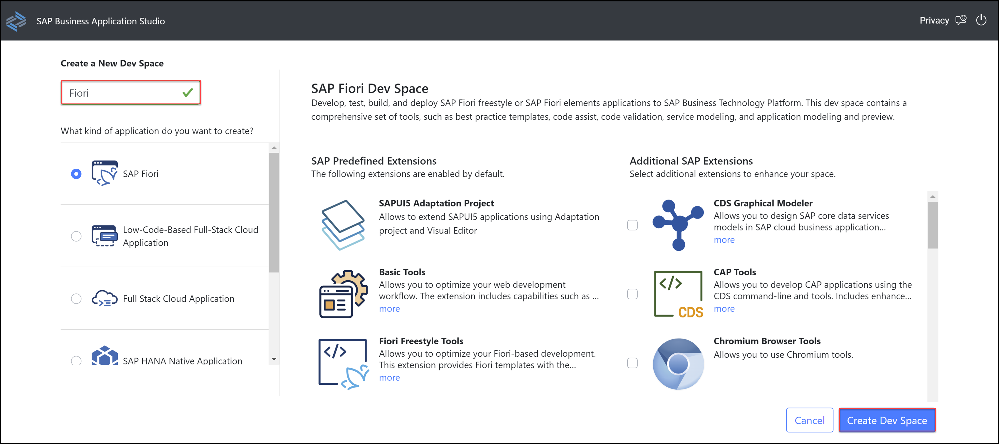
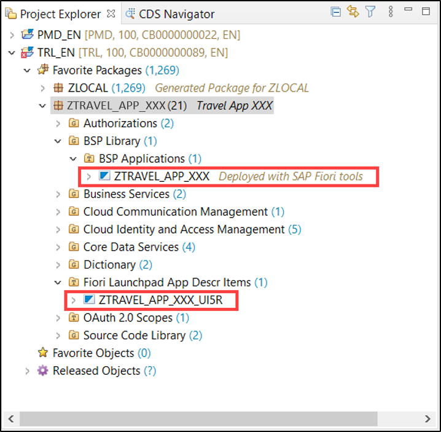
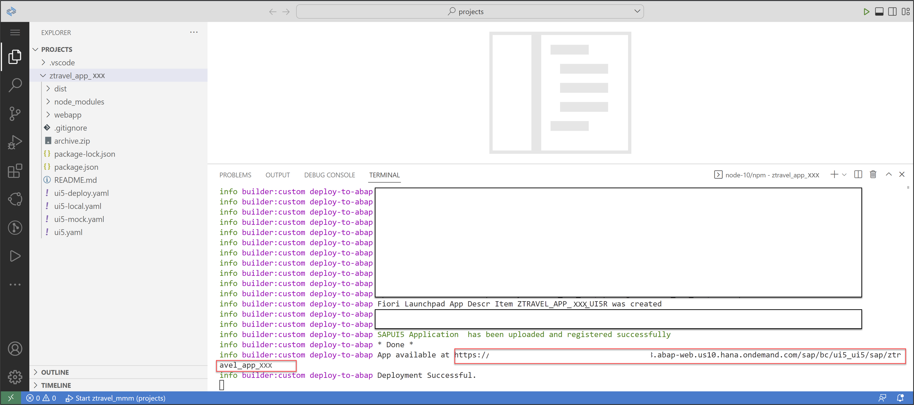

# Create a SAP Fiori App and Deploy it to SAP BTP, ABAP Environment
<!-- description --> Create a SAP Fiori app for a RAP business object from SAP BTP, ABAP Environment in SAP Business Application Studio and deploy it to SAP BTP, ABAP Environment.

## Prerequisites  
- **Trial:** You need an SAP BTP, ABAP environment [trial user](abap-environment-trial-onboarding) or a license.
- **Licensed system:**
    - The business catalog `SAP_A4C_BC_DEV_UID_PC` (Development - UI Deployment) needs to be assigned to a business role of the developer user. For an existing ABAP systems, the business catalog needs to be added manually to the existing developer business role.
    - You need to be a member at the used global account​
    - You need to be an organization manager at the used Cloud Foundry subaccount
    - You need to be a security administrator at the used Cloud Foundry Subaccount​
    - The SAP Business Application Studio and the SAP BTP, ABAP environment instance must be under same subaccount.

## You will learn  
- How to assign role collections
- How to create dev spaces
- How to set up organization and space
- How to create list report object pages
- How to run SAP Fiori applications
- How to deploy applications
- How to check BSP library in Eclipse
- How to create IAM apps and business catalogs

---

### Assign role collection to user

  1. Login to [SAP BTP Trial cockpit](https://cockpit.hanatrial.ondemand.com/) and click **Enter Your Trial Account**.

      

  2. Select your subaccount **trial**.

      

  2. Now you are in the trial overview page. Click **Users** and select your user.

      

  4. Click **Assign Role Collection**.

      

  5. Select `Business_Application_Studio_Extension_Deployer` and click **Assign Role Collection**.

      
 

### Create dev space

  1. On the left menu scroll to the top and select **Instances and Subscriptions** and open SAP Business Application Studio.

      

  2. Now the SAP Business Application Studio has started. Click **Create Dev Space**.

      

  3. Create a new dev space:
       - Name: **Fiori**
       - Type: **SAP Fiori**
 
       Click **Create Dev Space**.

     

  4. When your status is **Running**, select your dev space **Fiori**.

      

### Set up organization and space

  1. Now you are in your **Fiori** dev space in SAP Business Application Studio.
     Select the menu on the left side and click **Open Folder** to set your workspace.

      

  2. Select **`/home/user/projects/`** and click **OK**.

      

  3. Switch to SAP BTP Trial and select your trial subaccount.

      

  4. Copy your **Cloud Foundry Environment API endpoint** for later use.      

      

  5. Switch to **SAP Business Application Studio**, select the menu on the left side and click **View > Command Palette**.

      

  6. Search for **CF: Login to Cloud Foundry** and select it.

      

  7. Paste your Cloud Foundry API endpoint, enter your credentials and click **Sign in**.

      

  8. Now you can see, that you are logged in. Set now your cloud foundry target:

     - Cloud Foundry Organization: `<your_global_account>`
     - Cloud Foundry Space: dev

      

      Click **Apply**.

### Create list report object page

  1. Select the menu on the left side and click **View > Command Palette**.

      

  2. Search for **Fiori: Open Application Generator** and select it.

      

  3. Select **List Report Page** and click **Next >**.

      

  4. Configure data source, system and service:
     - Data source: **Connect to a System**
     - System: **`ABAP Environment on SAP Business Technology Platform`**
     - ABAP Environment: **`default_abap-trial`**
     - Service: **`ZUI_C_TRAVEL_M_XXX(1) - OData V2`**

     

     Click **Next >**.

     A destination for the `abap-trial` service instance is generated automatically.

  5. Select your main entity **`TravelProcessor`** and click **Next >**.

      

  6. Configure project attributes:  
     - Name: **`ztravel_app_xxx`**
     - Title: **Travel App XXX**
     - Description: **A Fiori application.**
     - Add deployment configuration: Yes
     - Add FLP configuration: Yes
     - Configure advanced options: No

     Click **Next >**.

      

    >Your **application name must** begin with a `z letter` and **must** be in **lowercase letters**.

  7. Configure deployment:
       - Target: ABAP
       - Destination: `<your_abap_system_url>`
       - `SAPUI5` ABAP Repository: `ztravel_app_xxx`
       - Package: `ztravel_app_xxx`
       - How do you want to enter Transport Request? Manually
       - Transport Request: `<your_transport_request>`

      

      Click **Next >**.

    >If you want to copy your transport request, please do following: Open Eclipse, search your package `ZTRAVEL_APP_XXX` and open it. Open your transport organizer to see your transport request. Copy your transport request for later use. You can find your transport request underneath the Modifiable folder.
    

  8. Configure SAP Fiori launchpad:
       - Semantic object: `ztravel_app_xxx`
       - Action: display
       - Title: Travel App XXX

      

      Click **Finish**.

### Run SAP Fiori application for data preview

  1. Select the menu on the left side, right-click your project `ztravel_app_xxx` and select **Open in Integrated Terminal**.

      

  2. Type `npm start` and press **Enter**.

      

  3. The preview opens. Click **Go**.

     

  4. Now check your result.

     

### Deploy your application

1. Select the menu on the left side, right-click your project `ztravel_app_xxx` and select **Open in Integrated Terminal**.

    

2. Enter **`npm run deploy`** to deploy your application. When prompted, check deployment configuration and press y. Open the URL at the end of the deployment log in browser to preview the application.

    

    When the deployment is successful, you will get these two information back as a result: **UIAD details** and **deployment successful**.

### Check BSP library and SAP Fiori Launchpad app descriptor item in Eclipse

  1. Open Eclipse and check the **BSP library** and **SAP Fiori Launchpad app descriptor item folder** in your package **`ZTRAVEL_APP_XXX`**. If you are not able to see BSP applications and SAP Fiori Launchpad app description items, refresh your package `ZTRAVEL_APP_XXX` by pressing `F5`.

     

### Create IAM App and business catalog

  1. In Eclipse right-click your package **`ZTRAVEL_APP_XXX`** and select **New** > **Other Repository Object**.

      

  2. Search for **IAM App**, select it and click **Next >**.

      

  3. Create a new IAM App:
     - Name: **`ZTRAVEL_IAM_XXX`**
     - Description: IAM App

      

      Click **Next >**.

  4. Click **Finish**.

      

  5. Select **Services** and add a new one. 

      

  6. Select following:
      - Service Type: `OData V2 (deprecated)`
      - Service Name: `ZUI_C_TRAVEL_M_XXX_0001`    

      
 
      Click **OK**.

      Right-click your IAM App and click **Activate**.

    >If you can't find your service name, you can press **CTRL + space** to search for it.

  7. Right-click your package **`ZTRAVEL_APP_XXX`** and select  **New** > **Other Repository Object**. 

      

  8. Search for **Business Catalog**, select it and click **Next >**.

      

  9. Create a new business catalog:
     - Name: **`ZTRAVEL_BC_XXX`**
     - Description: Business catalog

      

      Click **Next >**.

 10. Click **Finish**.
 
      

 11. Select **Apps** and add a new one.

      

 12. Create a new business catalog:
     - IAM App: `ZTRAVEL_IAM_XXX_EXT`
     - Name: `ZTRAVEL_BC_XXX_0001`

      

      Click **Next >**.

 13. Click **Finish**.

       

 14. Click **Publish Locally** to publish your business catalog.

       

### Run SAP Fiori application

  1. Go back to SAP Business Application Studio and deploy your changes. Select the menu on the left side, right-click your project `ztravel_app_xxx` and select **Open in Integrated Terminal**.

      

  2. Enter **`npm run deploy`**. When prompted, check deployment configuration and press y.

      

  3. Press **`CTRL and click the following link`** to open the URL in a browser.

      

  4. Log in to ABAP Trial.

      

  5. Click **Go**.

      

  6. Check your result.

      

### Test yourself
