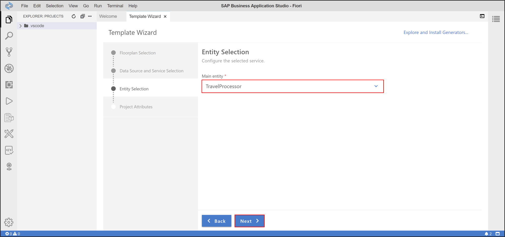
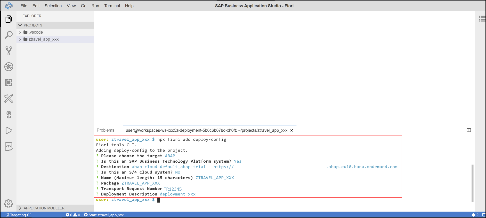
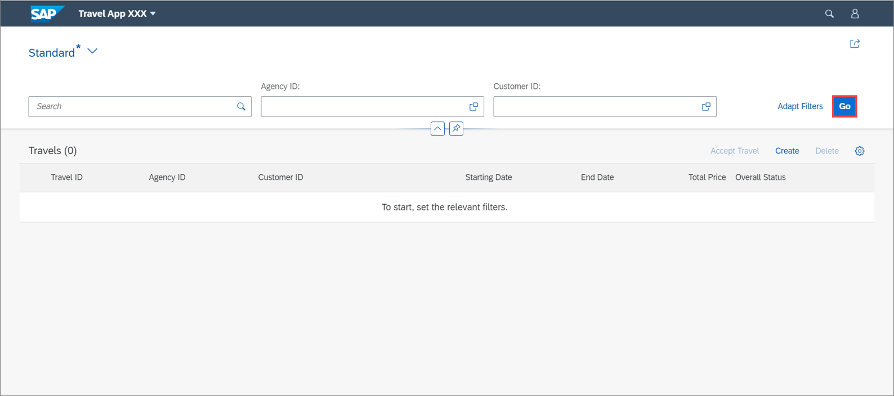

## Prerequisites  
- **Trial:** You need an SAP BTP, ABAP environment [trial user](abap-environment-trial-onboarding) or a license.
- **Licensed system:**
    - The business catalog `SAP_A4C_BC_DEV_UID_PC` (Development - UI Deployment) needs to be assigned to a business role of the developer user. For an existing ABAP systems, the business catalog needs to be added manually to the existing developer business role.
    - You need to be a member at the used global account​
    - You need to be an organization manager at the used Cloud Foundry subaccount
    - You need to be a security administrator at the used Cloud Foundry Subaccount​
    - The SAP Business Application Studio and the SAP BTP, ABAP environment instance should be under same subaccount.

## Details
### You will learn  
- How to assign role collections
- How to create dev spaces
- How to set up organization and space
- How to create list report object pages
- How to run SAP Fiori applications
- How to deploy applications
- How to check BSP library in Eclipse
- How to create IAM apps and business catalogs

---
[ACCORDION-BEGIN [Step 1: ](Assign role collection to user)]

  1. Login to [SAP BTP Trial cockpit](https://cockpit.hanatrial.ondemand.com/) and click **Enter Your Trial Account**.

      

  2. Select your subaccount **trial**.

      

  3. Click **Trust Configuration** and select **Default identity provider** to set up your trust.

      

      **HINT:** If you are using a licensed system, make sure you have the trust administrator role assigned to your user.

  4. Enter your e-mail address and click **Show Assignments**.

      

  5. Click **Assign Role Collection** .

      

  6. Select **`Business_Application_Studio_Developer`** and click **Assign Role Collection**.

      

  7. Check your result. Now your user should have the **`Business_Application_Studio_Developer`** role collection assigned.

      

      You are now able to develop on SAP Business Application Studio.

[DONE]
[ACCORDION-END]

[ACCORDION-BEGIN [Step 2: ](Create dev space)]

  1.  Select **trial** > **Service Marketplace**. Search for **SAP Business Application Studio** and select it.

      

  2.  Select actions and click **Go to Application**.

      

  3.  Check the privacy statement and click **OK**.

      

  4. Now the SAP Business Application Studio has started. Click **Create Dev Space**.

      

  5. Create a new dev space:
       - Name: **Fiori**
       - Type: **SAP Fiori**

       Click **Create Dev Space**.

     

  6. When your status is **Running**, select your dev space **Fiori**.

      

[DONE]
[ACCORDION-END]

[ACCORDION-BEGIN [Step 3: ](Set up organization and space)]

  1. Now you are in your **Fiori** dev space in SAP Business Application Studio.
     Select **Open Folder** to set your workspace.

      

  2. Select **projects** and click **Open**.

      

  3. Select **View > Find Command**.

      

  4. Search for **CF: Login to Cloud Foundry** and select it.

      

  5. Select your API endpoint and press enter.

      

  6. Enter the same e-mail address you set in your trial instance and press enter.
      

  7. Enter your password and press enter.

      

  7. Select your global account and press enter.

      

  8. Select dev as your space and press enter.

      

  9. Check your result. Now your organization and space have been set.

     

[DONE]
[ACCORDION-END]

[ACCORDION-BEGIN [Step 4: ](Create list report object page)]

  1. Select **View** > **Find Command**.

    

  2. Select **Fiori: Open Application Generator**.  

    

  3. Select **List Report Object Page** and click **Next >**.

    

  5. Configure data source, system and service:
     - Data source: **Connect to an SAP System**
     - System: **`ABAP Environment on SAP Business Technology Platform`**
     - ABAP Environment: **`default_abap-trial`**
     - Service: **`ZUI_C_TRAVEL_M_XXX(1) - OData v2`**

     

     Click **Next >**.

     A destination for the `abap-trial` service instance is generated automatically.

  6. Select your main entity **`TravelProcessor`** and click **Next >**.

    

  7. Configure project attributes:  
     - Name: **`ztravel_app_xxx`**
     - Title: **Travel App XXX**
     - Description: **A Fiori application.**
     - Add deployment configuration: Yes
     - Add FLP configuration: Yes
     - Configure advanced options: No

     Click **Next >**.

    

    **HINT:** Your **application name must** begin with a `z letter` and **must** be in **lowercase letters**.

  8. Configure deployment:

       - Target: ABAP
       - Is this an SAP Business Technology Platform system? Yes
       - Target System URL: `<your_abap_system_url>`
       - Name: `ztravel_app_xxx`
       - Package: `ztravel_app_xxx`
       - Transport Request: `<your_transport_request>`
       - Deployment description: deployment xxx

      !

      Click **Next >**.

    >**HINT: If you want to copy your transport request, please do following:**  Open Eclipse, search your package **`ZTRAVEL_APP_XXX`** and open it. Open your transport organizer to see your transport request. Copy your transport request for later use. You can find your **transport request** underneath the **Modifiable** folder.
    >      

  9. Configure Fiori Launchpad:

       - Semantic Object: `ztravel_app_xxx`
       - Action: display
       - Title: Travel App XXX

      !

      Click **Finish**.

 10. Now all files have been generated.

      !

[DONE]
[ACCORDION-END]

[ACCORDION-BEGIN [Step 5: ](Run SAP Fiori application for data preview)]

  1. Press the run button on the left side and select the **`Start ztravel_app_xxx`** run button to start your SAP Fiori application.

      

      **HINT**: An alternative to run the application is to open the terminal and enter: `npm start`.

  2. Your default browser will open. Click **Go** to see your result.

      

  3. Check your result.

     

[DONE]
[ACCORDION-END]

[ACCORDION-BEGIN [Step 6: ](Deploy your application)]

1. Click **Files**, right-click your project and select **Open in Terminal**.

    

2. Enter **`npm run deploy`** to deploy your application. When prompted, check deployment configuration and press y. Open the URL at the end of the deployment log in browser to preview the application.

    

    When the deployment is successful, you will get these two information back as a result: **UIAD details** and **deployment successful**.

>**HINT: If you want to update your SAP Fiori Launchpad configuration, then you can o following steps:**
> 1. Go back to SAP Business Application Studio, select projects, right-click your project **`ztravel_app_xxx`** and select **Open in Terminal**.

>

>  2. To add Fiori Launchpad content use this command, enter **`npx fiori add flp-config`**.

>     Add following information:

>       - Semantic Object: **`ztravel_app_xxx`**
       - Action: display
       - Title: Travel App XXX
       - Subtitle (optional): press enter

>       

> 3.  Open Eclipse, search your package **`ZTRAVEL_APP_XXX`** and open it. Open your transport organizer to see your transport request. Copy your transport request for later use. You can find your **transport request** underneath the **Modifiable** folder.

>      

>  4. Go back to SAP Business Application Studio and open the terminal again. To add `deploy config` details, enter **`npx fiori add deploy-config`**.

>     Add following information:

>      - Please choose the target: ABAP
      - Is this an SAP Business Technology Platform system?: Y
      - Destination: press enter for default
      - Is this an S/4 Cloud system? N
      - Name: press enter for default
      - Package: **`ztravel_app_xxx`**
      - Transport Request: **`<your_transport_request>`**
      - Deployment description: `deployment xxx`

>      

>      The `ui5-deploy.yaml` will be generated as part of this `deploy config` command.

[DONE]
[ACCORDION-END]

[ACCORDION-BEGIN [Step 7: ](Check BSP library and SAP Fiori Launchpad app descriptor item in Eclipse)]

  1. Open Eclipse and check the **BSP library** and **SAP Fiori Launchpad app descriptor item folder** in your package **`ZTRAVEL_APP_XXX`**. If you are not able to see BSP applications and SAP Fiori Launchpad app description items, refresh your package `ZTRAVEL_APP_XXX` by pressing `F5`.

    

[DONE]
[ACCORDION-END]

[ACCORDION-BEGIN [Step 8: ](Create IAM App and business catalog)]

  1. In Eclipse right-click your package **`ZTRAVEL_APP_XXX`** and select **New** > **Other Repository Object**.

      

  2. Search for **IAM App**, select it and click **Next >**.

      

  3. Create a new IAM App:
     - Name: **`ZTRAVEL_IAM_XXX`**
     - Description: IAM App

      

      Click **Next >**.

  4. Click **Finish**.

      

  5. Select **Services** and add a new one.

      

  6. Select following:
      - Service Type: `OData IWSG`
      - Service Name: `ZUI_C_TRAVEL_M_XXX_0001`    

      

      Click **OK**.

      **Save** and **activate** your IAM app.

  7. Right-click your package **`ZTRAVEL_APP_XXX`** and select  **New** > **Other Repository Object**.

      

  8. Search for **Business Catalog**, select it and click **Next >**.

      

  9. Create a new business catalog:
     - Name: **`ZTRAVEL_BC_XXX`**
     - Description: Business catalog

      

      Click **Next >**.

 10. Click **Finish**.

      

 11. Select **Apps** and add a new one.

      

 12. Create a new business catalog:
     - IAM App: `ZTRAVEL_IAM_XXX_EXT`
     - Name: `ZTRAVEL_BC_XXX_0001`

      

      Click **Next >**.

 13. Click **Finish**.

       

 14. Click **Publish Locally** to publish your business catalog.

       

[DONE]
[ACCORDION-END]

[ACCORDION-BEGIN [Step 9: ](Run SAP Fiori application)]

  1. Go back to SAP Business Application Studio and deploy your changes. Therefore right-click your project **`ztravel_app_xxx`** and select **Open in Terminal**.

    

  2. Enter **`npm run deploy`**. When prompted, check deployment configuration and press y.

      

  3. Press **`CTRL and click the following link`** to open the URL in a browser.

      

  4. Log in to ABAP Trial.

      

  5. Click **Go**.

      

  6. Check your result.

      

[DONE]
[ACCORDION-END]

[ACCORDION-BEGIN [Step 10: ](Test yourself)]

[VALIDATE_1]
[ACCORDION-END]

Give us 55 seconds of your time to help us improve

