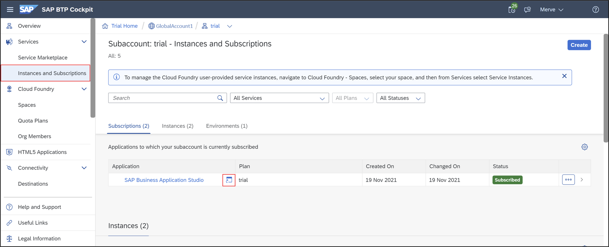

## Prerequisites  
- You need a SAP Cloud Platform ABAP Environment trial user or a license.
- You need to have enough quota for HTML5 application and portal services. These services can be found in the entitlements of your subaccount.  

## Details
### You will learn  
- How to add ABAP services to multi-target application
- How to create HTML5 module
- How to create SAP Fiori launchpad site module
- How to deploy UI to Cloud Foundry
- How to run application as business user

---
[ACCORDION-BEGIN [Step 1: ](Create multi-target application)]

  1. If you are using your trial user, then login to your [SAP Cloud Platform trial cockpit](https://cockpit.hanatrial.ondemand.com/) and select **Launch SAP Web IDE**.

      

     Otherwise login to your [SAP Cloud Platform cockpit](https://account.hana.ondemand.com/), click **Services**, choose **SAP Web IDE Full-Stack** and click **Go to Service**.

      

      

  2. In your SAP Web IDE account select **File** > **New** > **Project from Template**.

      

  3. Search for multi-target, select **Multi-Target Application** and click **Next**.

      

  4. Enter project name **`MTA_Project_XXX`** and click **Next**.

      

  5. Enter **`MTA_Project_XXX`** as application ID, select **`0.0.1`** as application version.
  Check **Use HTML5 Application Repository** and click **Finish**.

      

[DONE]
[ACCORDION-END]

[ACCORDION-BEGIN [Step 2: ](Copy API endpoint)]

  1.  Login to your **SAP Cloud Platform cockpit trial** and select **trial**.

      

     Or Login to your **SAP Cloud Platform cockpit** and select your global account. Select **Subaccounts** and your **subaccount**.

      

  4. Copy your API endpoint for later use.

      

[DONE]
[ACCORDION-END]

[ACCORDION-BEGIN [Step 3: ](Configure project settings)]

  1. Switch to SAP Web IDE and right-click on your project **`MTA_Project_XXX`** select **Project** > **Project Settings**.

      

  2. Select **Cloud Foundry** as Project and custom Cloud Foundry settings.
     - API Endpoint: **`<your_api_endpoint>`**
     - Organization: **`<your_organization>`**
     - Space: **`<your_space>`**

     Click **Save**.

      

[DONE]
[ACCORDION-END]

[ACCORDION-BEGIN [Step 4: ](Add ABAP service to multi-target application)]

  1. Select your project **`MTA_Project_XXX`** > **New** > **SAP Cloud Platform Service**.

      

  2. If you are using the SAP Cloud Platform trial cockpit, search for **ABAP**, select **`abap-trial`** and click **Next**.

      

     If you are using the SAP Cloud Platform cockpit, then search for **ABAP**, select it and click **Next**.

      

  3. Select **Reuse instance**, your instance, provide a resource name and click **Finish**.

      

[DONE]
[ACCORDION-END]

[ACCORDION-BEGIN [Step 5: ](Create HTML5 module)]

  1. Right-click on your project **`MTA_Project_XXX`** and select **New** > **HTML5 Module**.

      

  2. Choose **List Report Application** and click **Next**.

      

  3. Provide following information:
     - Module Name: **`TRAVEL_APP_XXX`**
     - Title: **`TRAVEL_APP_XXX`**
     - Namespace: **`namespace_xxx`**

     Click **Next**.

      

  4. Select **SAP Cloud Platform Service**, then click on your resource.

      

  5. Logon to SAP Cloud Platform ABAP environment trial or SAP Cloud Platform ABAP environment and switch back to SAP Web IDE.

      

  6. Select your resource **`ZUI_C_TRAVEL_M_XXX`** and click **Next**.

      

  7. Check **Selected Service Metadata** and click **Next**.

      

  8. Select **`TravelProcessor`** as OData collection and click **Finish**.

      

[DONE]
[ACCORDION-END]

[ACCORDION-BEGIN [Step 6: ](Remove destination service resource)]

  1. Open your **`mta.yaml`** file, click on **MTA Editor** and **Resources**.

      

  2. Select your destination resource **`dest_MTA_Project_XXX`** and delete it.

      

  3. Save your **`mta.yaml`** file.

[DONE]
[ACCORDION-END]

[ACCORDION-BEGIN [Step 7: ](Test UI on Cloud Foundry)]

  1. Right-click on **`TRAVEL_APP_XXX`** and select **Run** > **Run Configurations**.

      

  2. Click **`+`** to add a new run configuration.

      

  3. Select **Run as Web Application**.

      

  4. Create your run configuration.
     - Name: **`Run TRAVEL APP XXX on Cloud Foundry`**
     - Select your **`flpSandbox.html`** file.

     Click **Run on Cloud Foundry**, select **Without Frame** and click **Save and Run**.

     

  5. Logon to your SAP Cloud Platform ABAP environment trial or SAP Cloud Platform ABAP environment.

      

  6. Select the **`TRAVEL_APP_XXX`** tile to test your application.

      

  7. Select **Go**, to see your result.

      

  8. Check your result.

      

[DONE]
[ACCORDION-END]

[ACCORDION-BEGIN [Step 8: ](Create SAP Fiori launchpad site module)]

  1. Open SAP Web IDE and right-click on your project **`MTA_Project_XXX`** and select **New** > **SAP Fiori Launchpad Site Module**.

      

  2. Create a SAP Fiori launchpad site module:
     - Module name: **`FLP_Site_Module_XXX`**

      

    Click **Finish**.

[DONE]
[ACCORDION-END]

[ACCORDION-BEGIN [Step 9: ](Create inbound tile)]

1. Open **`manifest.json`** and select **Navigation**.

    Create semantic object:

    - Semantic object: `Travel_App_XXX`
    - Action: display

    Create inbound tile:

    - Title: `Travel_App_XXX`
    - Subtitle: `Travel_booking_application`
    - icon: `sap-icon://sap-logo-shape`

      

2. Save your changes.

[DONE]
[ACCORDION-END]

[ACCORDION-BEGIN [Step 12: ](Create SAP Fiori launchpad site module)]
  1. Open the **`CommonDataModel.json`** file in **`FLP_Site_Module_XXX`** and click **Add Group**.

    

  2. Create new group:
     - Group name: **`Travel App XXX`**

    

  3. Click on your group.

    

  4. Add your project app **`Travel_App_XXX`** to your group and click **Select**.

    

  5. Now your project app **`Travel_App_XXX`** is added to your group.

    

[DONE]
[ACCORDION-END]

[ACCORDION-BEGIN [Step 11: ](Deploy UI to Cloud Foundry)]

  1. Right click on **`MTA_Project_XXX`** and select **Build** > **Build with Cloud MTA Build Tool (recommended)**.

      

  2.  Open **`mta_archives`**.

      

  3.  Right-click on **`MTA_Project_XXX_0.0.1.mtar`**, select **Deploy** > **Deploy to SAP Cloud Platform**.

      

  4.  Deploy your **`mtar`** file to SAP Cloud Platform.

       - Cloud Foundry API Endpoint: **`<your_api_endpoint>`**
       - Organization: **`<your_organization>`**
       - Space: **`<your_space>`**

       Click **Deploy**.

      

[DONE]
[ACCORDION-END]

[ACCORDION-BEGIN [Step 12: ](Run application on Cloud Foundry as business user)]

  1. Open SAP Cloud Platform cockpit trial or SAP Cloud Platform cockpit and navigate to your **trial subaccount**.  
     Select your space **dev**.

      

  2. Run your app router **`mta-project-xxx-approuter`**.  

      

  3.  Select **`mta-project-xxx-approuter`**.

      

  4.  Click on your application routes to open your application in your launchpad.

      

  5. Logon to your SAP Cloud Platform ABAP environment trial or SAP Cloud Platform ABAP environment system.

      

  6. You application is now available as a tile in the launchpad. Select your application **`Travel_App_XXX`**.

      

  7. Click **Go** to see your result.

      

  8. Check your result.

      

[DONE]
[ACCORDION-END]

[ACCORDION-BEGIN [Step 13: ](Test yourself)]

[VALIDATE_1]
[ACCORDION-END]

Give us 55 seconds of your time to help us improve

