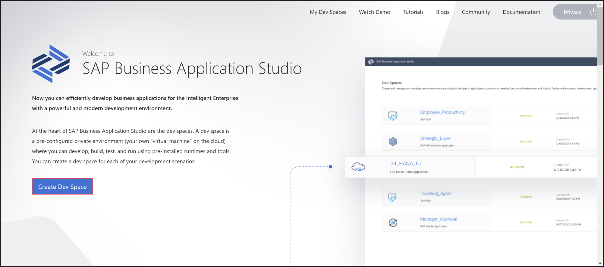
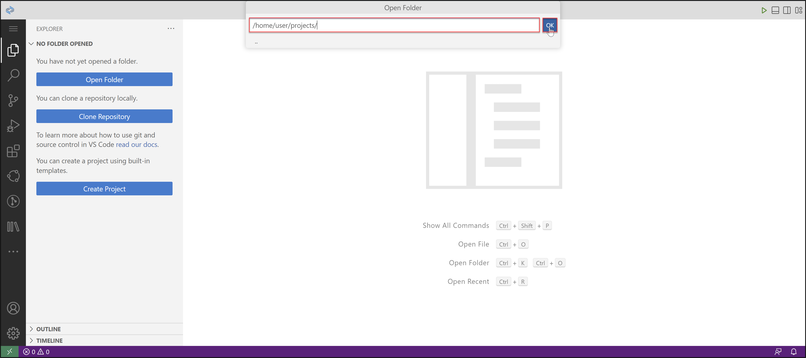
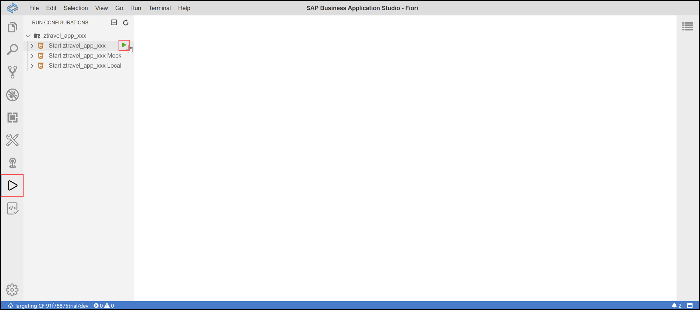

## Prerequisites  
- You need a SAP Cloud Platform ABAP Environment trial user or a license.

## Details
### You will learn  
- How to assign role collections
- How to create dev spaces
- How to set up organization and space
- How to create list report object pages
- How to run SAP Fiori applications

---
[ACCORDION-BEGIN [Step 1: ](Assign role collection to user)]

  1. Login to [SAP Cloud Platform trial cockpit](https://cockpit.hanatrial.ondemand.com/) and click **Enter Your Trial Account**.

      

  2. Select your subaccount **trial**.

      

  3. Click **Trust Configuration** to set up your trust.

      

      HINT: If you are using a licensed system, make sure you have the trust administrator role assigned to your user.

  4. Select **sap.default**.

      

  5. Enter your e-mail address and click **Show Assignments**.

      

  6. Click **Assign Role Collection** .

      

  7. Select **`Business_Application_Studio_Developer`** and click **Assign Role Collection**.

      

  8. Check your result. Now your user should have the **`Business_Application_Studio_Developer`** role collection assigned.

      

      You are now able to develop on SAP Business Application Studio.

[DONE]
[ACCORDION-END]

[ACCORDION-BEGIN [Step 2: ](Create dev space)]

  1.  Select **trial** > **Subscriptions** > **SAP Business Application Studio** and click **Go to Application**.

      

  2.  Check the privacy statement and click **OK**.

      

  3. Now the SAP Business Application Studio has started. Click **Create Dev Space**.

      

  4. Create a new dev space:
       - Name: **Fiori**
       - Type: **SAP Fiori**
       - Additional SAP Extensions: **Launchpad Module**

       Click **Create Dev Space**.

     

  5. Select your dev space **Fiori**.

      

[DONE]
[ACCORDION-END]

[ACCORDION-BEGIN [Step 3: ](Set up organization and space)]

  1. Now you are in your **Fiori** dev space in SAP Business Application Studio.
     Select **Open Workspace** to set your workspace.

      

  2. Select **projects** and click **Open**.

      

  3. Select on the button **The organization and space in Cloud Foundry have not been set.**

      

  4. Press enter to set your Cloud Foundry endpoint.

      

  5. Enter the same e-mail address you entered in your trial instance and press enter.
      

  6. Enter your password and press enter.

      

  7. Select your global account and press enter.

      

  8. Select dev as your space and press enter.

      

  9. Check your result. Now your organization and space have been set.

     

[DONE]
[ACCORDION-END]

[ACCORDION-BEGIN [Step 4: ](Create list report object page)]

  1. Select **View** > **Find Command**.

    

  2. Search for **Yeoman UI Generators** and select it.

    

  3. Select **SAP Fiori elements application** and click **Next >**.

    

  4. Select **List Report Object Page V2** and click **Next >**.

    

  5. Configure data source, system and service:
     - Data source: **Connect to SAP System**
     - System: **`your_abap_trial_instance`**
     - Service: **`ZUI_C_TRAVEL_M_XXX`**

     Click **Next >**.

    

  6. Select your main entity **`TravelProcessor`** and click **Next**.

    

  7. Configure project attributes:
     - Name: **`ztravel_app_xxx`**
     - Title: **Travel App XXX**
     - Description: **A Fiori application.**

     Click **Next >**.

    

    HINT: Your **application name must** be in **lowercase letters**.

[DONE]
[ACCORDION-END]

[ACCORDION-BEGIN [Step 5: ](Run SAP Fiori application)]

  1. Close the wizard.

      

  2. Press the run button.

      

  3. Select **`Start ztravel_app_xxx`** and press the run button to run your SAP Fiori application.

      

  4. Click **Expose and Open**.

      

  5. Enter **travel** and press enter.

      

  6. Select **`test/`**.

      

  7. Select **`flpSandbox.html`**.

      

  8. Now your SAP Fiori application runs. Select your application **Travel App XXX**.

      

  9. Click **Go** to see your result.

      

 10. Check your result.

     

[DONE]
[ACCORDION-END]

[ACCORDION-BEGIN [Step 6: ](Test yourself)]

[VALIDATE_1]
[ACCORDION-END]

Give us 55 seconds of your time to help us improve

