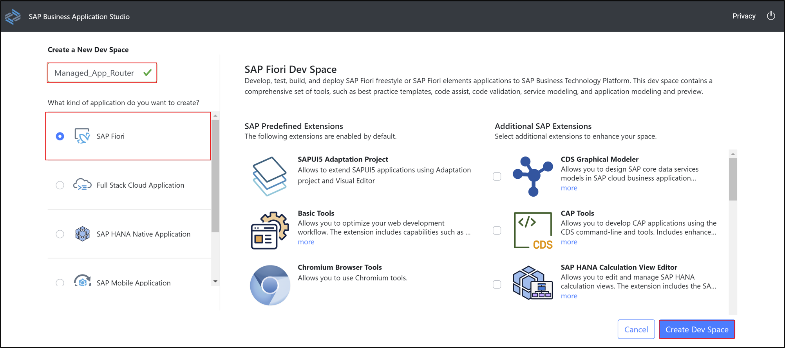
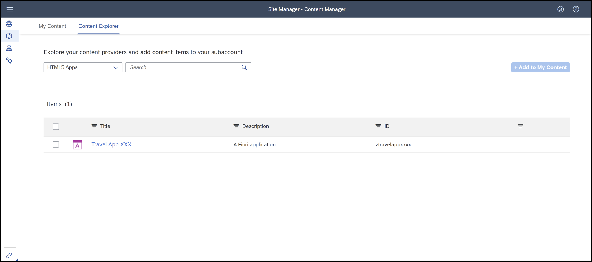

# Create a SAP Fiori App and Deploy it to SAP BTP, Cloud Foundry environment
<!-- description --> Create a SAP Fiori app using SAP-managed app router for a RAP business object from SAP BTP, ABAP Environment in SAP Business Application Studio and deploy it to SAP BTP, Cloud Foundry environment.

## Prerequisites  
- **Trial:** You need an SAP BTP, ABAP environment [trial user](abap-environment-trial-onboarding) or a license.
- User has authorization to execute the OData service​
- The user is Space Developer in the targeted Cloud Foundry Space​
- Business Application Studio is subscribed and the SAP Business Application Studio Developer role collection is assigned​
- SAP Launchpad Service is subscribed and the Launchpad Admin role collection is assigned
- **Limitation:** SAP Business Application Studio must be subscribed in same subaccount as the ABAP instance

## You will learn  
- How to create MTA projects
- How to create SAP Fiori applications
- How to run applications
- How to build MTA projects
- How to deploy MTA archive files
- How to check deployment
- How to open SAP launchpad service

---

### Open SAP Business Application Studio

  1. Log in to [SAP BTP Trial cockpit](https://cockpit.hanatrial.ondemand.com/) and click **Enter Your Trial Account**.

      

  2. Select your subaccount **trial**.

      

  3. Select **Service Marketplace** and search for **SAP Business Application Studio** and select it.

      

### Create dev space

  1. Create a new dev space:
       - Name: **`Managed_App_Router`**
       - Type: **SAP Fiori**

       Click **Create Dev Space**.

      

  2. Click **`Managed_App_Router`**.

      

  3. Select **Open Folder**.

     

  4. Select **projects** and click **Open**.

      

### Create MTA project

  1. Select **View** > **Find Command**.

      

  2. Search for **Open CF: Application Router Generator** and select it.

      

  4. Create MTA project:
      - MTA ID:  `ztravel_app_xxx`
      - MTA description: Travel App XXX
      - Add router module: `Managed Approuter`

    Click **Finish**.

      

  5. Check your result.

      

### Login to Cloud Foundry

  1.  Select **View** > **Find Command**.

      

  2. Search for **Login to Cloud Foundry** and select it.
      

  3. Press **Enter** to set your API endpoint.

     

  4. Enter your email address and press **Enter**.

      

  5. Enter your password and press **Enter**.

      

  6. Select your global account.

      

  7. Select your dev space.

      

  8. Now you are logged in and your organization and space have been set.

      

### Create SAP Fiori application​

  1. Select **View** > **Find Command**.

      

  2.  Search for **Open Application Generator** and select it.

      

  3. Select **SAP Fiori elements** as application type and **List Report Object Page** as `floorplan`.

    Click **Next >**.

      

  4. Configure data source, system and service:
     - Data source: **Connect to a SAP System**
     - System: **`ABAP Environment on SAP Business Technology Platform`**
     - ABAP Environment: **`default_abap-trial`**
     - Service: **`ZUI_C_TRAVEL_M_XXX(1) - OData V2`**

     Click **Next >**.

      

  5. Select **`TravelProcessor`** and click **Next >**.

      

  6. Configure project attributes:  
     - Name: **`ztravel_app_xxx`**
     - Title: **Travel App XXX**
     - Description: **A Fiori application.**
     - Project folder path:
     **`/home/user/projects/ztravel_app_xxx`**
     - Add deployment configuration: Yes
     - Add FLP configuration: Yes
     - Configure advanced options: No

     Click **Next >**.
      

    >**HINT**: Make sure, you have selected your **MTA project** in the **folder path**.

  7. Configure deployment:

       - Target: Cloud Foundry
       - Destination Name:
       `<your_destination_system_url>`

       Click **Next >**.

      

  8. Configure SAP Fiori Launchpad:

       - Semantic Object: `ztravel_app_xxx`
       - Action: maintain
       - Title: Travel App XXX

       Click **Finish**.

      

### Check result

Check your result

  

### Run application

1. Right-click your SAP Fiori Application `ztravel_app_xxx` and select **Open in Terminal**.

    

2. Enter **`npm run start`** to run your application.

    

3. Click **Go**.

    

4. Check your result.

    

### Build MTA project​

  1. Right-click your  `mta.yaml`file inside your SAP Fiori Application `ztravel_app_xxx` and select **Build MTA Project**.

    

  2. Check your result. A new `mta_archives` folder has been created.

    

    >**HINT:** You can also create the `mta_archives` by right-click on the **project** > **open terminal**, and **check** where the `mta_archive` is present, and then run the command `npm run build`. The `mta_archives` file will then get generated.

### Deploy MTA archive file​

  1. Right-click your  `ztravel_app_xxx_0.0.1.mtar`file inside your `mta_archives` folder and select **Deploy MTA Archive**.

      

  2. Check your result.

      

    >**HINT:** You can also deploy the application from command line by **opening the terminal**, **check** where the **`mta_archive`** is present, and then run the **command `npm run deploy`**.

### Check deployment result

  1. Go back to SAP BTP trial cockpit, select **HTML5 Applications** on the left menu and select your application **`ztravelappxxx`**.

    

  2. Click **Go**.

      

  3. Check your result.

      

### Open SAP Launchpad Service

  1. Go back to SAP BTP trial cockpit, select **Service Marketplace** on the left menu, search for **Launchpad Service** and select **Go to Application**.

    

  2. Click **Content Providers** on the left menu. Now you can see your HTML5 application. Click the refresh button.

      

  3. Go to your content explorer and select your HTML5 app.

    

  4.  Check your result. Your **Travel App XXX** should appear here.

      

### Test yourself

