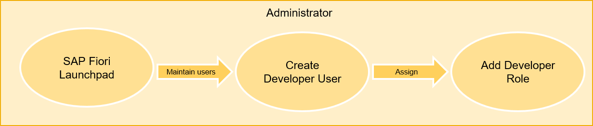
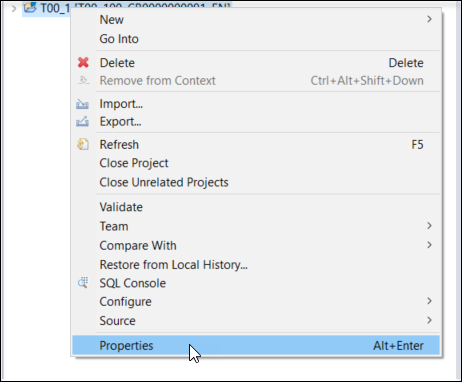
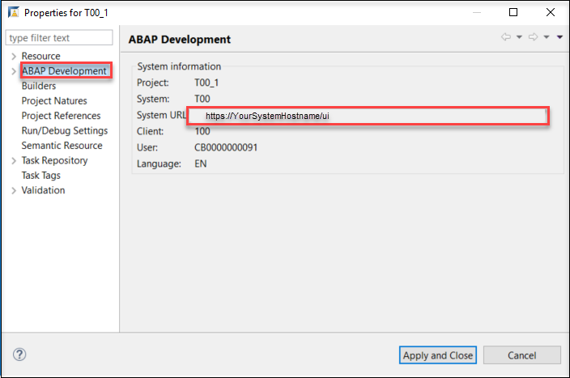
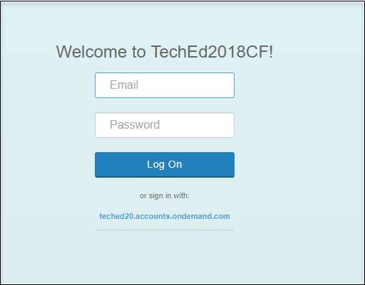
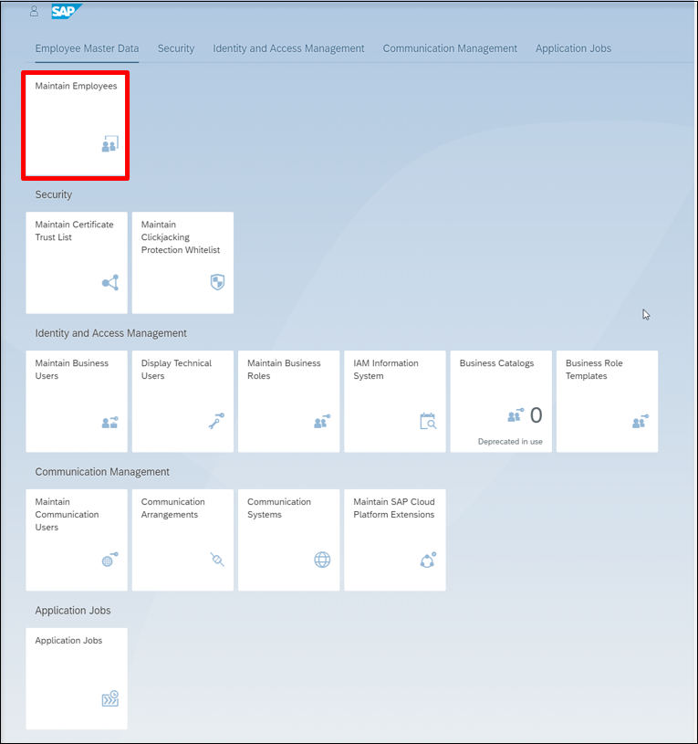
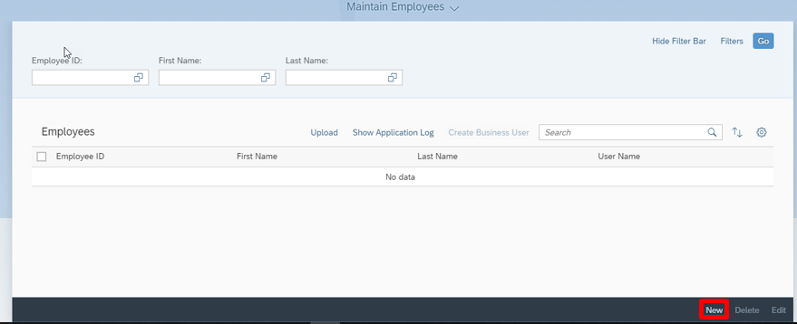
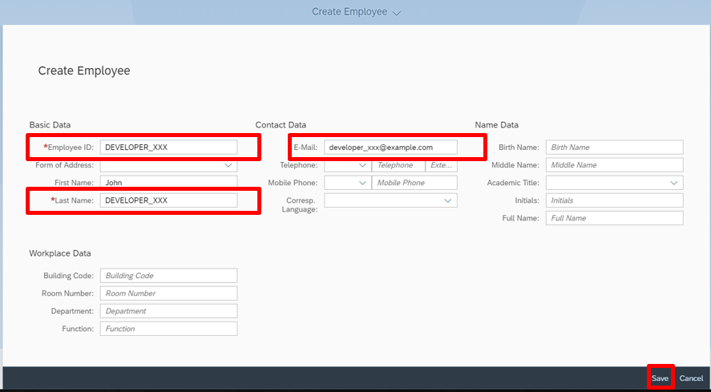
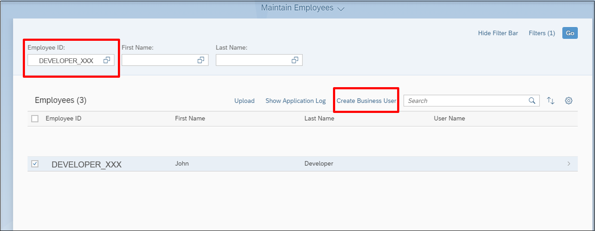
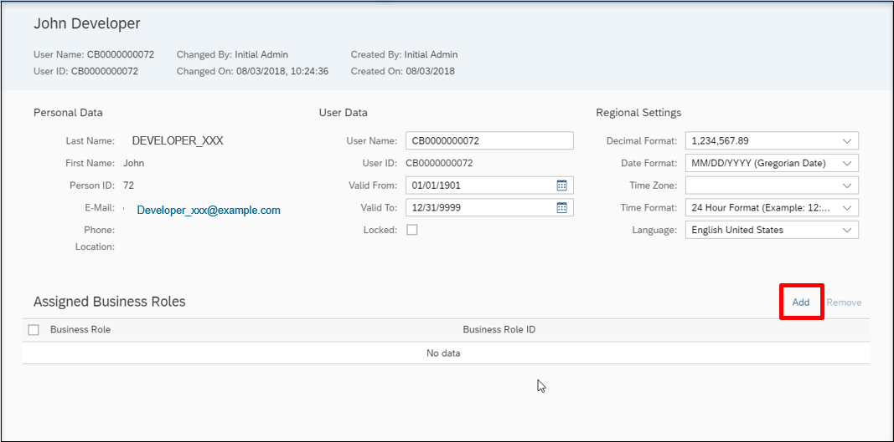
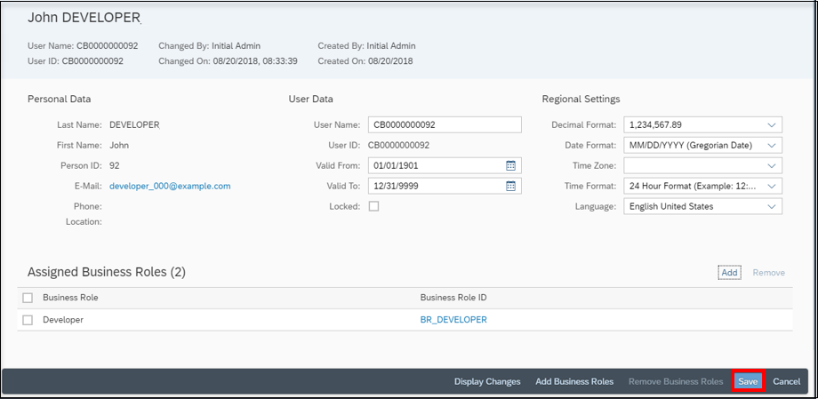

## Prerequisites  
- You must have an administrator user.

## Details
### You will learn
- How to create an employee user
- How to assign business roles to an employee user

### Time to Complete
**10 Min**.

---

[ACCORDION-BEGIN [Step 1: ](Overview)]

To be connected to your system in ADT, expose an ABAP service and consume this service to create a Fiori Application, you will need to have a Developer User with developer role.

[DONE]
[ACCORDION-END]

[ACCORDION-BEGIN [Step 2: ](Log in to SAP Fiori Launchpad as administrator)]
 1. Open Eclipse and do right click on your system and navigate to **Properties**.

    

 2. Navigate to **ABAP Development** and copy the **System URL**.

    

 3. Copy this URL in a browser and change the URL like this:

    Add `-web` after `.abap` and `/ui` at the end of URL.
    `https://<your-system>.abap-web.eu10.hana.ondemand.com/ui`

    

 4. Login with admin user and password in SAP Fiori Launchpad.

    

[DONE]
[ACCORDION-END]

[ACCORDION-BEGIN [Step 3: ](Navigate to Maintain Employees application)]
Navigate to **Maintain Employees** application.

[DONE]
[ACCORDION-END]

[ACCORDION-BEGIN [Step 4: ](Create a new employee)]
Create a new employee by clicking **New**

[DONE]
[ACCORDION-END]

[ACCORDION-BEGIN [Step 5: ](Enter user data)]
  1. Enter user data and a valid Email address .
      - Employee ID: `DEVELOPER_XXX`
      - Last Name: `DEVELOPER_XXX`
      - E-Mail: `developer_xxx@example.com`

  2. **Save** your changes.

      

[DONE]
[ACCORDION-END]

[ACCORDION-BEGIN [Step 6: ](Create business user)]
  1. Select the newly created entry in the employee list.

  2. Press **Create Business User**.

      

[DONE]
[ACCORDION-END]

[ACCORDION-BEGIN [Step 7: ](Add business roles)]
  1. Press **Add** Business Roles.

      

  2. Select business role **Developer** and press **OK**.

      

  3. Save all changes with click on **Save**.

      

[DONE]
[ACCORDION-END]

[ACCORDION-BEGIN [Step 8: ](Test yourself)]
In which application on your SAP Fiori launchpad can you create developer user as an administrator?

[VALIDATE_1]
[ACCORDION-END]
---
