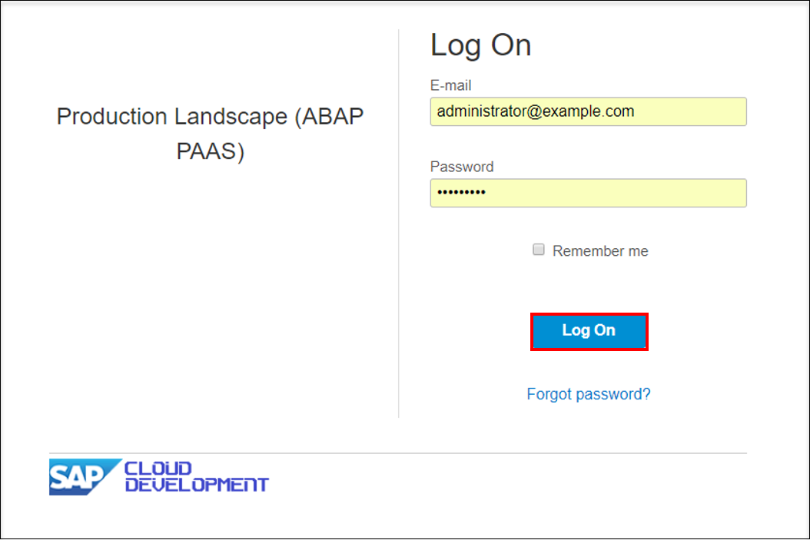

## Prerequisites  
- You must have an administrator user.

## Details
### You will learn
- How to create an employee user
- How to assign business roles to an employee user

### Time to Complete
**10 Min**.

---
[ACCORDION-BEGIN [Step 1: ](Log in to SAP Fiori launchpad as administrator)]

Log in with admin user to the SAP Fiori launchpad.

[DONE]
[ACCORDION-END]

[ACCORDION-BEGIN [Step 2: ](Navigate to Maintain Employees application)]

Navigate to **Maintain Employees** application.

[DONE]
[ACCORDION-END]

[ACCORDION-BEGIN [Step 3: ](Create a new employee)]

Create a new employee by clicking **New**.

[DONE]
[ACCORDION-END]

[ACCORDION-BEGIN [Step 4: ](Enter user data)]

1. Enter user data and a valid Email address.
2. **Save** your changes.

[DONE]
[ACCORDION-END]

[ACCORDION-BEGIN [Step 5: ](Create business user)]

1. Select the newly created entry in the employee list.
2. Press **Create Business User**.

[DONE]
[ACCORDION-END]

[ACCORDION-BEGIN [Step 6: ](Add business roles)]

1. Press **Add** Business Roles.

2. Select business role **Developer** and press **OK**.

3. Save all changes with click on **Save**.

[DONE]
[ACCORDION-END]

[ACCORDION-BEGIN [Step 7: ](Test yourself)]
In which application on your SAP Fiori launchpad can you create developer user as an administrator?

[VALIDATE_1]
[ACCORDION-END]
---
