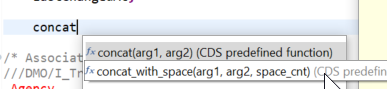
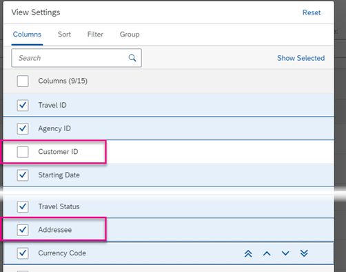
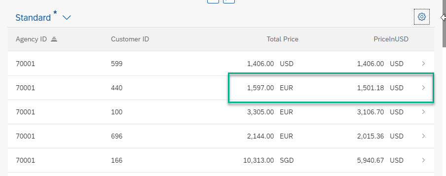
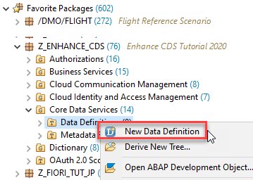
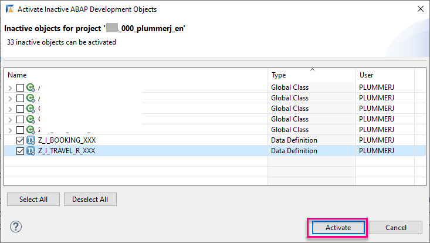

# Enhance an ABAP Core Data Services (CDS) View in SAP Business Technology Platform (BTP) ABAP Environment
<!-- description --> Add features like value help, aggregations, and calculated fields to an existing CDS entity

## Prerequisites
**Tutorial**: [Create an ABAP Core Data Services (CDS) View in SAP BTP ABAP Environment](abap-environment-create-cds-mde)

## You will learn
- How to add value help using a filter
- How to add textual information using associations
- How to concatenate two elements, using a built-in function for CDS
- How to convert currencies using a built-in function for CDS
- How to create an object page
- How to create a parent-child hierarchy in your business object
- How to add a CASE statement


## Intro
You can then use some of these features in productive development to make your applications more powerful and more user-friendly. By the end of this tutorial, your application should include a list page and an object page, which should look like this:

<!-- border -->


<!-- border -->


You can see the code at the end of this tutorial. Throughout the tutorial, objects name include a suffix, such as `000`. Always replace this with your group number or initials.

---

### Add value help

To make the input fields more useful, you will now add input value help to the field **`AgencyID`**.

1. Specify the source of the value help. This works a bit like a join: You need to point to an entity, and field common to both the value help entity and your CDS entity. In this case, you will point to **`AgencyID`** in the CDS entity **`/DMO/I_Agency`**. Add the following annotation to your field **`AgencyID`**.

    ```CDS
    @Consumption.valueHelpDefinition: [{  entity: {name: '/DMO/I_Agency', element: 'AgencyID'}  }]

    ```

2. You also need to expose this second entity in the OData service. To do this, add the entity **`/DMO/I_Agency`** to your service definition, so the complete definition looks like this:

    ```CDS
    @EndUserText.label: 'Service exposes Travel Data 000'
    define service Z_EXPOSE_TRAVEL_R_000 {
      expose Z_I_TRAVEL_R_000 as Travel;
      expose /DMO/I_Agency as Agency;
    }

    ```

3. Format, save, and activate both CDS entity and service definition ( **`Shift+F1, Ctrl+S, Ctrl+3`** ).

4. Refresh your Fiori Elements preview and choose value help for the input field **`AgencyID`**.

    <!-- border -->
    

5. Now the value help appears. Enter the country key **DE** and choose **Go**. Only German agencies appear on the list.

    <!-- border -->
    

6. Repeat this step for **`CustomerID`**:

    ```CDS
    @Consumption.valueHelpDefinition: [{entity: {name: '/DMO/I_Customer', element: 'CustomerID' }}]
    ```

7. Also, expose this entity in the service definition:

    ```CDS
    expose /DMO/I_Customer as Customer;

    ```


### Add text associations

Next, you will make the **Agency** field more readable by adding the agency name to the ID, using a text association.
CDS associations are simply specifications of joins, always in the same place in the syntax. The main advantage of an association is reuse: Once you have specified an association once, you can conveniently string several associations together in a path. In this case, however, you will use a simple association.

For more information, see:
- ABAP Keyword Documentation: [CDS - Associations](https://help.sap.com/doc/abapdocu_752_index_htm/7.52/en-US/index.htm?file=abencds.htm)

1. Add the following statement to your CDS entity, **`Z_I_TRAVEL_R_000`**, just before the list of fields. The first statement creates an association from the source CDS entity **`Z_I_TRAVEL_R_000`** to the target CDS entity **`/DMO/I_Agency`**, joined on the field **`AgencyID`**. The source entity is represented by the alias **`$projection`**, because you cannot use the original name in a path statement. The target entity is represented by its alias name **`_Agency`**.

    ```CDS
      association [1..1] to /DMO/I_Agency as _Agency on $projection.AgencyID = _Agency.AgencyID

    ```

    <!-- border -->
    

2. Now add the following annotation to the field **`AgencyID`**:

    ```CDS
      @ObjectModel.text.association: '_Agency'

    ```

3. Check that the association has been added to the field list. (This should have been done automatically when you inserted the signature of `/DMO/I_TRAVEL_U`.)

    <!-- border -->
    

4. Format, save, and activate ( **`Shift+F1, Ctrl+S, Ctrl+F3`** ).

5. Make sure that the entity **`/DMO/I_Agency`** has been added to your service definition. (You should have done this in step 1.)

    <!-- border -->
    

6. Refresh your Fiori Elements preview. The agency name should now be shown, with the ID number in parentheses.

    <!-- border -->
    

7. Repeat for the field **`CustomerID`**:

    ```CDS
    association [1..1] to /DMO/I_Customer as _Customer    on $projection.CustomerID =   _Customer.CustomerID

    ```

    ```CDS
    @ObjectModel.text.association: '_Customer'

    ```

8. Also make sure this association are added to the list of fields:

    ```CDS
    //Associations
    _Customer

    ```

      <!-- border -->
      


### Merge two fields

ABAP has many built-in SQL functions for both numeric and string fields.

For more information on these functions, see : ABAP Keyword Documentation: [SQL Functions](https://help.sap.com/doc/abapdocu_752_index_htm/7.52/en-US/index.htm?file=abensql_functions.htm).

You will use a simple one to easily merge two fields. The two fields are provided by the association **`_Customer`**.

1. Add an association.

    ```CDS
        association [1..1] to /DMO/I_Customer as _Customer on $projection.CustomerID = _Customer.CustomerID
    ```

2. After `CustomerID`, add a comma, then add the function **`concat_with_space`** using auto-complete ( **`Ctrl+Space`** ); then add the alias **`as Addressee`**.

    ```CDS
      concat_with_space(_Customer.Title, _Customer.LastName, 1) as Addressee,

    ```
    <!-- border -->
    

3. Also make sure this association is added to the list of fields:

      ```CDS
      //Associations
      _Customer
      ```
4. Format, save, and activate these objects using **`Shift+F1, Ctrl+S, Ctrl+F3 `**.

5. Check the result in the data preview, by clicking in the editor and choosing **Open With > Data Preview** from the context menu. The result should look like this.

      <!-- border -->
      

      <!-- border -->
      

6. Now you have the addressee, you may want to comment out the text association for **`CustomerID`**.


### Add currency conversion

It would be nice to find out how much money each **Agency** has received in total. To do this, you first need to convert all the sums paid to one currency. To do this, you will again use a built-in function. For more information, see the ABAP Keyword Documentation: [ABAP CDS - Conversion Functions for Units and Currencies](https://help.sap.com/doc/abapdocu_752_index_htm/7.52/en-US/index.htm?file=abencds_f1_conv_func_unit_curr.htm)

1. Convert the price (**`TotalPrice`**) of each line item to US Dollars. Again, you do this using a built-in conversion function. You simply have to define the variables you are using for amount, source currency, etc, and the built-in function does the rest.

    You need to cast the character value **` 'USD' `** to the correct type and length, **` abap.cuky( 5 ) `**.

    You may get a warning: "Reference information missing...". Ignore this for now.

    ```CDS
    @Semantics.amount.currencyCode: 'CurrencyCode'
    currency_conversion(
    amount => TotalPrice,
    source_currency => CurrencyCode,
    round => 'X',
    target_currency => cast('USD' as abap.cuky( 5 )),
    exchange_rate_date => cast('20200429' as abap.dats),
    error_handling => 'SET_TO_NULL' )
    as PriceInUSD,  

    ```
2. Format, save, and activate ( **`Shift+F1, Ctrl+S, Ctrl+3`** )

3. If you check the result in the data preview, it should look like this.

    <!-- border -->
    

4. Now you will remove the warning. If you select the warning, then choose **Problem Description** from the context menu, you will see that you need to add an annotation,  **`•Semantics.amount.currencyCode`**. However, this will simply add the original currency code (e.g. `NOK`) to the `PriceInUSD` column. Also, you can only add an element name to the annotation, not a literal such as `'NOK'`. So you need to:

    - Create a column, **`TargetCurrency`**
    - Give it the value of the literal
    - Cast the string literal to a currency type, **`abap.cuky`**
    - Add the semantic annotation to **`PriceInUSD`**

    Your code should now look like this:

    ```CDS
    //Conversion to USD
    @Semantics.currencyCode: true
      cast( 'USD' as abap.cuky ) as TargetCurrency,

    ```
5. Optional: Test in the Fiori Elements preview. Your app should look like this:

    <!-- border -->    


### Check code for CDS entity

The code for your CDS entity should look like this:

```CDS
@AbapCatalog.viewEnhancementCategory: [#NONE]
@AccessControl.authorizationCheck: #NOT_REQUIRED
@EndUserText.label: 'Travel Model View Entity - Read Only'
@Metadata.ignorePropagatedAnnotations: true
@Metadata.allowExtensions: true
@Search.searchable: true
@ObjectModel.usageType:{
  serviceQuality: #X,
  sizeCategory: #S,
  dataClass: #MIXED

define view entity Z_I_TRAVEL_R_000
  as select from /DMO/I_Travel_U

  association [1..1] to /DMO/I_Agency   as _Agency       on $projection.AgencyID = _Agency.AgencyID
  association [1..1] to /DMO/I_Customer as _Customer     on $projection.CustomerID = _Customer.CustomerID

{

      ///DMO/I_Travel_U

  key TravelID,
      @Consumption.valueHelpDefinition: [{entity: {name: '/DMO/I_Agency', element: 'AgencyID'}}]
      @ObjectModel.text.association: '_Agency'
      AgencyID,

      @Consumption.valueHelpDefinition: [{entity: {name: '/DMO/I_Customer', element: 'CustomerID' }}]
      @ObjectModel.text.association: '_Customer'
      CustomerID,

      concat_with_space(_Customer.Title, _Customer.LastName, 1) as Addressee,
      BeginDate,
      EndDate,
      BookingFee,

      @Semantics.amount.currencyCode: 'CurrencyCode'
      TotalPrice,

      //Currency Conversion
      currency_conversion(
      amount => TotalPrice,
      source_currency => CurrencyCode,
      round => 'X',
      target_currency => cast('USD' as abap.cuky( 5 )),
      exchange_rate_date => cast('20200429' as abap.dats),
      error_handling => 'SET_TO_NULL' )                         as PriceInUSD,

      @ObjectModel.text.association: '_CurrencyText'
      CurrencyCode,


      @Search.defaultSearchElement: true
      @Search.fuzzinessThreshold: 0.90
      Memo,
      Status,
      LastChangedAt,

      /* Associations */
      //DMO/I_Travel_U
      _Agency,
      _Booking,
      _Currency,
      _Customer,
      _CurrencyText,
      _Customer,
      _TravelStatus

}

```


### Test yourself


### Create object page

At the moment, your application is a simple list. It would be nice to click on a row, i.e. a travel, and get more details in a separate page, known as an object page. Later you can add details from other CDS entities using associations.
For more information on object pages, see SAP Help Portal: [Defining UI Annotations](https://help.sap.com/viewer/923180ddb98240829d935862025004d6/Cloud/en-US/fd95e7c9905e469bb176217f49e15e71.html)

1. First add the page itself. Add the following annotation to your metadata extension, just after the opening curly bracket:

    ```CDS
    @UI.facet: [ { id:              'Travel',
                    purpose:         #STANDARD,
                    type:            #IDENTIFICATION_REFERENCE,
                    label:           'Travel',
                    position:        10 } ]

    ```
    <!-- border -->

2. You then specify which elements you want to include in the object page. Since the facet type is `#IDENTIFICATION_REFERENCE`, you use the **identification** annotation, so that the complete annotation plus element now looks like this:

    ```CDS
    @UI: { lineItem:     [ {  position: 20, label: 'Agency', importance: #HIGH } ],
     identification:[ { position: 10, label: 'Travel' } ],
     selectionField: [{position: 20  }] }
    TravelID;

    ```

3. Add the following to the other elements, so that your metadata extension looks like this:

    ```CDS
    @UI: { lineItem:     [ {  position: 20, label: 'Agency', importance: #HIGH } ],
         identification: [ { position: 20 } ],
         selectionField: [{position: 20  }]
        }
    AgencyID;


    @UI: { lineItem:        [ {  position: 30, label: 'Customer', importance: #HIGH  } ]
           ,identification: [ { position: 30 } ]
           ,selectionField: [ { position: 30 }]
          }
    CustomerID;


    @UI: {  lineItem: [ { position: 40 } ],
            identification: [ { position: 40 } ],
            selectionField: [ { position: 40 }]
          }
    BeginDate;


    @UI: {  lineItem: [ { position: 50 } ],
            identification: [ { position: 50 } ]
           ,selectionField: [ { position: 50 }]
          }
    EndDate;


    @UI: { lineItem: [ { position: 60 } ],
            identification: [ { position: 50 } ]

           }
    TotalPrice;

    ```

4. Finally, add a header to your object page, just after the layer annotation (before the `annotate view...` statement):

    ```CDS
    @UI: {
      headerInfo: {
        typeName: 'Travel',
        typeNamePlural: 'Travels',
        title: {
          type: #STANDARD,
          label: 'Travel',
          value: 'TravelID'
        }
      }
    }

    ```

      <!-- border -->

5. Test your object page in the Fiori Elements preview. It should look roughly like this:

    <!-- border -->


### Create CDS entity for booking

You will now add more information to the object page by creating:
- A CDS entity for bookings
- Adding a second UI facet to the travel metadata extension

You will also create a parent-child hierarchy for these two entities. Your business object will then consist of a tree of nodes linked by a special associations known as a composition.
For more information on this relationship, see [Defining the Data Model in CDS Views](https://help.sap.com/viewer/923180ddb98240829d935862025004d6/Cloud/en-US/f851d987fe0d43d4886e54ca98034aa5.html), particularly the first two sections,  Travel Root View `/DMO/I_Travel_U` and Booking View `/DMO/I_Booking_U`.

1. In the Package Explorer, select **Data Definition**, then choose **New Data Definition** from the context menu.

    <!-- border -->

2. Enter the following:
    - Name = **`Z_I_BOOKING_R_000`**
    - Description = **`Consumption view from /DMO/I_BOOKING_U`**
    - Referenced Object = **`/DMO/I_BOOKING_U`**

3. Choose the same transport request, then choose **Next**. Do not choose **Finish.**

4. Finally, choose **Use template** then choose **Define view**. Then choose **Finish**.

Your CDS entity appears in a new editor. We will fix the errors now.

6. Change the `@AccessControl.authorizationCheck:` to **`#NOT_REQUIRED`**.


### Specify hierarchy

1. Add the following to **`Z_I_BOOKING_000`**, using Auto-complete (`Ctrl+Space`).
Then **Save**, but **DO NOT yet activate your entity**.

    ```CDS
    association to parent Z_I_TRAVEL_R_000 as _Travel
      on $projection.TravelID = _Travel.TravelID


    ```
2. Change **`Z_I_TRAVEL_R_000`** to a root view entity and add the composition association as follows. Again, **Save**, but **DO NOT yet activate your entity**.

    ```CDS
    define root view entity Z_I_TRAVEL_R_000
      as select from /DMO/I_Travel_U as Travel

    composition [0..*] of Z_I_BOOKING_000 as _Booking

    ```

3. Now, choose **Activate All `(Shift+Ctrl+F3)`**.

    <!-- border -->

4. Choose **Deselect All**, then choose your two entities `Z_I_TRAVEL_R_000` and `Z_I_BOOKING_000`, then choose **Activate**.

    <!-- border -->

5. Change the `@AccessControl.authorizationCheck:` to **`#NOT_REQUIRED`**.

6. Add an alias to the **`define view`** statement, so that your code looks like this:

    ```CDS
    @AccessControl.authorizationCheck: #CHECK
    @EndUserText.label: 'Read-only view from /DMO/I_BOOKING_U'
    define view entity Z_I_BOOKING_000 as select from /DMO/I_Booking_U as Booking

    ```

7. Format, save, and activate the CDS entity (**`Shift+F1, Ctrl+S, Ctrl+F3`**) `Z_I_BOOKING_000`.


### Add annotations

1. Add semantic annotations as follows:

    ```CDS
    @Semantics.amount.currencyCode: 'Currency_Code'
    FlightPrice          as Flight_Price,

    @Semantics.currencyCode: true
    CurrencyCode         as Currency_Code,

    ```

2. Format, save, and activate the CDS entity (**`Shift+F1, Ctrl+S, Ctrl+F3`**).


### Create metadata extension for Z_I_BOOKING_000

1. First, allow metadata extensions to your CDS entity by adding the following annotation just after the `@EndUserText.label: 'Consumption view from /DMO/I_BOOKING_U'` annotation:

    ```CDS
    @Metadata.allowExtensions: true

    ```

1.  In the Package Explorer, select the CDS entity **`Z_I_BOOKING_R_000`**, then choose **New Metadata Extension** from the context menu.

2. Enter a name **`ZMDE_BOOKING_R_000`** and description **Metadata for` Z_I_BOOKING_R_000`**; select the transport request and choose **Finish**.,

3. In the editor, enter the following code:

    ```CDS
    @Metadata.layer: #CORE

    @UI: {
    headerInfo: {
    typeName: 'Travel',
    typeNamePlural: 'Travels',
              title: {
                type: #STANDARD,
                label: 'Travel',
                value: 'TravelID'
                    }
              }
          }
    annotate view Z_I_BOOKING_R_000 with

    {
      @UI: { lineItem:       [ { position: 10, importance: #HIGH } ],
             identification: [ { position: 10 } ] }
     TravelID;

      @UI: { lineItem:       [ { position: 10, importance: #HIGH } ],
             identification: [ { position: 10 } ] }
      BookingID;

      @UI: { lineItem:       [ { position: 20, importance: #HIGH } ],
             identification: [ { position: 20 } ] }
      BookingDate;

      @UI: { lineItem:       [ { position: 30, importance: #HIGH } ],
             identification: [ { position: 30 } ] }
      AirlineID;

      @UI: { lineItem:       [ { position: 40, importance: #HIGH } ],
             identification: [ { position: 40 } ] }
      ConnectionID;


      @UI: { lineItem:       [ { position: 50, importance: #HIGH } ],
             identification: [ { position: 50 } ] }
      FlightDate;

      @UI: { lineItem:       [ { position: 60, importance: #MEDIUM } ],
             identification: [ { position: 60 } ] }
      Flight_Price;

    }

    ```

4. Format, save, and activate the metadata extension (**`Shift+F1, Ctrl+S, Ctrl+F3`**).


### Add association from Travel to Booking

1. Also, add the entity **`Z_I_BOOKING_R_000`** to the service definition **`Z_EXPOSE_TRAVEL_R_000`**:

```CDS
@EndUserText.label: 'Expose travel Service 000'
define service Z_EXPOSE_TRAVEL_R_000 {
  expose Z_I_TRAVEL_R_000 as Travel;
  expose Z_I_BOOKING_R_000 as Booking;
}

```

2. Format, save, and activate (**`Shift+F1, Ctrl+S, Ctrl+F3`**).

3. Check the service binding. It should now include a `to_Booking` association, like this. If not, try choosing **Unpublish**, then **Publish** again.

    <!-- border -->


### Add Booking information to object page

1. In metadata extension **`Z_MDE_TRAVEL_000`**, before the square bracket, insert a comma after the Travel facet, then insert the **Booking** facet to the Travel metadata extension, so that your code looks like this:

    ```CDS
    @UI.facet: [ { id:              'Travel',
                    purpose:         #STANDARD,
                    type:            #IDENTIFICATION_REFERENCE,
                    label:           'Travel',
                    position:        10 } ,
                    { id:              'Booking',
                    purpose:         #STANDARD,
                    type:            #LINEITEM_REFERENCE,
                    label:           'Booking',
                    position:        20,
                    targetElement:   '_Booking'} ]

    ```

    <!-- border -->

2. Now, in the metadata extension **`ZMDE_BOOKING_R_000`**, specify which fields from Booking you want to include in the object page, again using an `identification` annotation as follows:

    ```CDS
    @UI: { lineItem:       [ { position: 10, importance: #HIGH } ],
           identification: [ { position: 10 } ] }
    BookingID;

    @UI: { lineItem:       [ { position: 20, importance: #HIGH } ],
           identification: [ { position: 20 } ] }
    BookingDate;

    @UI: { lineItem:       [ { position: 30, importance: #HIGH } ],
           identification: [ { position: 30 } ] }
    AirlineID;

    @UI: { lineItem:       [ { position: 40, importance: #HIGH } ],
           identification: [ { position: 40 } ] }
    ConnectionID;


    @UI: { lineItem:       [ { position: 50, importance: #HIGH } ],
           identification: [ { position: 50 } ] }
    FlightDate;

    @UI: { lineItem:       [ { position: 60, importance: #MEDIUM } ],
           identification: [ { position: 60 } ] }
    Flight_Price;

    ```
3. Test your new facet in the Fiori Elements preview. It should look like this:

    <!-- border -->


### Add association from Booking to Connection

You can also display information from another entity using an association.

1. In the CDS entity **`Z_I_BOOKING_R_000`**, add an association from Booking to Connection.

    ```CDS
        association [1..1] to /DMO/I_Connection as _Connection on $projection.ConnectionId = _Connection.ConnectionID

    ```

2. You will get a warning. If you choose **Problem Description**, you will see that this warning can be hidden, by adding the following pseudo-comment:

    ```CDS
      /*+[hideWarning] { "IDS" : [ "CARDINALITY_CHECK" ] }*/

    ```

3. Now add the following two elements to the CDS entity **`Z_I_BOOKING_R_000`**:

    ```CDS
    @Semantics.quantity.unitOfMeasure: 'DistanceUnit'
    _Connection.Distance as Distance,

    @Semantics.unitOfMeasure: true
    _Connection.DistanceUnit as DistanceUnit,

    ```

4. Optional: Test your Fiori Elements preview again. It should look like this:

    <!-- border -->


### Add CASE statement

1. Add the following code, immediately after the element `DistanceUnit`:

    ```CDS
    case
        when _Connection.Distance >= 2000 then 'long-haul flight'
        when _Connection.Distance >= 1000 and
         _Connection.Distance <  2000 then 'medium-haul flight'
        when _Connection.Distance <  1000 then 'short-haul flight'
                          else 'error'
    end                      as Flight_type,

    ```
2. Also, make sure that the distance is in kilometers, by adding this code **after** the select list:

    ```CDS
    where
    _Connection.DistanceUnit = 'KM'

    ```

    <!-- border -->

3. Format, save, and activate the CDS entity.

4. Test your Fiori Elements preview again. It should look like this:

    <!-- border -->


### More Information
- Blog post: [From Open SQL Joins to CDS Associations](https://blogs.sap.com/2016/08/12/from-open-sql-joins-to-cds-associations/)

- SAP Help Portal: [Defining UI Annotations](https://help.sap.com/viewer/923180ddb98240829d935862025004d6/Cloud/en-US/fd95e7c9905e469bb176217f49e15e71.html)

- SAP Help Portal: [Defining CDS Annotations for Metadata-Driven UIs](https://help.sap.com/viewer/fc4c71aa50014fd1b43721701471913d/202009.001/en-US/9b4aa865c1e84634b6e105173fc3a5e7.html)

- Troubleshooting: [Blog post: Find Errors in Metadata Extensions, by Andre Fischer](https://blogs.sap.com/2020/07/09/how-to-find-errors-in-metadata-extensions-no-item-data-shown-in-object-page/)

- Troubleshooting: [Blog post: Use the SAP Gateway Error Log in ADT, by Andre Fischer](https://blogs.sap.com/2020/07/22/how-to-use-the-sap-gateway-error-log-in-adt/)

---
