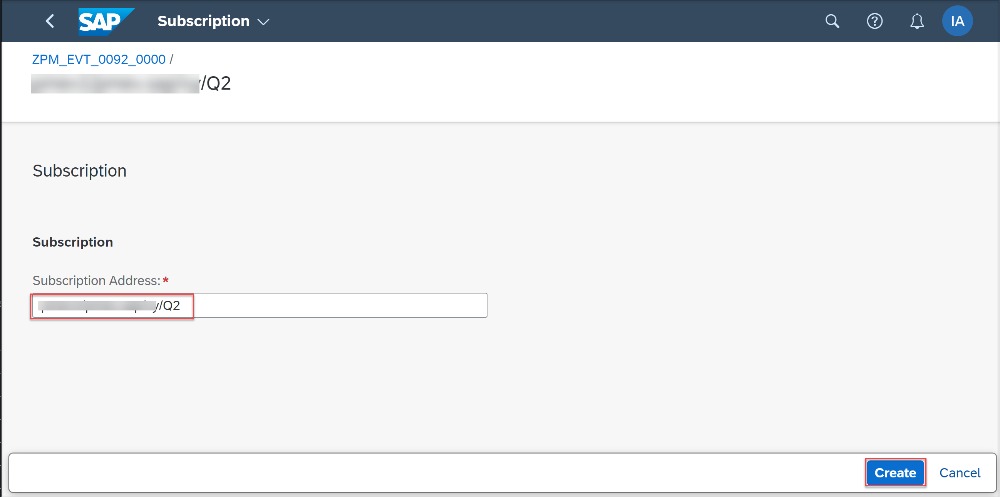

# Event Consumption in ABAP Development Tools for Eclipse
<!-- description --> Consume an Event using Event Consumption Model within a Business Application

## Prerequisites
 - You need to have access to a S/4 HANA system and a SAP BTP ABAP environment system.
 - You need to prepare an event mesh instance in your SAP business technology platform system and download the service key of this instance. For more information see the [Create Instance of SAP Event Mesh] (https://developers.sap.com/tutorials/cp-enterprisemessaging-instance-create.html)
 - You need to create a queue for the event mesh instance. For more information see the [Create Queues and Queue Subscription for SAP Event Mesh] (https://developers.sap.com/tutorials/cp-enterprisemessaging-queue-queuesubscription.html)
 - You need a user with access to maintain communication arrangement and maintain business user.


## You will learn
  - How to create connection between a cloud system and a SAP BTP ABAP environment system.
  - How to consume an Event.

## Intro
This tutorial was written for SAP BTP ABAP Environment. However, you should also be able to use it in SAP S/4HANA Cloud Environment in the same way.

Always replace `####` with your initials or group number.

---

### Overview

An **event** is a data record expressing a significant change in state and its surrounding context. For example, a change of a business object such as business partner, can be indicated by raising a business event. Events will be developed and configured and going to be sent to the event mesh service in the cloud. Since SAP Event Mesh is responsible for message delivery, senders do not need to know which applications, services or systems will receive what data. An interested party having subscribed to this event, can consume, and process it. Event consumption works in ABAP platform, in steampunk. In the event consumption at runtime, you have two main parts which are the event providers and the event consumer system, and both are connected via message broker in our case this would be SAP Event Mesh.

  


### Communication Arrangement for SAP event mesh instance in the cloud system


Here you will create a communication arrangement to connect your S/4 system with the SAP Event Mesh. So if you create later a new business partner in this S/4 system and by means of a SAP Event Mesh instance you can consume it in a SAP BTP ABAP environment system. To publish an event in the Cloud, you need first to Create a communication arrangement and then Create Outbound Bindings for the created channel.

  1. Login to the cloud system.

    

  2. Navigate to **Communication Management** and click **Communication Arrangement**.

    

  3. Click **New** to create a communication arrangement.

    

    

  4. Choose `sap_com_0092` as **Scenario** and copy the service key of your event mesh instance under **Service Key**.

    >For more information about how to create instance of SAP Event Mesh [link] (https://developers.sap.com/tutorials/cp-enterprisemessaging-instance-create.html)


    

    

  5. You need to create a **Communication User**. Click **New** and enter a **User Name**, **Description** and **Propose Password**. Copy the generated password and save it for later. Click **Create**.

    

    

  6. Now you need to change the **Arrangement Name** to `Z_EVENT_0092_####` and replace `####` with your initials or group number. This Arrangement Name will also be the name of the channel which is used later to send events.

     Click **Create** communication arrangement.

      

  7. Open your new created communication arrangement and check the details.

    


### Create Outbound Bindings and generate Metadata


Now you need to choose your outbound topic like create, update, etc. And afterwards you can download the created `.json` file. This specification file contains all metadata of the event like how the payload looks like, what kind of types are there, etc.

  1. Search for **Enterprise Event Enablement** App and open it.

    

  2. Click **Go** to open a list of channels and choose your channel in this list.

    

  3. Now you need to add the outbound topic you are interested in to this channel:

    - Click **Create**  

      

    - On the next page click **Topic** value help

      

    - In this popup search for `sap/s4/beh/businesspartner/v1/BusinessPartner/Created/*` and choose `sap/s4/beh/businesspartner/v1/BusinessPartner/Created/*`

      

    - Click **Create**

      

  4. Go back to your channel and scroll down to **Event Metadata** and save the metadata as a `.json` file for further usage. This specification file contains all metadata of the event.

    

    >If the metadata is empty please reload the page with F5 and try again.


### Create Event Consumption Model


Here you will create an Event Consumption Model with the `.json` file that you downloaded in last step.

  1. Open ADT and open your SAP BTP ABAP environment system.

  2. Create a new **ABAP Package** if you have not one. Please be sure if your package name is with **Z** like

    - Name: `ZEVENT_CONSUMPTION_####`
    - Description: `event consumption`

    

  3. Right-click your package and choose **New** > **Other ABAP Repository Object** > **Business Services** > **Event Consumption Model**  and click **Next** to launch the creation wizard.

    

    

  4. Fill the fields and upload the `.json` file you saved before into the new event consumption ADT wizard. This will then automatically generate all that you need in this event consumption model, like the event handler custom code, authorization defaults values and inbound service.

    - Name: will be created with the Prefix and Identifier
    - Description: `event consumption model`
    - Namespace/ Prefix/ Identifier : `Z`and `EVENT####`
    - Event specification File: `.json` file

    click **Next**.

    

  5. Select all the event types that you would like to consume in your business application and click **Next**.

    

  6. Click **Next** by **Define Consumer Artifacts**

    

  7. In **ABAP Artifact Generation List** you need to copy the **Inbound Service** name for later usage. Click **Next**.

    

   8. Select a **Transport Request** and click **Finish**.

    


  9. In created event consumption model you can see the selected **Event Types** that are assigned because of your `.json` file.

    

  10. Save and activate your event consumption model.


### Create Communication Scenario for Event Consumption Model


In this section you will create a communication scenario for the previously generated Event Consumption Model and you will get explanation of additional steps needed to use it later for the event consumption. Eventually, this communication scenario is used in the productive system to create a communication arrangement with the previously generated Event Consumption Model. Moreover, a `sap_com_0092` communication arrangement will be required in the productive system which denotes the connection from the productive system to the event mesh instance in the SAP BTP ABAP environment system. These two scenarios combined will then enable the event consumption with the generated Event Consumption Model.

  1. Right-click your package and choose **New** > **Other ABAP Repository Object** > **Cloud Communication Management** > **Communication Scenario** and click **Next**.

    

    

  2. Enter the following name and description:

    - Name:`Z_EVENT_SCENARIO_####`
    - Description: `event consupmtion scenario ####`

    and click **Next**.

      

  3. Select a transport request and click **Next**. The newly created Communication Scenario opens automatically.

    

  4. In the Communication Scenario under General:

    - as **Communication Scenario Type** choose Customer Managed,
    - as **Allowed Instances** you can choose what suits you best for the given Event Consumption Model.

  5. Click the Inbound tab of the Communication Scenario. In the Inbound configuration click **Add...** under Inbound Services.

    

  6. In the pop-up, insert the previously generate inbound service (you copied the inbound service name in step 4-7) of the Event Consumption Model under **Inbound Service ID** and click **Finish**.

    

  7. Save the communication scenario by pressing `Ctrl + S`.

  8. To test the created communication scenario with the generated Event Consumption Model, you must click **Publish Locally** in the communication scenario.

    


### Create database table for handler method


  In this step, you can create a DB table and save the business partner Ids in this DB table. With this you can consume the event which is created in a S/4 system. Creating a DB table in this tutorial is just to help you to save and check your created Ids.

  1. Right-click your package and choose **New** > **Other ABAP Repository Object** > **Database Table** and click **Next**

    

    

  2. Enter the following name and description:

    - Name:`ZTABLE_####`
    - Description: `Database table`

    

    click **Next**, select a **Transport Request** and click **Finish** .

  3. Define the table with this code and replace all **####** with your number:

    ```ZTABLE_####
      @EndUserText.label : 'Database table'
      @AbapCatalog.enhancement.category : #NOT_EXTENSIBLE
      @AbapCatalog.tableCategory : #TRANSPARENT
      @AbapCatalog.deliveryClass : #A
      @AbapCatalog.dataMaintenance : #RESTRICTED
      define table ztable_#### {
        key client     : abap.clnt not null;
        key recorddate : abap.dats not null;
        key recordtime : abap.tims not null;
        payload        : abap.char(1000);

      }
    ```

  4. Save and activate the table.


### Define handle event methods


  In the consumer extension class, the event processing logic can be implemented. In the generated class, you can find for each event type of the Event Consumption Model a respective handle event method. In each method, the corresponding event type and the typed business data for this event can be found. The latter is commented out so that you can implement your own logic.

  1. Navigate to **Business Service** > **Event Consumption models** > `ZEVENT####` > **Classes** > `ZCL_EVENT####` which is generated (or you can navigate to the **Source Code Library** > `ZCL_EVENT####`). Here you can see the create Method.

    

    


  2. Remove comment from these lines:

    ```
      DATA ls_business_data TYPE STRUCTURE FOR HIERARCHY Z_BusinessPartner_Created_v1.      
      ls_business_data = io_event->get_business_data( ).
    ```

  3. You need to copy the code below and replace it in your method. Replace all **####** with your number:

    ```ZCL_EVENT####
      DATA ls_business_data TYPE STRUCTURE FOR HIERARCHY Z_BusinessPartner_Created_v1.

      DATA wa TYPE  ztable_####.
      ls_business_data = io_event->get_business_data( ).

      wa-payload = ls_business_data-BusinessPartner.

      DATA(sydatum) = cl_abap_context_info=>get_system_date(  ).
      DATA(sytime) = cl_abap_context_info=>get_system_time(  ).

      wa-recorddate = sydatum.
      wa-recordtime = sytime.

      DELETE FROM  ztable_####
      WHERE recorddate < @sydatum.

      INSERT ztable_#### FROM @wa.

    ```  

  4. Your code will look like the following:

    

    >You can raise an exception whenever there is an issue. This will imply that the event processing has failed and therefore set the event status to **failed**. To see the exception, open **Window** > **Show View** > **Other** search for **Feed Reader**. Here you can see a message if an issue is raised.
    


### Communication Arrangement for SAP Event Mesh instance in the SAP BTP ABAP environment system


  Then in Fiori launchpad of your SAP BTP ABAP environment system you first need to build a communication arrangement with `sap_com_0092` scenario and the same service key instance you used to build your communication arrangement in the cloud system.

  1. To open the Fiori launchpad right-click your project in ADT and navigate to **Properties**

    

  2. Click **Service URL** to open the dashboard of this system.

    

  3. Navigate to **Communication Arrangement** and click **New** to create a communication arrangement.

  4. Choose `sap_com_0092` as **Scenario** and copy the service key of your event mesh instance under **Service Key**. You need to create a **Communication User**. Click **New** and enter a **User Name**, **Description** and **Propose Password**. Copy the generated password and save it for later. Click **Create**.

  5. Now you need to change the **Arrangement Name** to `ZPM_EVT_0092_####` and replace `####` with your initials or group number.

     Click **Create** communication arrangement.

    


### Communication Arrangement for event consumption model in the SAP BTP ABAP environment system


  The connection between your BTP system and event mesh instance is done, now you need to create another communication arrangement with the scenario you already published in ADT:

  1. Navigate to **Communication Arrangement**, click **New**.

    

  2. Choose your created scenario and click **Create**.

    

  3. In the communication arrangement you need to define a communication system. Click **New** and enter a **System ID** and **System Name** like `ZEVENT_####` and click **Create**.

    

    

  4. Communication system will be opened. Here scroll down to the **Event Mesh** and enable it. Open the value help and in the popup search for the  communication arrangement name you created in the previous step:

    

    

  5. Fill out the inbound username with the user name created in the last step and click **OK**.

    

    

  6. Under **General** click the **Inbound Only** option and click **Save**.

    

  7. In communication arrangement click **Save**.

    


### Maintain Subscription


  Now you need to choose a subscription in your channel to specify in which queue you should get the event message.

  1. In the Fiori launchpad search for **Enterprise Event Enablement** App and open it.

    

  2. Click **Go** to see a list of channels and choose your channel.

    

  3. You need to check if the inbound topic from your event consumption model is added successfully in to this channel:

    >Reload the page until you can see the inbound topic.

        

  4. Navigate to **Subscription** and click **Create** and subscribe to the queue you already created for your event mesh instance from which you should get the event message.

    

    

    >For more information about how to create a queue see this [link] (https://developers.sap.com/tutorials/cp-enterprisemessaging-queue-queuesubscription.html)

  5. The subscription status must be **Acknowledged**.

    >Reload the page until it is Acknowledged.

    


### Create business partner


  To test your eventing process you need to create a business partner and check if the created ID will appear in the table.

  1. Open your S/4 Cloud system and navigate to **Maintain Business Partner**.

    

  2. Click **Person** to create a new business partner.

    

  3. Enter **First Name** and **Last Name** like following

    - First Name:`business`
    - Last Name: `partner ####`

    replace **####** with your number and press **Save**.

    

  4. Check the created **Business Partner Id**

    

  5. Back to SAP BTP ABAP environment system in ADT and open your database table `ZTABLE_####` and run the table with F8. You can find your created business Id in this table.

    


### Test yourself


---
