## Prerequisites
- **IMPORTANT**: This tutorial cannot be completed on a trial account
- You have set up SAP Cloud Platform, ABAP Environment, for example by using the relevant booster: [Using a Booster to Automate the Setup of the ABAP Environment](https://help.sap.com/viewer/65de2977205c403bbc107264b8eccf4b/Cloud/en-US/cd7e7e6108c24b5384b7d218c74e80b9.html)
- **Tutorial**: [Set up SAP BTP ABAP Environment and Create Your First Console Application](abap-environment-trial-onboarding), for a licensed user, steps 1-2
- You have assigned the role **`SAP_BR_DEVELOPER`** to your business user. You need this to work with Communication Management in SAP Fiori Launchpad

## You will learn

- How to connect to an external RESTful API, in this case the Overpass street map service: [http://overpass-api.de/](http://overpass-api.de/), by creating the necessary communication artifacts:
- How to query the service for a specific amenity in a specific city, e.g. Heidelberg beer gardens.
- How to parse the information in an ABAP class using JSON and SAP's XCO Library
- How to display the information in the ABAP console
This tutorial enables you to work with XML data from an external RESTful API in your ABAP applications.
Throughout this tutorial, object names include the suffix `000`. Always replace this with your group number or initials.

---

### Create package

1. In ABAP Development Tools (ADT), select your ABAP Cloud Project and choose **New > ABAP Package** from the context menu.

2. Enter the following and choose **Next**:
    - Name = **`Z_API_OVERPASS_000`**
    - Description = **Get map data using Overpass map service API**
    - Add to favorite packages = Yes
    - Package type = **Development**

    <!-- border -->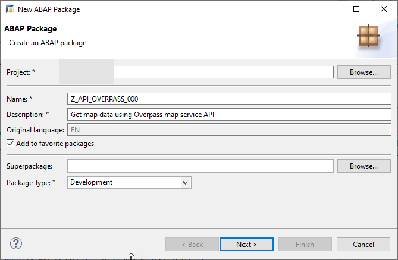

3. Choose **Create new transport request**, enter a description, such as **Get data from API Overpass**, then choose **Finish**.
    <!-- border -->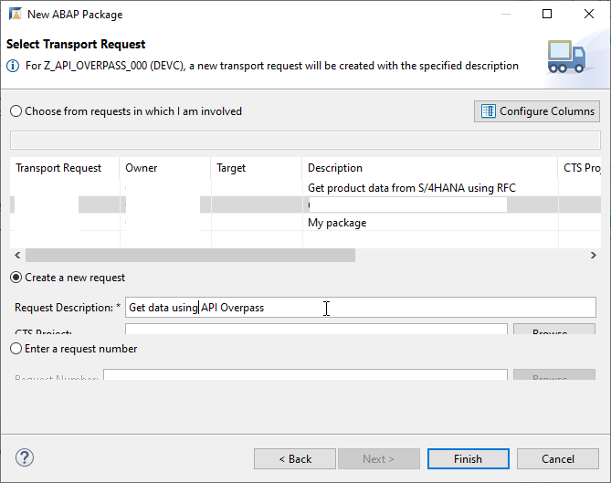


### Create outbound service

1. Select your ABAP package and choose **New > Other Repository Object** from the context menu; then enter **Outbound Service**, then choose **Next**.

2. Enter the following and choose **Next**.
    - Outbound service: **`Z_API_OVERPASS_OB_000`**
    - Description: **Get data from Overpass map service**
    - Service type: **HTTP Service**

    <!-- border -->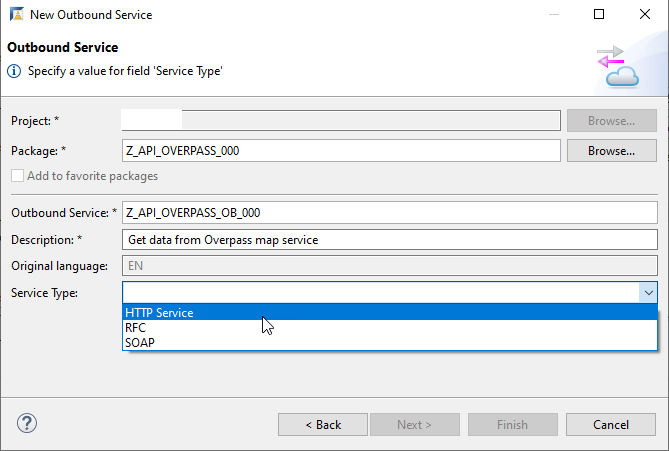

3. Choose the transport request you just created, then choose **Finish**.

    The outbound service appears.

4. Enter the **Default Path Prefix** **`/api/interpreter`**.

    <!-- border -->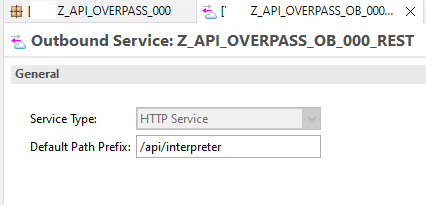

5. Choose **Save (`Ctrl + S`)**.


### Create communication scenario in ADT


1. Again, choose **New > Other Repository Object** from the context menu; then enter **Communication Scenario**.

    <!-- border -->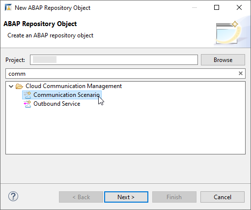

2. Enter the following and choose **Next**.

    - Name: **`Z_API_OVERPASS_CSCEN_000`**
    - Description: **Communication Scenario: Get data from Overpass map service**

3. Choose the transport request you just created, then choose **Finish**.

    The communication scenario appears.

    <!-- border -->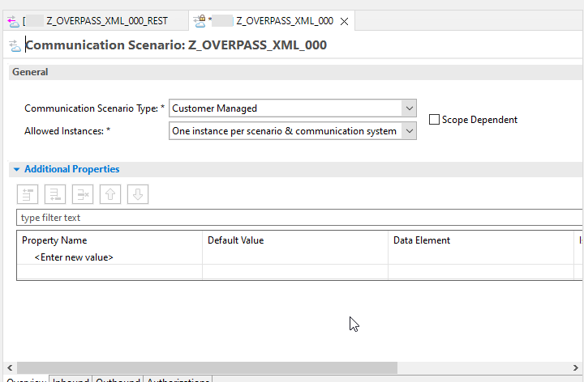

5. On the **Outbound** tab, ensure that all four authentication methods are ticked.

6. Add your outbound service, by choosing **Add...**.

    <!-- border -->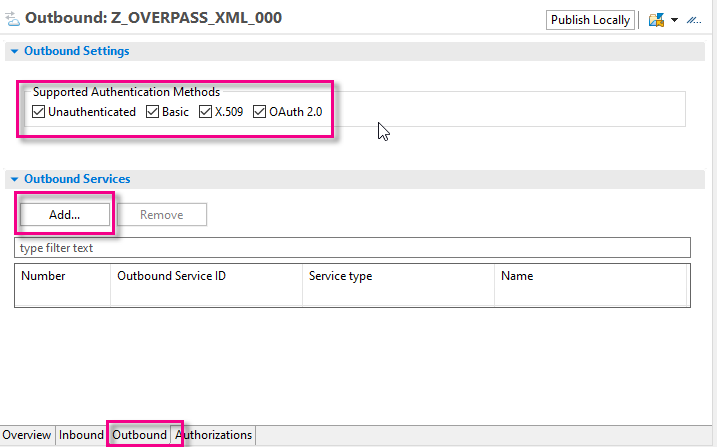

7. Choose **Browse**, choose your outbound service, **`Z_API_OVERPASS_OB_000`**, then choose **Finish**.
The suffix **REST** has added to the outbound service name automatically.

    <!-- border -->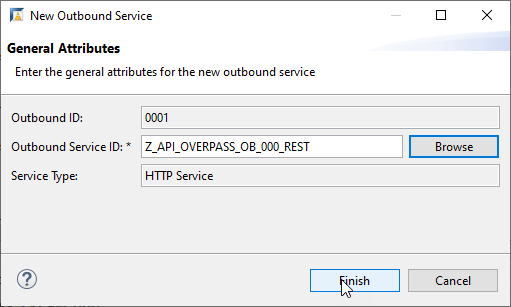

    <!-- border -->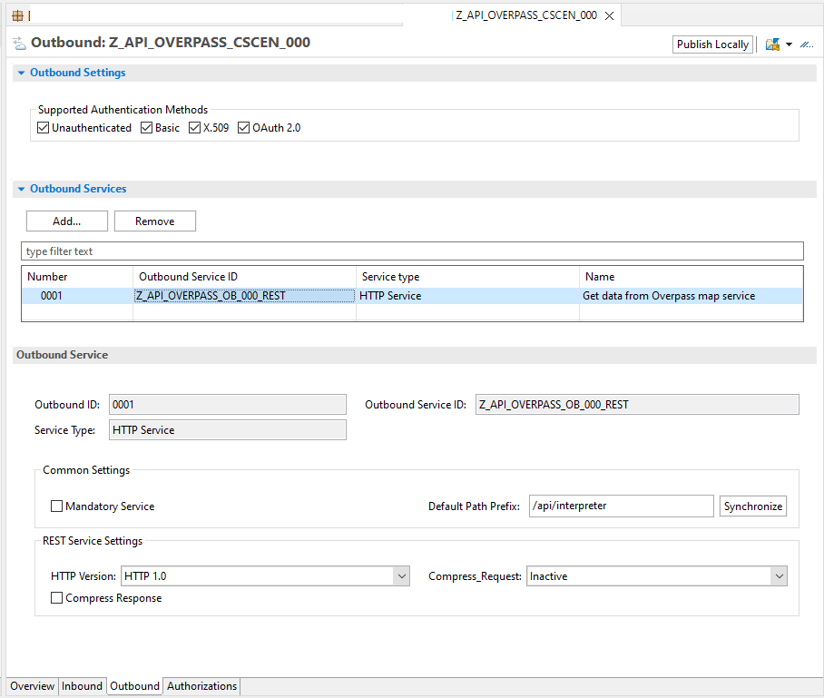

8. Finally, **Save** your communication scenario, then choose **Publish Locally**.


### Create communication system in Fiori Launchpad


Now, you need to create the necessary communication artifacts in Fiori Launchpad, starting with the **Communication System**.
This artifact specifies the URL of the API (minus the HTTP(S) protocol) and port.

1. In the Fiori Launchpad home page, choose **Communication System**, then choose **New**.

    <!-- border -->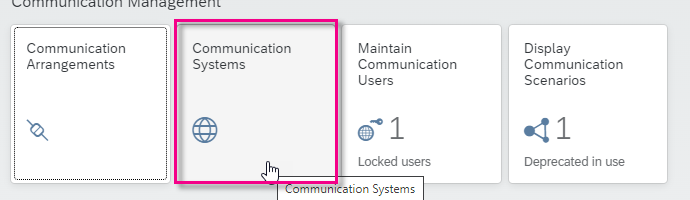
    &nbsp;
    <!-- border -->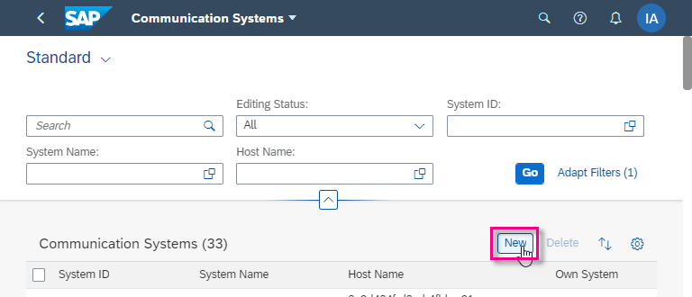

2. Enter the following and choose **Create**.

    - System ID: **`Z_OVERPASS_000_CSYS`**
    - System Name: **`Z_OVERPASS_000_CSYS`**

    <!-- border -->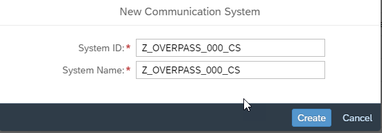

3. Enter host name: \overpass-api.de

4. Under **Users for Outbound Communication**, enter the option **None**.

    <!-- border -->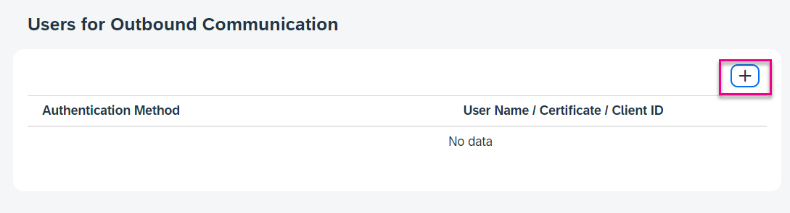
    &nbsp;
    <!-- border -->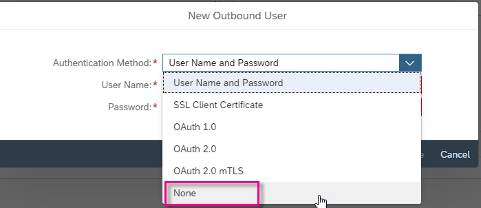
    &nbsp;
    <!-- border -->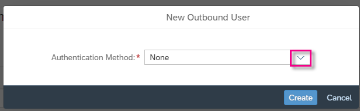
    &nbsp;
    <!-- border -->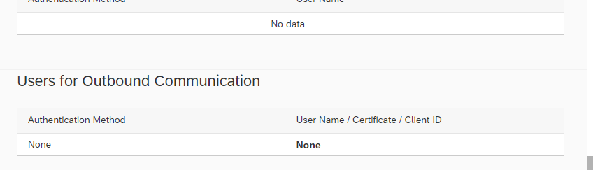

5. Leave the other default settings as they are and choose **Save**.

### Create communication arrangement


This next artifact specifies the communication scenario and communication system.

1. Go back to the Fiori Launchpad home page and choose **Communication Arrangement**, then choose **New**.

    <!-- border -->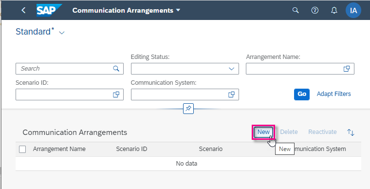

2. Browse to, then select your **Communication Scenario**, **`Z_API_OVERPASS_CSCEN_000`** (created in ADT). The **Communication Arrangement** name is filled automatically.

    <!-- border -->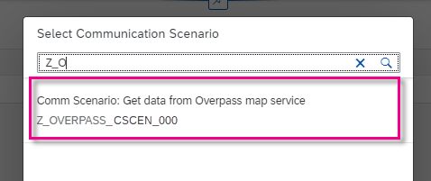
    &nbsp;
    <!-- border -->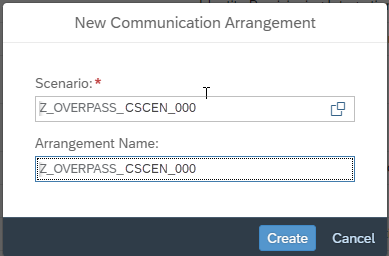

3. In the main editor, select the Communication System, **`Z_OVERPASS_000_CSYS`**.
    The **Service URL**, port etc are filled automatically.

    <!-- border -->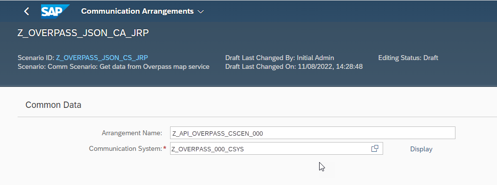
    &nbsp;
    <!-- border -->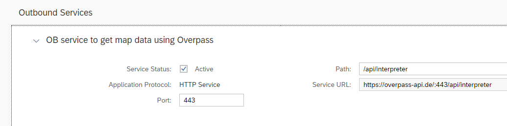

You can now check the connection.

<!-- border -->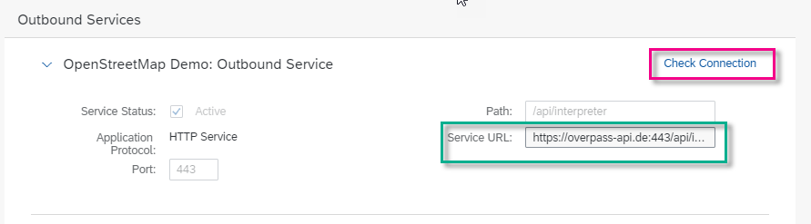
&nbsp;
<!-- border -->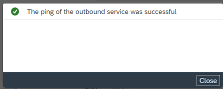

### Create ABAP class


Now, you will create an ABAP class that will call your destination, and which you can run in the console.

1. In the ABAP Development Tools `(ADT)`, in the Package Explorer, select your package and choose **New > ABAP Class** from the context menu.

    <!-- border -->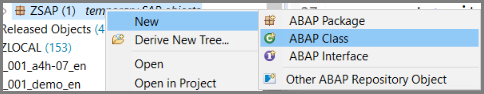

2. Enter a name and description for your class. **Remember to change `000` to your group number**.
    - Name: **`zcl_api_overpass_json_000`**
    - Description: **Get map data using Overpass + JSON**

    <!-- border -->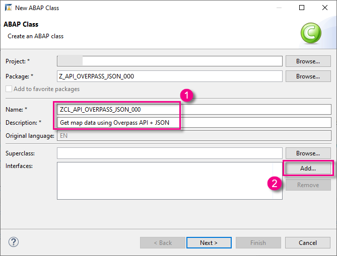

3. Add the interface **`IF_OO_ADT_CLASSRUN`** by choosing **Add...**.

    <!-- border -->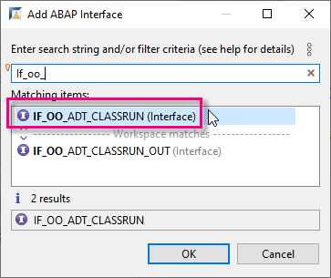
    &nbsp;
    <!-- border -->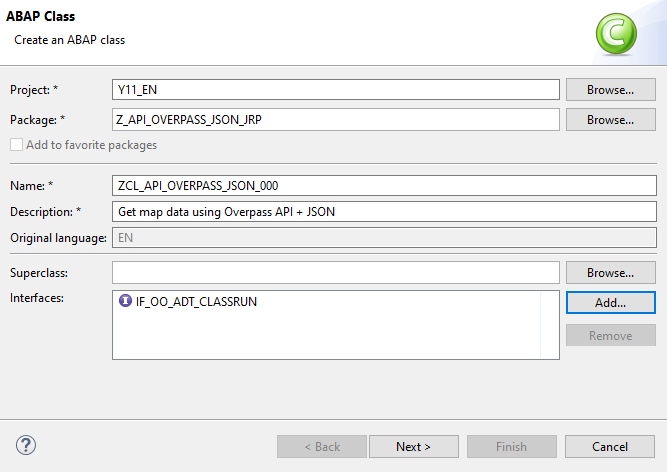

4. Choose or create a transport request, then choose **Finish**.

The class is displayed in a new editor.

<!-- border -->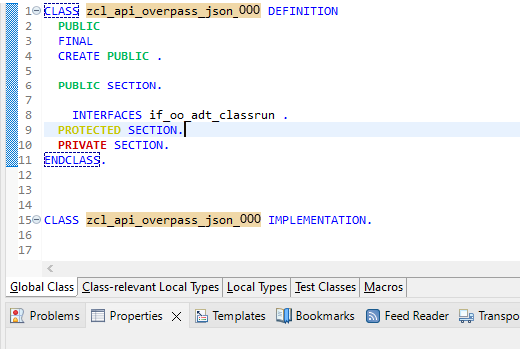

### Copy code


To be able to access the external service, you must:

- create an HTTP client that points to your communication scenario and service id
- send an HTTP request
- output the response in the ABAP console
- wrap the code in an exception

Copy the following code. Replace `000` with your group number or initials.

```ABAP
METHOD if_oo_adt_classrun~main.

  " Create HTTP client; send request
  TRY.
  DATA(lo_destination) = cl_http_destination_provider=>create_by_comm_arrangement(
                           comm_scenario  = 'Z_OVERPASS_JSON_CS_000'
                           service_id     = 'Z_API_OVERPASS_JSON_000_REST'

                         ).

      DATA(lo_http_client) = cl_web_http_client_manager=>create_by_http_destination( i_destination = lo_destination ).
      DATA(lo_request) = lo_http_client->get_http_request( ).

      lo_request->set_query( query = 'data=[out:json];area[name="Heidelberg"];node["amenity"="biergarten"](area);out;' ).

      DATA(lo_response) = lo_http_client->execute( i_method = if_web_http_client=>get ).
      DATA(lv_json_results) = lo_response->get_text( ).

    CATCH cx_root INTO DATA(lx_exception).
      out->write( lx_exception->get_text( ) ).
  ENDTRY.

  " Create an ABAP structure to contain the data from the API
  TYPES:
    BEGIN OF ts_tags,
      name    TYPE string,
      website TYPE string,
    END OF ts_tags,

    BEGIN OF ts_element,
      type TYPE string,
      id   TYPE string,
      lat  TYPE string,
      lon  TYPE string,
      tags TYPE ts_tags,
    END OF ts_element,

    BEGIN OF ts_osm3s,
      timestamp_osm_base  TYPE string,
      timestamp_areas_base TYPE string,
      copyright TYPE string,
    END OF ts_osm3s,

    BEGIN OF ts_osm,
      version   TYPE string,
      generator TYPE string,
      osm3s     TYPE ts_osm3s,
      elements  TYPE STANDARD TABLE OF ts_element WITH EMPTY KEY,
    END OF ts_osm.

  DATA ls_osm TYPE ts_osm.

  " Convert the data from JSON to ABAP using the XCO Library; output the data
  TRY.

      xco_cp_json=>data->from_string( lv_json_results )->apply( VALUE #(
        ( xco_cp_json=>transformation->pascal_case_to_underscore )
        ( xco_cp_json=>transformation->boolean_to_abap_bool )
      ) )->write_to( REF #( ls_osm ) ).

      out->write( | Names of beergardens in Heidelberg (Germany) found on OpenStreetMaps. | ).
      out->write( | Data is obtained from the OSM API in JSON format and read into ABAP using the XCO library. | ).
      out->write( | Note: Not all locations have an associated name. | ).
      out->write( | Generator: { ls_osm-generator } | ).
      out->write( | ---------------------------------- | ).

      LOOP AT ls_osm-elements ASSIGNING FIELD-SYMBOL(<element>).
        out->write( | Beergarden number { sy-tabix }: { <element>-tags-name } | ).
      ENDLOOP.
      out->write( | ---------------------------------- | ).

    " catch any error
    CATCH cx_root INTO DATA(lx_root).
      out->write( lx_root->get_text( ) ).
  ENDTRY.


ENDMETHOD.

```

### Activate


1. Check your syntax (`Ctrl+F2`).
2. Format (`Ctrl+F1`), save (`Ctrl+S`) and activate (`Ctrl+F3`) your class.

### Run class in ABAP Console


Run your class in the console (`F9`).

The output should look something like this:
&nbsp;
<!-- border -->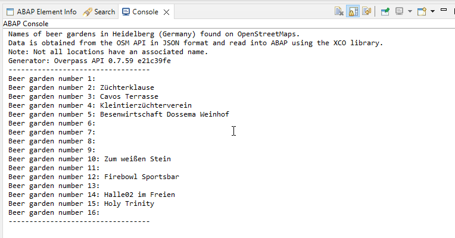

### Test yourself


### More Information
- SAP Help Portal: [Communication Management: Outbound Communication](https://help.sap.com/docs/BTP/65de2977205c403bbc107264b8eccf4b/f871712b816943b0ab5e04b60799e518.html)
- SAP Help Portal: [XCO Library: JSON](https://help.sap.com/docs/BTP/65de2977205c403bbc107264b8eccf4b/492ccdb87b224a35a8ed20e53325dfce.html)
- SAP Community blog post: [Introducing the XCO Library Cloud Platform edition](https://blogs.sap.com/2020/09/21/introducing-the-xco-library-cloud-platform-edition/)


---
