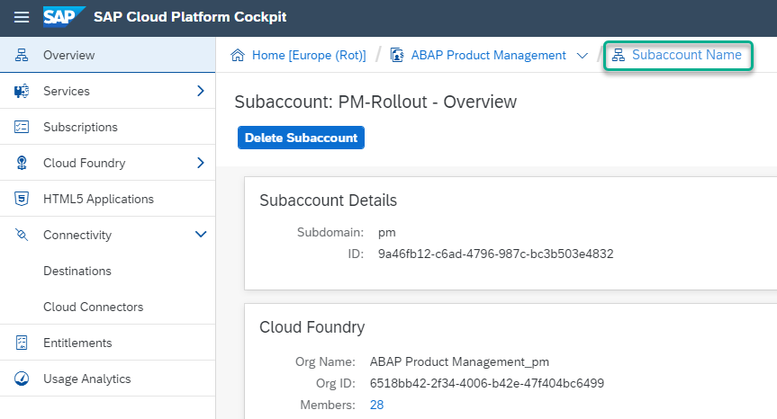
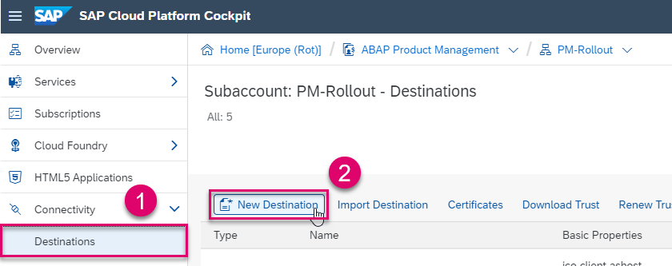
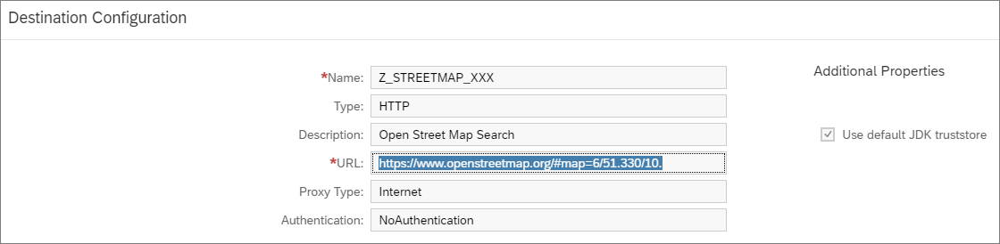
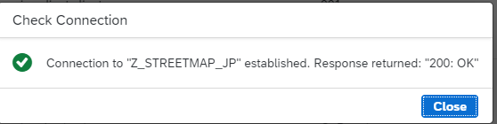
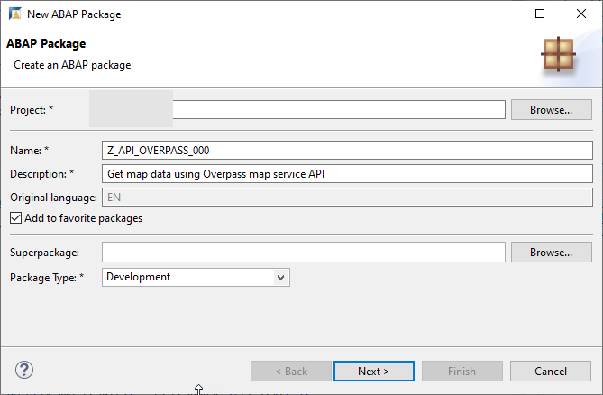
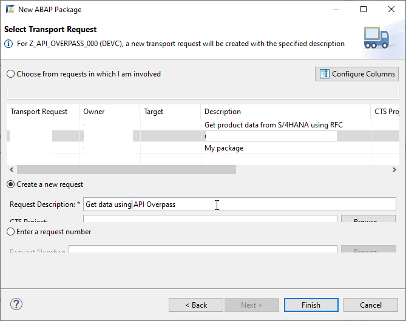
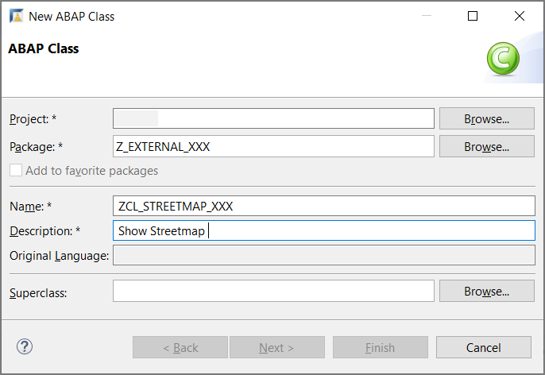
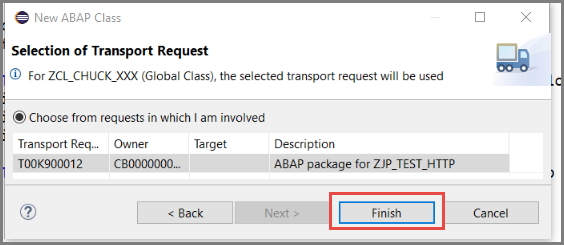
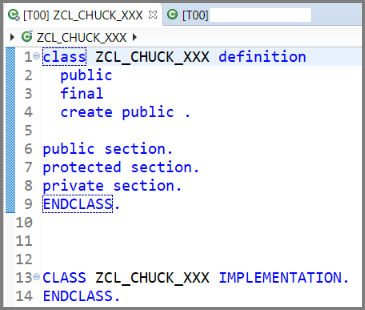
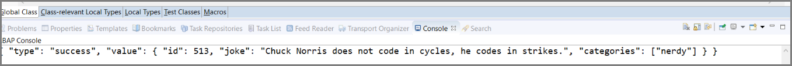

## Prerequisites  
- **IMPORTANT**: This tutorial cannot be completed on a trial account
- You have set up SAP Cloud Platform, ABAP Environment, for example by using the relevant booster: [Using a Booster to Automate the Setup of the ABAP Environment](https://help.sap.com/viewer/65de2977205c403bbc107264b8eccf4b/Cloud/en-US/cd7e7e6108c24b5384b7d218c74e80b9.html)
- **Tutorial**: [Create Your First Console Application](https://developers.sap.com/tutorials/abap-environment-trial-onboarding.html), for a licensed user, steps 1-2

## Details
### You will learn  
  - How to create a new destination in SAP Cloud Cockpit
  - How to call an external API from inside an ABAP class by pointing to this destination

---
You will create a new destination service instance, specifying the URL for an external API, user/password, and authentication.
You will then create a class that calls the API and displays the output from it in the console.
This enables you to avoid hard-coding the URL of the external API in your ABAP class.

Throughout this tutorial, objects name include the suffix `XXX`. Always replace this with your group number or initials.

[ACCORDION-BEGIN [Step 1: ](Create destination service)]
You will now create a destination in the ABAP Environment. This must be created at subaccount (not Space) level.

1. In the SAP Cloud Platform Cockpit of your Cloud Foundry subaccount, navigate to your subaccount.

  !

2. Choose **Destinations**, then choose **New Destinations**.

    !

2. Enter the following values and choose **Save**:

    |  Field Name     | Value
    |  :------------- | :-------------
    |  Name           | e.g. **`Z_STREETMAP_XXX`** as here
    |  Type           | **`HTTP`**
    |  Description    | Can be anything, here **`Streetmap`**
    |  URL   | `https://www.openstreetmap.org/#map=18/49.29271/8.64401` (In your browser, this would display `Walldorf`, Germany)
    |  Proxy Type   | Internet
    |  Authentication | `NoAuthentication`

    !

3. Choose **Check Connection**. You should get the following response.

  !


[DONE]
[ACCORDION-END]


[ACCORDION-BEGIN [Step 2: ](Create new package)]
1. In ABAP Development Tools (ADT), select the ABAP Cloud Project and choose **New > ABAP Package**.

2. Enter the following and choose **Next**:
    - Name = **`Z_EXTERNAL_API_XXX`**
    - Description = **Call external API**
    - Package type = **Development**

    

3. Choose **Create new transport request**, enter a description, such as "External API", then choose **Finish**.

    !

[DONE]
[ACCORDION-END]

[ACCORDION-BEGIN [Step 3: ](Create ABAP class)]
Now, you will create an ABAP class that will call your destination, and which you can run in the console.

1. In the ABAP Development Tools `(ADT)`, in the Package Explorer, select your package and choose **New > ABAP Class** from the context menu.

    

2. Enter a name and description for your class and choose Next. **Remember to change `XXX` to your group number**.

    

3. Choose or create a transport request, then choose Finish.

    

The class is displayed in a new editor.



[DONE]

[ACCORDION-END]

[ACCORDION-BEGIN [Step 4: ](Add INTERFACES statement)]
Add the following `interfaces` statement to the public section:

```ABAP
PUBLIC SECTION.
  INTERFACES if_oo_adt_classrun.
PRIVATE SECTION.
```
This enables you to run the class in the console.

[DONE]

[ACCORDION-END]

[ACCORDION-BEGIN [Step 5: ](Copy code)]
To be able to access the external service, you must:
- maintain a cloud destination for the remote system
- create an HTTP client
- send an HTTP request
- output the response in the ABAP console
- wrap the code in an exception

Copy the following code. Replace the `xxx` of `i_name` with your group number:

```ABAP
METHOD if_oo_adt_classrun~main.
    TRY.
        DATA(lo_destination) = cl_http_destination_provider=>create_by_cloud_destination(
          i_name                  = 'Z_STREETMAP_XXX'
          i_authn_mode = if_a4c_cp_service=>service_specific ).

        DATA(lo_http_client) = cl_web_http_client_manager=>create_by_http_destination( i_destination = lo_destination ).
        DATA(lo_request) = lo_http_client->get_http_request( ).

        DATA(lo_response) = lo_http_client->execute( i_method = if_web_http_client=>get ).
          out->write( lo_response->get_text( ) ).

      CATCH cx_root INTO DATA(lx_exception).
        out->write( lx_exception->get_text( ) ).
    ENDTRY.
  ENDMETHOD.

```

[DONE]

[ACCORDION-END]

[ACCORDION-BEGIN [Step 6: ](Check, save, and activate)]
1. Check your syntax (`Ctrl+F2`).
2. Save (`Ctrl+S`) and activate (`Ctrl+F3`) your class.

[DONE]

[ACCORDION-END]

[ACCORDION-BEGIN [Step 7: ](Run class in ABAP Console)]
Run your class in the console (`F9`).

The output should look something like this:
.


[DONE]
[ACCORDION-END]

[ACCORDION-BEGIN [Step 8: ](Test yourself)]


[VALIDATE_1]

[ACCORDION-END]
