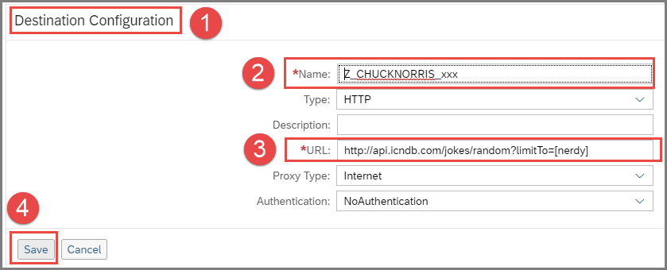
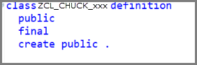

## Prerequisites  
 -  Communication arrangement for scenario `SAP_COM_0276` was created with service instance name `OutboundCommunication`.
 -	You have created a package.
 -  You have opened the SAP Cloud Platform cockpit and navigated to the correct space.

## Details
### You will learn  
  - How to call an external API from inside an ABAP system using a class

---

[ACCORDION-BEGIN [Step 1: ](Navigate to the service instance)]
First, navigate to the service instance name `OutboundCommunication`.

1.	In your space in the **SAP Cloud Platform Cockpit**, open **Service Marketplace** and choose **Destination**:

    

2.  Choose **Instances > `OutboundCommunication`**:

    

[DONE]

[ACCORDION-END]

[ACCORDION-BEGIN [Step 2: ](Create a new destination)]

1. Choose **New Destination**:

    

2. Then enter the following (replacing **`xxx`** with your group number):

    - Name  = `Z_CHUCKNORRIS_xxx`
    - URL = `http://api.icndb.com/jokes/random?limitTo=[nerdy]`
    - Proxy type = Internet
    - Authentication = `NoAuthentication`

3. Then choose **Save**:

      

[DONE]

[ACCORDION-END]

[ACCORDION-BEGIN [Step 3: ](Check the connection)]
Check the connection:

  

[DONE]

[ACCORDION-END]

[ACCORDION-BEGIN [Step 4: ](Create an ABAP class)]
Now, you will create an ABAP class, which you can run in the console.

1. In the ABAP Development Tools `(ADT)`, in the Package Explorer, select your package and choose **New > ABAP Class** from the context menu:

    

2. Enter a name and description for your class and choose Next. **Remember to change `XXX` to your group number**:

    

3. Choose or create a transport request, then choose Finish:   

    

The class is displayed in a new editor:


[DONE]

[ACCORDION-END]

[ACCORDION-BEGIN [Step 5: ](Replace default statements)]
Now you will implement the class. First, remove the following statements:



Replace them with

```ABAP
CLASS zcl_chuck_xxx DEFINITION PUBLIC FINAL CREATE PUBLIC .

  PUBLIC SECTION.

  PRIVATE SECTION.
ENDCLASS.
```

[DONE]
[ACCORDION-END]

[ACCORDION-BEGIN [Step 6: ](Add an interface statement)]
Add the interfaces statement to the public section:

```ABAP
PUBLIC SECTION.
  INTERFACES if_oo_adt_classrun.
PRIVATE SECTION.
```
This enables you to run the class in the console.

[DONE]

[ACCORDION-END]

[ACCORDION-BEGIN [Step 7: ](Implement the method)]
1. Add the method implementation below and wrap it in an exception.
2. Then replace the `xxx` of `i_name` with your group number. Leave the service name `ZSAP_COM_0276` as it is.

    ```ABAP
    METHOD if_oo_adt_classrun~main.
        TRY.
            DATA(lo_destination) = cl_http_destination_provider=>create_by_cloud_destination(
              i_name                  = 'Z_CHUCKNORRIS_xxx'
              i_service_instance_name = 'ZSAP_COM_0276'
              i_authn_mode = if_a4c_cp_service=>service_specific ).

            DATA(lo_http_client) = cl_web_http_client_manager=>create_by_http_destination( i_destination = lo_destination ).
            DATA(lo_request) = lo_http_client->get_http_request( ).
            DATA(lo_response) = lo_http_client->execute( i_method = if_web_http_client=>get ).
              out->write( lo_response->get_text( ) ).

          CATCH cx_root INTO DATA(lx_exception).
            out->write( lx_exception->get_text( ) ).
        ENDTRY.
      ENDMETHOD.

    ```

[DONE]

[ACCORDION-END]

[ACCORDION-BEGIN [Step 8: ](Check, save, and activate)]
1. Check your syntax (`Ctrl+F2`).
2. Save (`Ctrl+S`) and activate (`Ctrl+F3`) your class.

[DONE]

[ACCORDION-END]

[ACCORDION-BEGIN [Step 9: ](Run the class in the console)]
Run your class in the console (`F9`).

The output should look something like this:


[DONE]

[ACCORDION-END]

[ACCORDION-BEGIN [Step 9: ](Test yourself)]
Create the variable `lo_request` using the DATA statement and the `get_http_request` method of the `lo_http_client` object. Enter the correct below.

[VALIDATE_1]

[ACCORDION-END]
---
