## Prerequisites

- **IMPORTANT**: This tutorial cannot be completed on a trial account 
- You have set up SAP Cloud Platform, ABAP Environment, for example by using the relevant booster: [Using a Booster to Automate the Setup of the ABAP Environment](https://help.sap.com/viewer/65de2977205c403bbc107264b8eccf4b/Cloud/en-US/cd7e7e6108c24b5384b7d218c74e80b9.html)
- **Tutorial**: [Set up SAP BTP ABAP Environment and Create Your First Console Application](abap-environment-trial-onboarding), for a licensed user, steps 1-2
- You have assigned the following to your business user: **`SAP_BR_DEVELOPER`**
- You have also assigned the following to your business user: **`SAP_BR_ADMINISTRATOR`** (Business Role) and **`SAP_CORE_BC_COM`** (Business Catalog) You need these to work with Communication Management in SAP Fiori Launchpad


## You will learn

- How to connect to an external RESTful API, in this case the Overpass street map service: [http://overpass-api.de/](http://overpass-api.de/), by creating the necessary communication artifacts
- How to work with HTTP requests in your ABAP code
- How to query the service
- How to parse the information in an ABAP class using either JSON and SAP's XCO Library or using XML and a simple transformation
- How to create an executable class and display the output in the ABAP console

This tutorial enables you to work with data from an external RESTful API in your ABAP applications.

Throughout this tutorial, object names include the suffix `000`. Always replace this with your group number or initials.

> This tutorial was written for SAP BTP ABAP Environment. However, you should also be able to use it in SAP S/4HANA Cloud Environment in the same way.

---


### Create package

1. In ABAP Development Tools (ADT), select your ABAP Cloud Project and choose **New > ABAP Package** from the context menu.

2. Enter the following and choose **Next**:
    - Super-package: *Your super-package, if you are using one*
    - Name = **`Z_API_OVERPASS_000`**
    - Description = **Get map data using Overpass map service API**
    - Add to favorite packages = Yes
    - Package type = **Development**

    <!-- border -->
    

3. Choose **Create new transport request**, enter a description, such as **Get data from API Overpass**, then choose **Finish**.

    <!-- border -->
    


### Create outbound service

1. Select your ABAP package and choose **New > Other Repository Object** from the context menu; then enter **Outbound Service**, then choose **Next**.

2. Enter the following and choose **Next**.
    - Outbound service: **`Z_API_OVERPASS_OB_000`**
    - Description: **Get data from Overpass map service**
    - Service type: **HTTP Service**

    <!-- border -->
    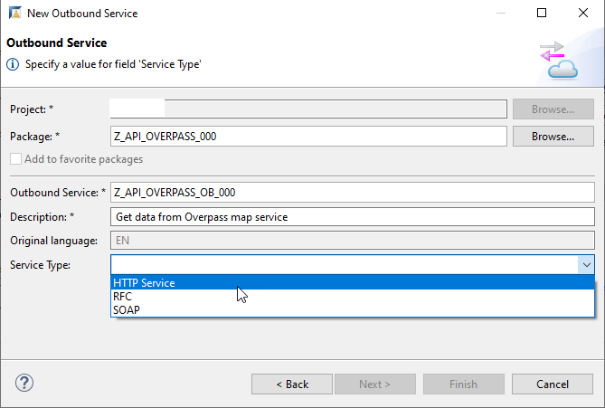

3. Choose the transport request you just created, then choose **Finish**.

    The outbound service appears.

4. Enter the **Default Path Prefix** **`/api/interpreter`**.

    <!-- border -->
    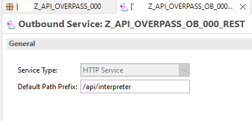

5. Choose **Save (`Ctrl + S`)**.


### Create communication scenario in ADT

1. Again, choose **New > Other Repository Object** from the context menu; then enter **Communication Scenario**.

    <!-- border -->
    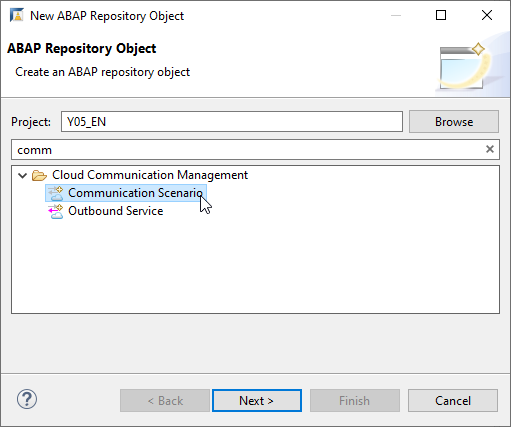

2. Enter the following and choose **Next**.

    - Name: **`Z_API_OVERPASS_CSCEN_000`**
    - Description: **Communication Scenario: Get data from Overpass map service**

      <!-- border -->
      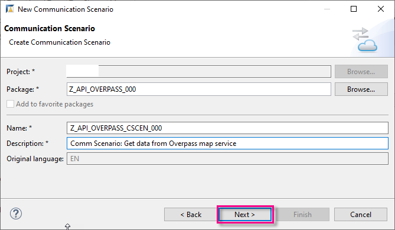

3. Choose the transport request you just created, then choose **Finish**.

    The communication scenario appears in a new editor. Ensure the following have been entered:

    - Communication Scenario Type: **Customer Managed**
    - Allowed Instances: **One instance per client**

      <!-- border -->
      

4. On the **Outbound** tab, ensure that the authentication method **Unauthenticated** ticked.

5. Add your outbound service, by choosing **Add...**.

    <!-- border -->
    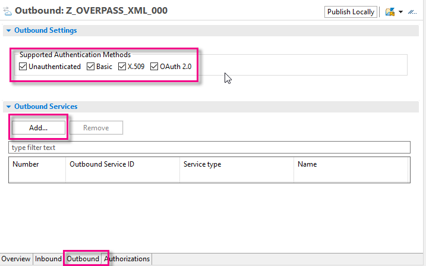

6. Choose **Browse**, choose your outbound service, **`Z_API_OVERPASS_OB_000`**, then choose **Finish**.
  
    The suffix **REST** has added to the outbound service name automatically.

    <!-- border -->
    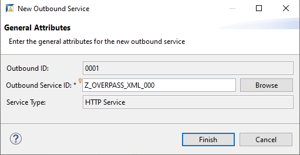

    <!-- border -->
    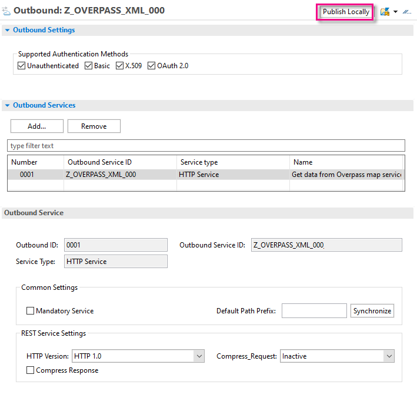

7. Finally, **Save** your communication scenario, then choose **Publish Locally**.


### Create communication system in Fiori Launchpad

Now, you need to create the necessary communication artifacts in Fiori Launchpad, starting with the **Communication System**. This artifact specifies hostname and port of the targeted remote API.

1. In the Fiori Launchpad home page, choose **Communication System**, then choose **New**.

    <!-- border -->
    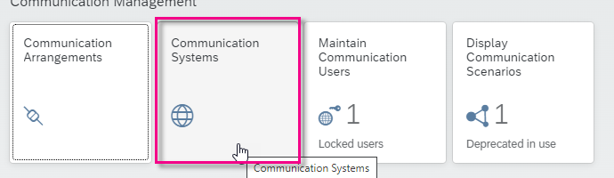

    <!-- border -->
    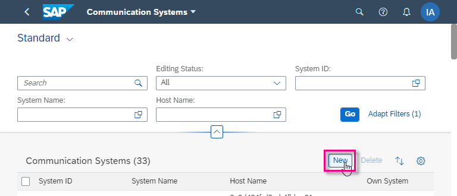

2. Enter the following and choose **Create**.

    - System ID: **`Z_OVERPASS_000_CSYS`**
    - System Name: **`Z_OVERPASS_000_CSYS`**

    <!-- border -->
    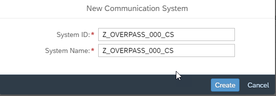

3. Enter host name: `overpass-api.de`

4. Under **Users for Outbound Communication**, enter the option **None**.

    <!-- border -->
    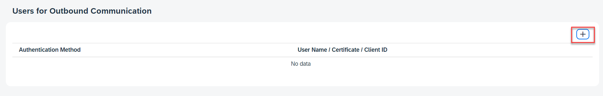
    
    <!-- border -->
    
    
    <!-- border -->
    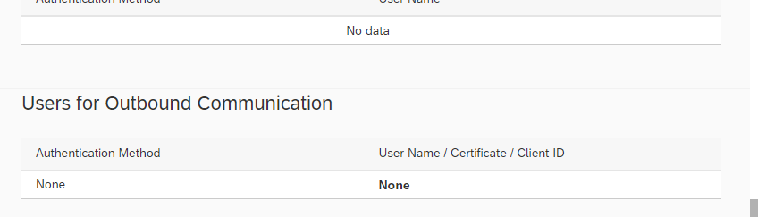

5. Leave the other default settings as they are and choose **Save**.


### Create communication arrangement

A communication arrangement establishes a specific communication route by combining one communication scenario and one communication system.

1. Go back to the Fiori Launchpad home page and choose **Communication Arrangement**, then choose **New**.

    <!-- border -->
    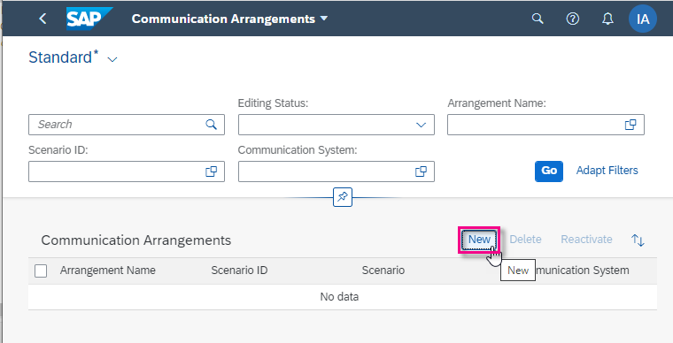

2. Browse to, then select your **Communication Scenario**, **`Z_API_OVERPASS_CSCEN_000`** (created in ADT). The **Communication Arrangement** name is filled automatically.

    <!-- border -->
    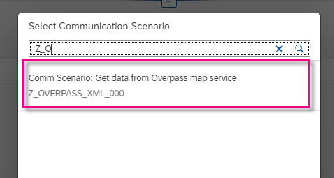
    </br>
    <!-- border -->
    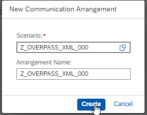

3. In the main editor, select the Communication System, **`Z_OVERPASS_000_CSYS`**.
    The **Service URL**, port etc are filled automatically.

    <!-- border -->
    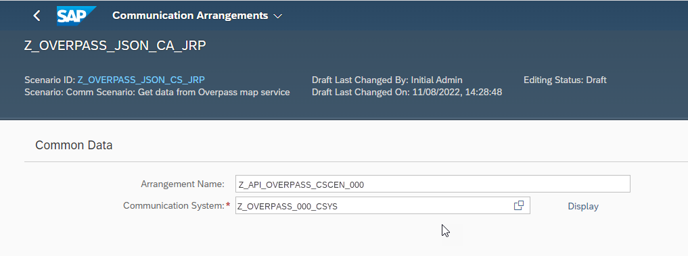
    </br>
    <!-- border -->
    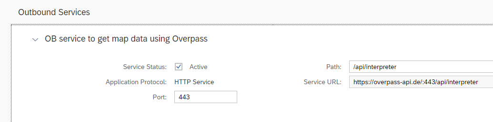

4. Choose **Save**.
    You can now check the connection.

    <!-- border -->
    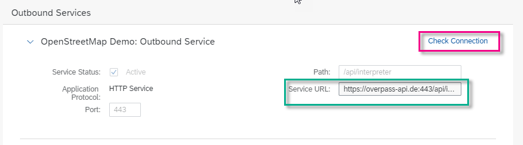
    </br>
    <!-- border -->
    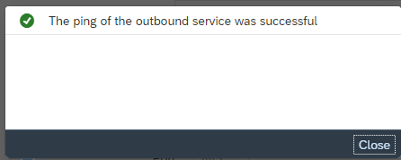


### Create transformation (XML only)

[OPTION BEGIN [XML]]

Now, create the **Simple Transformation**, which converts the XML data to ABAP data.

1. In the Project Explorer, select your package (from the previous tutorial) and choose **New > Other ABAP Repository Object > Transformations > Transformation**, then choose **Next**.

    <!-- border -->
    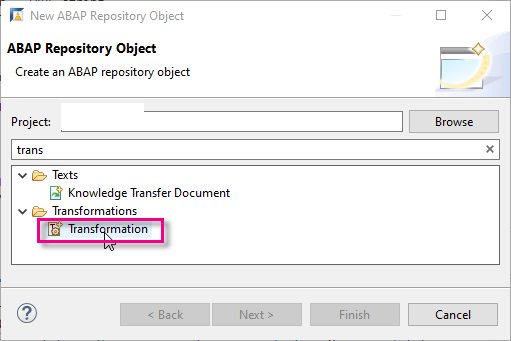

2. Enter the following:
    - Name: **`Z_OVERPASS_XML_ST_000`**
    - Description: **Transform Overpass Map Data: XML-ABAP**
    - Template: **Simple transformation**

    <!-- border -->
    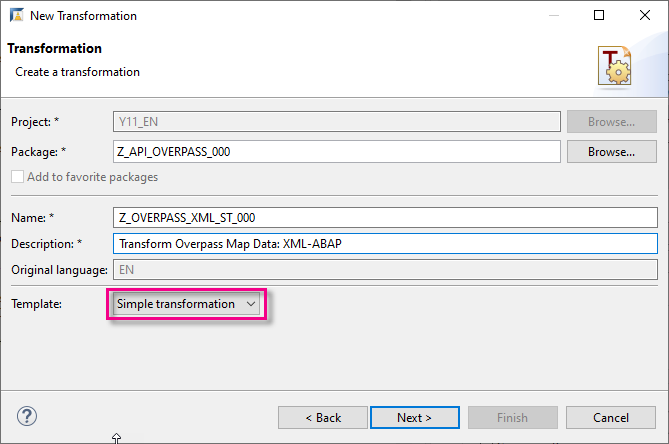

3. Choose your transport request and choose **Finish**.
    A skeleton transformation appears in a new editor.

4. Copy the following code into the **`<tt:transform...`** node:

    ```ABAP
    <tt:root name="osm"/>

    <tt:template>
      <osm tt:ref=".osm">
        <tt:attribute name="version" value-ref="api_version"/>
        <tt:attribute name="generator" value-ref="api_generator"/>
        <note tt:value-ref="note"/>
        <meta tt:ref="metadata">
          <tt:attribute name="osm_base" value-ref="osm_base"/>
          <tt:attribute name="areas" value-ref="osm_areas"/>
        </meta>
        <tt:loop ref="nodes">
          <node>
            <tt:attribute name="id" value-ref="id"/>
            <tt:attribute name="lat" value-ref="latitude"/>
            <tt:attribute name="lon" value-ref="longitude"/>
            <tt:loop ref="tags">
              <tag>
                <tt:attribute name="k" value-ref="property"/>
                <tt:attribute name="v" value-ref="value"/>
              </tag>
            </tt:loop>
          </node>
        </tt:loop>
      </osm>
    </tt:template>

    ```
    <!-- border -->
    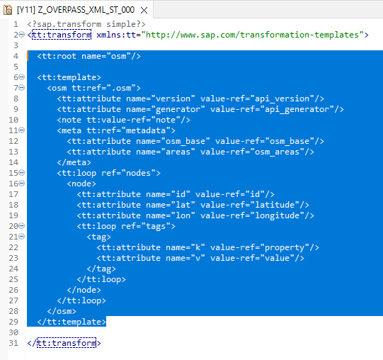

5. Check your syntax (`Ctrl+F2`).

6. Format (`Ctrl+F1`), save (`Ctrl+S`) and activate (`Ctrl+F3`) your class.    

[OPTION END]


[OPTION BEGIN [JSON]]
> If you are using JSON, skip this step, since, instead of an ABAP transformation, you use the XCO Library.

[OPTION END]


### Create ABAP class

Now, you will create an ABAP class that will call your destination, and which you can run in the console.

1. Select your package and choose **New > ABAP Class** from the context menu.

    <!-- border -->
    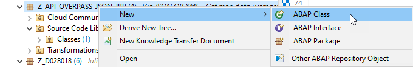

2. Enter the following for your class and choose Next. Remember to change `000` to your group number.
    - Name: **`ZCL_OVERPASS_XML_000`**
    - Description: **Get map data using Overpass + XML**
    - Interfaces: **`IF_OO_ADT_CLASSRUN`** (using **Add...**)

    <!-- border -->
    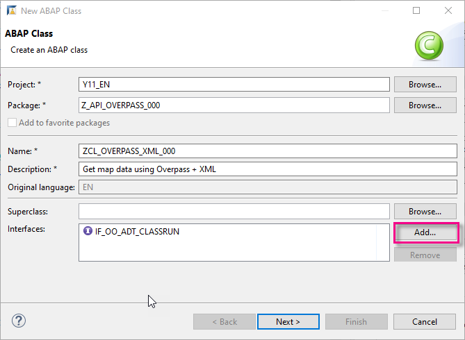

3. Choose or create a transport request, then choose Finish.

The skeleton class is displayed in a new editor.

<!-- border -->
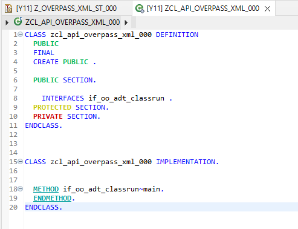


### Implement method

[OPTION BEGIN [XML]]

To be able to access the external service, you will:

1. Create an HTTP client that points to your communication scenario and service id

2. Configure and send an HTTP request. You configure the request using `lo_request->set_query( )` including specifying whether the response should be XML or JSON

3. Convert the response to ABAP structures

4. Output the response in the ABAP console

5. Catch any potential exceptions that may be thrown.

A sample of the raw XML output is available here:
[OverpassRawOutputXML.txt](https://raw.githubusercontent.com/SAPDocuments/Tutorials/master/tutorials/abap-environment-external-api/OverpassRawOutputXML.txt)

Implement the method **`if_oo_adt_classrun~main`** by inserting the following code. Replace the `000` with your group number or initials.

    ```ABAP
    " Get data using XML
    METHOD if_oo_adt_classrun~main.

          " Create HTTP client
          TRY.

              DATA(lo_destination) = cl_http_destination_provider=>create_by_comm_arrangement(
                                       comm_scenario  = 'ZMDC_OVERPASS_CSCEN'
                                       service_id     = 'ZMDC_OVERPASS_OBS_REST'
                                     ).

              DATA(lo_http_client) = cl_web_http_client_manager=>create_by_http_destination( i_destination = lo_destination ).
              DATA(lo_request) = lo_http_client->get_http_request( ).

              " Send request; store response in lv_xml_results
              lo_request->set_query( query = 'data=area[name="Heidelberg"];node["amenity"="biergarten"](area);out;' ).

              DATA(lo_response) = lo_http_client->execute( i_method = if_web_http_client=>get ).
              DATA(lv_xml_results) = lo_response->get_text( ).

            CATCH cx_root INTO DATA(lx_exception).
              out->write( lx_exception->get_text( ) ).
          ENDTRY.

          " Create structures etc
          TYPES:
            BEGIN OF ts_tag,
              property TYPE string,
              value    TYPE string,
            END OF ts_tag,

            BEGIN OF ts_node,
              id        TYPE string,
              latitude  TYPE string,
              longitude TYPE string,
              tags      TYPE STANDARD TABLE OF ts_tag WITH EMPTY KEY,
            END OF ts_node,

            BEGIN OF ts_metadata,
              osm_base  TYPE string,
              osm_areas TYPE string,
            END OF ts_metadata,

            BEGIN OF ts_osm,
              api_version   TYPE string,
              api_generator TYPE string,
              note          TYPE string,
              metadata      TYPE ts_metadata,
              nodes         TYPE STANDARD TABLE OF ts_node WITH EMPTY KEY,
            END OF ts_osm.

          DATA ls_osm TYPE ts_osm.


          TRY.
            " transform response; store transformed response in structure osm
            CALL TRANSFORMATION zmdc_osm_xml_st
            SOURCE XML lv_xml_results
            RESULT osm = ls_osm.


              out->write( | Names of beer gardens in Heidelberg (Germany) found on OpenStreetMaps. | ).
              out->write( | Data is obtained from the OSM API in XML format and read into ABAP using a simple transformation (ST). | ).
              out->write( | Note: Not all locations have an associated name. | ).
              out->write( | Generator: { ls_osm-api_generator } | ).
              out->write( | ---------------------------------- | ).

              " Output data to console
              DATA lv_index TYPE int4.
              LOOP AT ls_osm-nodes ASSIGNING FIELD-SYMBOL(<node>).
                lv_index = sy-tabix.
                LOOP AT <node>-tags ASSIGNING FIELD-SYMBOL(<tag>).
                  IF <tag>-property = 'name'.
                    out->write( | Beer garden number { lv_index }: { <tag>-value } | ).
                  ENDIF.
                ENDLOOP.
              ENDLOOP.
              out->write( | ---------------------------------- | ).

          " catch any error
              CATCH cx_root INTO DATA(lx_root).
                out->write( lx_root->get_text( ) ).
          ENDTRY.

      ENDMETHOD.

    ```

[OPTION END]


[OPTION BEGIN [JSON]]

To be able to access the external service, you must:

1. Create an HTTP client that points to your communication scenario and service id

2. Configure and send an HTTP request. You configure the request using `lo_request->set_query( )` including specifying whether the response should be XML or JSON

3. Convert the response to ABAP structures

4. Output the response in the ABAP console

5. Catch any potential exceptions that may be thrown.

A sample of the raw JSON output is available here:
[OverpassRawOutputXML.txt](https://raw.githubusercontent.com/SAPDocuments/Tutorials/master/tutorials/abap-environment-external-api/OverpassRawOutputJSON.txt)

Implement the method **`if_oo_adt_classrun~main`** by inserting the following code. Replace the `000` with your group number or initials.

    ```ABAP
    " Get data using JSON
    METHOD if_oo_adt_classrun~main.

      " Create HTTP client; send request
      TRY.
      DATA(lo_destination) = cl_http_destination_provider=>create_by_comm_arrangement(
                               comm_scenario  = 'Z_OVERPASS_JSON_CS_000'
                               service_id     = 'Z_API_OVERPASS_JSON_000_REST'

                             ).

          DATA(lo_http_client) = cl_web_http_client_manager=>create_by_http_destination( i_destination = lo_destination ).
          DATA(lo_request) = lo_http_client->get_http_request( ).

          lo_request->set_query( query = 'data=[out:json];area[name="Heidelberg"];node["amenity"="biergarten"](area);out;' ).

          DATA(lo_response) = lo_http_client->execute( i_method = if_web_http_client=>get ).
          DATA(lv_json_results) = lo_response->get_text( ).

        CATCH cx_root INTO DATA(lx_exception).
          out->write( lx_exception->get_text( ) ).
      ENDTRY.

      " Create an ABAP structure to contain the data from the API
      TYPES:
        BEGIN OF ts_tags,
          name    TYPE string,
          website TYPE string,
        END OF ts_tags,

        BEGIN OF ts_element,
          type TYPE string,
          id   TYPE string,
          lat  TYPE string,
          lon  TYPE string,
          tags TYPE ts_tags,
        END OF ts_element,

        BEGIN OF ts_osm3s,
          timestamp_osm_base  TYPE string,
          timestamp_areas_base TYPE string,
          copyright TYPE string,
        END OF ts_osm3s,

        BEGIN OF ts_osm,
          version   TYPE string,
          generator TYPE string,
          osm3s     TYPE ts_osm3s,
          elements  TYPE STANDARD TABLE OF ts_element WITH EMPTY KEY,
        END OF ts_osm.

      DATA ls_osm TYPE ts_osm.

      " Convert the data from JSON to ABAP using the XCO Library; output the data
      TRY.

          xco_cp_json=>data->from_string( lv_json_results )->apply( VALUE #(
            ( xco_cp_json=>transformation->pascal_case_to_underscore )
            ( xco_cp_json=>transformation->boolean_to_abap_bool )
          ) )->write_to( REF #( ls_osm ) ).

          out->write( | Names of beer gardens in Heidelberg (Germany) found on OpenStreetMaps. | ).
          out->write( | Data is obtained from the OSM API in JSON format and read into ABAP using the XCO library. | ).
          out->write( | Note: Not all locations have an associated name. | ).
          out->write( | Generator: { ls_osm-generator } | ).
          out->write( | ---------------------------------- | ).

          LOOP AT ls_osm-elements ASSIGNING FIELD-SYMBOL(<element>).
            out->write( | Beer garden number { sy-tabix }: { <element>-tags-name } | ).
          ENDLOOP.
          out->write( | ---------------------------------- | ).

        " catch any error
        CATCH cx_root INTO DATA(lx_root).
          out->write( lx_root->get_text( ) ).
      ENDTRY.


    ENDMETHOD.

    ```

[OPTION END]


### Activate code

1. Check your syntax (`Ctrl+F2`).

2. Format (`Ctrl+F1`), save (`Ctrl+S`) and activate (`Ctrl+F3`) your class.


### Run class in ABAP Console

Run your class in the console (`F9`). The output should look something like this.

<!-- border -->
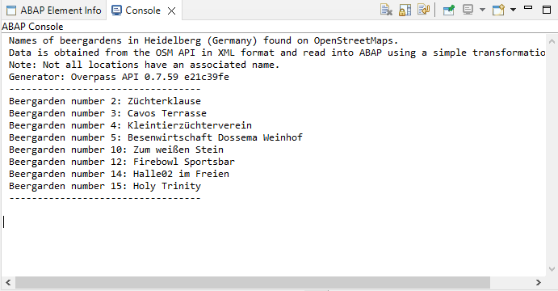


<!-- border -->
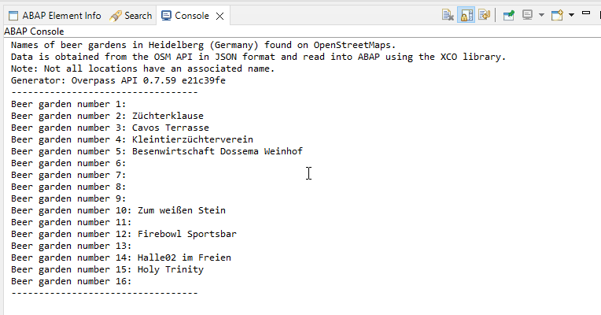


### Test yourself XML

### Test yourself JSON


### More information 
- SAP Help Portal: [Communication Management: Outbound Communication](https://help.sap.com/docs/BTP/65de2977205c403bbc107264b8eccf4b/f871712b816943b0ab5e04b60799e518.html)
- SAP Help Portal: [SAP ABAP Development User Guide: Tasks - Working with Transformations for XML](https://help.sap.com/docs/ABAP_PLATFORM/c238d694b825421f940829321ffa326a/442a645fba984fbf873ecb7640585a29.html)
- ABAP Keyword Documentation: [ ABAP and XML → Transformations for XML → ST - Simple Transformations](https://help.sap.com/doc/abapdocu_753_index_htm/7.53/en-US/abenabap_st.htm)
- [Overpass API by Example](https://wiki.openstreetmap.org/wiki/Overpass_API/Overpass_API_by_Example#Tagging)
- SAP Help Portal: [XCO Library: JSON](https://help.sap.com/docs/BTP/65de2977205c403bbc107264b8eccf4b/492ccdb87b224a35a8ed20e53325dfce.html)
- SAP Community blog post: [Introducing the XCO Library Cloud Platform edition](https://blogs.sap.com/2020/09/21/introducing-the-xco-library-cloud-platform-edition/)
- Overpass Tag Information, including keys, tags etc: [Overpass Tag Info](https://taginfo.openstreetmap.org/)


---
