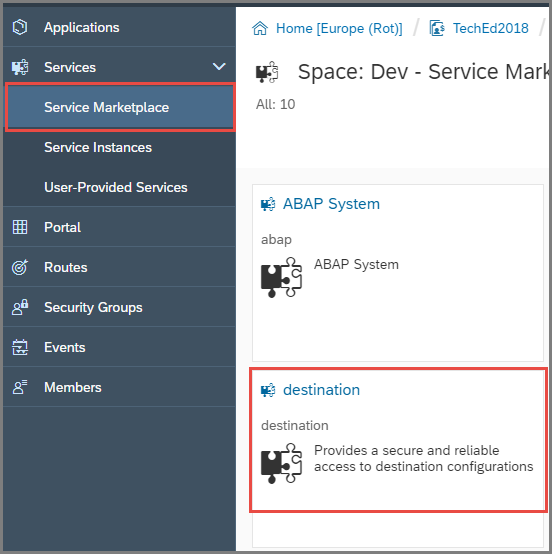
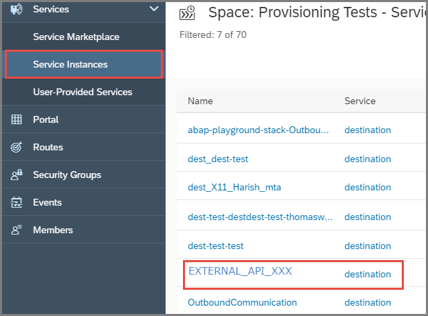
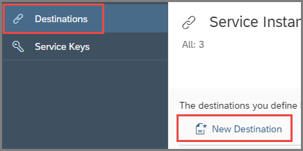
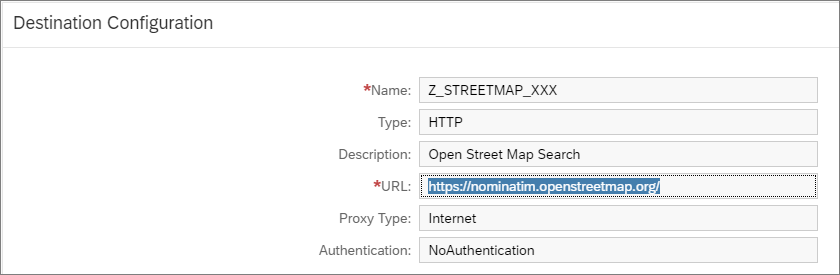
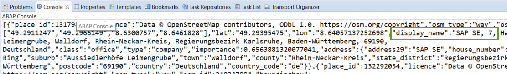

## Prerequisites  
- **IMPORTANT**: This tutorial cannot be completed on a trial account
- **Tutorial**: [Create Your First Console Application](abap-environment-console-application)
- **Tutorial**: [Create a Communication Arrangement for Outbound Communication](abap-env-create-comm-arrangement-api)

## Details
### You will learn  
  - How to create a new destination for an existing communication arrangement
  - How to call an external API from inside an ABAP system

---
Predefined communication scenarios allow you to, for example, exchange data between a SAP Cloud Platform system and an external system.
 A communication arrangement specifies the metadata for a communication scenario. For more information, see [Maintain a Communication Arrangement for an Exposed Service](https://developers.sap.com/tutorials/abap-environment-communication-arrangement.html).

You will create a new destination for an existing communication arrangement, specifying the URL for an external API, user/password, and authentication.
You will then create a class that calls the API and displays the output from it in the console.

Throughout this tutorial, objects name include the suffix `XXX`. Always replace this with your group number or initials.

[ACCORDION-BEGIN [Step 1: ](Open the instance of the destination service)]

1. In your space in the **SAP Cloud Platform Cockpit** (e.g. **`Dev`**), open **Service Marketplace** and choose **Destination**.                          

    

2.  Choose **Instances**, then choose your instance, **`EXTERNAL_API_XXX`**.

    

[DONE]
[ACCORDION-END]

[ACCORDION-BEGIN [Step 2: ](Create a new destination)]

1. From the left pane, choose **Destinations**, then choose **New Destination**:

    

2. Then enter the following (replacing **`xxx`** with your group number). Then choose **Save**:
    - Name  = `Z_STREETMAP_XXX`
    - URL = `https://nominatim.openstreetmap.org/`
    - Proxy type = Internet
    - Authentication = `NoAuthentication`

    

[DONE]

[ACCORDION-END]

[ACCORDION-BEGIN [Step 3: ](Create an ABAP class)]
Now, you will create an ABAP class that will call your destination, and which you can run in the console.

1. In the ABAP Development Tools `(ADT)`, in the Package Explorer, select your package and choose **New > ABAP Class** from the context menu.

    

2. Enter a name and description for your class and choose Next. **Remember to change `XXX` to your group number**.

    

3. Choose or create a transport request, then choose Finish.

    

The class is displayed in a new editor.


[DONE]

[ACCORDION-END]

[ACCORDION-BEGIN [Step 4: ](Add an INTERFACES statement)]
Add the following `interfaces` statement to the public section:

```ABAP
PUBLIC SECTION.
  INTERFACES if_oo_adt_classrun.
PRIVATE SECTION.
```
This enables you to run the class in the console.

[DONE]

[ACCORDION-END]

[ACCORDION-BEGIN [Step 5: ](Create HTTP client)]
To be able to access the external service, you must maintain a cloud destination for the foreign system and create an HTTP client. Proceed as follows:

1. Add the method implementation below and wrap it in an exception.

2. Then replace the `xxx` of `i_name` and `i_service_instance_name` with your group number.
  (To get the `i_service_instance_name`, see the tutorial [Create a Communication Arrangement for Outbound Communication](abap-env-create-comm-arrangement-api), step 7).

    ```ABAP
    METHOD if_oo_adt_classrun~main.
        TRY.
            DATA(lo_destination) = cl_http_destination_provider=>create_by_cloud_destination(
              i_name                  = 'Z_STREETMAP_XXX'
              i_service_instance_name = 'OutboundComm_for_RFCDemo_XXX'
              i_authn_mode = if_a4c_cp_service=>service_specific ).

            DATA(lo_http_client) = cl_web_http_client_manager=>create_by_http_destination( i_destination = lo_destination ).
            DATA(lo_request) = lo_http_client->get_http_request( ).


            DATA(lo_response) = lo_http_client->execute( i_method = if_web_http_client=>get ).
              out->write( lo_response->get_text( ) ).

          CATCH cx_root INTO DATA(lx_exception).
            out->write( lx_exception->get_text( ) ).
        ENDTRY.
      ENDMETHOD.

    ```

[DONE]

[ACCORDION-END]

[ACCORDION-BEGIN [Step 6: ](Check, save, and activate)]
1. Check your syntax (`Ctrl+F2`).
2. Save (`Ctrl+S`) and activate (`Ctrl+F3`) your class.

[DONE]

[ACCORDION-END]

[ACCORDION-BEGIN [Step 7: ](Run the class in the console)]
Run your class in the console (`F9`).

The output should look something like this:
.


[DONE]
[ACCORDION-END]

[ACCORDION-BEGIN [Step 8: ](Add formatting)]
The output is currently just an HTML dump. You will now format the output as JSON.

1. Immediately after the `DATA(lo_request) = lo_http_client->get_http_request( ).` statement, add the following code:

```ABAP

lo_request->set_form_field(
    i_name  = 'format'
    i_value = 'json' ).
lo_request->set_form_field(
    i_name  = 'q'
    i_value = 'SAP SE' ).
lo_request->set_form_field(
    i_name  = 'country'
    i_value = 'Germany' ).
lo_request->set_form_field(
    i_name  = 'city'
    i_value = 'Walldorf' ).
lo_request->set_form_field(
    i_name  = 'addressdetails'
    i_value = '1' ).

```

[DONE]
[ACCORDION-END]

[ACCORDION-BEGIN [Step 9: ](Check, save, activate, and test)]
1. Check your syntax (`Ctrl+F2`).
2. Save (`Ctrl+S`) and activate (`Ctrl+F3`) your class.
3. Run your class in the console (`F9`).

The output should now look something like this:


[DONE]
[ACCORDION-END]

[ACCORDION-BEGIN [Step 10: ](Test yourself)]


[VALIDATE_1]

[ACCORDION-END]
