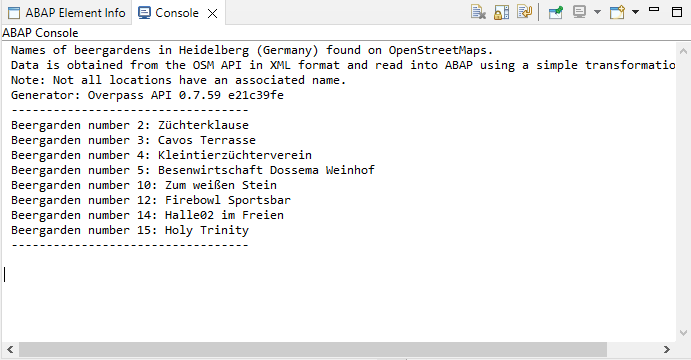

## Prerequisites  
- **IMPORTANT**: This tutorial cannot be completed on a trial account
- **Tutorial**: [Get Data from an External API in SAP BTP ABAP Environment Using JSON](abap-environment-external-api-json), **prerequisites** plus steps 1-5


## You will learn  
- How to connect to an external RESTful API, in this case the Overpass street map service: [http://overpass-api.de/](http://overpass-api.de/),  using the communication  artifacts from the previous tutorial:
- How to query the service for a specific amenity in a specific city, e.g. Heidelberg beer gardens, in an ABAP class
- How to parse the information in this class using XML and a transformation
- How to display the information in the ABAP console
This tutorial enables you to work with XML data from an external RESTful API in your ABAP applications.
Throughout this tutorial, object names include the suffix `000`. Always replace this with your group number or initials.

---


### Create transformation

Now, create the **Simple Transformation**, which converts the XML data to ABAP data.

1. In the Project Explorer, select your package (from the previous tutorial) and choose **New > Other ABAP Repository Object > Transformations > Transformation**, then choose **Next**.

    <!-- border -->

2. Enter the following:
    Name: **`Z_OVERPASS_XML_ST_000`**
    Description: **Transform Overpass Map Data: XML-ABAP**
    Template: Simple transformation

    <!-- border -->

3. Choose your transport request and choose **Finish**.
    A skeleton transformation appears in a new editor.

4. Copy the following code into the **`<tt:transform...`** node:

    ```ABAP
    <tt:root name="osm"/>

    <tt:template>
      <osm tt:ref=".osm">
        <tt:attribute name="version" value-ref="api_version"/>
        <tt:attribute name="generator" value-ref="api_generator"/>
        <note tt:value-ref="note"/>
        <meta tt:ref="metadata">
          <tt:attribute name="osm_base" value-ref="osm_base"/>
          <tt:attribute name="areas" value-ref="osm_areas"/>
        </meta>
        <tt:loop ref="nodes">
          <node>
            <tt:attribute name="id" value-ref="id"/>
            <tt:attribute name="lat" value-ref="latitude"/>
            <tt:attribute name="lon" value-ref="longitude"/>
            <tt:loop ref="tags">
              <tag>
                <tt:attribute name="k" value-ref="property"/>
                <tt:attribute name="v" value-ref="value"/>
              </tag>
            </tt:loop>
          </node>
        </tt:loop>
      </osm>
    </tt:template>

    ```
    <!-- border -->

5. Check your syntax (`Ctrl+F2`).

6. Format (`Ctrl+F1`), save (`Ctrl+S`) and activate (`Ctrl+F3`) your class.    


### Create ABAP class

Now, you will create an ABAP class that will call your destination, and which you can run in the console.

1. Select your package and choose **New > ABAP Class** from the context menu.

    <!-- border -->

2. Enter the following for your class and choose Next. Remember to change `000` to your group number.
    - Name: **`ZCL_OVERPASS_XML_000`**
    - Description: Get map data using Overpass + XML
    - Interfaces: **`IF_OO_ADT_CLASSRUN`** (using **Add...**)

    <!-- border -->

3. Choose or create a transport request, then choose Finish.

The skeleton class is displayed in a new editor.

<!-- border -->


### Add INTERFACES statement

Add the following statement to the public section

    ```ABAP
    PUBLIC SECTION.
      INTERFACES if_oo_adt_classrun.
    PRIVATE SECTION.

    ```

This enables you to run the class in the console.


### Copy code

To be able to access the external service, you must:
- create an HTTP client that points to your communication scenario, communication system, and  service id
- send an HTTP request, understandable to the Overpass API
- wrap this code in an exception
- transform response
- output the transformed response in the ABAP console
- wrap this code in an exception in case the XSLT is incorrect

1. Copy the following code. Replace the `000` with your group number or initials.

    ```ABAP
    METHOD if_oo_adt_classrun~main.

          " Create HTTP client
          TRY.

              DATA(lo_destination) = cl_http_destination_provider=>create_by_comm_arrangement(
                                       comm_scenario  = 'ZMDC_OVERPASS_CSCEN'
                                       service_id     = 'ZMDC_OVERPASS_OBS_REST'
                                     ).

              DATA(lo_http_client) = cl_web_http_client_manager=>create_by_http_destination( i_destination = lo_destination ).
              DATA(lo_request) = lo_http_client->get_http_request( ).

              " Send request; store response in lv_xml_results
              lo_request->set_query( query = 'data=area[name="Heidelberg"];node["amenity"="biergarten"](area);out;' ).

              DATA(lo_response) = lo_http_client->execute( i_method = if_web_http_client=>get ).
              DATA(lv_xml_results) = lo_response->get_text( ).

            CATCH cx_root INTO DATA(lx_exception).
              out->write( lx_exception->get_text( ) ).
          ENDTRY.

          " Create structures etc
          TYPES:
            BEGIN OF ts_tag,
              property TYPE string,
              value    TYPE string,
            END OF ts_tag,

            BEGIN OF ts_node,
              id        TYPE string,
              latitude  TYPE string,
              longitude TYPE string,
              tags      TYPE STANDARD TABLE OF ts_tag WITH EMPTY KEY,
            END OF ts_node,

            BEGIN OF ts_metadata,
              osm_base  TYPE string,
              osm_areas TYPE string,
            END OF ts_metadata,

            BEGIN OF ts_osm,
              api_version   TYPE string,
              api_generator TYPE string,
              note          TYPE string,
              metadata      TYPE ts_metadata,
              nodes         TYPE STANDARD TABLE OF ts_node WITH EMPTY KEY,
            END OF ts_osm.

          DATA ls_osm TYPE ts_osm.


          TRY.
            " transform response; store transformed response in structure osm
            CALL TRANSFORMATION zmdc_osm_xml_st
            SOURCE XML lv_xml_results
            RESULT osm = ls_osm.


              out->write( | Names of beergardens in Heidelberg (Germany) found on OpenStreetMaps. | ).
              out->write( | Data is obtained from the OSM API in XML format and read into ABAP using a simple transformation (ST). | ).
              out->write( | Note: Not all locations have an associated name. | ).
              out->write( | Generator: { ls_osm-api_generator } | ).
              out->write( | ---------------------------------- | ).

              " Output data to console
              DATA lv_index TYPE int4.
              LOOP AT ls_osm-nodes ASSIGNING FIELD-SYMBOL(<node>).
                lv_index = sy-tabix.
                LOOP AT <node>-tags ASSIGNING FIELD-SYMBOL(<tag>).
                  IF <tag>-property = 'name'.
                    out->write( | Beergarden number { lv_index }: { <tag>-value } | ).
                  ENDIF.
                ENDLOOP.
              ENDLOOP.
              out->write( | ---------------------------------- | ).

          " catch any error: In case XSLT is not correct
              CATCH cx_root INTO DATA(lx_root).
                out->write( lx_root->get_text( ) ).
          ENDTRY.

      ENDMETHOD.

    ```

2. Check your syntax (`Ctrl+F2`).

3. Format (`Ctrl+F1`), save (`Ctrl+S`) and activate (`Ctrl+F3`) your class.


### Run class in ABAP Console

Run your class in the console (`F9`). The output should look something like this:
&nbsp;
<!-- border -->


### Test yourself


### More Information
- SAP Help Portal: [Communication Management: Outbound Communication](https://help.sap.com/docs/BTP/65de2977205c403bbc107264b8eccf4b/f871712b816943b0ab5e04b60799e518.html)
- SAP Help Portal: [SAP ABAP Development User Guide: Tasks - Working with Transformations for XML](https://help.sap.com/docs/ABAP_PLATFORM/c238d694b825421f940829321ffa326a/442a645fba984fbf873ecb7640585a29.html)
- ABAP Keyword Documentation: [ ABAP and XML → Transformations for XML → ST - Simple Transformations](https://help.sap.com/doc/abapdocu_753_index_htm/7.53/en-US/abenabap_st.htm)
- [Overpass API by Example](https://wiki.openstreetmap.org/wiki/Overpass_API/Overpass_API_by_Example#Tagging)
- Overpass Tag Information, including keys, tags etc: [Overpass Tag Info](https://taginfo.openstreetmap.org/)


---
