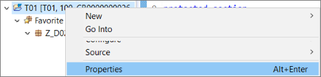
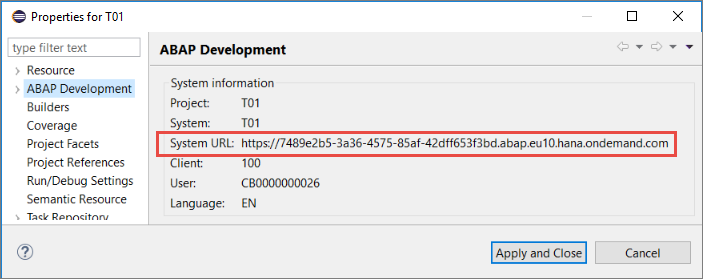
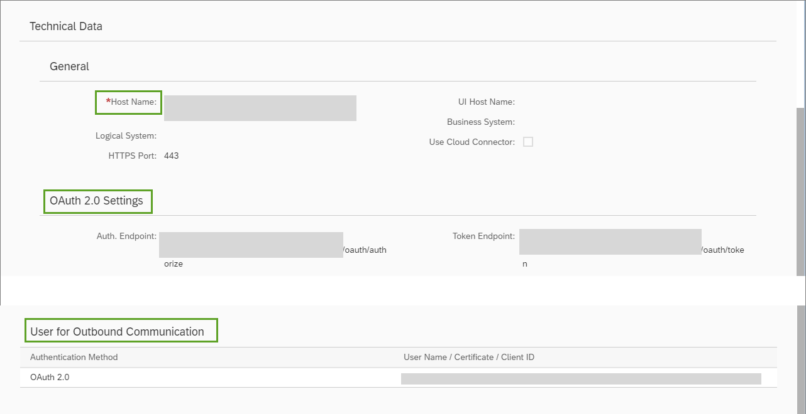
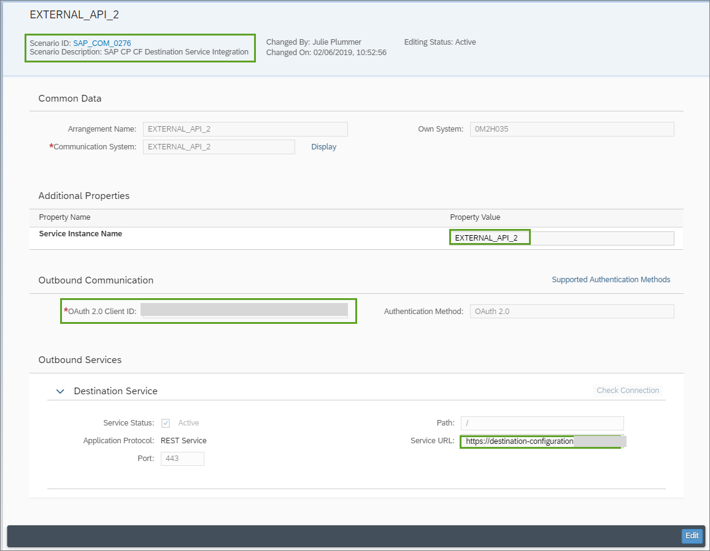
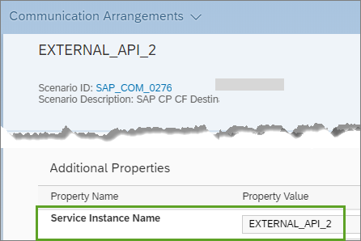

## Prerequisites  
- You have connected to an ABAP system and created an ABAP Cloud Project, as described in [Connect to the ABAP System
](https://help.sap.com/viewer/65de2977205c403bbc107264b8eccf4b/Cloud/en-US/7379dbd2e1684119bc1dd28874bbbb7b.html)
-  Optional: You have opened the SAP Cloud Platform cockpit and navigated to the correct space. See [SAP Help Portal: SAP Cloud Platform Cockpit](https://help.sap.com/viewer/65de2977205c403bbc107264b8eccf4b/Cloud/en-US/e47748b5bb571014afedc70595804f3e.html)
- **Tutorial**: [Create your First ABAP Console Application](abap-environment-console-application), steps 1-3
- **Tutorial**: [Create a Communication Arrangement for an External API](abap-env-create-comm-arrangement-api)

## Details
### You will learn  
  - How to call an external API in an ABAP Class, using a specific destination for a communication arrangement

---

Predefined communication scenarios allow you to, for example, exchange data between an ABAP Environment instance and an external system.
A communication arrangement specifies the metadata for a communication scenario.
For more information, see:

- [SAP Help Portal: Communication Management](https://help.sap.com/viewer/65de2977205c403bbc107264b8eccf4b/Cloud/en-US/2e84a10c430645a88bdbfaaa23ac9ff7.html))

- [SAP Help Portal: Using Services in the Cloud Foundry Environment](https://help.sap.com/viewer/65de2977205c403bbc107264b8eccf4b/Cloud/en-US/f22029f0e7404448ab65f71ff5b0804d.html)

- [Cloud Foundry: Managing Service Keys](https://docs.cloudfoundry.org/devguide/services/service-keys.html)

You will create a new destination for an existing communication arrangement, specifying the URL for an external API, user, password, and authentication.
You will then create a class that calls the API and displays the output from it in the console.

Throughout this tutorial, objects name include the suffix `XXX`. Always replace this with your group number or initials.

[ACCORDION-BEGIN [Step 1: ](Open the dashboard for your project)]
In ADT, select your project and choose **Properties > ABAP Development > System `URL`**.

  

  

[DONE]
[ACCORDION-END]

[ACCORDION-BEGIN [Step 2: ](Optional: Check the communication system)]
Enter the `URL` in the browser and add `/ui`.
In the dashboard that appears, choose **Create a Communication System**.
The most important settings are:

- Host Name
- `OAuth` 2.0 Settings
- User for Outbound Communication

  

[DONE]
[ACCORDION-END]

[ACCORDION-BEGIN [Step 3: ](Optional: Check the communication arrangement)]
Go back and choose **Create a Communication Arrangement**.
The most important settings are:

- Scenario ID : `SAP_COM_0276` (pre-delivered by SAP)
- Service Instance Name: `EXTERNAL_API_XXX`
- Service URL

  


[DONE]
[ACCORDION-END]

[ACCORDION-BEGIN [Step 4: ](Create an ABAP class)]
Now, you will create an ABAP class that will call your destination, and which you can run in the console.

1. In the ABAP Development Tools `(ADT)`, in the Package Explorer, select your package and choose **New > ABAP Class** from the context menu:

    

2. Enter a name and description for your class and choose Next. **Remember to change `XXX` to your group number**:

    

3. Choose or create a transport request, then choose Finish:

    

The class is displayed in a new editor:

    

[DONE]

[ACCORDION-END]

[ACCORDION-BEGIN [Step 5: ](Add an interface statement)]
Now you will implement the class.
Add the following `interfaces` statement to the public section:

```ABAP
  INTERFACES if_oo_adt_classrun.
```
This enables you to run the class in the console.

[DONE]

[ACCORDION-END]

[ACCORDION-BEGIN [Step 6: ](Implement the method)]
  1. Add the method implementation below for the method `if_oo_adt_classrun~main.` and wrap it in an exception.

    - `i_name` = the specific destination defined in the destination service instance (in the SAP Cloud Cockpit) `EXTERNAL_API_XXX`
    - `i_service_instance_name` = your communication arrangement (in the dashboard):

    

```ABAP

    TRY.
        DATA(lo_destination) = cl_http_destination_provider=>create_by_cloud_destination(
          i_name                  = 'Z_CHUCKNORRIS_XXX'
          i_service_instance_name = 'EXTERNAL_API_XXX'
          i_authn_mode = if_a4c_cp_service=>service_specific ).

        DATA(lo_http_client) = cl_web_http_client_manager=>create_by_http_destination( i_destination = lo_destination ).
        DATA(lo_request) = lo_http_client->get_http_request( ).
        DATA(lo_response) = lo_http_client->execute( i_method = if_web_http_client=>get ).
          out->write( lo_response->get_text( ) ).

      CATCH cx_root INTO DATA(lx_exception).
        out->write( lx_exception->get_text( ) ).
    ENDTRY.

```

[DONE]

[ACCORDION-END]

[ACCORDION-BEGIN [Step 7: ](Check, save, and activate)]
1. Check your syntax (`Ctrl+F2`).
2. Save (`Ctrl+S`) and activate (`Ctrl+F3`) your class.

[DONE]

[ACCORDION-END]

[ACCORDION-BEGIN [Step 8: ](Run the class in the console)]
Run your class in the console (`F9`).

The output should look something like this:


[DONE]

[ACCORDION-END]

[ACCORDION-BEGIN [Step 9: ](Test yourself)]
Create the variable `my_request` using the DATA statement and the `get_http_request` method of the `my_http_client` object. Enter the correct text below:

[VALIDATE_1]

[ACCORDION-END]
---
