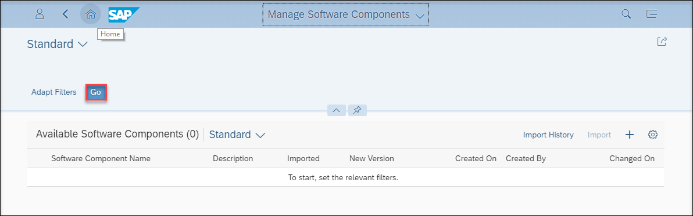
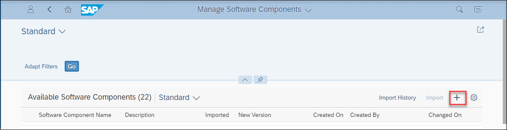
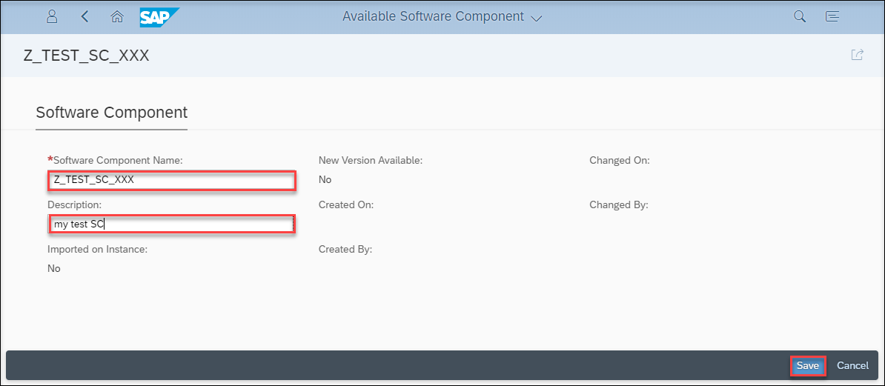
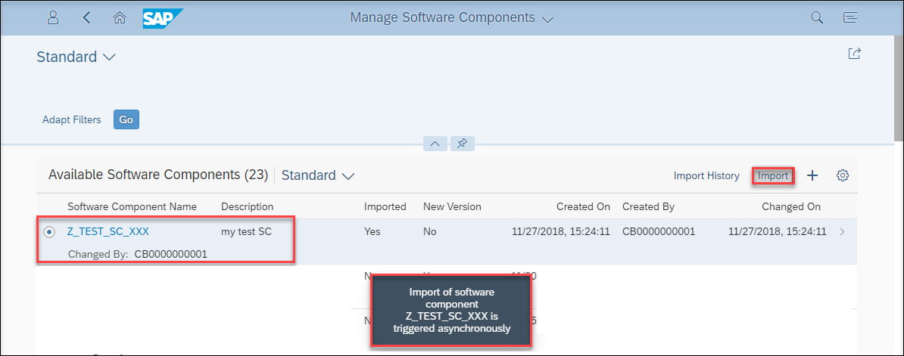
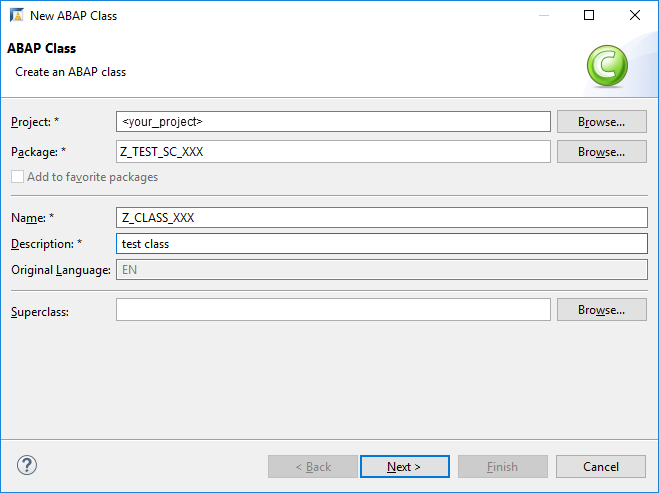
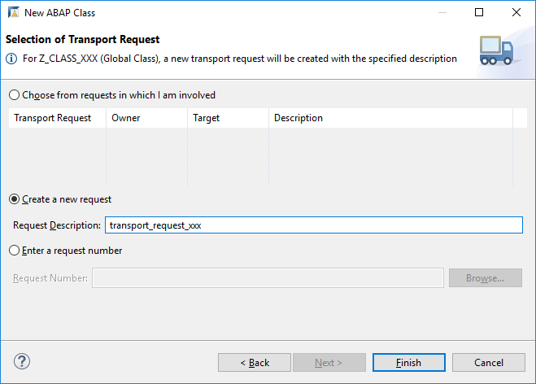

## Prerequisites  
 - Create a developer user in a SAP Cloud Platform ABAP Environment system.
 - Download Eclipse Photon or Oxygen and install ABAP Development Tools (ADT). See <https://tools.hana.ondemand.com/#abap>.

## Details
### You will learn  
  - How to create and import a new software component into a SAP Cloud Platform ABAP Environment instance.
  - How to add ABAP sources and export software component.
  - How to import software component into a new SAP Cloud Platform ABAP Environment instance.

---

[ACCORDION-BEGIN [Step 1: ](Create software component via SAP Fiori launchpad)]
  1. Open **Manage Software Components** app on your first instance's Fiori launchpad.

      

  2. Press **GO** button to load all available software components.

      

  3. Press **+** button to create a new software component.

      

  4. Enter a **Software Component Name** and a **Description** and press **Save**.

      

    You can use `Z`-, `Y`- or `/DMO/`-Name

  5. Select your created software component and press **Import**. Check the popup.

      

      With selecting **Import History** you can view the current status of the import.

[DONE]
[ACCORDION-END]

[ACCORDION-BEGIN [Step 2: ](Add ABAP sources and export component)]
  1. Open Eclipse and connect with your developer user to your first ABAP system and add your imported software component to your **Favorite Packages**.

      

  2. Create ABAP objects in your software component (e.g. ABAP class). You can create a new transport task if asked, otherwise add your object to an existing one.

      

      

  3. Release your transport request and its subtasks. Therefore, open view **Transport Organizer**.

      

  4. Release all your subtasks by right click on it and select **Release**.

      

  5. Afterwards release your transport request by right click on it and also select **Release**.

      

[DONE]
[ACCORDION-END]

[ACCORDION-BEGIN [Step 3: ](Update or import software component again)]
  1. Open **Manage Software Components** app on your second instance's Fiori launchpad.

      

  2. Press **GO** button to load all available software components.

      

  3. Select your software component and press **Import**. This will either update the software component if it is already imported into the second system or import the software component if it is not present in the second system.

      

[DONE]
[ACCORDION-END]

[ACCORDION-BEGIN [Step 4: ](Test yourself)]

[VALIDATE_1]
[ACCORDION-END]
---
