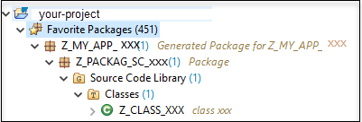
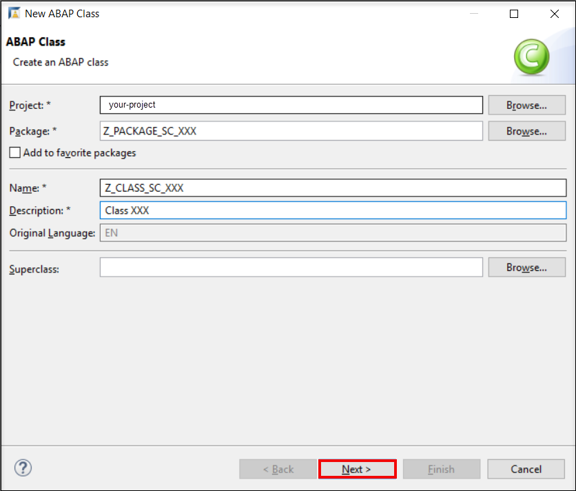

## Prerequisites  
 - Create a developer user in a SAP Cloud Platform ABAP Environment system.
 - Add the lifecycle management - Software Components business catalog (ID: `SAP_A4C_BC_MSCL_PC`) to your business role
 - Download Eclipse Photon or Oxygen and install ABAP Development Tools (ADT). See <https://tools.hana.ondemand.com/#abap>.
 - Read following blog post about [Software Lifecycle Management for SAP Cloud Platform ABAP Environment](https://blogs.sap.com/2019/11/13/software-lifecycle-management-for-sap-cloud-platform-abap-environment/).

## Details
### You will learn  
  - How to create and import a new software component into a SAP Cloud Platform ABAP Environment instance
  - How to add ABAP sources and export software component
  - How to import software component into a new SAP Cloud Platform ABAP Environment instance

>A Software Component is designed to contain all of your application coding and should be runnable itself.

>**Example:** Think of an application for Room Booking in your company. Below an example how the application can be structured.

>`Z_ROOM_BOOKER` (Top-Level-package, corresponds to software component and is created automatically – Type Structure )

>o	`ZRB_LOGIC` (sub-package, Type Development)

>o`	ZRB_SERVICES` (sub-package, Type Development)

>o	`ZRB_UTIL` (sub-package, Type Development)

---

[ACCORDION-BEGIN [Step 1: ](Create software component via SAP Fiori launchpad)]
  1. Login as administrator and open **Manage Software Components** application on your **development systems Fiori Launchpad**.

      

  2. Press **GO** button to see the list of all already available software components.

      

  3. Click **Create** to create a new software component.

      

  4. Enter a **Software Component Name** and a **Description** and press **Save**.

      

      You can use your own namespace.

  5. Select your created software component and press **Import**. Click **OK** on **Import** popup.

     As software component creation creates a repository for it in a distributed version-control system only and not in the development instance, you have to import that before starting real development.

      

  6. Check the popup.

      

      With selecting **Import History** you can view the current status of the import.

[DONE]
[ACCORDION-END]

[ACCORDION-BEGIN [Step 2: ](Add ABAP sources and export component)]

  1. Open Eclipse and connect with your developer user to your **development ABAP system**. Right-click on **Favorite Packages** and select **Add Package**.

      

  2. Enter **`Z_MY_APP_XXX`**, select it and click **OK**.

      

  3. Check your result.  

      

  4. Right-click on **`ZLOCAL`** > **New** > **ABAP Package**.

      

  5. Create package:

     - Name: **`Z_PACKAGE_SC_XXX`**
     - Description: **`Package XXX`**

     Click **Next**.

     

      **Hint:** Your software component root package is a structure package, hence it's not allowed to create objects directly in this package. You need to add an additional development package and then you're able to add your objects.

  6. Click **Next**.

      

  7. Select **Create a new request**:
     - Request Description: **`TRXXX`**

     Click **Finish**.

      

  8. Right-click on your package **`Z_PACKAGE_SC_XXX`** and select **New** > **ABAP Class**.

      

  9. Create class in Package `Z_PACKAGE_SC_XXX`:

     - Name: **`Z_CLASS_SC_XXX`**
     - Description: **`Class XXX`**

     Click **Next**.

     

  10. Select your transport request **`TRXXX`**
  Click **Finish**.

      

  11. Release your transport request and its subtasks. Therefore, open view **Transport Organizer**.

      

  12. Release all your subtasks by right click on it and select **Release**.

      

  13. Afterwards release your transport request by right click on it and also select **Release**.

      

[DONE]
[ACCORDION-END]

[ACCORDION-BEGIN [Step 3: ](Update or import software component again)]
  1. Open **Manage Software Components** app on your **test systems Fiori launchpad**.

      

  2. Press **GO** button to load all available software components.

      

  3. Select your software component and press **Import**. This will either update the software component if it is already imported into the second system or import the software component if it is not present in the second system.

      

      With selecting **Import History** you can view the current status of the import.

[DONE]
[ACCORDION-END]

[ACCORDION-BEGIN [Step 4: ](Check the imported software component)]
  1. Open Eclipse and connect with your developer user to your **test ABAP system** and add your imported software component to your **Favorite Packages**. Check if all objects are imported.

      

[DONE]
[ACCORDION-END]

[ACCORDION-BEGIN [Step 5: ](Test yourself)]

[VALIDATE_1]
[ACCORDION-END]
---
