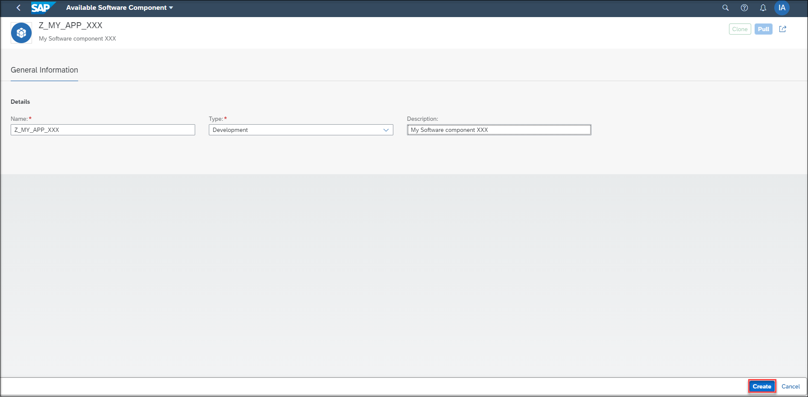
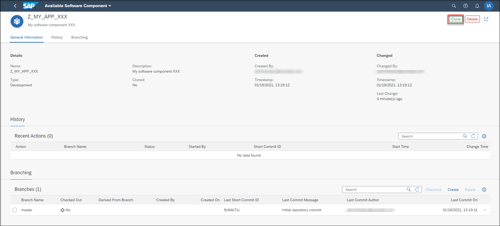
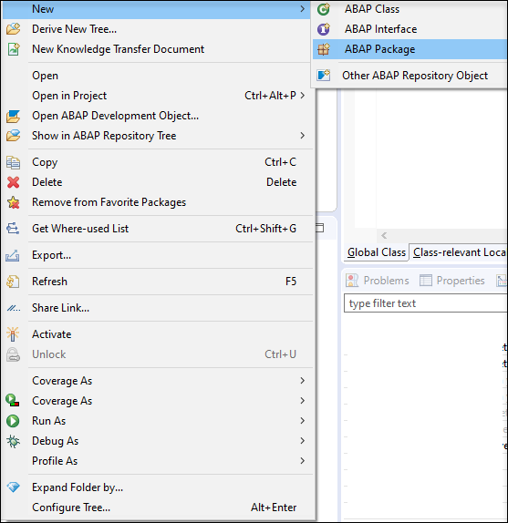
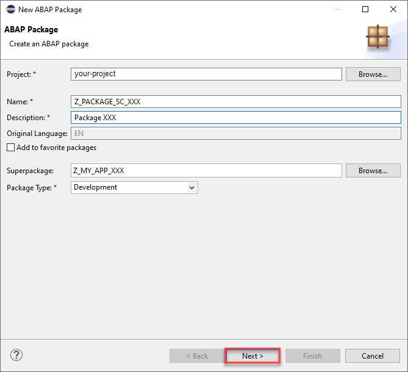
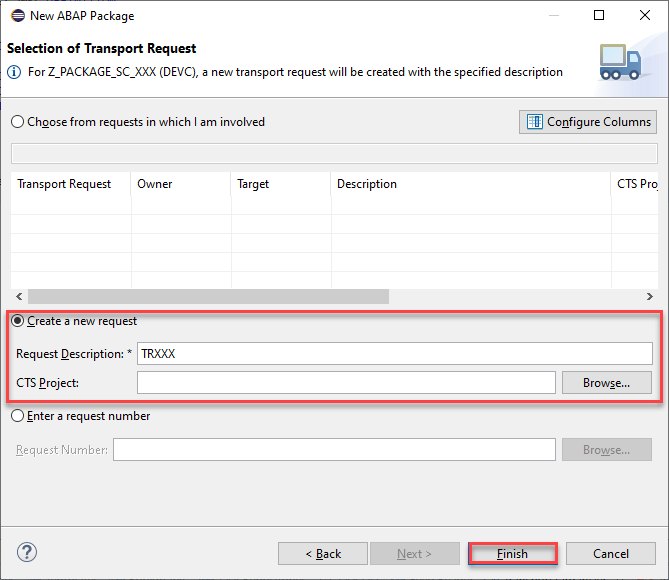
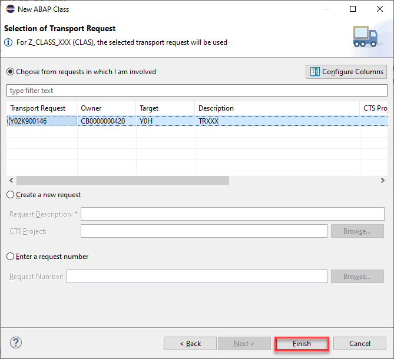

## Prerequisites  
 - You need developer user in two SAP BTP ABAP Environment systems under one global account.
 - Add the lifecycle management - Software Components business catalog (ID: `SAP_A4C_BC_MSCL_PC`) to your business role
 - Download Eclipse Photon or Oxygen and install ABAP Development Tools (ADT). See <https://tools.hana.ondemand.com/#abap>.
 - Read following blog post about [Software Lifecycle Management for SAP BTP ABAP Environment](https://blogs.sap.com/2019/11/13/software-lifecycle-management-for-sap-cloud-platform-abap-environment/).

## Details
### You will learn  
  - How to create and import a new software component into a SAP BTP ABAP Environment instance
  - How to add ABAP sources and export software component
  - How to import software component into a new SAP BTP ABAP Environment instance

---

[ACCORDION-BEGIN [Step 1: ](Create software component via SAP Fiori launchpad)]
  1. Login to your first system Fiori launchpad as administrator and open **Manage Software Components** application.

      

  2. Press **GO** to see the list of all already available software components.

      

  3. Click **Create** to create a new software component.

      

  4. Enter a **Software Component Name** and a **Description** and press **Create**.

      

  5. In your created software component press **Clone**.

      

  6. In the clone dialog select **Master** branch and click **Clone**.

      

  7. You can check under **Recent Actions** if your clone is done.

      

[DONE]
[ACCORDION-END]

[ACCORDION-BEGIN [Step 2: ](Add ABAP sources and export component)]

  1. Open Eclipse and connect with your developer user to your first ABAP system. Right-click **Favorite Packages** and select **Add Package**.

      

  2. Enter **`Z_MY_APP_XXX`**, select it and click **OK**.

      

  3. Check your result.  

      

  4. Right-click your package **`Z_MY_APP_XXX`** and select **New** > **ABAP Package**.

      

  5. Create a package

    - Name: **`Z_PACKAGE_SC_XXX`**
    - Description: **`Package XXX`**

    Click **Next**.

      

    >Your software component root package is a structure package, hence it's not allowed to create objects directly in this package. You need to add an additional development package and then you are able to add your objects.

  6. Select **Create a new request**

    - Request Description: **`TRXXX`**

    click **Finish**.

    

  7. Right-click your package **`Z_PACKAGE_SC_XXX`** and select **New** > **ABAP Class**.

      

  8. Create class in package `Z_PACKAGE_SC_XXX`:

     - Name: **`Z_CLASS_XXX`**
     - Description: **`Class XXX`**

     Click **Next**.

     

  9. Select your transport request **`TRXXX`**. Click **Finish**.

      

    Save and activate your new class.

  10. Release your transport request and its subtasks. Therefore, open view **Transport Organizer**.

      

  11. Right-click your subtasks and select **Release** to release all your subtasks.

      

  12. Afterwards right-click your transport request and select **Release** to release your transport request.

      

[DONE]
[ACCORDION-END]

[ACCORDION-BEGIN [Step 3: ](Update or import software component again)]
  1. Open **Manage Software Components** app on your second systems Fiori launchpad.

      

  2. Press **GO** to load all available software components.

      

  3. Select your software component and press **Clone**. This will either update the software component if it is already imported into the second system or import the software component if it is not present in the second system.

      

  4. In the clone dialog select **Master** branch and click **Clone**.

      

  5. You can check under **Recent Actions** if your clone is done.

      

[DONE]
[ACCORDION-END]

[ACCORDION-BEGIN [Step 4: ](Check the imported software component)]
  1. Open Eclipse and connect with your developer user to your second ABAP system and add your imported software component to your **Favorite Packages**. Check if all objects are imported.

      

[DONE]
[ACCORDION-END]

[ACCORDION-BEGIN [Step 5: ](Test yourself)]

[VALIDATE_1]
[ACCORDION-END]
---
