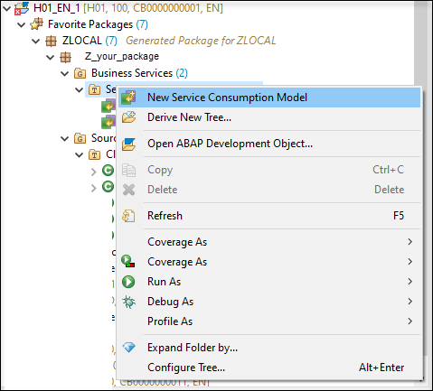

## Prerequisites
 - You need the standard developer authorization profile to create ABAP development objects.
 - You need a SAP Cloud Connector account, connected with the subaccount. See [Configure SAP Cloud Connector](https://developers.sap.com/tutorials/abap-env-rfc.html) for more details.

## Details
### You will learn
  - How to download service metadata files for the remote function call
  - How to create a service consumption model using metadata file
  - How to generate proxies for remote function call (RFC)

Always replace `XXX` with your initials or group number.

---

[ACCORDION-BEGIN [Step 1: ](Download metadata files from aco_proxy)]
  1. Logon to your on-premise system.

      

  2. Execute transaction `aco_proxy`.

    

  3. For this tutorial, search two function modules: `RFC_SYSTEM_INFO` and `RFC_READ_TABLE`.

      Choose **File** and press **Enter** to download the file.

      

      Store it in an XML file on your local system.

      

If you have a new system, you will be able to download multiple files, but if not, download all files one after the other and save them for later use.


[DONE]
[ACCORDION-END]

[ACCORDION-BEGIN [Step 2: ](Create service consumption model - RFC_SYSTEM_INFO)]
  1. Open ADT and login to your ABAP System.
  If you do not have a package, create a new one.

  2. Right-click your package and choose **New** > **Other ABAP Repository Object**.

    

  3. Choose **Service Consumption Model** and click **Next**.

    

  4. Enter a **Name** and **Description** and choose **`RFC`** as **Remote Consumption Model**.

    Click **Next**.

    

  5. Set a **Proxy Class** name and choose the stored metadata file `RFC_SYSTEM_INFO` in your local system as **Service Metadata File**.

    Click **Next**.

    

  6. Choose a transport request or create a new one.

    Click **Finish**.

    

  7. Check your package and make sure the service consumption model `Z_TEST_XXX` and the proxy class `Z_CLASS_TEST_XXX` were created. If needed, refresh your package.

    


[DONE]
[ACCORDION-END]


[ACCORDION-BEGIN [Step 3: ](Create class for remote function call - RFC_SYSTEM_INFO)]
  1. Right click your package  and create a new Class in your Package and use **Add** to add `IF_OO_ADT_CLASSRUN` interface.

    Click **Next**.

    

    Your new created class should look like the following:

    

  2. In the service consumption model, copy the code sample.

    

  3. Paste the code in your new class in the `if_oo_adt_classrun~main` method.

    

  4. Enter a valid destination name as `mydestname` and ask for some outputs.

    

    You can copy this code:

    ```RFC
    out->write( |{ CURRENT_RESOURCES }, { FAST_SER_VERS }, { MAXIMAL_RESOURCES }, { RECOMMENDED_DELAY }, { RFCSI_EXPORT-rfcchartyp }, { S4_HANA }| ).
        out->write(  RFCSI_EXPORT ).
    ```

  5. Activate both classes, auto-generated and created by your own. Press **F9** to run the class and check results in the console.


[DONE]
[ACCORDION-END]

[ACCORDION-BEGIN [Step 4: ](Create service consumption model - RFC_READ_TABLE)]
Right-click **Service Consumption Models** in ADT and create a new service consumption model with the other stored metadata file `RFC_READ_TABLE` in your local system.

  >See Step 2 for details.




[DONE]
[ACCORDION-END]

[ACCORDION-BEGIN [Step 5: ](Create class for remote function call - RFC_READ_TABLE)]
  1. Right-click your package and create a new class and copy the code sample from your created service consumption models into `if_oo_adt_classrun~main` method.

    >See Step 3 for details.

    

    

  2. Enter a valid destination name as `mydestname` and try to read a table like `SFLIGHT`.

    


    Your complete code should look like following:

    ```RFC
    CLASS z_class_read_xxx DEFINITION
    PUBLIC
    FINAL
    CREATE PUBLIC .
    PUBLIC SECTION.
    INTERFACES if_oo_adt_classrun .
    PROTECTED SECTION.
    PRIVATE SECTION.
    ENDCLASS.
    CLASS z_class_read_xxx IMPLEMENTATION.
    METHOD if_oo_adt_classrun~main.
    DATA dest TYPE REF TO IF_RFC_DEST.
    DATA myobj  TYPE REF TO Z_READ_TEST.
    DATA DELIMITER TYPE Z_READ_TEST=>SO_TEXT001.
    DATA NO_DATA TYPE Z_READ_TEST=>SO_TEXT001.
    DATA QUERY_TABLE TYPE Z_READ_TEST=>TABNAME.
    DATA ROWCOUNT TYPE Z_READ_TEST=>SO_INT.
    DATA ROWSKIPS TYPE Z_READ_TEST=>SO_INT.
    DATA DATA TYPE Z_READ_TEST=>_TAB512.
    DATA FIELDS TYPE Z_READ_TEST=>_RFC_DB_FLD.
    DATA OPTIONS TYPE Z_READ_TEST=>_RFC_DB_OPT.
    TRY.
      dest = CL_RFC_DESTINATION_PROVIDER=>CREATE_BY_CLOUD_DESTINATION( I_NAME = 'A4H' ).
      CREATE OBJECT myobj
        EXPORTING
          destination = dest.
    catch CX_RFC_DEST_PROVIDER_ERROR.
     " handle CX_RFC_DEST_PROVIDER_ERROR
    ENDTRY.
    TRY.
    QUERY_TABLE = 'SFLIGHT'.
      myobj->RFC_READ_TABLE(
         EXPORTING
           DELIMITER = DELIMITER
           NO_DATA = NO_DATA
           QUERY_TABLE = QUERY_TABLE
         CHANGING
           DATA = DATA
           FIELDS = FIELDS
           OPTIONS = OPTIONS
       ).
       Loop at DATA into DATA(ls_wa).
       out->write( ls_wa-wa ).
       Endloop.
     CATCH  CX_ACO_COMMUNICATION_FAILURE INTO DATA(lcx_comm).
     out->write( lcx_comm->get_longtext( ) ).
      " handle CX_ACO_COMMUNICATION_FAILURE (sy-msg* in lcx_comm->IF_T100_MESSAGE~T100KEY)
     CATCH CX_ACO_SYSTEM_FAILURE INTO DATA(lcx_sys).
     out->write( lcx_sys->get_longtext( ) ).
      " handle CX_ACO_SYSTEM_FAILURE (sy-msg* in lcx_sys->IF_T100_MESSAGE~T100KEY)
     CATCH CX_ACO_APPLICATION_EXCEPTION INTO DATA(lcx_appl).
      " handle APPLICATION_EXCEPTIONS (sy-msg* in lcx_appl->IF_T100_MESSAGE~T100KEY)
       CASE lcx_appl->GET_EXCEPTION_ID( ).
          WHEN 'DATA_BUFFER_EXCEEDED'.
            "handle DATA_BUFFER_EXCEEDED.
          WHEN 'FIELD_NOT_VALID'.
            "handle FIELD_NOT_VALID.
          WHEN 'NOT_AUTHORIZED'.
            "handle NOT_AUTHORIZED.
          WHEN 'OPTION_NOT_VALID'.
            "handle OPTION_NOT_VALID.
          WHEN 'TABLE_NOT_AVAILABLE'.
            "handle TABLE_NOT_AVAILABLE.
          WHEN 'TABLE_WITHOUT_DATA'.
            "handle TABLE_WITHOUT_DATA.
       ENDCASE.
    ENDTRY.
  ENDMETHOD.
ENDCLASS.
    ```

  3. Activate both classes, auto-generated and created by your own. Press **F9** to run the class and check results in the console.

    


[DONE]
[ACCORDION-END]

[ACCORDION-BEGIN [Step 6: ](Test yourself)]

[VALIDATE_1]
[ACCORDION-END]
---
