## Prerequisites  
  - You need a SAP BTP, ABAP environment license.
  - ADT version 2.96 or higher

## Details
### You will learn
  - How to create an ABAP package
  - How to create a domain
  - How to create a table
  - How to create a data definition
  - How to create a lock object

In this tutorial, wherever `XXX` appears, use a number (e.g. `000`).

---


[ACCORDION-BEGIN [Step 1: ](Create ABAP package)]
1. Go to ADT and right-click on **`ZLOCAL`**, select the menu path **New** > **ABAP Package**.

    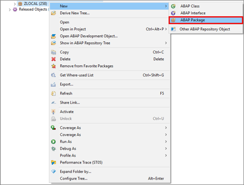

2. Create your package:

    - Name: **`Z_ROOM_XXX`**
    - Description: **`My Package XXX`**

    Click **Next>**.

    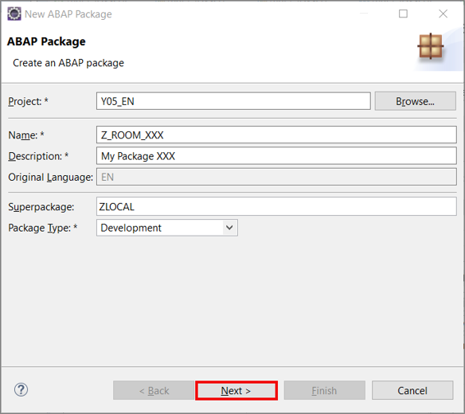

3. Click **Next>**.

    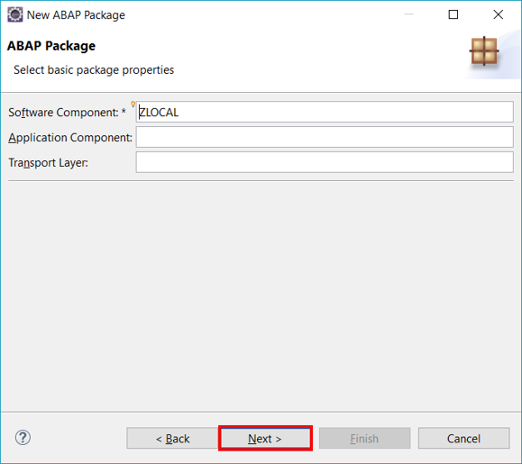

4. Click **Finish**.

    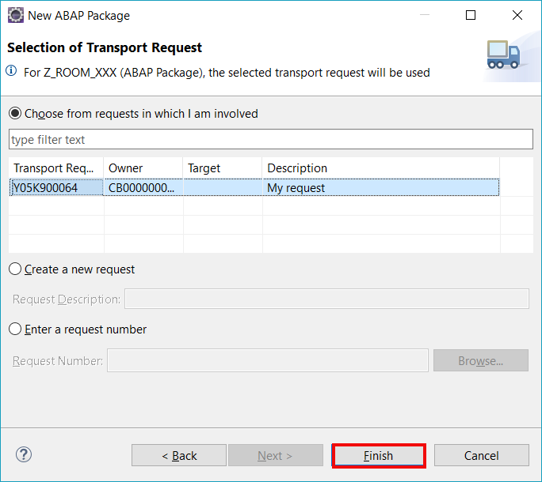

[DONE]
[ACCORDION-END]


[ACCORDION-BEGIN [Step 2: ](Add package)]
  1. Right-click on **Favorite Packages** and select **Add Package...**

      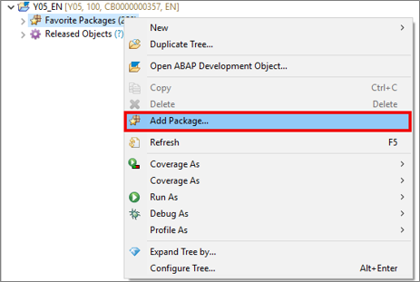

  2. Search for **`Z_ROOM_XXX`**, select it and click **OK**.

      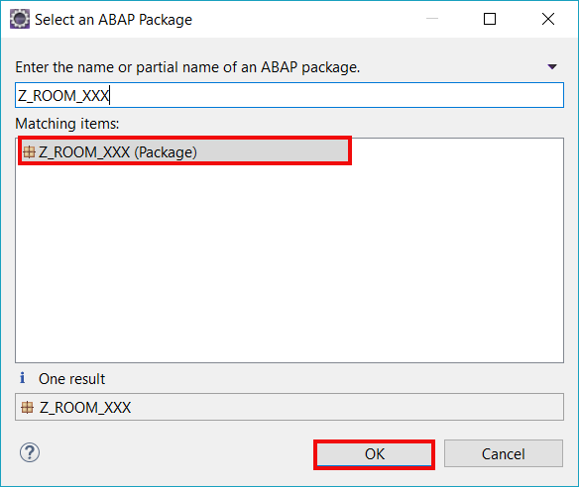

[DONE]
[ACCORDION-END]

[ACCORDION-BEGIN [Step 3: ](Create domain)]
  1. Right-click on **`Z_ROOM_XXX`**, select the menu path **New** > **Other ABAP Repository Object**

      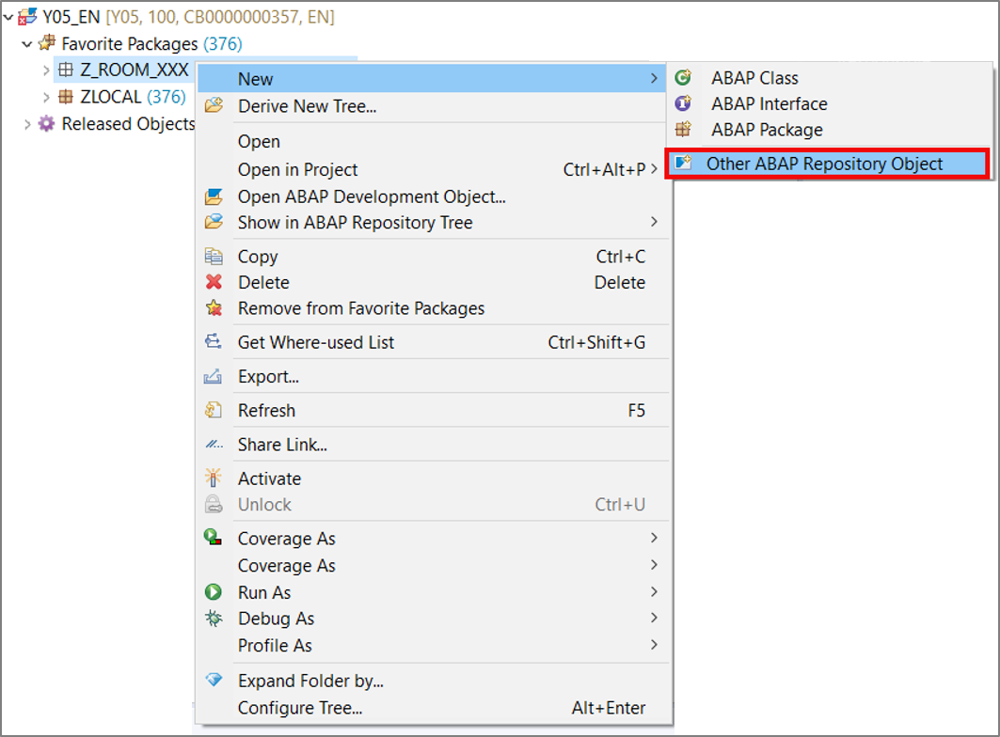

  2. Search for **Domain**, select it and click **Next>**.

      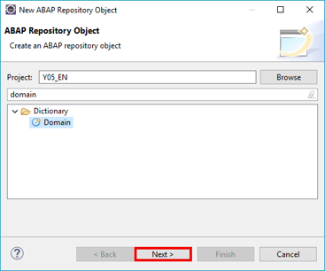

  3.  Create your domain:
     - Name: **`Z_LOCA_DOM_XXX`**
     - Description: **`Location`**

     Click **Next>**.

      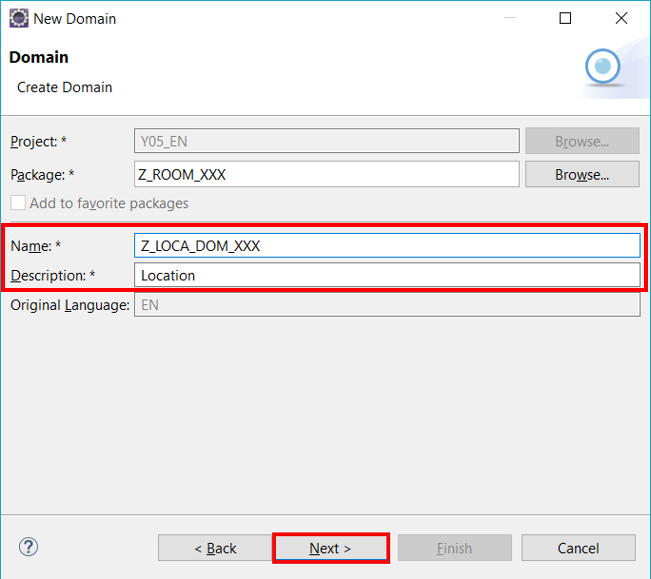

  4. Click **Finish**.

      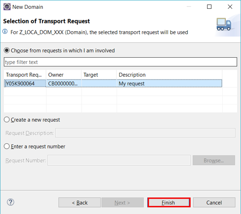

  5. Enhance your domain with following information:
      - Data Type: `CHAR`
      - Length: 3
      - Output Length: 3

      Save and activate.

      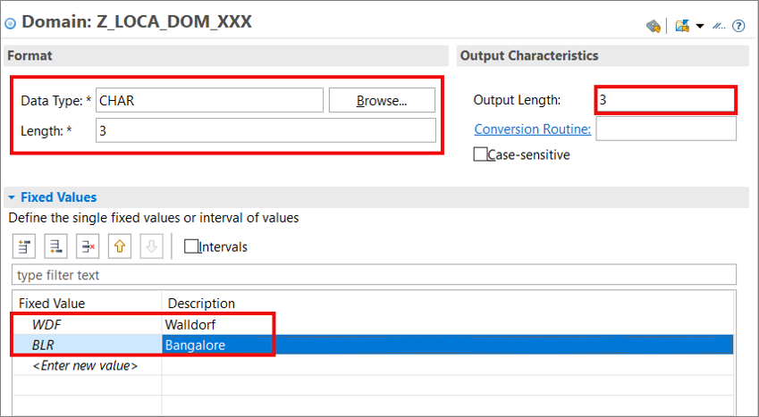

[DONE]
[ACCORDION-END]

[ACCORDION-BEGIN [Step 4: ](Create data element)]
  1. Right-click on **`Z_ROOM_XXX`**, select the menu path **New** > **Other ABAP Repository Object**

      

  2. Search for **Data Element**, select it and click **Next>**.

      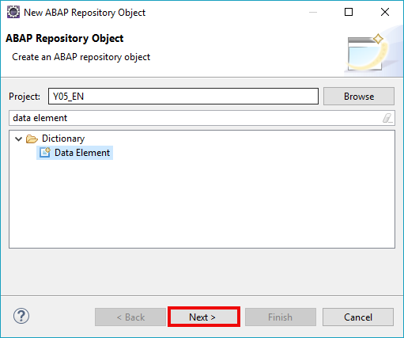

  3.  Create your data element:
     - Name: **`Z_LOCA_DTEL_XXX`**
     - Description: **`Location`**

     Click **Next>**.

      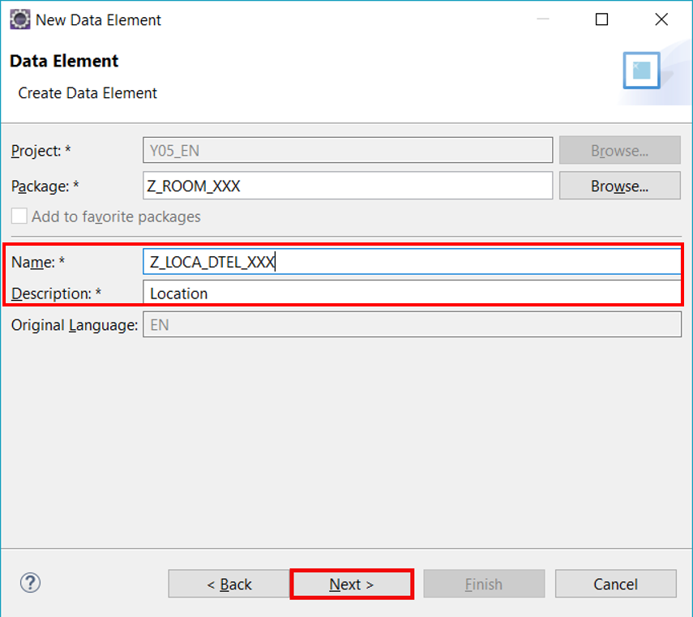

  4. Click **Finish**.

      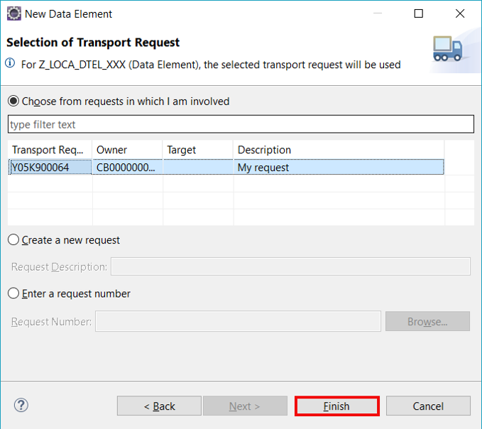

  5. Enhance your data element with following information:
      - Category: Domain
      - Type Name: **`Z_LOCA_DOM_XXX`**

      Save and activate.

      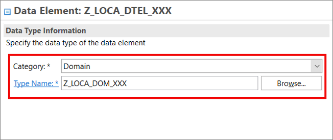

[DONE]
[ACCORDION-END]

[ACCORDION-BEGIN [Step 5: ](Create database table)]
  1. Right-click on **`Z_ROOM_XXX`**, select the menu path **New** > **Other ABAP Repository Object**

      

  2. Search for **Database Table**, select it and click **Next>**.

      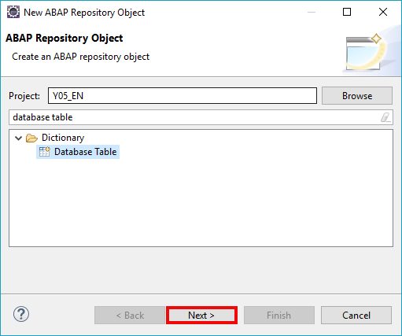

  3.  Create your database table:
     - Name: **`ZROOM_XXX`**
     - Description: **`Room XXX`**

     Click **Next>**.

      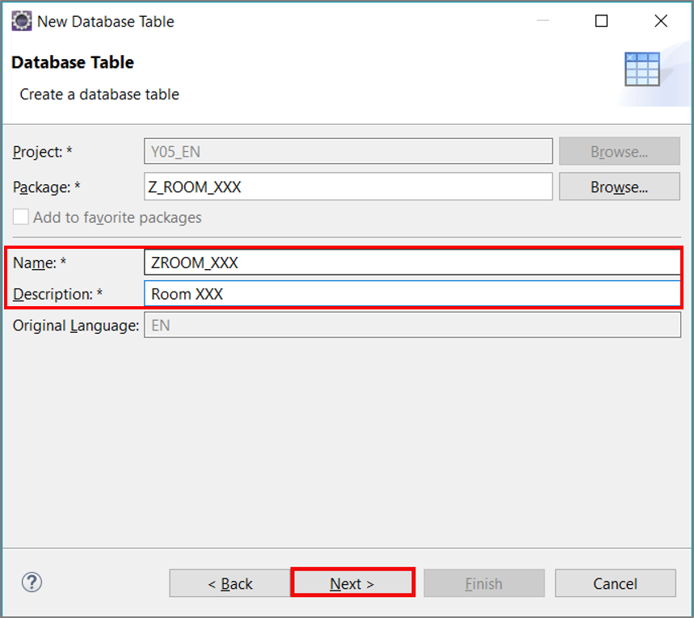

  4. Click **Finish**.

      

  5. Create your data table with following coding:

    ```ABAP
      @EndUserText.label : 'Room XXX'
      @AbapCatalog.enhancementCategory : #NOT_EXTENSIBLE
      @AbapCatalog.tableCategory : #TRANSPARENT
      @AbapCatalog.deliveryClass : #A
      @AbapCatalog.dataMaintenance : #LIMITED
      define table zroom_xxx {
      key client          : abap.clnt not null;
      key id              : abap.char(20) not null;
      @EndUserText.label : 'Seats'
      seats               : abap.dec(3,0);
      location            : z_loca_dtel_xxx;
      hasbeamer           : abap_boolean;
      hasvideo            : abap_boolean;
      userrating          : abap.char(2);
      lastchangeddatetime : tzntstmpl;
      lastchangedbyuser   : syuname;
      }
    ```

      Save and activate.

[DONE]
[ACCORDION-END]

[ACCORDION-BEGIN [Step 6: ](Create data definition)]
  1. Right-click on **`Z_ROOM_XXX`**, select the menu path **New** > **Other ABAP Repository Object**

      

  2. Search for **Data Definition**, select it and click **Next>**.

      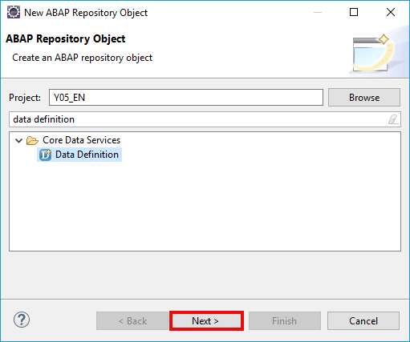

  3.  Create your database table:
     - Name: **`Z_I_ROOM_XXX`**
     - Description: **`Room XXX`**

     Click **Next>**.

      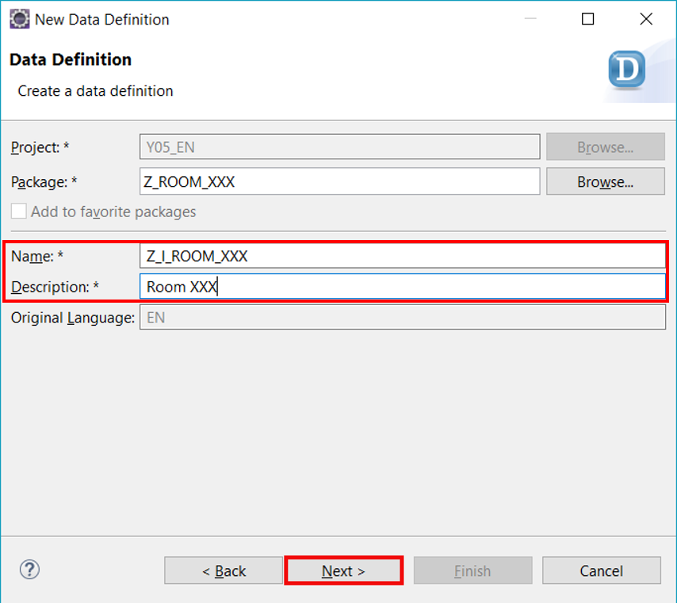

  4. Click **Finish**.

      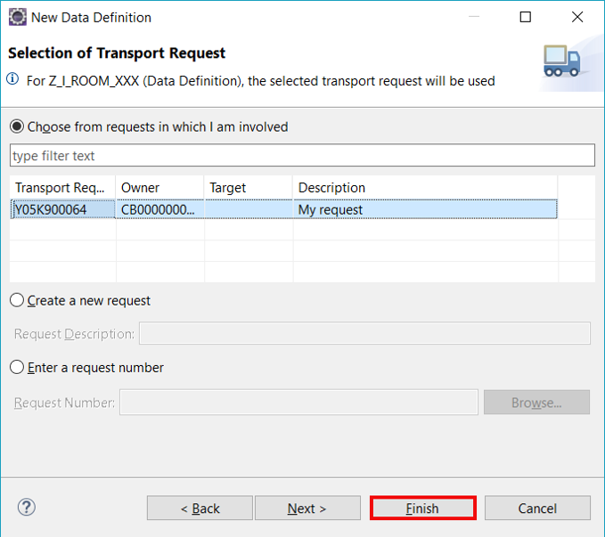

  5. Create your data definition with following coding:

    ```ABAP
      @AbapCatalog.sqlViewName: 'Z_M_ROOM_XXX'
      @AbapCatalog.compiler.compareFilter: true
      @AbapCatalog.preserveKey: true
      @AccessControl.authorizationCheck: #CHECK
      @EndUserText.label: 'Room XXX'
      @Search.searchable
      @UI.headerInfo: { typeName: 'Room', typeNamePlural: 'Rooms' , title : { value: 'ID' } }
      define root view Z_I_ROOM_XXX as select from zroom_xxx as room
      association [0..1] to I_BusinessUser as _SAPSysAdminDataChangeUser on _SAPSysAdminDataChangeUser.UserID = room.lastchangedbyuser
      {
      @UI.facet: [ { type: #COLLECTION, position: 1, id: 'ROOM', label: 'Room'  }, { type: #IDENTIFICATION_REFERENCE, position: 1, parentId: 'ROOM', label: 'General Information'}]
      @EndUserText: { label: 'ID' }
      @Search: { defaultSearchElement: true }
      @UI: { lineItem: [{ position: 1 }], identification: [{ position: 1 }] }
      key room.id,
      @EndUserText: { label: 'Seats' }
      @UI: { lineItem: [{ position: 3 }], identification: [{ position: 2 }] }
      room.seats,
      @EndUserText: { label: 'Location' }
      @UI: { lineItem: [{ position: 4 }], identification: [{ position: 3 }] }
      room.location,
      @EndUserText: { label: 'Has Beamer' }
      @UI: { lineItem: [{ position: 5 }], identification: [{ position: 4 }] }
      room.hasbeamer,
      @EndUserText: { label: 'Has Video' }
      @UI: { lineItem: [{ position: 7 }], identification: [{ position: 5 }] }
      room.hasvideo,
      @EndUserText: { label: 'User Rating' }
      @UI: { lineItem: [{ position: 8 }], identification: [{ position: 6 }] }
      userrating,
      @EndUserText: { label: 'Last Changed On' }
      @UI: { identification: [{ position: 7 }] }
      room.lastchangeddatetime,
      @EndUserText: { label: 'Last Changed By' }
      @UI: { identification: [{ position: 8 }], textArrangement: #TEXT_ONLY }
      room.lastchangedbyuser,
      @UI.hidden: true
      _SAPSysAdminDataChangeUser  
      }
    ```

      Save and activate.


[DONE]
[ACCORDION-END]

[ACCORDION-BEGIN [Step 7: ](Create lock object)]
  1. Right-click on **`Z_ROOM_XXX`**, select the menu path **New** > **Other ABAP Repository Object**

      

  2. Search for **Lock Object**, select it and click **Next>**.

      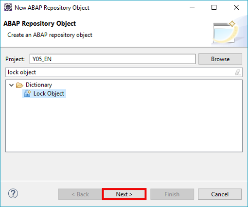

  3.  Create your database table:
     - Name: **`EZROOMXXX`**
     - Description: **`LOCK`**

     Click **Next>**.

      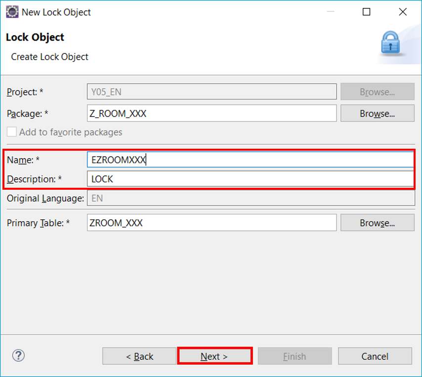

  4. Click **Finish**.

      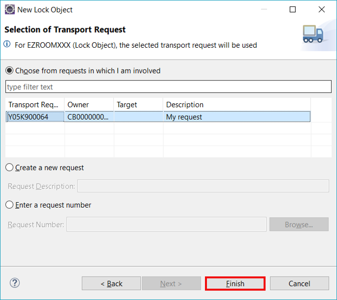

  5. Enhance your lock object with following information:
      - Lock Mode: Write Lock

      Save and activate.

      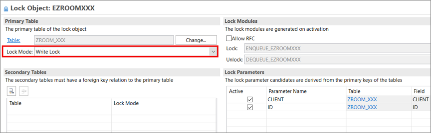

[DONE]
[ACCORDION-END]


[ACCORDION-BEGIN [Step 8: ](Test yourself)]

[VALIDATE_1]
[ACCORDION-END]
