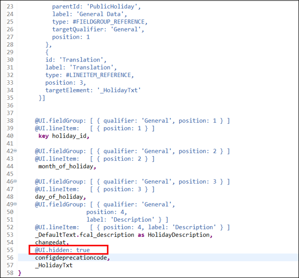
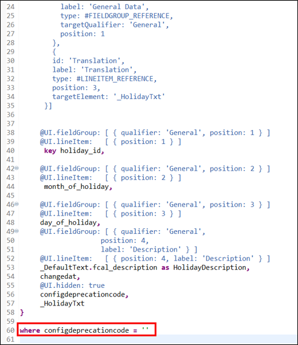
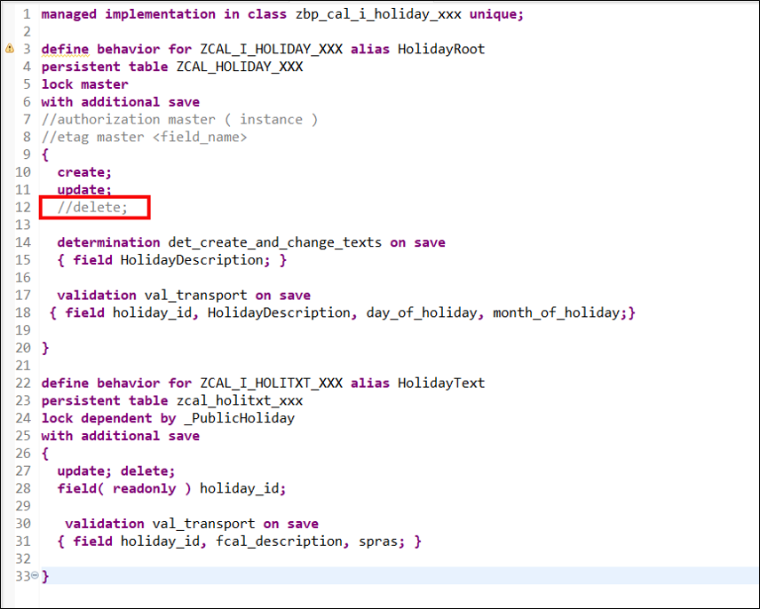
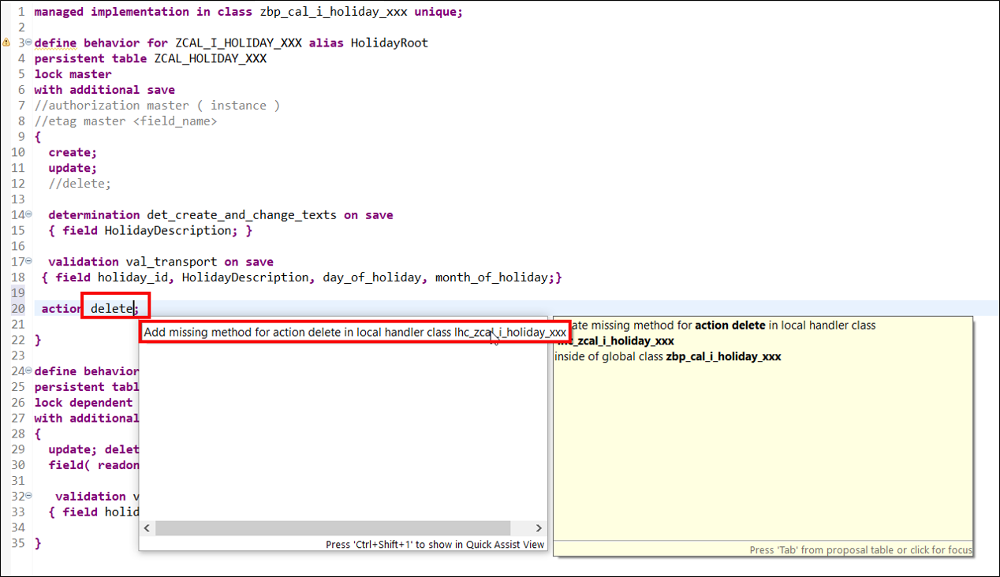
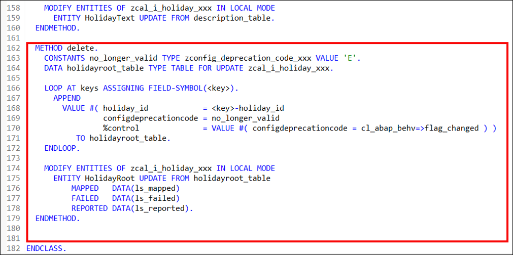
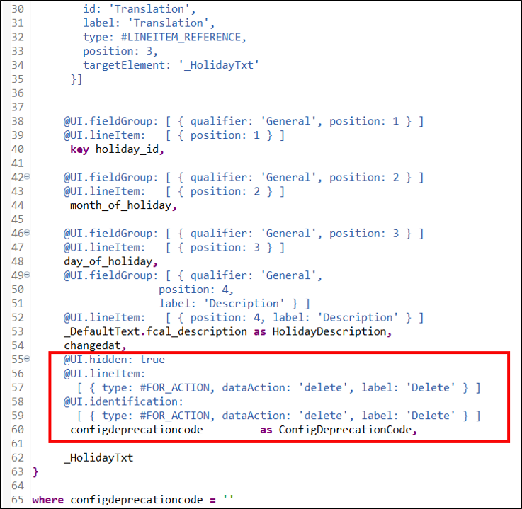
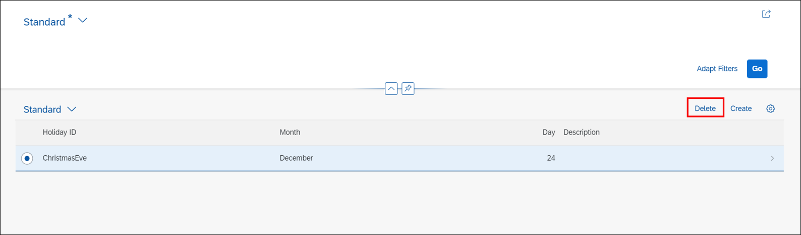

 
## Prerequisites  
- You need an SAP Cloud Platform ABAP Environment [trial user](abap-environment-trial-onboarding) or a license.


## Details
### You will learn  
- How to add delete flag to CDS view
- How to add UI annotation


---
[ACCORDION-BEGIN [Step 1: ](Add delete flag to CDS view)]

  1. Open your CDS view **`ZCAL_HOLIDAY_XXX`** and add following UI annotation:

    ```ABAP
    @UI.hidden: true
    ```

      

  2. Add the where condition at the end of your CDS View **`ZCAL_HOLIDAY_XXX`**:

    ```ABAP
    where configdeprecationcode = ''
    ```

      

      Save and activate.

  3. Open your behavior definition **`ZCAL_I_HOLIDAY_XXX`** and disable the physical deletion.
     Remove the **delete** property from the root node.

      

  4. Add **action delete** to your behavior definition.

    ```ABAP
    action delete;
    ```

  5. Save and activate your behavior definition.
  Set the cursor on the action delete definition and press **CTRL+1**. Click on **Add missing method for action delete in new local handler class** to create your action method.

      

  5. Insert following code as your delete method in **`ZBP_CAL_I_HOLIDAY_XXX`**:

    ```ABAP
    METHOD delete.
      CONSTANTS no_longer_valid TYPE zconfig_deprecation_code_xxx VALUE 'E'.
      DATA holidayroot_table TYPE TABLE FOR UPDATE zcal_i_holiday_xxx.

      LOOP AT keys ASSIGNING FIELD-SYMBOL(<key>).
        APPEND
          VALUE #( holiday_id            = <key>-holiday_id
                   configdeprecationcode = no_longer_valid
                   %control              = VALUE #( configdeprecationcode = cl_abap_behv=>flag_changed ) )
             TO holidayroot_table.
      ENDLOOP.

      MODIFY ENTITIES OF zcal_i_holiday_xxx IN LOCAL MODE
        ENTITY HolidayRoot UPDATE FROM holidayroot_table
            MAPPED   DATA(ls_mapped)
            FAILED   DATA(ls_failed)
            REPORTED DATA(ls_reported).
    ENDMETHOD.
    ```

    

  6. Save and activate.

[DONE]
[ACCORDION-END]

[ACCORDION-BEGIN [Step 2: ](Add UI annotation)]
  1. Go to **`ZCAL_I_HOLIDAY_XXX`** and search for `configdeprecationcode` and add following UI annotations:

    ```ABAP
    @UI.hidden: true
       @UI.lineItem:
         [ { type: #FOR_ACTION, dataAction: 'delete', label: 'Delete' } ]
       @UI.identification:
         [ { type: #FOR_ACTION, dataAction: 'delete', label: 'Delete' } ]
       configdeprecationcode         as ConfigDeprecationCode,
    ```

    

  2.  Check your result.

      


[DONE]
[ACCORDION-END]

[ACCORDION-BEGIN [Step 3: ](Test yourself)]

[VALIDATE_1]
[ACCORDION-END]
---
