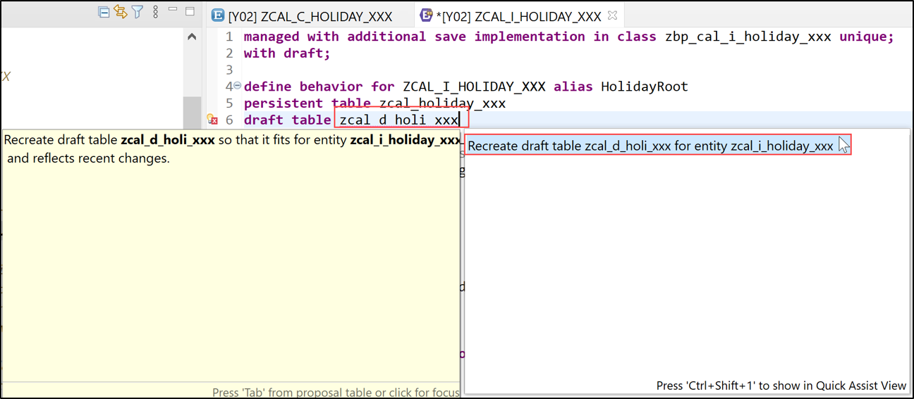
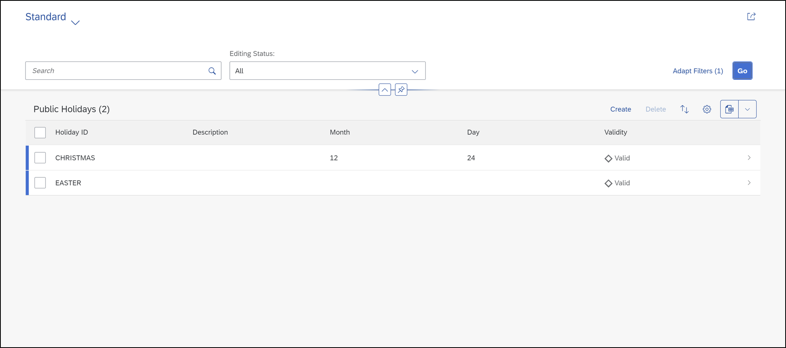
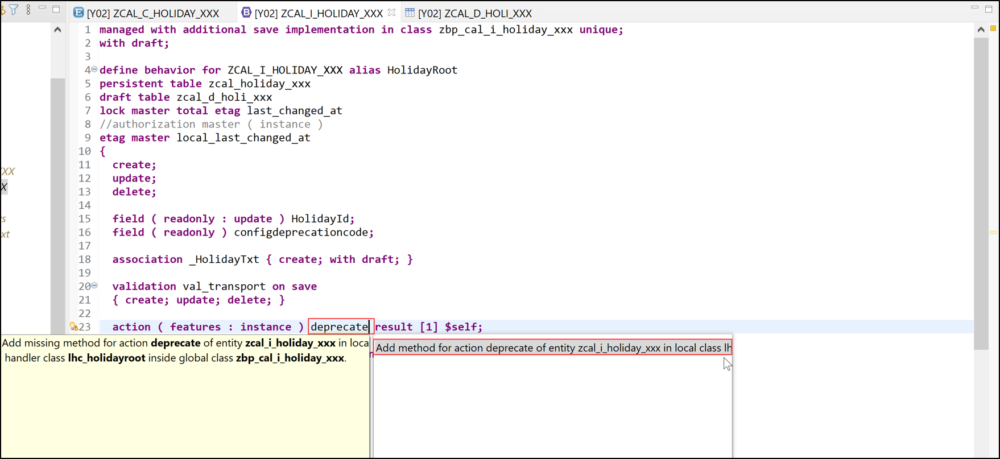
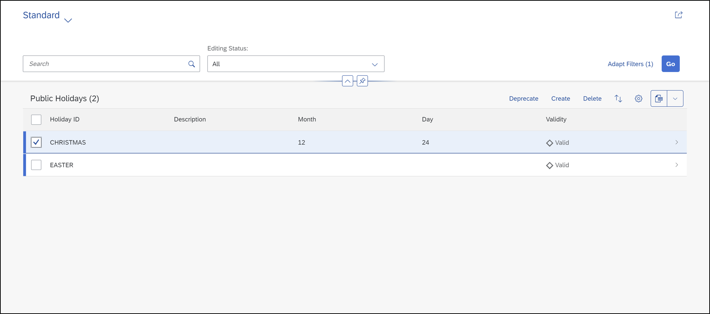
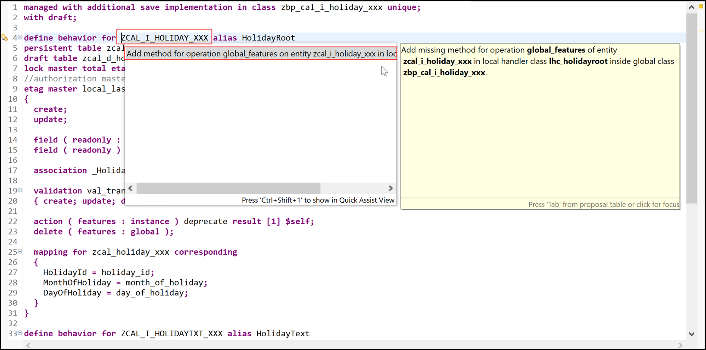

## Prerequisites  
- You need a SAP BTP, ABAP environment license.

## Details
### You will learn  
- How to add deprecation flag to data model
- How to create deprecation action
- How to define global feature control

>**Business configuration deprecation**

>Some configuration entries cannot or may not be physically deleted from a database. This is the case for example if configuration entries such as price tables have already been used in a system and must continue to be referred to. In this case, the deprecation of configuration entries is advisable. Configuration entries are only marked as deprecated on the database without physically deleting them.


---

[ACCORDION-BEGIN [Step 1: ](Add deprecation flag to data model)]

  1. Open database table **`ZCAL_HOLIDAY_XXX`** and add field `configdeprecationcode` of type `config_deprecation_code`

    ```ABAP
    @EndUserText.label : 'CDS View for Public Holidays'
    @AbapCatalog.enhancement.category : #NOT_EXTENSIBLE
    @AbapCatalog.tableCategory : #TRANSPARENT
    @AbapCatalog.deliveryClass : #C
    @AbapCatalog.dataMaintenance : #RESTRICTED
    define table zcal_holiday_xxx {
      key client            : mandt not null;
      key holiday_id        : zcal_holiday_id_xxx not null;
      month_of_holiday      : zcal_month_xxx;
      day_of_holiday        : zcal_day_xxx;
      last_changed_at       : timestampl;
      local_last_changed_at : timestampl;
      configdeprecationcode : config_deprecation_code;
    }
    ```

  2. Save and activate.

  3. Open CDS view **`ZCAL_I_HOLIDAY_XXX`** and add field `configdeprecationcode` and calculated field `criticality`. Create an association to the text view `I_ConfignDeprecationCodeText`.

    ```ABAP
    @AccessControl.authorizationCheck: #CHECK
    @EndUserText.label: 'CDS View for public holidays'
    define root view entity ZCAL_I_HOLIDAY_XXX
      as select from zcal_holiday_xxx
      composition [0..*] of ZCAL_I_HOLIDAYTXT_XXX           as _HolidayTxt
      association [0..*] to I_ConfignDeprecationCodeText as _DeprecationText on _DeprecationText.ConfigurationDeprecationCode = $projection.configdeprecationcode
    {
      key holiday_id       as HolidayId,
          @Semantics.calendar.month: true
          month_of_holiday as MonthOfHoliday,
          @Semantics.calendar.dayOfMonth: true
          day_of_holiday   as DayOfHoliday,
          @Semantics.systemDateTime.lastChangedAt: true
          last_changed_at,
          @Semantics.systemDateTime.localInstanceLastChangedAt: true
          local_last_changed_at,
          configdeprecationcode,
          case when configdeprecationcode = 'W' then 2
               when configdeprecationcode = 'E' then 1
               else 3
          end              as criticality,
          _HolidayTxt,
          _DeprecationText
    }
    ```

  4. Save and activate.

  5. Open projection view **`ZCAL_C_HOLIDAY_XXX`** and add fields `configdeprecationcode`, `criticality` and `DeprecationDescription`. Annotate the latter as the text element for `configdeprecationcode`.

    ```ABAP
    @EndUserText.label: 'Projection view for public holidays'
    @AccessControl.authorizationCheck: #CHECK
    @Metadata.allowExtensions: true
    define root view entity ZCAL_C_HOLIDAY_XXX
      provider contract transactional_query
      as projection on ZCAL_I_HOLIDAY_XXX
    {
      key HolidayId,
          MonthOfHoliday,
          DayOfHoliday,
          _HolidayTxt.HolidayDescription              as HolidayDescription     : localized,
          _DeprecationText.ConfignDeprecationCodeName as DeprecationDescription : localized,
          @ObjectModel.text.element:['DeprecationDescription']
          configdeprecationcode,
          criticality,
          last_changed_at,
          local_last_changed_at,
          _HolidayTxt : redirected to composition child ZCAL_C_HOLIDAYTXT_XXX
    }
    ```

  6. Save and activate.

  7. Open metadata extension **`ZCAL_C_HOLIDAY_XXX`** and add field `configdeprecationcode` to the facet and hide field `criticality` and `DeprecationDescription`.

    ```ABAP
    @Metadata.layer: #CORE
    @Search.searchable: true
    @UI: {
      headerInfo: { typeName: 'Public Holiday',
                    typeNamePlural: 'Public Holidays',
                    title: { type: #STANDARD, label: 'Public Holiday', value: 'HolidayId' } },
      presentationVariant: [{ sortOrder: [{ by: 'HolidayId', direction:  #ASC }] }] }
    annotate view ZCAL_C_HOLIDAY_XXX with
    {
      @UI.facet: [
        {
          id: 'PublicHoliday',
          purpose: #STANDARD,
          label: 'Public Holiday',
          type: #IDENTIFICATION_REFERENCE,
          position: 1
        },
        {
          id: 'Description',
          label: 'Description',
          type: #LINEITEM_REFERENCE,
          position: 2,
          targetElement: '_HolidayTxt'
         }
        ]

      @UI: {  identification: [ { position: 1 } ],
              lineItem:       [ { position: 1 } ] }
      @Search.defaultSearchElement: true
      HolidayId;
      @UI: {  identification: [ { position: 2, hidden: true } ],
              lineItem:       [ { position: 2 } ] }
      HolidayDescription;
      @UI: {  identification: [ { position: 3 } ],
              lineItem:       [ { position: 3 } ] }
      MonthOfHoliday;
      @UI: {  identification: [ { position: 4 } ],
              lineItem:       [ { position: 4 } ] }
      DayOfHoliday;
      @UI.hidden: true
      last_changed_at;
      @UI.hidden: true
      local_last_changed_at;

      @UI: {  identification: [ { position: 5, criticality: 'criticality' } ],
            lineItem:       [ { position: 5, criticality: 'criticality' } ] }
      configdeprecationcode;
      @UI.hidden: true
      criticality;
      @UI.hidden: true
      DeprecationDescription;
    }
    ```

  8. Save and activate.

  9. Open behavior definition **`ZCAL_I_HOLIDAY_XXX`** and set `configdeprecationcode` to read only for the `HolidayRoot` entity.

    ```ABAP
    managed with additional save implementation in class zbp_cal_i_holiday_xxx unique;
    with draft;

    define behavior for ZCAL_I_HOLIDAY_XXX alias HolidayRoot
    persistent table zcal_holiday_xxx
    draft table zcal_d_holi_xxx
    lock master total etag last_changed_at
    //authorization master ( instance )
    etag master local_last_changed_at
    {
      create;
      update;
      delete;

      field ( readonly : update ) HolidayId;
      field ( readonly ) configdeprecationcode;

      association _HolidayTxt { create; with draft; }

      validation val_transport on save
      { create; update; delete; }

      mapping for zcal_holiday_xxx corresponding
      {
        HolidayId = holiday_id;
        MonthOfHoliday = month_of_holiday;
        DayOfHoliday = day_of_holiday;
      }
    }

    define behavior for ZCAL_I_HOLIDAYTXT_XXX alias HolidayText
    persistent table zcal_holitxt_xxx
    draft table zcal_d_holit_xxx
    etag dependent by _Public_Holiday
    lock dependent by _Public_Holiday
    {
      update;
      delete;
      field ( readonly : update ) HolidayId;
      field ( readonly : update ) Language;

      association _Public_Holiday { with draft; }

      validation val_transport on save
      { create; update; delete; }

      mapping for zcal_holitxt_xxx corresponding
      {
        Language = spras;
        HolidayId = holiday_id;
        HolidayDescription = fcal_description;
      }
    }
    ```

 10. Place the cursor on **`zcal_d_holiday_xxx`** and use the quick assist (CTRL+1) to adjust the draft table. Save and activate the draft table.

     

 11. Save and activate the draft table.

 12. Go back to your behavior definition, save and activate it.

 13. Check your result. The app now shows the deprecation status under label `Validity` alongside a semaphore icon plus description in the logon language, but a function to change the status still needs to be added.

      

[DONE]
[ACCORDION-END]

[ACCORDION-BEGIN [Step 2: ](Create deprecation action)]

This step explains the [creation of UI actions](https://help.sap.com/viewer/923180ddb98240829d935862025004d6/Cloud/en-US/2553c7347f43431baa68efec360fe062.html). This is needed to change the validity status.

  1. Open behavior definition **`ZCAL_I_HOLIDAY_XXX`** and add action `deprecate` to entity `HolidayRoot`.

    ```ABAP
    managed with additional save implementation in class zbp_cal_i_holiday_xxx unique;
    with draft;

    define behavior for ZCAL_I_HOLIDAY_XXX alias HolidayRoot
    persistent table zcal_holiday_xxx
    draft table zcal_d_holi_xxx
    lock master total etag last_changed_at
    //authorization master ( instance )
    etag master local_last_changed_at
    {
      create;
      update;
      delete;

      field ( readonly : update ) HolidayId;
      field ( readonly ) configdeprecationcode;

      association _HolidayTxt { create; with draft; }

      validation val_transport on save
      { create; update; delete; }

      action ( features : instance ) deprecate result [1] $self;

      mapping for zcal_holiday_xxx corresponding
      {
        HolidayId = holiday_id;
        MonthOfHoliday = month_of_holiday;
        DayOfHoliday = day_of_holiday;
      }
    }

    define behavior for ZCAL_I_HOLIDAYTXT_XXX alias HolidayText
    persistent table zcal_holitxt_xxx
    draft table zcal_d_holit_xxx
    etag dependent by _Public_Holiday
    lock dependent by _Public_Holiday
    {
      update;
      delete;
      field ( readonly : update ) HolidayId;
      field ( readonly : update ) Language;

      association _Public_Holiday { with draft; }

      validation val_transport on save
      { create; update; delete; }

      mapping for zcal_holitxt_xxx corresponding
      {
        Language = spras;
        HolidayId = holiday_id;
        HolidayDescription = fcal_description;
      }
    }
    ```

  2. Save and activate the behavior definition **`ZCAL_I_HOLIDAY_XXX`**.

  3. Place the cursor on `deprecate` and press CTRL+1 to add the missing method.

    

  4. In your implementation class **`ZBP_CAL_I_HOLIDAY_XXX`** add missing `deprecate` method.

    ```ABAP
    CLASS lsc_zcal_i_holiday_xxx DEFINITION INHERITING FROM cl_abap_behavior_saver.

      PROTECTED SECTION.

        METHODS save_modified REDEFINITION.

    ENDCLASS.

    CLASS lsc_zcal_i_holiday_xxx IMPLEMENTATION.

      METHOD save_modified.
      zcl_bc_transport_api_f_xxx=>get_transport_api( use_table_scomp_transport = abap_false )->transport(
          table_entity_relations = VALUE #( ( table = 'ZCAL_HOLIDAY_XXX'    entity = 'HOLIDAYROOT' )
                                            ( table = 'ZCAL_HOLITXT_XXX'    entity = 'HOLIDAYTEXT' ) )
          create                 = REF #( create )
          update                 = REF #( update )
          delete                 = REF #( delete )
      ).
      ENDMETHOD.

    ENDCLASS.

    CLASS lhc_holidaytext DEFINITION INHERITING FROM cl_abap_behavior_handler.

      PRIVATE SECTION.

        METHODS val_transport FOR VALIDATE ON SAVE
          IMPORTING keys FOR HolidayText~val_transport.

    ENDCLASS.

    CLASS lhc_holidaytext IMPLEMENTATION.

      METHOD val_transport.
        DATA create TYPE TABLE FOR CREATE zcal_i_holidaytxt_xxx.
        zcl_bc_transport_api_f_xxx=>get_transport_api( use_table_scomp_transport = abap_false )->validate(
            table_entity_relation = VALUE #( table = 'ZCAL_HOLITXT_XXX' entity = 'HOLIDAYTEXT' )
            keys                  = REF #( keys )
            reported              = REF #( reported )
            failed                = REF #( failed )
            create                = REF #( create )
        ).
      ENDMETHOD.

    ENDCLASS.

    CLASS lhc_HolidayRoot DEFINITION INHERITING FROM cl_abap_behavior_handler.
      PRIVATE SECTION.

       CONSTANTS:
        BEGIN OF config_code,
          valid    TYPE config_deprecation_code VALUE '',
          obsolete TYPE config_deprecation_code VALUE 'W',
          not_valid TYPE config_deprecation_code VALUE 'E',
        END OF config_code.

        METHODS get_instance_features FOR INSTANCE FEATURES
          IMPORTING keys REQUEST requested_features FOR HolidayRoot RESULT result.
        METHODS val_transport FOR VALIDATE ON SAVE
          IMPORTING keys FOR holidayroot~val_transport.
        METHODS deprecate FOR MODIFY
          IMPORTING keys FOR ACTION holidayroot~deprecate RESULT result.

    ENDCLASS.

    CLASS lhc_HolidayRoot IMPLEMENTATION.

      METHOD get_instance_features.
      READ ENTITIES OF zcal_i_holiday_xxx IN LOCAL MODE
      ENTITY HolidayRoot
        FIELDS ( configdeprecationcode ) WITH CORRESPONDING #( keys )
      RESULT DATA(holidays)
      FAILED failed.

      result =
        VALUE #(
          FOR holiday IN holidays
            LET deprecate =  COND #( WHEN holiday-configdeprecationcode = config_code-valid
                                      THEN if_abap_behv=>fc-o-enabled
                                      ELSE if_abap_behv=>fc-o-disabled  )
            IN
              ( %tky                 = holiday-%tky
                %action-deprecate = deprecate
               ) ).
      ENDMETHOD.

      METHOD val_transport.
        DATA create TYPE TABLE FOR CREATE zcal_i_holiday_xxx.
        zcl_bc_transport_api_f_xxx=>get_transport_api( use_table_scomp_transport = abap_false )->validate(
            table_entity_relation = VALUE #( table = 'ZCAL_HOLIDAY_XXX' entity = 'HOLIDAYROOT' )
            keys                  = REF #( keys )
            reported              = REF #( reported )
            failed                = REF #( failed )
            create                = REF #( create )
        ).
      ENDMETHOD.

      METHOD deprecate.
       MODIFY ENTITIES OF zcal_i_holiday_xxx IN LOCAL MODE
      ENTITY HolidayRoot
         UPDATE
           FIELDS ( configdeprecationcode )
           WITH VALUE #( FOR key IN keys
                           ( %tky         = key-%tky
                             configdeprecationcode = config_code-obsolete ) )
      FAILED failed
      REPORTED reported.

      READ ENTITIES OF zcal_i_holiday_xxx IN LOCAL MODE
        ENTITY HolidayRoot
          ALL FIELDS WITH CORRESPONDING #( keys )
        RESULT DATA(holidays).

      result = VALUE #( FOR holiday IN holidays
                          ( %tky   = holiday-%tky
                            %param = holiday ) ).
      ENDMETHOD.

    ENDCLASS.
    ```

  5. Save and activate the implementation class **`ZBP_CAL_I_HOLIDAY_XXX`**.

  6. Open behavior projection **`ZCAL_C_HOLIDAY_XXX`** and add action `deprecate` to entity `HolidayRoot`.

    ```ABAP
    projection implementation in class zbp_cal_c_holiday_xxx unique;
    use draft;

    define behavior for ZCAL_C_HOLIDAY_XXX alias HolidayRoot
    use etag
    {
      use create(augment);
      use update(augment);
      use delete;

      use association _HolidayTxt { create; with draft; }
      use action deprecate;

      field ( modify ) HolidayDescription;
    }

    define behavior for ZCAL_C_HOLIDAYTXT_XXX alias HolidayText
    use etag
    {
      use update;
      use delete;

      use association _Public_Holiday { with draft; }
    }
    ```

  7. Save and activate.

  8. Open metadata extension **`ZCAL_C_HOLIDAY_XXX`** and add the `#FOR_ACTION` annotation for field `configdeprecationcode`.

    ```ABAP
    @Metadata.layer: #CORE
    @Search.searchable: true
    @UI: {
      headerInfo: { typeName: 'Public Holiday',
                    typeNamePlural: 'Public Holidays',
                    title: { type: #STANDARD, label: 'Public Holiday', value: 'HolidayId' } },
      presentationVariant: [{ sortOrder: [{ by: 'HolidayId', direction:  #ASC }] }] }
    annotate view ZCAL_C_HOLIDAY_XXX with
    {
      @UI.facet: [
        {
          id: 'PublicHoliday',
          purpose: #STANDARD,
          label: 'Public Holiday',
          type: #IDENTIFICATION_REFERENCE,
          position: 1
        },
        {
          id: 'Description',
          label: 'Description',
          type: #LINEITEM_REFERENCE,
          position: 2,
          targetElement: '_HolidayTxt'
         }
        ]

      @UI: {  identification: [ { position: 1 } ],
              lineItem:       [ { position: 1 } ] }
      @Search.defaultSearchElement: true
      HolidayId;
      @UI: {  identification: [ { position: 2, hidden: true } ],
              lineItem:       [ { position: 2 } ] }
      HolidayDescription;
      @UI: {  identification: [ { position: 3 } ],
              lineItem:       [ { position: 3 } ] }
      MonthOfHoliday;
      @UI: {  identification: [ { position: 4 } ],
              lineItem:       [ { position: 4 } ] }
      DayOfHoliday;
      @UI.hidden: true
      last_changed_at;
      @UI.hidden: true
      local_last_changed_at;
      @UI: {  identification: [ { position: 5, criticality: 'criticality' },
                              { type: #FOR_ACTION, dataAction: 'deprecate', label: 'Deprecate' } ],
            lineItem:       [ { position: 5, criticality: 'criticality' },
                              { type: #FOR_ACTION, dataAction: 'deprecate', label: 'Deprecate' } ] }
      configdeprecationcode;
      @UI.hidden: true
      criticality;
      @UI.hidden: true
      DeprecationDescription;
    }
    ```

  9. Save and activate.

 10. The app has now a new **Deprecate**  action. The action is active/inactive according to the selected item. Via this action you can switch the **Validity** value from **Valid** to **Obsolete**.

    

[DONE]
[ACCORDION-END]

[ACCORDION-BEGIN [Step 3: ](Define global feature control)]
You can define global [feature control](https://help.sap.com/viewer/923180ddb98240829d935862025004d6/Cloud/en-US/a5055eef86fa492d99a29b3a9c7c2b88.html) for feature control that doesn't depend on the business object instance, but external factors like specific user settings or the business scope.

As an example we will unconditionally de-activate the action **Delete** to prevent the physical deletion of configuration.

>HINT: The same can be achieved by removing the action from the Behavior Definition.
However by defining a global feature you can implement your own logic when the physical deletion of a configuration entry is possible or not.

  1. Open behavior definition **`ZCAL_I_HOLIDAY_XXX`** and add the annotation `features : global` to the action `delete` for entity `HolidayRoot`:

    ```ABAP
    managed with additional save implementation in class zbp_cal_i_holiday_xxx unique;
    with draft;

    define behavior for ZCAL_I_HOLIDAY_XXX alias HolidayRoot
    persistent table zcal_holiday_xxx
    draft table zcal_d_holi_xxx
    lock master total etag last_changed_at
    //authorization master ( instance )
    etag master local_last_changed_at
    {
      create;
      update;

      field ( readonly : update ) HolidayId;
      field ( readonly ) configdeprecationcode;

      association _HolidayTxt { create; with draft; }

      validation val_transport on save
      { create; update; delete; }

      action ( features : instance ) deprecate result [1] $self;
      delete ( features : global );

      mapping for zcal_holiday_xxx corresponding
      {
        HolidayId = holiday_id;
        MonthOfHoliday = month_of_holiday;
        DayOfHoliday = day_of_holiday;
      }
    }

    define behavior for ZCAL_I_HOLIDAYTXT_XXX alias HolidayText
    persistent table zcal_holitxt_xxx
    draft table zcal_d_holit_xxx
    etag dependent by _Public_Holiday
    lock dependent by _Public_Holiday
    {
      update;
      delete;
      field ( readonly : update ) HolidayId;
      field ( readonly : update ) Language;

      association _Public_Holiday { with draft; }

      validation val_transport on save
      { create; update; delete; }

      mapping for zcal_holitxt_xxx corresponding
      {
        Language = spras;
        HolidayId = holiday_id;
        HolidayDescription = fcal_description;
      }
    }
    ```

  2. Save and activate.

  3. Place the cursor on **`ZCAL_I_HOLIDAY_XXX`** and press **CTRL+1** to add a method `get_global_features` to behavior implementation **`ZBP_CAL_I_HOLIDAY_XXX`**.

      

  4. Implement **method `get_global_features`** in local types of the implementation class **`ZBP_CAL_I_HOLIDAY_XXX`**.

    ```ABAP
    CLASS lsc_zcal_i_holiday_xxx DEFINITION INHERITING FROM cl_abap_behavior_saver.

      PROTECTED SECTION.

        METHODS save_modified REDEFINITION.

    ENDCLASS.

    CLASS lsc_zcal_i_holiday_xxx IMPLEMENTATION.

      METHOD save_modified.
      zcl_bc_transport_api_f_xxx=>get_transport_api( use_table_scomp_transport = abap_false )->transport(
          table_entity_relations = VALUE #( ( table = 'ZCAL_HOLIDAY_XXX'    entity = 'HOLIDAYROOT' )
                                            ( table = 'ZCAL_HOLITXT_XXX'    entity = 'HOLIDAYTEXT' ) )
          create                 = REF #( create )
          update                 = REF #( update )
          delete                 = REF #( delete )
      ).
      ENDMETHOD.

    ENDCLASS.

    CLASS lhc_holidaytext DEFINITION INHERITING FROM cl_abap_behavior_handler.

      PRIVATE SECTION.

        METHODS val_transport FOR VALIDATE ON SAVE
          IMPORTING keys FOR HolidayText~val_transport.

    ENDCLASS.

    CLASS lhc_holidaytext IMPLEMENTATION.

      METHOD val_transport.
        DATA create TYPE TABLE FOR CREATE zcal_i_holidaytxt_xxx.
        zcl_bc_transport_api_f_xxx=>get_transport_api( use_table_scomp_transport = abap_false )->validate(
            table_entity_relation = VALUE #( table = 'ZCAL_HOLITXT_XXX' entity = 'HOLIDAYTEXT' )
            keys                  = REF #( keys )
            reported              = REF #( reported )
            failed                = REF #( failed )
            create                = REF #( create )
        ).
      ENDMETHOD.

    ENDCLASS.

    CLASS lhc_HolidayRoot DEFINITION INHERITING FROM cl_abap_behavior_handler.
      PRIVATE SECTION.

       CONSTANTS:
        BEGIN OF config_code,
          valid    TYPE config_deprecation_code VALUE '',
          obsolete TYPE config_deprecation_code VALUE 'W',
          not_valid TYPE config_deprecation_code VALUE 'E',
        END OF config_code.

        METHODS get_instance_features FOR INSTANCE FEATURES
          IMPORTING keys REQUEST requested_features FOR HolidayRoot RESULT result.
        METHODS val_transport FOR VALIDATE ON SAVE
          IMPORTING keys FOR holidayroot~val_transport.
        METHODS deprecate FOR MODIFY
          IMPORTING keys FOR ACTION holidayroot~deprecate RESULT result.
        METHODS get_global_features FOR GLOBAL FEATURES
          IMPORTING REQUEST requested_features FOR holidayroot RESULT result.

    ENDCLASS.

    CLASS lhc_HolidayRoot IMPLEMENTATION.

      METHOD get_instance_features.
      READ ENTITIES OF zcal_i_holiday_xxx IN LOCAL MODE
      ENTITY HolidayRoot
        FIELDS ( configdeprecationcode ) WITH CORRESPONDING #( keys )
      RESULT DATA(holidays)
      FAILED failed.

      result =
        VALUE #(
          FOR holiday IN holidays
            LET deprecate =  COND #( WHEN holiday-configdeprecationcode = config_code-valid
                                      THEN if_abap_behv=>fc-o-enabled
                                      ELSE if_abap_behv=>fc-o-disabled  )
            IN
              ( %tky                 = holiday-%tky
                %action-deprecate = deprecate
               ) ).
      ENDMETHOD.

      METHOD val_transport.
        DATA create TYPE TABLE FOR CREATE zcal_i_holiday_xxx.
        zcl_bc_transport_api_f_xxx=>get_transport_api( use_table_scomp_transport = abap_false )->validate(
            table_entity_relation = VALUE #( table = 'ZCAL_HOLIDAY_XXX' entity = 'HOLIDAYROOT' )
            keys                  = REF #( keys )
            reported              = REF #( reported )
            failed                = REF #( failed )
            create                = REF #( create )
        ).
      ENDMETHOD.

      METHOD deprecate.
       MODIFY ENTITIES OF zcal_i_holiday_xxx IN LOCAL MODE
      ENTITY HolidayRoot
         UPDATE
           FIELDS ( configdeprecationcode )
           WITH VALUE #( FOR key IN keys
                           ( %tky         = key-%tky
                             configdeprecationcode = config_code-obsolete ) )
      FAILED failed
      REPORTED reported.

      READ ENTITIES OF zcal_i_holiday_xxx IN LOCAL MODE
        ENTITY HolidayRoot
          ALL FIELDS WITH CORRESPONDING #( keys )
        RESULT DATA(holidays).

      result = VALUE #( FOR holiday IN holidays
                          ( %tky   = holiday-%tky
                            %param = holiday ) ).
      ENDMETHOD.

      METHOD get_global_features.
         result = VALUE #( %delete = if_abap_behv=>fc-o-disabled ).
      ENDMETHOD.

    ENDCLASS.
    ```

  5. Save and activate.

  The action **Delete** is no longer active, but you are still able to deprecate the configuration object.

[DONE]
[ACCORDION-END]

[ACCORDION-BEGIN [Step 4: ](Test yourself)]

[VALIDATE_1]
[ACCORDION-END]
---
