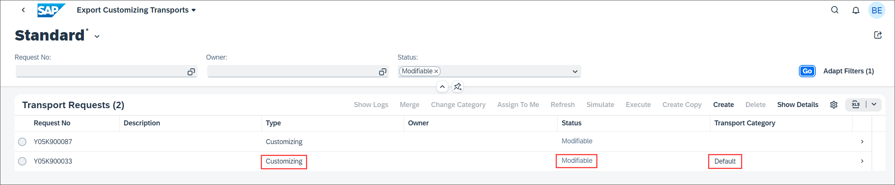
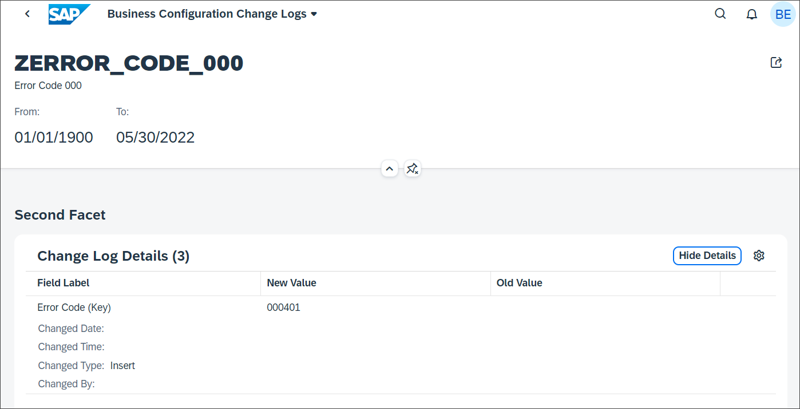

## Prerequisites  
- You need an SAP BTP, ABAP environment [trial user](abap-environment-trial-onboarding) or a license.
- Install [ABAP Development Tools](https://tools.hana.ondemand.com/#abap). You can also follow **step 1** of this [tutorial](abap-install-adt) to install ADT.

## Details
### You will learn  
- How to maintain business configurations

The [**Maintain Business Configurations**](https://help.sap.com/viewer/65de2977205c403bbc107264b8eccf4b/Cloud/en-US/76384d8e68e646d6ae5ce8977412cbb4.html) app serves as an entry point to the configuration objects provided by different applications or partners. You can use the app to adjust these configuration objects to change and influence the system behavior.

The required business catalog is contained in business role template `SAP_BR_BPC_EXPERT (Configuration Expert - Business Process Configuration)`. Ensure the user responsible for maintaining the error codes has this role assigned.

>**Hint:** The trial user in SAP BTP ABAP trial system already has the required catalog.

> Don't forget to replace all occurrences of the placeholder ### with your ID of choice in the exercise steps below. You can use the ADT function Replace All (`CTRL+F`) for the purpose.

---
[ACCORDION-BEGIN [Step 1: ](Maintain business configurations)]

  1. Start the Fiori Launchpad. Or right-click on your ABAP system and select **Properties**.

  2. Select **ABAP Development** and click on the system URL.

  3. Logon with the user responsible for maintaining the error codes.

  4. Select **Maintain Business Configurations** tile.

      

  5. Select your business configuration.

      

  6. Click **Edit**.

      

  7. Enter the following:
     - Error Code: **`401`**
     - Text: **`Unauthorized`**

     

     Click **Add Row**.

  8. Click **Save**.

     

  9. You get an error message. The transport request is missing. Click **Close**.

      

10. Click on **Select Transport**.

    

11. If a Task of a modifiable Transport Request is assigned to your user, you can select the Transport Request and proceed with saving. If not you need to create a new one first.

    

12. To create a transport request, return to the Fiori Launchpad Home Page and select the [**Export Customizing Transports**](https://help.sap.com/viewer/65de2977205c403bbc107264b8eccf4b/Cloud/en-US/fa7366c3888848bd94566104ac52e627.html) tile.

     

13. Click **Create**.

     

14. Create a transport request:
    - Description: **`New Error Codes ###`**
    - Technical Type: **`Customizing Request`**

    Click **Create**.

15. If you get an error message that there is already a default transport request, click **Cancel** and go back and search for the default customizing request.

    

16. Select the default transport request and create a new task for your user.

    

17. Create new task:
    - Description: **`New Error Codes`**
    - Owner: **`<User responsible for maintaining error codes>`**

    

    Click **Create**.

18. Back in the **Maintain Business Configurations** app click again on the **Select Transport** action. Use the input help to select a Transport Request and click **OK** and then click **Select Transport**. The selected Transport Request is now shown in the section **Transport**. If you miss a Transport Request, try to refresh the **Maintain Business Configurations** app.

    

19. Click **Save**. The data has been recorded on the transport request.

20. If you have activated `Log Changes` for the database table, you can start the **Business Configuration Change Logs** app to see the change log

    

- If you don't have a SAP BTP, ABAP environment license you can disable the transport recording. Edit class `ZBP_I_ERRORCODE###_S`, section **Local Types**. Delete the content of the following methods. Activate the class afterwards.
    - `LSC_ZI_ERRORCODE###_S→SAVE_MODIFIED`
    - `LHC_ZI_ERRORCODE###→VALIDATERECORDCHANGES`
    - `LHC_ZI_ERRORCODE###TEXT→VALIDATERECORDCHANGES`        

- You can manage your customizing transports with the [**Export Customizing Transport**](https://help.sap.com/viewer/65de2977205c403bbc107264b8eccf4b/Cloud/en-US/fa7366c3888848bd94566104ac52e627.html) app
- Business Configuration content can be recorded on both software components of type `Business Configuration` or `Development`. The former is recommended, see also [Business Configuration for SAP Cloud Platform ABAP Environment | SAP Blogs](https://blogs.sap.com/2019/12/20/business-configuration-for-sap-cloud-platform-abap-environment/). The transport request must have the attribute `SAP_ATO_TRANSPORT_TYPE` set to `BC` and the attribute `SAP_CUS_TRANSPORT_CATEGORY` set to `DEFAULT_CUST` or `MANUAL_CUST`.

[DONE]
[ACCORDION-END]

[ACCORDION-BEGIN [Step 2: ](Test yourself)]

[VALIDATE_1]
[ACCORDION-END]
---
