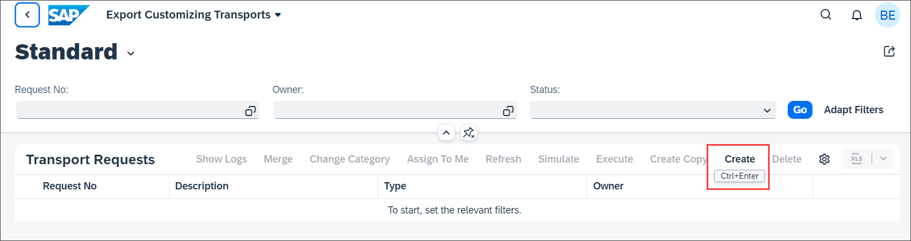
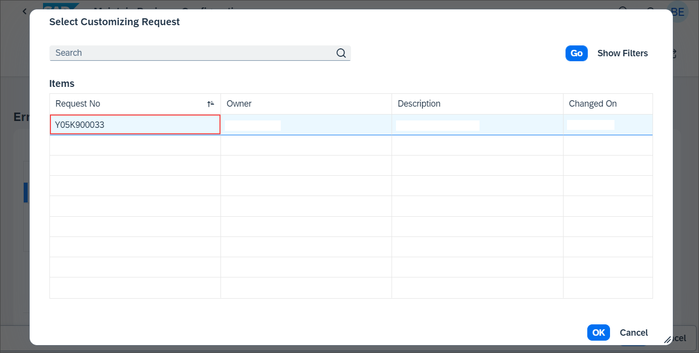

## Prerequisites  
- You need an SAP BTP, ABAP environment [trial user](abap-environment-trial-onboarding) or a license.
- Install [ABAP Development Tools](https://tools.hana.ondemand.com/#abap). You can also follow **step 1** of this [tutorial](abap-install-adt) to install ADT.

## Details
### You will learn  
- How to maintain business configurations

The [Maintain Business Configurations](https://help.sap.com/viewer/65de2977205c403bbc107264b8eccf4b/Cloud/en-US/76384d8e68e646d6ae5ce8977412cbb4.html) app serves as an entry point to the configuration objects provided by different applications or partners. You can use the app to adjust these configuration objects to change and influence the system behavior.

The required business catalog is contained in business role template `SAP_BR_BPC_EXPERT (Configuration Expert - Business Process Configuration)`.

>**Hint:** The trial user in SAP BTP ABAP trial system already has the required catalog.

> Don't forget to replace all occurrences of the placeholder ### with your ID of choice in the exercise steps below. You can use the ADT function Replace All (`CTRL+F`) for the purpose.

---
[ACCORDION-BEGIN [Step 1: ](Maintain business configurations)]

  1. Right-click on your ABAP system and select **Properties**.

     

  2. Select **ABAP Development**, copy the system URL and paste it in a browser of choice.

      

  3. Log in to your ABAP system.

      

  4. Select **Maintain Business Configurations** tile.

      

  5. Select your business configuration.

      

  6. Click **Edit**.

      

  7. Enter following:
     - Holiday I: `NEWYEAR`
     - Text: New Year
     - Month: 1
     - Day: 1

     

     Click **Add Row**.

  8. Click **Save**.

     

  9. You get an error message. The transport request is missing. Click **Close**.

      

10. Click on **Select Transport**.

    

11. If you have a transport request, you can select it here and proceed with saving. If you don't have a transport request, then you need to create a new one first.

    

12. To create a transport request select the [Export Customizing Transports](https://help.sap.com/viewer/65de2977205c403bbc107264b8eccf4b/Cloud/en-US/fa7366c3888848bd94566104ac52e627.html) tile.

     

13. Click **Create**.

     

14. Create a transport request:
    - Description: `Transport_###`
    - Technical Type: Customizing Request

    Click **Create**.

15. If you get an error message that there is already a default transport request, click **Cancel** and go back and search for the default customizing request.

    

16. Select the default transport request and create a new task for your user.

    

17. Create new task:
    - Description: `Task ###`
    - Owner: `<your_user>`

    

    Click **Create**.

18. Back in the `Maintain Business Configurations` app you can now select a transport request and save the data.

    

19. Click **Save**. The data has been recorded on the transport request.

    If you don't have a SAP BTP, ABAP environment license you can disable the transport recording. Edit class `ZBP_I_HOLIDAY###_S`, section **Local Types**. Delete the content of the following methods:
    - `LSC_ZI_HOLIDAY###_S→SAVE_MODIFIED`
    - `LHC_ZI_HOLIDAY###→VALIDATERECORDCHANGES`
    - `LHC_ZI_HOLIDAY###TEXT→VALIDATERECORDCHANGES`        
    Activate the class afterwards.  

    You can manage your customizing transports with the [Export Customizing Transport](https://help.sap.com/viewer/65de2977205c403bbc107264b8eccf4b/Cloud/en-US/fa7366c3888848bd94566104ac52e627.html) app.
    Business Configuration content can be recorded on both software components of type **Business Configuration** or **Development**. The former is recommended, see also [Business Configuration for SAP Cloud Platform ABAP Environment | SAP Blogs](https://blogs.sap.com/2019/12/20/business-configuration-for-sap-cloud-platform-abap-environment/).
    The transport request must have the attribute `SAP_ATO_TRANSPORT_TYPE` set to `BC` and the attribute `SAP_CUS_TRANSPORT_CATEGORY` set to `DEFAULT_CUST` or `MANUAL_CUST`.

[DONE]
[ACCORDION-END]

[ACCORDION-BEGIN [Step 2: ](Test yourself)]

[VALIDATE_1]
[ACCORDION-END]
---
