# Monitor An SAP BTP ABAP Environment Service Using SAP Cloud ALM (CALM)
<!-- description --> Configure health monitoring and real user monitoring for an SAP BTP ABAP Environment service using SAP Cloud ALM.

## Prerequisites
- SAP Cloud ALM instance
- SAP BTP ABAP Environment instance with the Administrator role
- Access to the Fiori app **Health Monitoring**

## You will learn
  - How to configure outbound communication from your SAP BTP ABAP Environment  using the communication scenario **`SAP_COM_0276`**
  - How to configure communication from your SAP BTP ABAP Environment instance to the SAP Cloud ALM service using the communication scenario  **`SAP_COM_0527`**
  - How to configure the use cases you want for SAP Cloud ALM

## Intro
If you run SAP BTP, ABAP environment, as one part of a hybrid landscape with on-premise and cloud systems, you might already have a central monitoring and alerting infrastructure in place. For example, the service offering SAP Focused Run (FRUN) is designed specifically for businesses that need high-volume system and application monitoring, alerting, and analytics. This is particularly relevant for hybrid landscapes including on-premise SAP solutions. For cloud-centric customers, we offer SAP Cloud ALM as an application lifecycle management offering.

If you use SAP Cloud ALM  as your monitoring and alerting infrastructure, you can integrate monitoring of the ABAP environment into your existing infrastructure. Using the health monitoring in SAP Cloud ALM, you can also watch whether your ABAP environment is still up and running and whether any exceptional situations occurred. In addition, you can use the real-user monitoring to monitor requests coming from business users and integration monitoring to watch the communication between integrated systems.

For more information, see SAP Help Portal: [Integration in Central Monitoring and Alerting](https://help.sap.com/viewer/65de2977205c403bbc107264b8eccf4b/Cloud/en-US/8d6e2e78f77540d6836cc63eea121966.html)

Throughout this tutorial, objects name include a prefix, such as **`Zxx`** or suffix, such as **`XXX`**. Always replace this with your group number or initials.

<!-- border -->
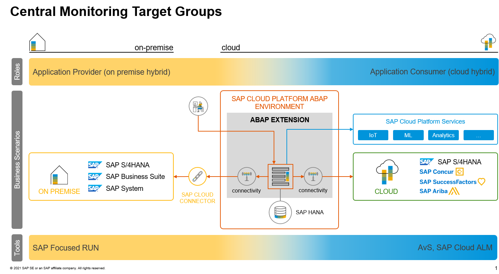

<!-- border -->
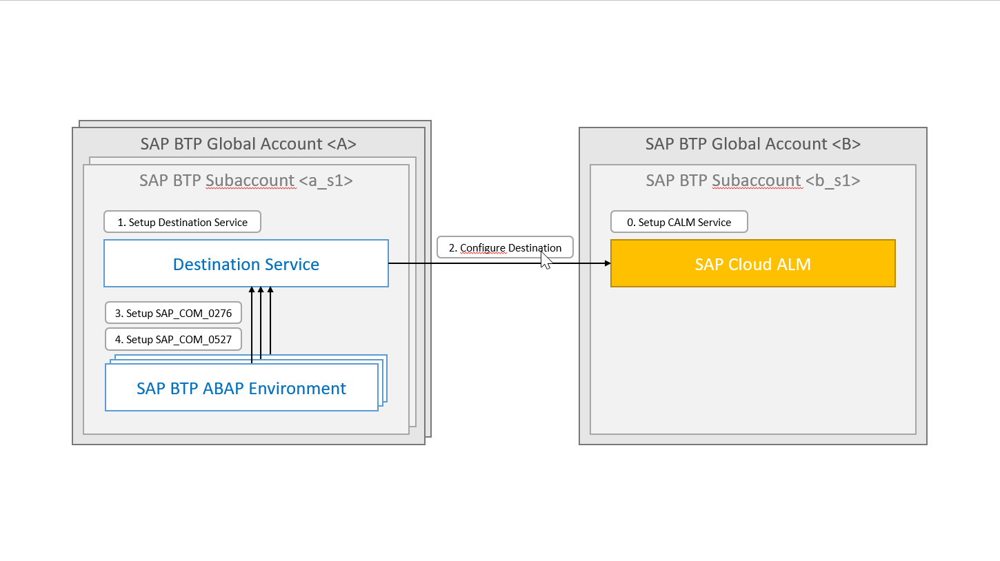

---

### Set up destination service

In the BTP Cockpit, you need to create a destination service in your BTP subaccount, if you have not already done so.

1. Navigate to your **Space**, choose **Instances**, then choose **Create**.

    <!-- border -->
    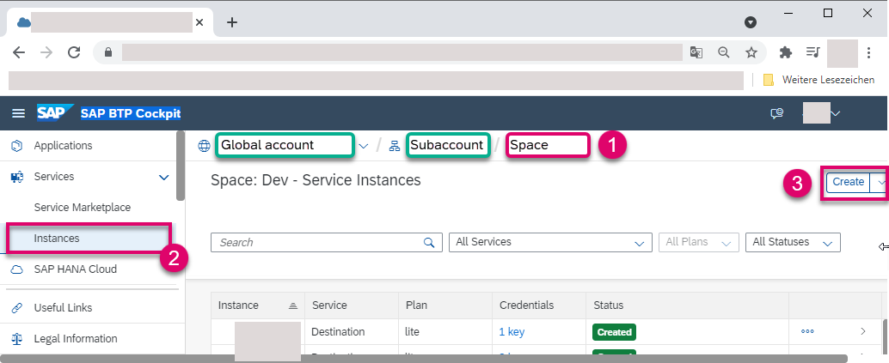

2. Enter the following, then choose **Create**.

    - Service: **Destination**
    - Plan: **Lite**
    - Instance Name: e.g. **`DST`**

    <!-- border -->
    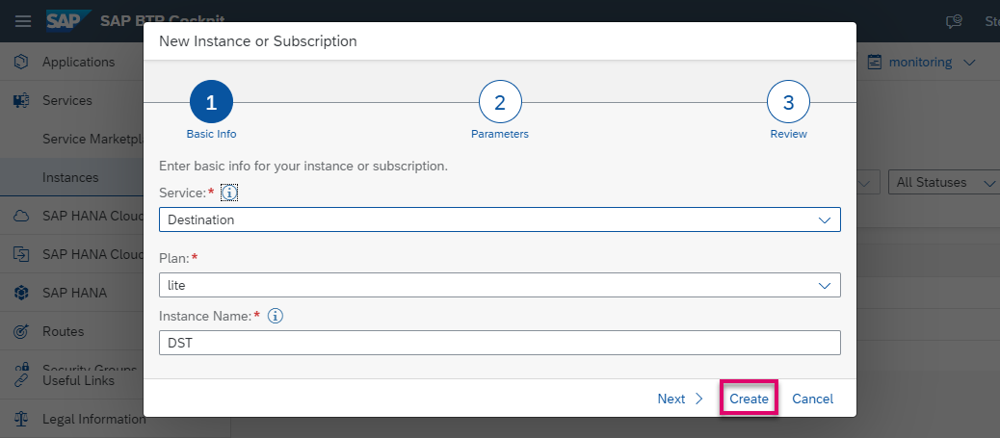

3.	Create a service key for your SAP Cloud ALM service and download it; you will need it later - that is, the SAP Cloud ALM service mentioned in the prerequisites above.

    <!-- border -->
    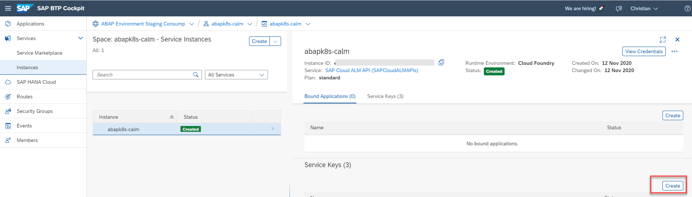

4. Create a new service key for your SAP BTP ABAP Environment and download it; you will need it later.

    <!-- border -->
    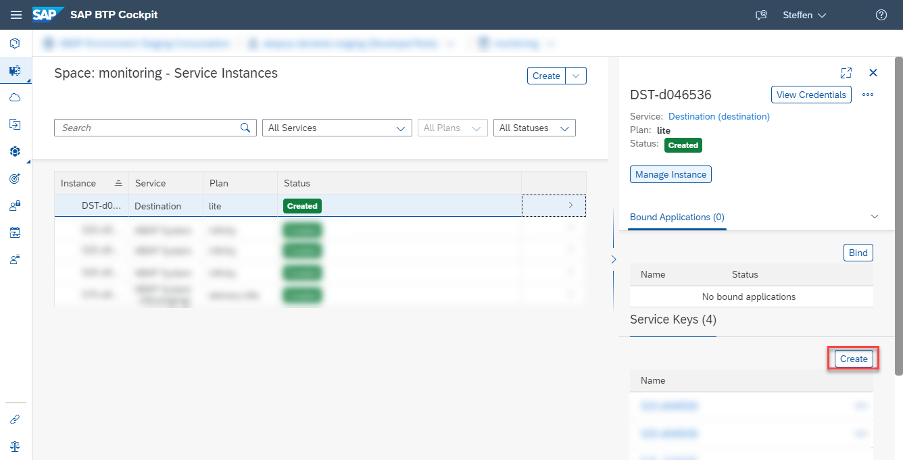

### Configure destination

In the BTP Cockpit, you need to create a destination to SAP Cloud ALM if you have not already done so.

1. Navigate to your **Subaccount** and choose **Destinations > New Destination**.

    <!-- border -->
    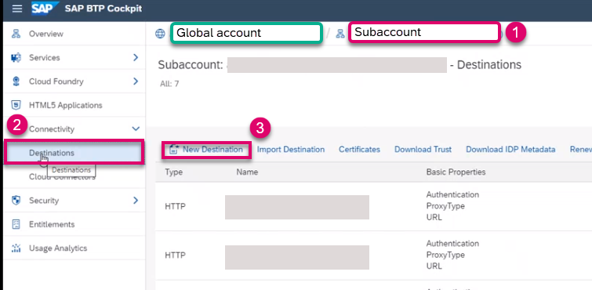

2. Configure the destination to your SAP Cloud ALM service using the credentials in the service key (from step 1.3).

    <!-- border -->
    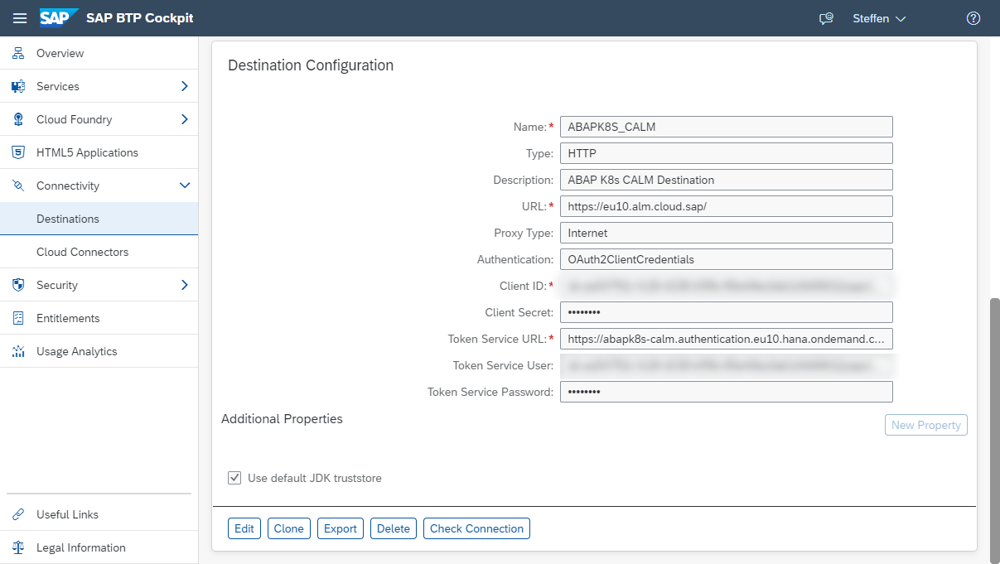

### Create Communication Arrangement for Destination Service Integration (SAP_COM_0276)

1.	Logon to your SAP BTP ABAP Environment as Administrator and choose the app **Communication Arrangements**.

    <!-- border -->
    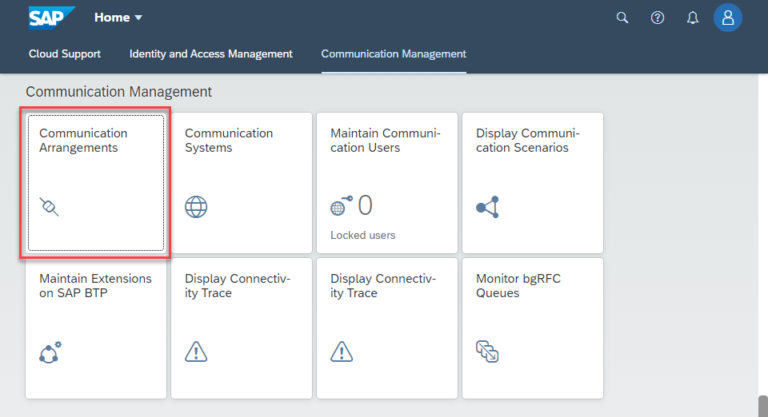

2. Choose **New**.

    <!-- border -->
    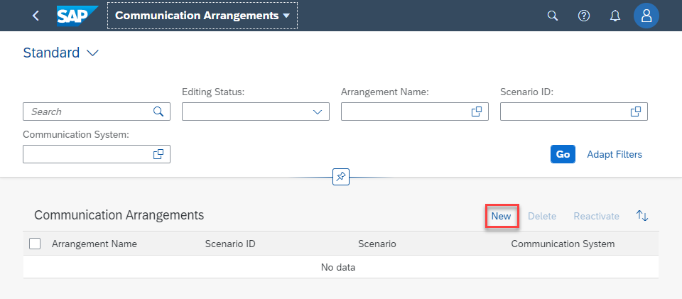

3. Choose scenario **`SAP_COM_0276`**, paste the service key of your destination service (from step 1.4), then choose **Create**.

    <!-- border -->
    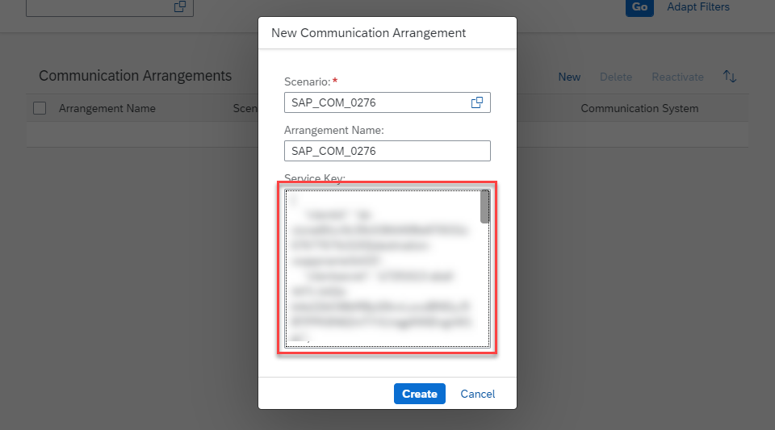

### Create Communication Arrangement for Application Monitoring (SAP_COM_0527)

1. Again, choose **New**, then choose **Create**.

    <!-- border -->
    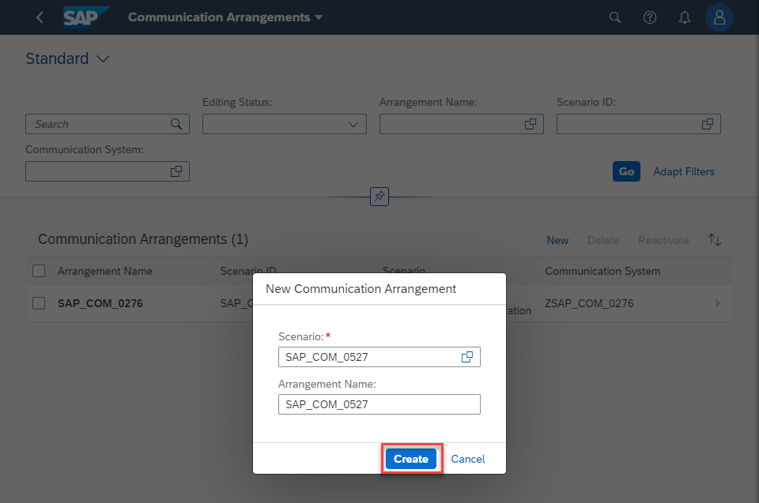

2. Create a New **Communication System**.

    <!-- border -->
    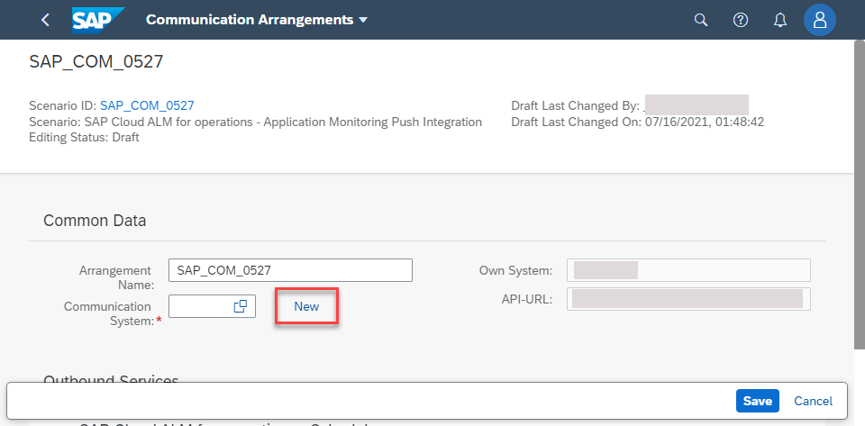

3. From the dropdown list, choose the **Name** for your SAP Cloud ALM service, that you configured in step 3.2.

    <!-- border -->
    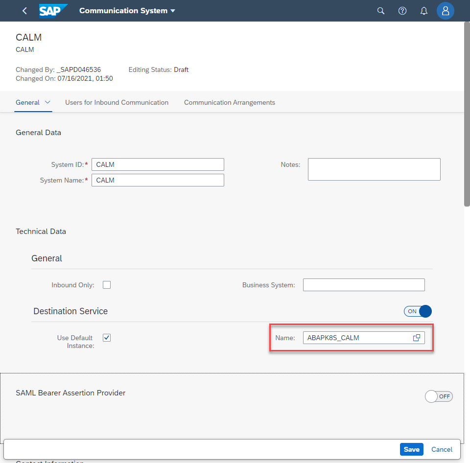

4. Choose the use cases you want to enable.

    <!-- border -->
    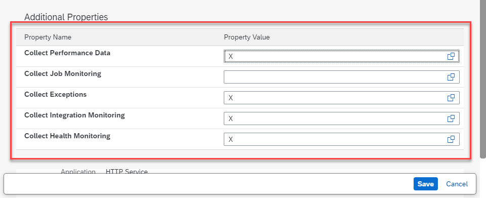

5. Configure the job execution details as follows and choose **Save**, then save the communication arrangement.

    <!-- border -->
    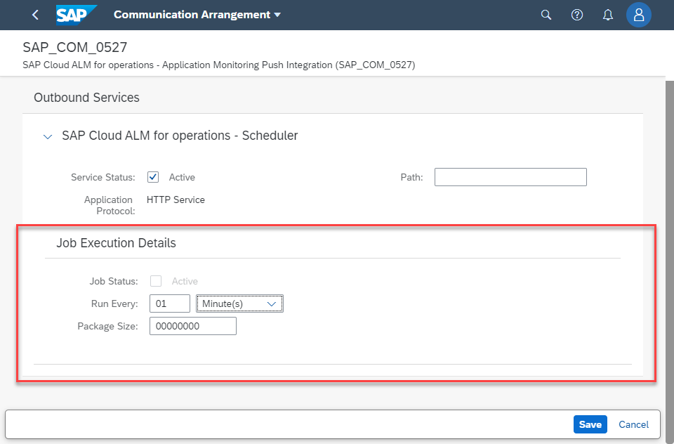

Your SAP BTP ABAP environment is registered in your SAP Cloud ALM instance. However, it could take **up to one hour** before the first monitoring data is pushed to your  service.

<!-- border -->
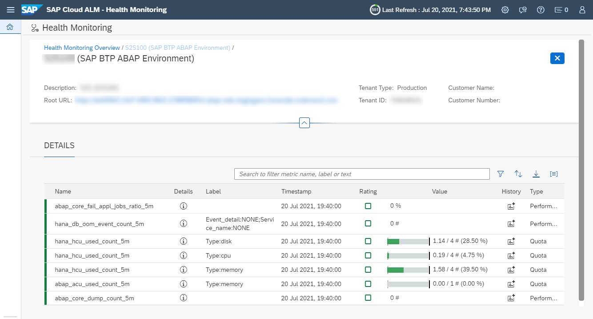

### Test yourself

---
