# Monitor An SAP BTP ABAP Environment Service Using SAP Focused Run (FRUN)
<!-- description --> Configure health monitoring and real user monitoring for an SAP BTP ABAP Environment service using SAP Focused Run (FRUN).

## Prerequisites
- SAP BTP ABAP Environment instance with the Administrator role
- Access to the Fiori app  **Advanced Application Management> Health Monitoring**
- Access to the Fiori app **Advanced Application Management> Cloud Service Management**

## You will learn
- How to configure communication from your SAP BTP ABAP Environment instance to the SAP Focus Run system using a communication arrangement, **`SAP_COM_0454`**
- How to configure the use case health monitoring  metric endpoint in the on-premise FRUN system
- How to configure the use case real user monitoring  metric endpoint in the on-premise FRUN system

## Intro
If you run SAP BTP, ABAP environment, as one part of a hybrid landscape with on-premise and cloud systems, you might already have a central monitoring and alerting infrastructure in place. For example, the service offering SAP Focused Run (FRUN) is designed specifically for businesses that need high-volume system and application monitoring, alerting, and analytics.

If you use FRUN as your monitoring and alerting infrastructure, you can integrate monitoring of the ABAP environment in FRUN. Using the health monitoring in SAP Focused Run, you can also watch whether your ABAP environment is still up and running and whether any exceptional situations occurred. In addition, you can use the real-user monitoring to monitor requests coming from business users and integration monitoring to watch the communication between integrated systems.

For more information, see SAP Help Portal[Integration in Central Monitoring and Alerting](https://help.sap.com/viewer/DRAFT/60f1b283f0fd4d0aa7b3f8cea4d73d1d/Internal/en-US/8d6e2e78f77540d6836cc63eea121966.html)

Throughout this tutorial, objects name include a prefix, such as **`Zxx`** or suffix, such as **`XXX`**. Always replace this with your group number or initials.

<!-- border -->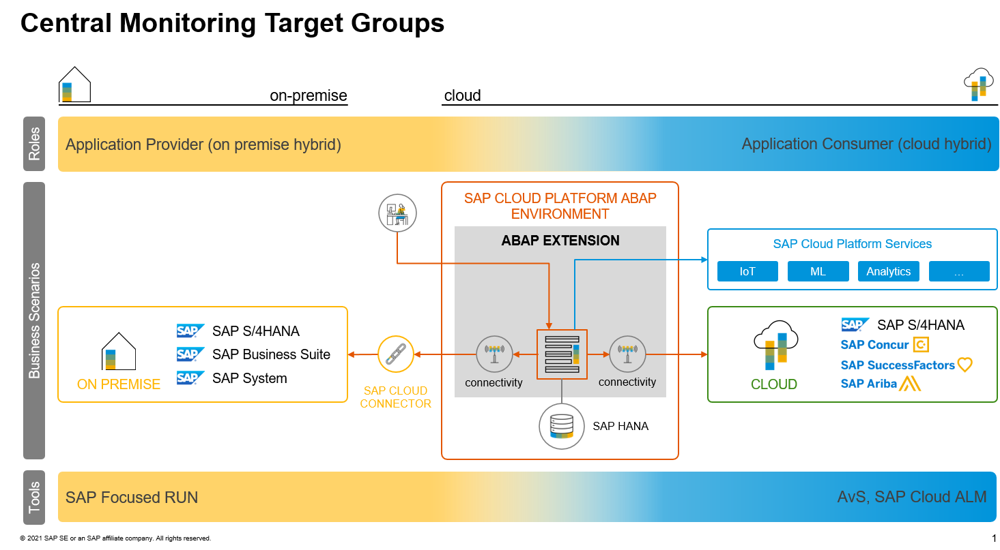

---

### Create communication system in SAP BTP ABAP Environment

First, you will configure communication from SAP BTP ABAP Environment to the on-premise FRUN system.

1. In the Fiori launchpad, open the app **Communication Management > Communication System**.

    <!-- border -->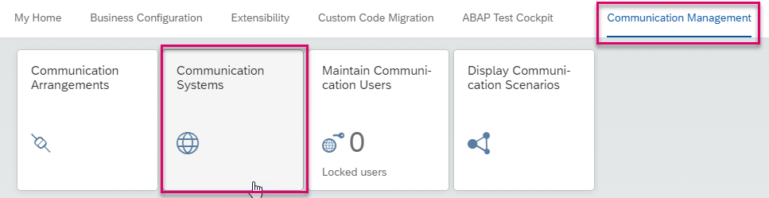

2. Choose **New**.

    <!-- border -->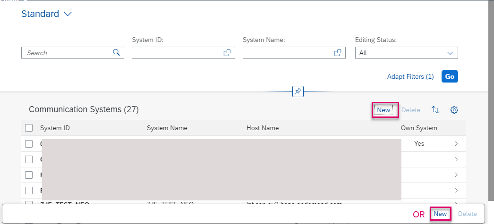

3. Enter the following:
    - System ID: e.g. **`FRN`**
    - System Name: **`FRN`** or **`ZXX_FRN`**

    <!-- border -->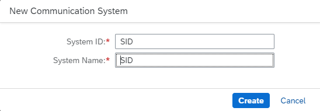

4. In **General**, choose **Inbound Only**.

5. In **Users for Inbound Communication**, create a new user by choosing **+**.

    <!-- border -->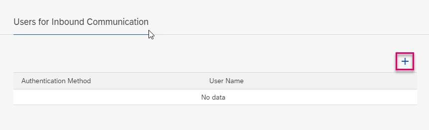

6. Enter the authentication method **User Name and Password**, then choose **New User**.

    <!-- border -->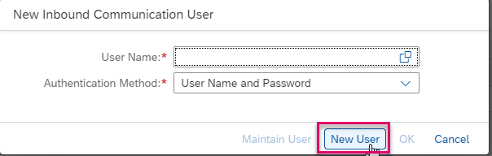

7. Enter the following:
    - User Name: **`USER_COM_0454_FRN`**
    - Description: **Application Monitoring Integration User**

8. Choose **Propose Password** and save the password.

9. The new communication user appears in the communication system.

    <!-- border -->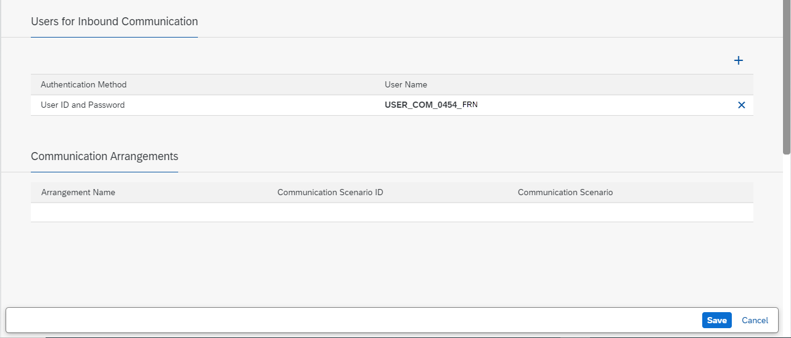

10. Choose **Create**, then on the **Communication System** screen, choose **Save**.

Now, the SAP BTP ABAP Environment instance is configured and ready to use for Inbound communication using `SAP_COM_0454` with the inbound communication user `USER_COM_0454_FRN`.

### Create communication arrangement

Now, you will create a communication arrangement using this system.

1. In the Fiori launchpad, open the app **Communication Management > Communication Arrangements**.

    <!-- border -->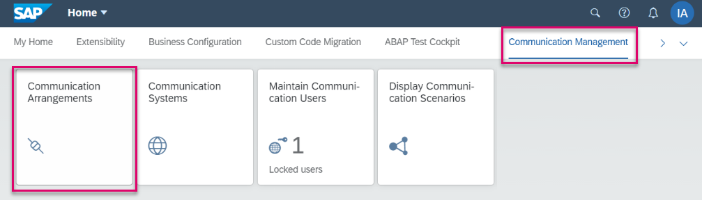

2. Choose **New**.

    <!-- border -->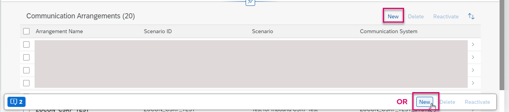

3. Enter the following, then choose **Save**:
    - Scenario: **`SAP_COM_0454` - Application Monitoring Integration**
    - Name: **`ZXX_COM_0454_FRN`**

    Your communication arrangement opens, showing the associated **Communication System** and the available inbound services.
    You will be using the **Return Health Monitoring Metrics** service.

 4. Copy the URL of this service since you will need it later.

    <!-- border -->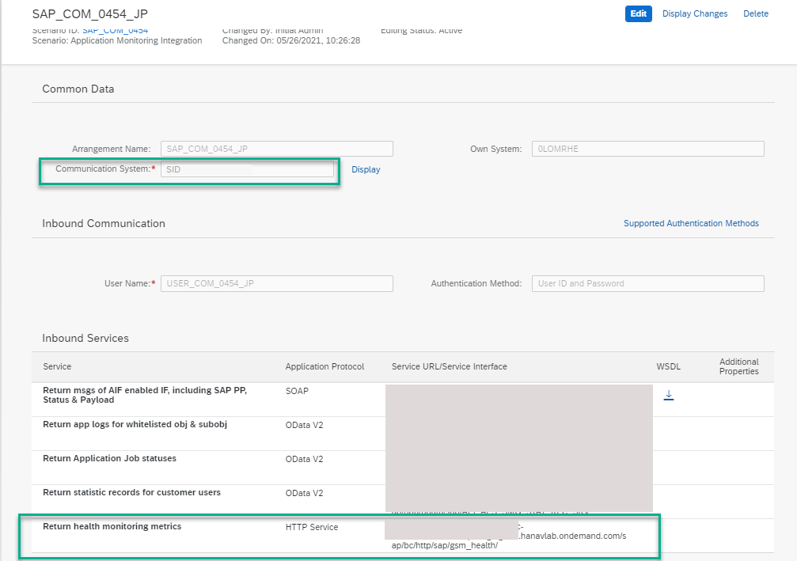

### Open Application Check in SAP S/4HANA system

Next, specify the details of the SAP BTP ABAP Environment instance in your SAP S/4HANA on-premise system.

1. In your SAP Focused Run System, in Fiori launchpad, choose the app **Advanced Application Management > Health Monitoring**.

    <!-- border -->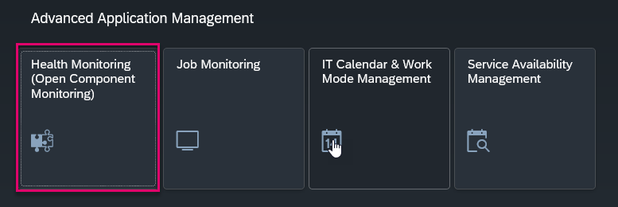

2. Enter the customer scope and choose **Go**:
    - Customer ID
    - Data Center

    <!-- border -->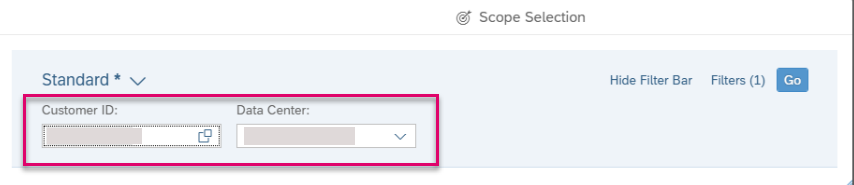

    The application opens, showing an overview of the systems in this customer network.

3. From the left menu bar, choose **Application Check**.

    <!-- border -->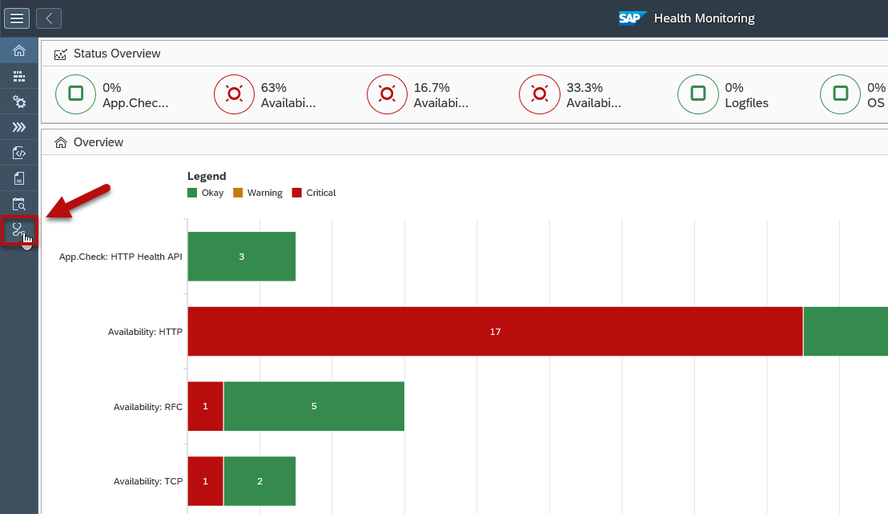

The app opens, showing overview page with checks for your systems.

<!-- border -->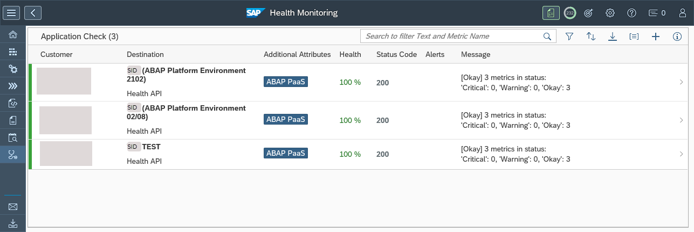

For the ABAP environment, the following checks are relevant:

|  Check Name     | Description | Comments
|  :------------- | :-------------
|  App. check: HTTP Health API | Application check using the HTTP health API | Check that can be used for external cloud application such as SAP BTP ABAP environment |
|  Availability: HTTP |shows whether your systems are available, based on a short ping that is sent to your systems regularly          | Standard check, part of the open component monitoring in SAP Focused RUN

### Add health monitoring endpoint

Add a new endpoint for the HTTP Health metric.

1. In the list of application checks, choose +.

2.	In the dialog that appears, choose HTTP Health API.

    <!-- border -->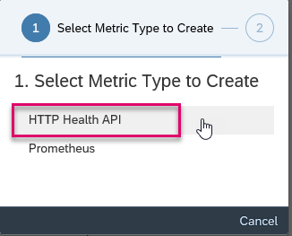

3. Enter the following data and choose **Save**.

    |  Field Name     | Value
    |  :------------- | :-------------
    | Metric Name	| For example, the name of your SAP BTP ABAP environment service and **test**
    | Collection Group / Customer Network | Choose your customer network from the dropdown list
    |  Collection Frequency    | 1 minute
    |  URL          | The URL of the HTTP service Return health monitoring statistics, copied from the communication arrangement. See step 2-4 of this tutorial
    |  Authentication | Basic
    | User, password | Use the credentials you used when you configured `SAP_COM_0454` in the SAP BTP ABAP environment

    <!-- border -->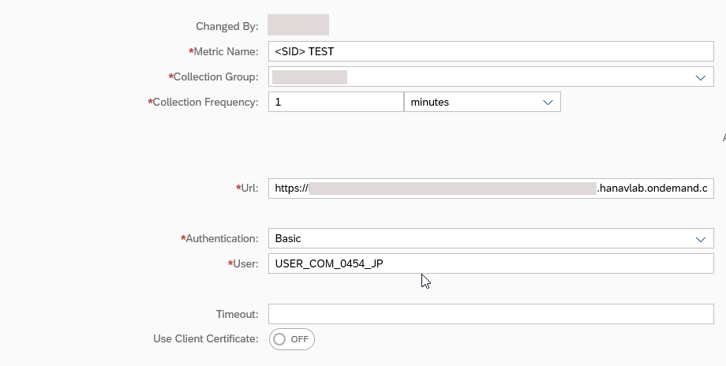

    <!-- border -->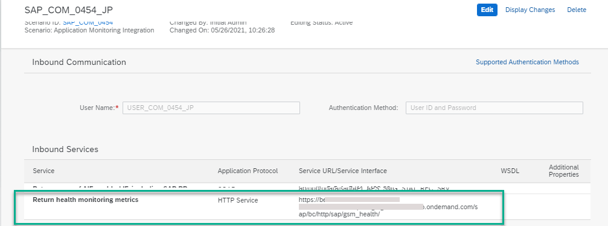

The health monitoring agent on SAP Focused RUN is configured and will regularly collect the metrics. Once the first collection is executed, the metrics will be shown in the health monitoring UI. The following metrics are available:

|  Metric Type | Metric Name | Description
|  :------------- | :-------------
| Performance |	`abap_core_dump_count_5m`	| Number of core short dumps during the last 5 minutes
| Performance	| `abap_core_fail_appl_jobs_ratio_5m`	| Ratio of failed application jobs during the last 5 minutes
| Performance	| `hana_indexserver_oom_event_count_5m`	| Number of out-of-memory events on the SAP HANA index server during the last 5 minutes
| Quota	| `abap_acu_used_count_5m` (type: memory)	| Used quota of ABAP system memory (in ABAP computing units)
| Quota	| `hana_hcu_used_count_5m` (type: `cpu`) | Used quota of CPU utilization for the SAP HANA database (in HANA computing units)
| Quota	| `hana_hcu_used_count_5m` (type: disk)	| Used quota of disk space for the SAP HANA database (in HANA computing units)
| Quota	| `hana_hcu_used_count_5m` (type: memory)	| Used quota of memory utilization for the SAP HANA database (in HANA computing units)

To view how the metrics evolved over time, choose the icon in the History column for each metric.

### Test yourself

### Configure Cloud Service Management

Now you will configure the SAP BTP ABAP environment service.

1. In your SAP Focused Run system, in Fiori launchpad, choose **Advanced Integration Monitoring > Cloud Service Management**.

    <!-- border -->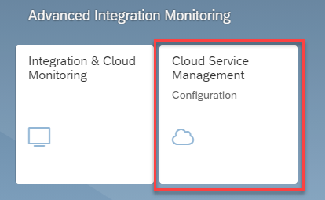

2. Choose **Add**.

    <!-- border -->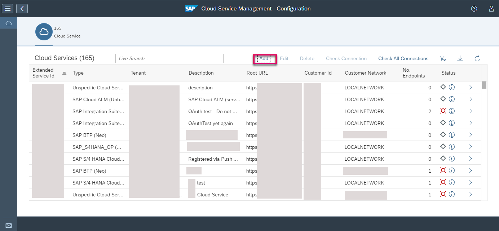

3. Enter the following, then choose **Save**:

    - Cloud Service Type **SAP S/4 HANA Cloud Essentials**
    - Tenant ID
    -	Root URL, from the `SAP_COM_0454` configuration
      This must be of the form: **`https://<GUID>.ondemand.com`**. Do not include the service itself (e.g. `sap/bc/http/sap/gsm_health/`)
    -	Description of the service, **`S4S(100)`**
    - Your customer network (as in step 3)
    - Unique service ID, e.g. **`S4S100`**

      <!-- border -->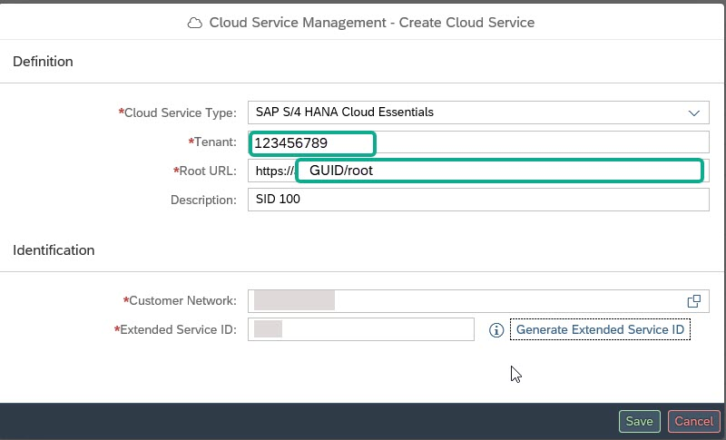

### Add HTTP endpoint

1. In the overview of cloud services, select your service and choose **Details**

    <!-- border -->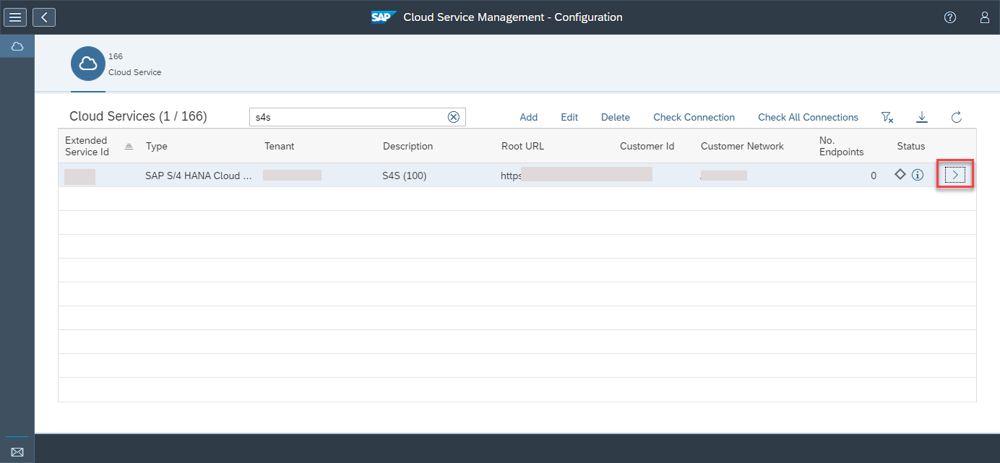

2. Add a new HTTP endpoint for this cloud service.
    - Enter the same user credentials as you used for the communication scenario **`SAP_COM_0454`** (see Step 1).
    - Description = **`S4S100`**

    <!-- border -->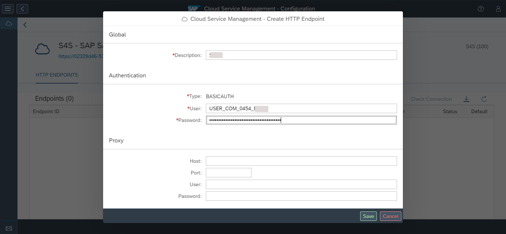

3. Check the HTTP connection to the SAP BTP ABAP environment service.

    <!-- border -->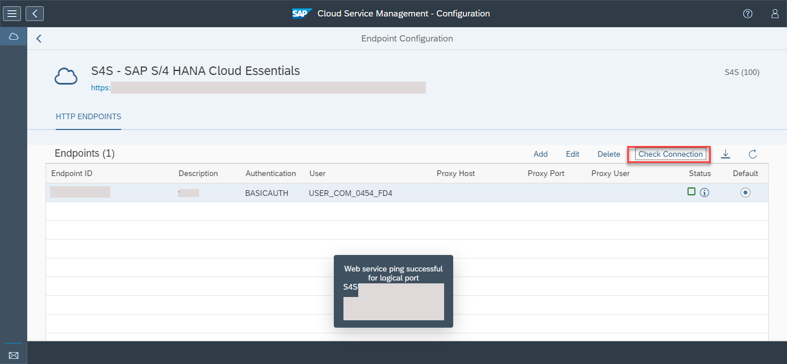

### Configure Real User Monitoring

1. Again, in your SAP Focused Run system, in Fiori launchpad, choose **Advanced Integration Monitoring > Real User Monitoring**.

    <!-- border -->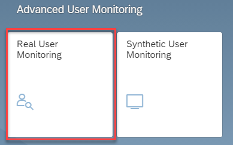

2. In the scope selection, search for your SAP BTP ABAP environment service, using filters if necessary.

    <!-- border -->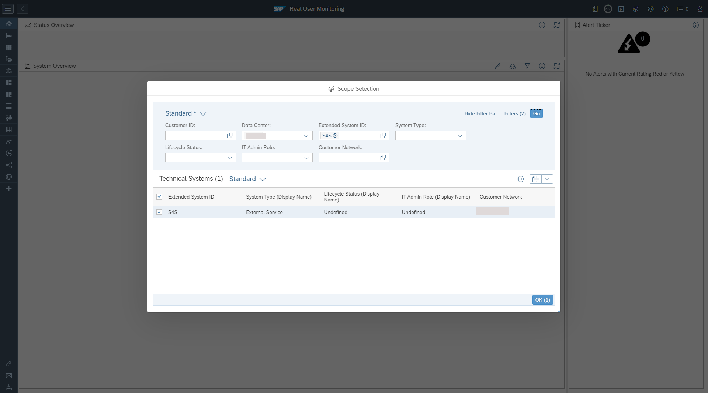

3. Enable your service for **Real User Monitoring** by choosing **Active = ON**.  

    <!-- border -->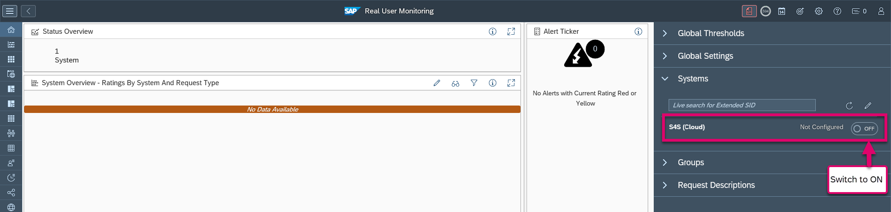

    <!-- border -->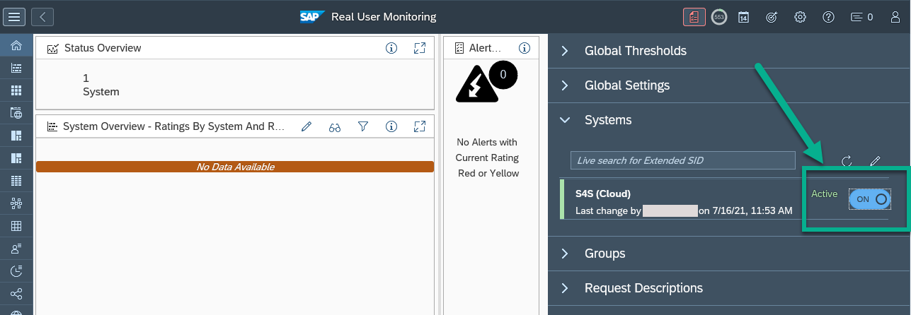

4. Wait at least 5 minutes to get the first data in your SAP Focused Run Real User Monitoring.

    <!-- border -->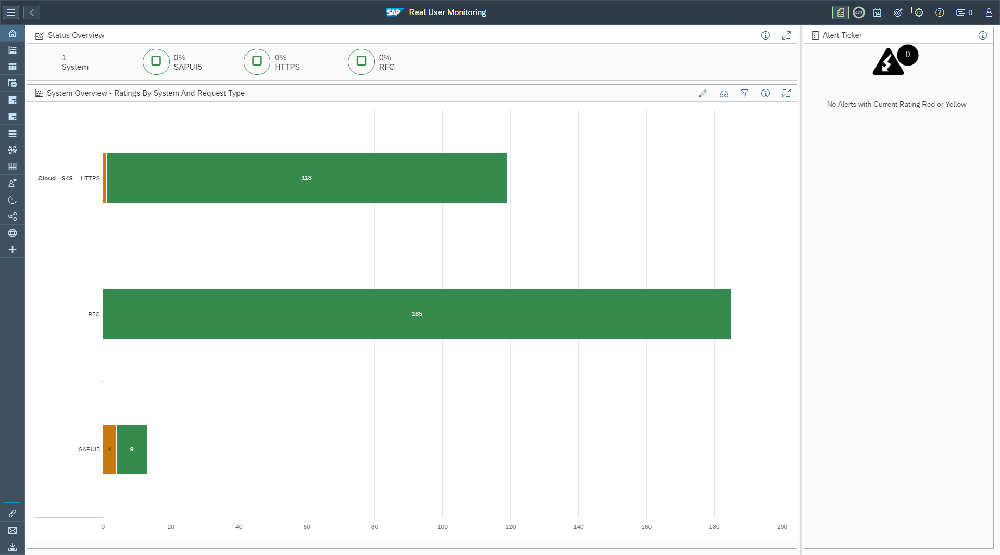

---
