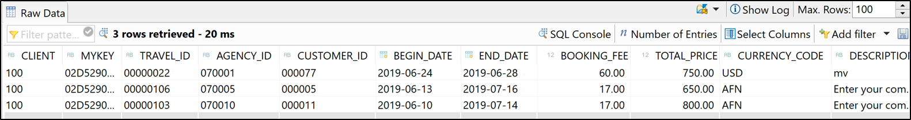

## Prerequisites  
- You need an SAP BTP, ABAP environment [trial user](abap-environment-trial-onboarding) or a license.
- You have downloaded Eclipse Photon or Oxygen and installed ABAP Development Tools (ADT). See <https://tools.hana.ondemand.com/#abap>.

## Details
### You will learn  
  - How to create an ABAP package
  - How to create a database table
  - How to create an ABAP class to generate data

In this tutorial, wherever XXX appears, use a number (e.g. 000).

---

[ACCORDION-BEGIN [Step 1: ](Create ABAP package)]
  1. Open **ABAP Development Tools (ADT)** and select your **ABAP Cloud Project** you created in [Create an SAP BTP ABAP Environment Trial User](abap-environment-trial-onboarding).

     Right-click on `ZLOCAL` and select **New > ABAP Package**.

      

  2. Create a new ABAP package:
     - Name: `ZTRAVEL_APP_XXX`
     - Description: `Package for travel XXX`
     - `Superpackage`: `ZLOCAL`
     - **Check** Add to favorite packages.

     Use your number instead of `XXX`.

      

      Click **Next >**.

  3. Select **Create new request** and enter a request description.

      

      Click **Finish**.

  4. Now your package is added to favorites objects.

      


[DONE]
[ACCORDION-END]

[ACCORDION-BEGIN [Step 2: ](Create database table)]
  1. Right-click on your package `ZTRAVEL_APP_XXX`, select **New** > **Other ABAP Repository Object**.

      

  2. Search for database table, select it and click **Next >**.

      

  3. Create a new database table:

       - Name: `ZTRAVEL_XXX`
       - Description: `Database table for travel data XXX`

     Click **Next >**.

      

  4. Click **Finish** to create your transport request.

      

  5. Replace your code with following:

    ```ABAP
    @EndUserText.label : 'Database table for travel data XXX'
    @AbapCatalog.enhancementCategory : #NOT_EXTENSIBLE
    @AbapCatalog.tableCategory : #TRANSPARENT
    @AbapCatalog.deliveryClass : #A
    @AbapCatalog.dataMaintenance : #RESTRICTED
    define table ztravel_xxx {
      key client      : abap.clnt not null;
      key mykey       : sysuuid_x16 not null;
      travel_id       : /dmo/travel_id;
      agency_id       : /dmo/agency_id;
      customer_id     : /dmo/customer_id;
      begin_date      : /dmo/begin_date;
      end_date        : /dmo/end_date;
      @Semantics.amount.currencyCode : 'ztravel_xxx.currency_code'
      booking_fee     : /dmo/booking_fee;
      @Semantics.amount.currencyCode : 'ztravel_xxx.currency_code'
      total_price     : /dmo/total_price;
      currency_code   : /dmo/currency_code;
      description     : /dmo/description;
      overall_status  : /dmo/overall_status;
      created_by      : syuname;
      created_at      : timestampl;
      last_changed_by : syuname;
      last_changed_at : timestampl;

    }   
    ```

  6. Save and activate.

      

     Now the dictionary tables are defined. The dictionary tables are the basis of our travel booking data model.

[DONE]
[ACCORDION-END]

[ACCORDION-BEGIN [Step 3: ](Create ABAP class)]
  1. Right-click on your package `ZTRAVEL_APP_XXX`, select **New** > **ABAP Class**.

      

  2. Create a new ABAP class:

     - Name: `ZCL_GENERATE_TRAVEL_DATA_XXX`
     - Description: `Class for generating travel data`

     Click **Next >**.

      

  3. Click **Finish** to create your transport request.

      

  4. Replace your code with following:

    ```ABAP
    CLASS zcl_generate_travel_data_xxx DEFINITION
      PUBLIC
      FINAL
      CREATE PUBLIC .

      PUBLIC SECTION.
        INTERFACES if_oo_adt_classrun.
      PROTECTED SECTION.
      PRIVATE SECTION.
    ENDCLASS.


    CLASS zcl_generate_travel_data_xxx IMPLEMENTATION.
      METHOD if_oo_adt_classrun~main.

        DATA itab TYPE TABLE OF ztravel_xxx.

    *   fill internal travel table (itab)
        itab = VALUE #(
          ( mykey = '02D5290E594C1EDA93815057FD946624' travel_id = '00000022' agency_id = '070001' customer_id = '000077' begin_date = '20190624' end_date = '20190628' booking_fee = '60.00' total_price =  '750.00' currency_code = 'USD'
            description = 'mv' overall_status = 'A' created_by = 'MUSTERMANN' created_at = '20190612133945.5960060' last_changed_by = 'MUSTERFRAU' last_changed_at = '20190702105400.3647680' )
          ( mykey = '02D5290E594C1EDA93815C50CD7AE62A' travel_id = '00000106' agency_id = '070005' customer_id = '000005' begin_date = '20190613' end_date = '20190716' booking_fee = '17.00' total_price = '650.00' currency_code = 'AFN'
            description = 'Enter your comments here' overall_status = 'A' created_by = 'MUSTERMANN' created_at = '20190613111129.2391370' last_changed_by = 'MUSTERMANN' last_changed_at = '20190711140753.1472620' )
          ( mykey = '02D5290E594C1EDA93858EED2DA2EB0B' travel_id = '00000103' agency_id = '070010' customer_id = '000011' begin_date = '20190610' end_date = '20190714' booking_fee = '17.00' total_price = '800.00' currency_code = 'AFN'
            description = 'Enter your comments here' overall_status = 'X' created_by = 'MUSTERFRAU' created_at = '20190613105654.4296640' last_changed_by = 'MUSTERFRAU' last_changed_at = '20190613111041.2251330' )
        ).

    *   delete existing entries in the database table
        DELETE FROM ztravel_xxx.

    *   insert the new table entries
        INSERT ztravel_xxx FROM TABLE @itab.

    *   output the result as a console message
        out->write( |{ sy-dbcnt } travel entries inserted successfully!| ).

      ENDMETHOD.
    ENDCLASS.
    ```

  5. Save, activate and click `F9` to run your ABAP class.

      

  6. Check your result. Therefore open your database table **`ZTRAVEL_XXX`** and press `F8` to see your data.
     Now the dictionary tables are filled with data.

      

[DONE]  
[ACCORDION-END]

[ACCORDION-BEGIN [Step 4: ](Test yourself)]

[VALIDATE_1]
[ACCORDION-END]
---

<p style="text-align: center;">Give us 55 seconds of your time to help us improve</p>

<p style="text-align: center;"><a href="https://sapinsights.eu.qualtrics.com/jfe/form/SV_0im30RgTkbEEHMV?TutorialID=abap-environment-persistence" target="_blank"></a></p>
