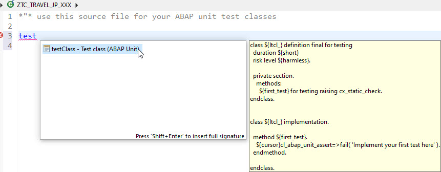
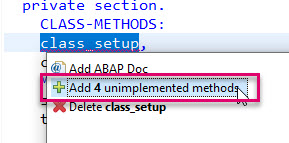
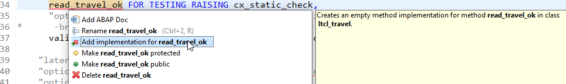
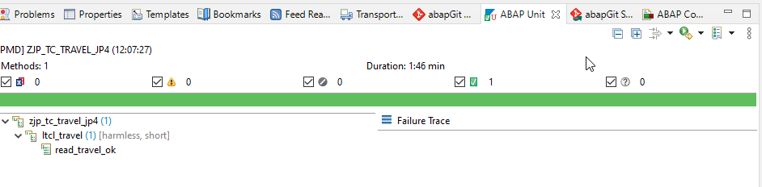
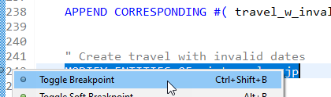
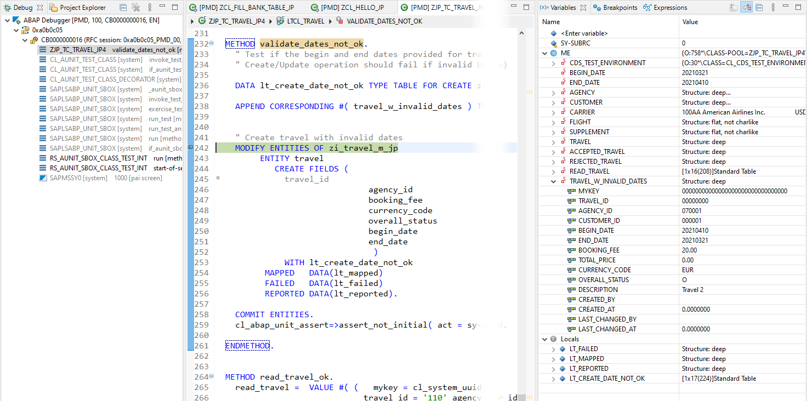
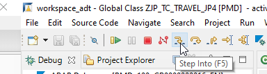
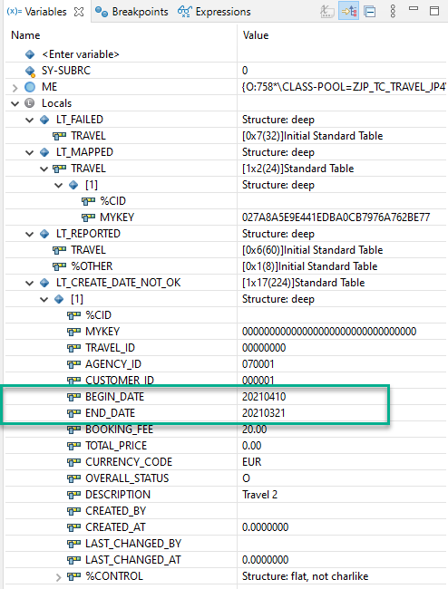
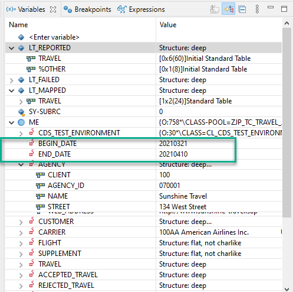

# Create and Run Unit Tests for a Fiori App
<!-- description --> Create and Run Unit Tests for your Fiori App Using ABAP Unit Tests.

## Prerequisites
  - You have completed the group [Develop a Fiori App Using the ABAP RESTful Programming Model (Managed Scenario)](group.abap-env-restful-managed), tutorials 1-5
  - You understand Entity Manipulation Language (EML). For more information, see the section **More Information** below
  - You understand ABAP Unit Tests. For more information, see the section **More Information** below. Start with the SAP Community blog post, [Creating ABAP unit tests in eclipse and SE80](https://blogs.sap.com/2013/04/15/creating-abap-unit-tests-in-eclipse-and-se80/), ignoring section 6.

## You will learn
  - How to create a test class using mock-up data and Entity Manipulation Language (EML)
  - How to run four tests on the CDS entity using this class:
    - Read an existing travel into the transactional buffer, since valid test data was inserted. (Data is then persisted to the database.)
    - Create a valid travel
    - Create an invalid travel
    - Validate travel dates


## Intro
Many introductions to ABAP Unit focus on a traditional ABAP class, such as a calculator. In this tutorial, you will test the CDS entity you created in the group, `ZI_TRAVEL_M_000`.

Throughout this tutorial, objects name include a suffix, such as `000`. Always replace this with your group number or initials.

---

### Create package and test class

1. In the Project Explorer, open the package and choose **New > ABAP Class** from the context menu.

2. Enter the following:

    - Name: **`ZTC_TRAVEL_000`**
    - Description: Test class for Travel `ZI_TRAVEL_M_000` (which you created previously)

4. Choose the transport request you just created, then choose **Finish**.


### Create local test class

1. Choose the **Test Classes** tab.

2. Enter **Test**, then choose **Auto-complete (`Ctrl + Space`)**, then choose **`testClass...` > Shift+Enter**.

    <!-- border -->

      The editor adds the template for the local test class.

3. Change the name of the local test class to **`ltcl_travel`**.

4. Delete the default method **`first_test`**.
It contains the following code.

    ```ABAP
    method first_test.
      cl_abap_unit_assert=>fail( 'Implement your first test here' ).
    endmethod.

    ```


### Define mock-up data

Before you start writing the test, set up mock-up data: In the **Private Section**, add the following code.
&nbsp;

The static attribute `cds_test_environment` of type CDS Test Environment provides the methods and types you need for testing. Later, you will  create an instance of this test environment. The attributes `travel`, `accepted_travel` and so on are key.
&nbsp;

After that, you will fill them with (valid or invalid) values so that they provide expected values to run the test assertions against.

    ```ABAP
    CLASS-DATA: cds_test_environment TYPE REF TO if_cds_test_environment,
                begin_date           TYPE /dmo/begin_date,
                end_date             TYPE /dmo/end_date.

    CLASS-DATA: agency                 TYPE /dmo/agency,
                customer               TYPE /dmo/customer,
                carrier                TYPE /dmo/carrier,
                flight                 TYPE /dmo/flight,
                supplement             TYPE /dmo/supplement,
                travel                 TYPE zi_travel_m_000,
                accepted_travel        TYPE zi_travel_m_000,
                rejected_travel        TYPE zi_travel_m_000,
                read_travel            TYPE STANDARD TABLE OF ztravel_000,
                travel_w_invalid_dates TYPE zi_travel_m_000.

    ```


### Define mock-up methods

1. Similarly, define mock-up methods: Still in the **Private Section**, define the methods **`class_setup`** and **`class_teardown`** for the class; and **`setup`** and **`teardown`** for the methods. Ignore the error for now.

    ```ABAP
    CLASS-METHODS :
      class_setup,
      class_teardown.

    METHODS:
      setup,
      teardown.

    ```

2. Add the method implementations: Select any one of the three methods, then choose **Quick Assist (`Ctrl + 1`)**.

    <!-- border -->

3. Format, save, and activate ( **`Ctrl + Shift + F1, Ctrl + S, Ctrl + F3`** ). The error disappears.


### Implement class_setup method

Copy the following code into the method implementation for the method **`class_setup`**.

The code:

- Implements the method **`class_setup`**: Get valid mock data from existing entities and add it to each structure.

- Then creates the mock-up environment for the entity `ZI_TRAVEL_M_000`. When the method is executed, all the test doubles are created in the database and are available for inserting test data.

```ABAP
begin_date = cl_abap_context_info=>get_system_date( ) + 10.
end_date = cl_abap_context_info=>get_system_date( ) + 30.

"Get a single agency info to be used in the test data
SELECT SINGLE * FROM /dmo/agency INTO @agency ##WARN_OK.  " Select any valid agency

"Get a single customer info to be used in the test data
SELECT SINGLE * FROM /dmo/customer INTO @customer ##WARN_OK.  " Select any valid customer

"Get a single airline info to be used in the test data
SELECT SINGLE * FROM /dmo/carrier INTO @carrier ##WARN_OK.  " Select any valid agency

" IMPORTANT:**************************************************************
" Specify which CDS entity will be tested
" ************************************************************************
cds_test_environment = cl_cds_test_environment=>create_for_multiple_cds(
                      i_for_entities = VALUE #(
                         ( i_for_entity = 'ZI_TRAVEL_M_000'
                         i_select_base_dependencies = abap_true ) ) ).
ENDMETHOD.

```


### Implement setup method

Implement the **`setup`** method; add some values to the structures you created earlier.

    ```ABAP
    " clear the content of the test double before each test
    " fill entities, against which your entity ZI_TRAVEL_M_000 will be tested
    travel =  VALUE #( travel_id = '101' agency_id = agency-agency_id customer_id = customer-customer_id
                        begin_date = cl_abap_context_info=>get_system_date( ) + 10
                        end_date = cl_abap_context_info=>get_system_date( ) + 30
                        booking_fee    = '20'
                        currency_code  = 'EUR'
                        description = 'Travel 1'
                        overall_status = 'O' ).

     accepted_travel =  VALUE #(
                        agency_id = agency-agency_id customer_id = customer-customer_id
                        begin_date = cl_abap_context_info=>get_system_date( ) + 10
                        end_date = cl_abap_context_info=>get_system_date( ) + 30
                        booking_fee    = '20'
                        currency_code  = 'EUR'
                        description = 'Travel 1'
                        overall_status = 'A' ). " travel status is accepted

     rejected_travel =  VALUE #(
                                agency_id = '1111' customer_id = customer-customer_id
                                begin_date = cl_abap_context_info=>get_system_date( ) + 10
                                end_date = cl_abap_context_info=>get_system_date( ) + 30
                                booking_fee    = '20'

                                currency_code  = 'EUR'
                                description = 'Travel 1'
                                overall_status = 'X' ). " travel status is rejected

     travel_w_invalid_dates =  VALUE #(
                                       agency_id = agency-agency_id customer_id = customer-customer_id
                                       begin_date = end_date  "" begin_date > end_date
                                       end_date = begin_date
                                       booking_fee    = '20'
                                       currency_code  = 'EUR'
                                       description = 'Travel 2'
                                       overall_status = 'O' ).
    ```


### Implement teardown methods

1. Add the following code to  the `class_teardown` method.

    ```ABAP
      cds_test_environment->destroy(  ).

    ```

2. Add the following code to  the `teardown` method.

    ```ABAP
      cds_test_environment->clear_doubles(  ).
      ROLLBACK ENTITIES.

    ```

`class_teardown` destroys the test environment & doubles created as part of test class.

`teardown` Clears the data in the test doubles for a given method, before the next method is executed.


### Create and implement test method `read_travel_ok`

1. In the class definition, add the method as follows. Add the implementation using **Quick Assist ( `Ctrl + 1` )**.

    <!-- border -->

2. Add the following code to the method implementation **`read_travel_ok`**. This code:
    - Fills one row of the internal table `read_table` with (valid) values; `TravelID = '110'`
    - Inserts this row as mock-up data, by calling `cds_test_environment->insert_test_data`
    - Reads one row of `zi_travel_m_000`, with the same key as internal table `read_table`, into internal table `lt_read_travel` (and if appropriate, into `failed` and `reported`)
    - Finally, it runs the test on this row.

    ```ABAP
    METHOD read_travel_ok.
      " checks that the EML statement is working with mock-up data
      " does not write to CDS entity zi_travel_m_000

      read_travel =  VALUE #( (   mykey = cl_system_uuid=>create_uuid_x16_static(  )
                                travel_id = '110' agency_id = agency-agency_id customer_id = customer-customer_id
                               begin_date = cl_abap_context_info=>get_system_date( ) + 10
                               end_date   = cl_abap_context_info=>get_system_date( ) + 30
                               booking_fee    = '20'
                               currency_code  = 'EUR'
                               description = 'Travel 1'
                               overall_status = 'O' ) ).

      """""""""""""""""""""""""""""""""""""""""""""""""""""""""""""                            
      " IMPORTANT - specifies entity under test = zi_travel_m_000
      """""""""""""""""""""""""""""""""""""""""""""""""""""""""""""
      cds_test_environment->insert_test_data( i_data = read_travel  ).
      READ ENTITIES OF zi_travel_m_000
      ENTITY travel ALL FIELDS WITH
         VALUE #( (  %key-mykey = read_travel[ 1 ]-mykey ) )
        RESULT DATA(lt_read_travel)
        FAILED DATA(failed)
        REPORTED DATA(reported).
      " TEST STUFF
      cl_abap_unit_assert=>assert_equals(
      EXPORTING
        act                  =  lt_read_travel[ 1 ]-travel_id
        exp                  =  110
        msg                  = 'Failed to create travel instance.'
    ).

    ENDMETHOD.

    ```


### Run unit test

1. Place your cursor anywhere in the editor, and choose **`Ctrl + Shift + F9`**.

    The ABAP Unit Test view appears, showing your test class and test method:

      

    There are four main commands that you will use:

      - `Ctrl+Shift+F9` to get a preview of existing unit tests
      - `Ctrl+Shift+F10` to execute unit tests
      - `Ctrl+Shift+F11` to execute unit tests with coverage measurement
      - `Ctrl+Shift+F12` to trigger the ABAP Unit launch dialog

    We will focus on executing unit tests (`Ctrl+Shift+F10`) here.


2. Execute the test by placing your cursor in the class editor and choosing **3 ABAP Unit Test** from the context menu, or choose **`Ctrl + Shift + F10`**.


### Create test method `create_travel_ok`

1. In the class definition, add the method **`create_travel_ok`** as follows. Add the implementation using **Quick Assist ( `Ctrl + 1` )**.

    ```ABAP
    create_travel_ok FOR TESTING RAISING cx_static_check.

    ```

2. Add the following code to the method implementation **`create_travel_ok`**. This code:
    - Takes the values of `accepted_travel` from the method `setup` and appends them to the internal table `lt_accepted_travel` (which must be of the type `ZI_TRAVEL_M_000` )
    - Creates a new row for the entity `ZI_TRAVEL_M_000` in the transactional buffer and passes it to `mapped`
    - Commits this row to the database (line 151)
    - Runs tests on this row

    ```ABAP
    METHOD create_travel_ok.
      " Test: create a single, valid travel
      " Result: Creating travel instance is successful
      """"""""""""""""""""""""""""""""""""""""""""""""""""""""""""""""""
      " IMPORTANT - CDS View ZI_TRAVEL_M_000 is exposed as "Travel"
      " in SD . ie SD defines entity set exposed in the OData service
      " Test runs vs OData service
      """"""""""""""""""""""""""""""""""""""""""""""""""""""""""""""""""

      DATA lt_accepted_travel TYPE TABLE FOR CREATE zi_travel_m_000\\Travel.
      APPEND CORRESPONDING #( accepted_travel ) TO lt_accepted_travel.


      """""""""""""""""""""""""""""""""""""""""""""""""""""""""""""""""""""""""""""""
      "IMPORTANT - specifies entities under test = entities of *BDEF* ZI_TRAVEL_M_000
      """""""""""""""""""""""""""""""""""""""""""""""""""""""""""""""""""""""""""""""
      MODIFY ENTITIES OF zi_travel_m_000
          ENTITY Travel
            CREATE FIELDS (
                                     Agency_ID
                                     Begin_Date
                                     End_Date
                                     Booking_fee
                                     total_Price
                                     currency_Code
                                     description
                                     overall_status
                                      )
                    WITH lt_accepted_travel
                MAPPED   DATA(mapped)
                FAILED   DATA(failed)
                REPORTED DATA(reported).
      COMMIT ENTITIES.
      READ ENTITIES OF zi_travel_m_000
          ENTITY travel ALL FIELDS WITH
            VALUE #( (  %key = mapped-travel[ 1 ]-%key ) )
            RESULT DATA(lt_read_travel)
            FAILED failed
            REPORTED reported.

      " TEST STUFF
      cl_abap_unit_assert=>assert_not_initial(
     EXPORTING
       act                  =  lt_read_travel[ 1 ]-travel_id
       msg                  = 'Failed to create travel id.'
    ).
      cl_abap_unit_assert=>assert_equals(
      EXPORTING
        act                  =  lt_read_travel[ 1 ]-agency_id
        exp                  =  travel-agency_id
        msg                  = 'Failed to create travel instance.'
    ).
    *
    *   .
    *
      cl_abap_unit_assert=>assert_initial(
        EXPORTING
          act                  = failed-travel
          msg                  = 'Failed to create travel instance.'
      ).
    *
    *
    ENDMETHOD.

    ```

3. Format, save, and activate ( **`Ctrl + Shift + F1, Ctrl + S, Ctrl + F3`** ). See below for a complete code listing.


### Add and implement other methods

1. In the class definition, add the following code. (Remember to change the period in line 30 to a comma.)

    ```ABAP
    create_travel_not_ok FOR TESTING RAISING cx_static_check,

    "optional unit test for validation-whether validation validate_dates is triggered or not
    "   - optional: Add break point in validate_dates method for further check
  validate_dates_not_ok FOR TESTING RAISING cx_static_check.    

    ```

2. Add implementations using **Quick Assist ( Ctrl+1 )**. Then add the following code to each method:

    ```ABAP
    method create_travel_not_ok.
    " Test creating a travel with a travel_id of an already existing  travel instance
       " Result: Creating a travel with duplicate id fails

    *    "Insert test travel entity
    *    DATA lt_travel TYPE STANDARD TABLE OF ztravel_000.
    *    APPEND CORRESPONDING #( travel ) TO lt_travel.
    *
    *    "Insert the test data into double
    *    cds_test_environment->insert_test_data( i_data = lt_travel ).

    DATA lt_rejected_travel TYPE TABLE FOR CREATE zi_travel_m_000\\Travel.
       APPEND CORRESPONDING #( rejected_travel ) TO lt_rejected_travel.

    *    ""Create test data to create a travel with  duplicate id
    *    DATA lt_create_travel TYPE TABLE FOR CREATE zi_travel_m_000\\travel.
    *
    *    lt_create_travel = VALUE #( ( travel_id = travel-travel_id
    *                                  agency_id = agency-agency_id
    *                                  begin_date = begin_date
    *                                  end_date = end_date
    *                                  description = 'Travel 2'
    *                                  booking_fee    = '10.5'
    *                                  currency_code  = 'USD'
    *                                  overall_status = 'O' ) ). " Open

       " Try to create travel entity with invalid agency_id
       MODIFY ENTITIES OF zi_travel_m_000
            ENTITY travel
               CREATE FIELDS (    travel_id
                                  agency_id
                                  begin_date
                                  end_date
                                  booking_fee
                                  total_price
                                  currency_code
                                  description
                                  overall_status )
                 WITH lt_rejected_travel
             MAPPED   DATA(mapped)
             FAILED   DATA(failed)
             REPORTED DATA(reported).
    commit ENTITIES RESPONSE OF zi_travel_m_000 REPORTED data(lt_travel_reported)
    failed data(lt_travel_failed).
       cl_abap_unit_assert=>assert_not_initial( lt_travel_failed ).
    endmethod.

    ```

    ```ABAP
    METHOD validate_dates_not_ok.
      " Test if the begin and end dates provided for travel are valid.
      " Create/Update operation should fail if invalid begin and end dates are provided (begin_data > end_date)

      DATA lt_create_date_not_ok TYPE TABLE FOR CREATE zi_travel_m_000\\travel. "begin date > end date

      APPEND CORRESPONDING #( travel_w_invalid_dates ) TO lt_create_date_not_ok.


      " Create travel with invalid dates
      MODIFY ENTITIES OF zi_travel_m_000
           ENTITY travel
              CREATE FIELDS (
    *             travel_id
                                 agency_id
                                 booking_fee
                                 currency_code
                                 overall_status
                                 begin_date
                                 end_date
                                  )
                WITH lt_create_date_not_ok
            MAPPED   DATA(lt_mapped)
            FAILED   DATA(lt_failed)
            REPORTED DATA(lt_reported).

      COMMIT ENTITIES.
      cl_abap_unit_assert=>assert_not_initial( act = sy-subrc ). " Creating a travel with invalid dates failed.

    ENDMETHOD.
    ```


### Optional: Open ABAP Debugger

You can check that the correct values have been passed to, for example, an internal table using the ABAP Debugger.

1. In the method **`validate_dates_not_ok`**, set a breakpoint at line 242, `MODIFY ENTITIES OF zi_travel_m_000`, by selecting the line numbering and choosing **`Toggle breakpoint`** from the context menu (or by double-clicking the line number).

    <!-- border -->

2. Now run the unit tests again ( **`Ctrl+Shift+F10`** ). In the dialog,choose **Yes**. The Debugger perspective appears.

    <!-- border -->

3. Choose the **Variables** tab and step through the method (**`F5`**).

    <!-- border -->

    For example, you can see the values in static attribute **`lt_create_date_not_ok`**, which are passed to **me**, the current instance of **`cds_test_environment`**.

    <!-- border -->
    <!-- border -->

4. Choose **Terminate** from the tool bar, go back to the **ABAP** perspective, and remove the breakpoint.

5. The **ABAP Unit** tab will report an error, because you terminated execution, but if you run the test again, the error will disappear.


### Test yourself


### More Information
- SAP Community blog post: [Creating ABAP unit tests in eclipse and SE80](https://blogs.sap.com/2013/04/15/creating-abap-unit-tests-in-eclipse-and-se80/)
- SAP Help Portal: [Unit Testing with ABAP Unit](https://help.sap.com/viewer/5371047f1273405bb46725a417f95433/Cloud/en-US/08c60b52cb85444ea3069779274b43db.html)
- In-depth: Complete openSAP Course [Writing Testable Code for ABAP](https://open.sap.com/courses/wtc1/items/2gzG0sRlN1yjkTUREB02L9)
- SAP Help Portal: [Entity Manipulation Language (EML)](https://help.sap.com/viewer/923180ddb98240829d935862025004d6/Cloud/en-US/af7782de6b9140e29a24eae607bf4138.html)
- In-depth: Complete openSAP Course [Building Apps with the ABAP RESTful Application Programming Model](https://open.sap.com/courses/cp13/items/2ic5xm4Fzn4MIVB6KnK1VE), in particular: Week 3 Unit 4: [Understanding Entity Manipulation Language (EML)](https://open.sap.com/courses/cp13/items/1PQYUmWLxhSJ6jovoMOScA)

---
