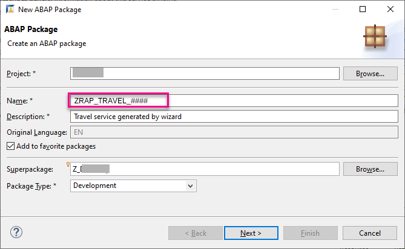
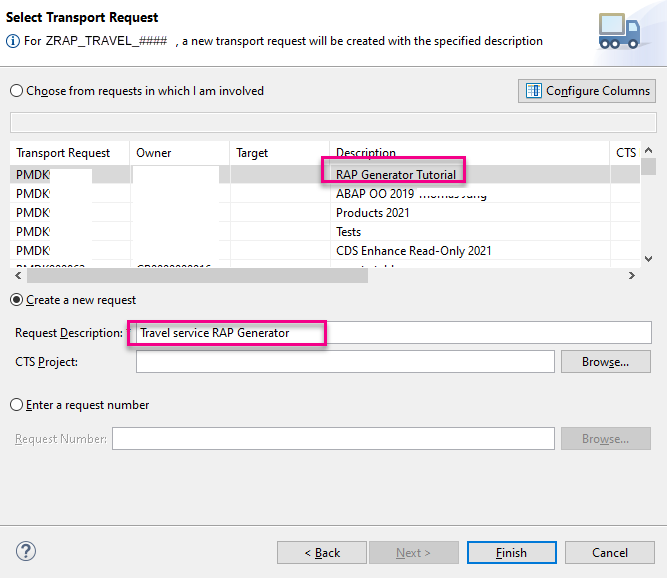
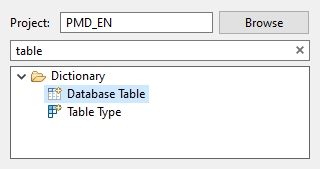

# Generate a RAP Business Service With The Wizard
<!-- description --> Generate a RAP business service in SAP BTP ABAP Environment using the ABAP Repository Objects Wizard

## Prerequisites
- You have done one of the following:
    - **Tutorial**: [Create an SAP BTP ABAP Environment Trial User](abap-environment-trial-onboarding)
    - You have bought a licensed version of SAP BTP ABAP Environment
- You have installed [ABAP Development Tools](https://tools.hana.ondemand.com/#abap), latest version

## You will learn
  - How to generate the artifacts you need to create a RAP business service. (RAP is the ABAP RESTful Application Programming Model)
  - You can then implement your business logic much more quickly than if you had to create each artifact by hand

## Intro
Throughout this tutorial, object names may include a suffix or group number, such as `####`. Always replace this with your own group number or initials.
For more information, see the links at the end of this tutorial.


---

### Create package

1. Create a new package for this tutorial, by choosing **New > ABAP Package**.

    <!-- border -->

2. Enter the following then follow the wizard, choosing a **new** transport request:
    - Name: **`ZRAP_TRAVEL_####`**
    - Description: **Travel data generated**
    - Request description: **Travel service RAP Generator**

    <!-- border -->
    <!-- border -->


### Create database table

1. Choose your package, then choose **New > Other Repository Object** from the context menu.

    <!-- border -->

2. Choose **Database Table** then **Next**.

    <!-- border -->

3. Enter the following, then choose **Next**.
    - Name: **`zrap_travel_####`**
    - Description: **Travel Data Generated**

4. Choose the transport request, then choose **Finish**.

5. The table appears in a new editor.


6. Delete the code `key client : abap.clnt;` and add the following:

    ```ABAP
    key client            : abap.clnt not null;
    key travel_uuid       : sysuuid_x16 not null;
    travel_id             : /dmo/travel_id not null;
    agency_id             : /dmo/agency_id;
    customer_id           : /dmo/customer_id;
    begin_date            : /dmo/begin_date;
    end_date              : /dmo/end_date;
    @Semantics.amount.currencyCode : 'zrap_travel_####.currency_code'
    booking_fee           : /dmo/booking_fee;
    @Semantics.amount.currencyCode : 'zrap_travel_####.currency_code'
    total_price           : /dmo/total_price;
    currency_code         : /dmo/currency_code;
    description           : /dmo/description;
    overall_status        : /dmo/overall_status;
    local_created_by      : abp_creation_user;
    local_created_at      : abp_creation_tstmpl;
    local_last_changed_by : abp_locinst_lastchange_user;
    local_last_changed_at : abp_locinst_lastchange_tstmpl;
    last_changed_at       : abp_lastchange_tstmpl;    

    ```

7. Format, save, and activate your table ( **`Shift+F1, Ctrl+S, Ctrl+F3`** ).

8. Optional: Check your table by clicking in the editor and choosing **Open With > Data Preview**.

    <!-- border -->

    > You must include a key field `client` with the type `abap.clnt`.

    > You **must not** use type `MANDT` since the generator will throw an error.

    > In addition, you must include the following administrative fields with the following types.

    > These are known as reuse data elements.

    ```ABAP
    local_created_by      : abp_creation_user;
    local_created_at      : abp_creation_tstmpl;
    local_last_changed_by : abp_locinst_lastchange_user;
    local_last_changed_at : abp_locinst_lastchange_tstmpl;
    last_changed_at       : abp_lastchange_tstmpl;   

    ```


For more information, see the SAP Help Portal: [ABAP RESTful Application Programming Model: RAP Reuse Data Elements](https://help.sap.com/viewer/923180ddb98240829d935862025004d6/Cloud/en-US/84bd58e2b9354be4a7a1c91cb687815c.html)


### Generate objects from table

1. Select your table and choose **Generate ABAP Repository objects...** from the context menu.

    <!-- border -->

2. Enter the following and choose **Next**.

    - Description: Travel data Generated
    - Use case: ABAP RESTful Application Programming Model: UI Service

3. Enter the following:

    - Data definition name: **`ZI_TRAVEL_####X`**
    - Alias name: **Travel**

    <!-- border -->

4. Enter the following information for each artifact, then choose **Next**:


    |  Artifact                   | Value     	        | Naming convention
    |  :--------------------------| :-------------------|:-----------------
    |  ABAP implementation class  | `ZBP_I_TRAVEL_####`  | `ZBP_I_<entity>_<suffix>` (BP = Behavior pool; I = interface view)   
    |  Draft Table Name:          | `ZRAP_TRAVEL_D_####X` | `Z<prefix>__<entity>_<suffix>` (underscore is not permitted as a second or third character)
    |  CDS projection view entity | `ZC_TRAVEL_####`     | `ZC__<entity>_<suffix>` (C = consumption view)
    |  CDS service definition     | `ZUI_TRAVEL_####`    | `ZUI_<entity>_<suffix>` (UI for e.g. Fiori app as opposed to a Web API)
    |  CDS service binding        | `ZUI_TRAVEL_O4_####` | `ZUI_<entity>_<OData version>_<suffix>`
    |  Binding type:              | `OData V4 - UI`     |  n/a

    The naming convention in general is as follows:
    **`[/<namespace>/][<prefix>]_<object_name>_[<suffix>].`**

    For more information, see the SAP Help Portal: [Naming Conventions for Development Objects](https://help.sap.com/viewer/923180ddb98240829d935862025004d6/Cloud/en-US/8b8f9d8f3cb948b2841d6045a255e503.html)

5. The system displays a list of objects that will be generated. Choose **Next**

    <!-- border -->

6. Choose the transport request, then choose **Finish**.

The artifacts are generated. You can now see them in the **Project Explorer**.

<!-- border -->


### Test your business service

1. The service binding appears automatically in a new editor.

    <!-- border -->

2. Publish the service binding.

    <!-- border -->
    .
    <!-- border -->


3. You now have a fully-fledged business service for which a Fiori app (based on the Fiori Elements List Reporting template) can be generated. Test this in the Fiori Elements preview, by choosing the **Travel** entity set from the service binding, then choosing **Preview**.

    <!-- border -->

The service appears in the Fiori Elements preview.

The table does not yet contain any data.

You can create a new **Travel** - but of course there is no value help or validation checks.

> IMPORTANT: If you later add a new CDS view entity to the compositional structure of the data model, make sure that you also extend the behavior definition for the new BO entities. Otherwise your business service will show errors.


### Test yourself


### More information
- SAP Help Portal: [Generating a RAP Business Service with the Generate ABAP Repository Objects Wizard](https://help.sap.com/viewer/923180ddb98240829d935862025004d6/Cloud/en-US/945d84d4981b427ab5ea9129d344c8d8.html)
- SAP Help Portal: [Generating ABAP Repository Objects](https://help.sap.com/viewer/5371047f1273405bb46725a417f95433/Cloud/en-US/7920415d9c8d43cfb11b8aa0724e7773.html)
- [Technical description of the sample code](https://github.com/SAP-samples/cloud-abap-rap)

---
