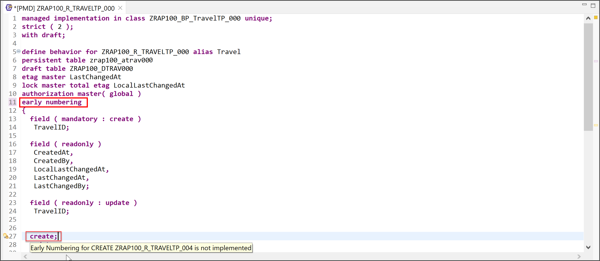
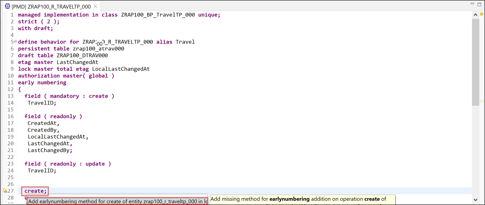
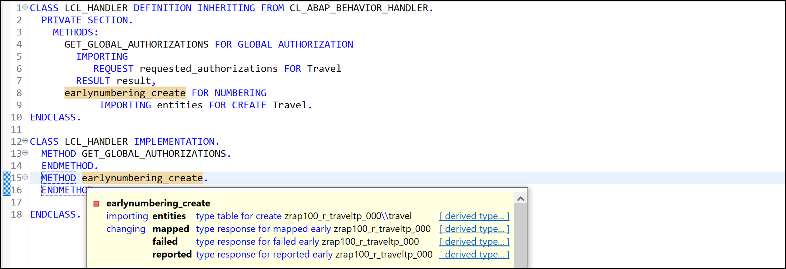
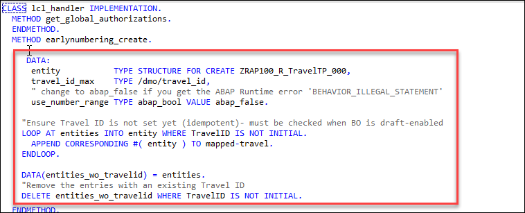
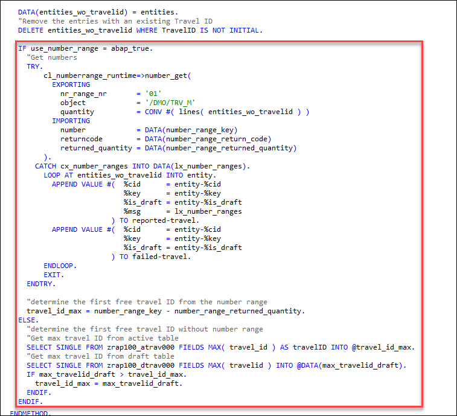
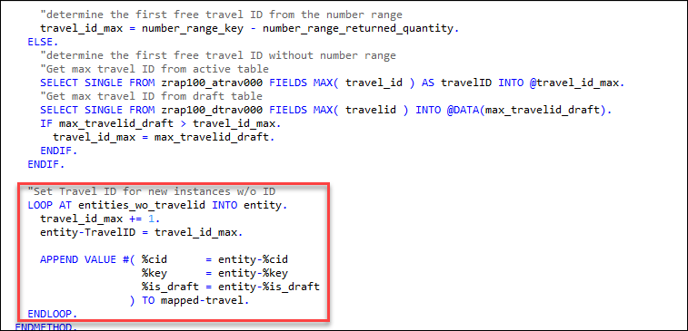
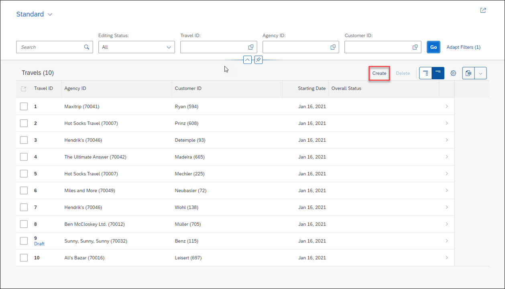
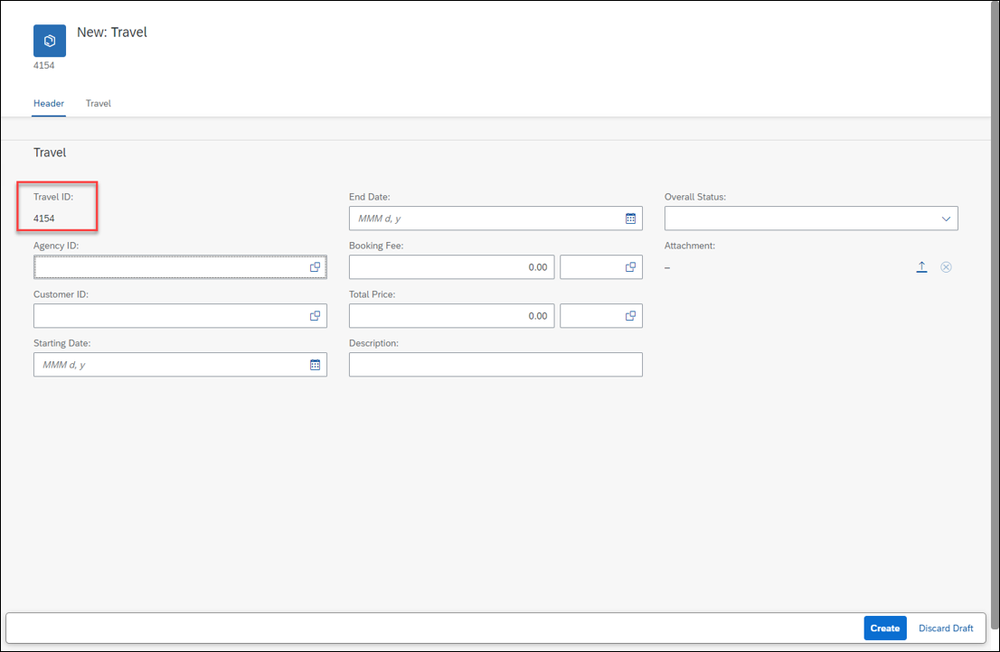

# Enhance the Business Object Behavior With Unmanaged Internal Numbering
<!-- description --> Enhance the business object behavior using early numbering with SAP BTP ABAP environment.

## Prerequisites
- You need to have access to an SAP BTP, ABAP environment, or SAP S/4HANA Cloud, ABAP environment or SAP S/4HANA (release 2021 or higher) system.
For example, you can create [free trial user on SAP BTP, ABAP environment](abap-environment-trial-onboarding).
- You have downloaded and installed the [latest ABAP Development Tools (ADT)] (https://tools.hana.ondemand.com/#abap) on the latest Eclipse© platform.

## You will learn  
  - How to define internal early numbering
  - How to implement internal early numbering
  - How to preview and test enhanced travel app

  In the previous exercise, you've enhanced the data model of the business object (BO) entity Travel.

  In the present exercise, you will define and implement the unmanaged internal early numbering to set the primary key `TravelID` of new Travel instances during their creation in your application. You will also use the static field control to specify some fields to read-only.
  A number range object will be used to determine the unique travel identifiers.

---

## Intro
>Reminder: Do not forget to replace the suffix placeholder ### with your chosen or assigned group ID in the exercise steps below.
>
>**Numbering:** Numbering is about setting values for primary key fields of entity instances during runtime. Different types of numbering are supported in RAP which can be divided into two main categories:

>**Early numbering:** In an early numbering scenario, the primary key value is set instantly after the modify request for the CREATE is executed. The key values can be passed externally by the consumer or can be set internally by the framework or an implementation of the FOR NUMBERING method. The latter will be implemented in the present exercise.
>
>**Late numbering:** In a late numbering scenario, the key values are always assigned internally without consumer interaction after the point of no return in the interaction phase has passed, and the SAVE sequence is triggered. Further reading: [Numbering](https://help.sap.com/docs/BTP/923180ddb98240829d935862025004d6/d85aec25222145f0b0cbbe8b02db51f0.html?state=PRODUCTION&version=Cloud&locale=en-US)

### Define internal early numbering

Define the (unmanaged) internal early numbering in the behavior definition  of the **Travel** entity.

 1. Open the behavior definition  **`ZRAP100_R_TravelTP_###`** of the **Travel** entity.

 2. Specify the statement provided below just after the statement `authorization master( global )`, just before the opening curly bracket `{` as shown on the screenshot.

    ```ABAP 
    early numbering
    ```

    The warning message **Early Numbering for `CREATE ZRAP100_R_TRAVELTP_###`** is not implemented is now displayed for the statement **`create;`**. You can hover the yellow underlined statement to display the message or have a look at the **Problems** view.        

    You can ignore it for now. You will handle it later.    

    


 3. Save  and activate  the changes.

 4. To complete the definition, you need to declare the required method in behavior implementation class. You can use the ADT Quick Fix to do that.
 
    Set the cursor on the statement **`create;`** and press **Ctrl+1** to open the **Quick Assist** view.

    Select the entry **Add `earlynumbering` method for create of entity `zrap100_i_travel_###` in local handler** from the dialog to add the **FOR NUMBERING** method **`earlynumbering_create`** to the local handler class **`lcl_handler`** of the behavior pool   **`ZRAP100_BP_TRAVEL_###`**.

    

    The behavior implementation class  **`ZRAP100_BP_TRAVEL_###`** will be enhanced appropriately.

    You are through with the definition of the early numbering and can now go ahead and implement its logic.     

 5. Save  and activate  the changes.


### Implement internal early numbering

You will now implement the logic for the unmanaged internal early numbering in behavior implementation class (aka behavior pool)  **`ZRAP100_BP_TRAVELTP_###`** of the **Travel** BO entity. A number range object will be used to determine the IDs of new **Travel** BO entity instances.

> **Please note**:   
>  Due to time constraints (and simplification reasons), the proper error handling when using number ranges is not part of this implementation example.
>Nevertheless, you can find a more comprehensive implementation example of a managed BO with a number range object in the behavior implementation class `/DMO/BP_TRAVEL_M` located in the package `/DMO/FLIGHT_MANAGED`. A description of this implementation is provided in the RAP development guide [Developing Managed Transactional Apps](https://help.sap.com/viewer/923180ddb98240829d935862025004d6/Cloud/en-US/b5bba99612cf4637a8b72a3fc82c22d9.html) on the SAP Help Portal.

 1. Check the method interface of the method **`earlynumbering_create`** in the declaration part of the local handler class `lcl_handler`.  

    For that, set the cursor on the method name and press **F2** to open the **ABAP Element Info** view and examine the full method interface, for example, the importing and changing parameters. You can navigate to the different (derived) types.

    

    Signature of the **FOR NUMBERING** method for managed business objects:

    - **IMPORTING** parameter **`entities`** - includes all entities for which keys must be assigned

    - Implicit **CHANGING** parameters (return parameters):   

        - **mapped** - used to provide the consumer with ID mapping information

        - **failed** - used for identifying the data set where an error occurred   

        - **reported** - used to return messages in case of failure.     

    Further reading: [Implicit Response Parameters](https://help.sap.com/viewer/fc4c71aa50014fd1b43721701471913d/202110.000/en-US/aceaf8453d4b4e628aa29aa7dfd7d948.html)               

 2. Now go ahead and implement the method **`earlynumbering_create`** in the implementation part of the implementation class. First, it must be ensured that the imported **Travel** entity instances do not yet have an ID set. This must especially be checked when the BO is draft-enabled. For that, remove all instances with a non-initial **`TravelID`** from the imported parameter **entities** which contains all **Travel** entities for which a key must be assigned. Insert the code snippet provided below into the method implementation and replace all occurrences of the placeholder `###` with your group ID.

    ```ABAP
    DATA:
      entity           TYPE STRUCTURE FOR CREATE ZRAP100_R_TravelTP_###,
      travel_id_max    TYPE /dmo/travel_id,
      " change to abap_false if you get the ABAP Runtime error 'BEHAVIOR_ILLEGAL_STATEMENT'
      use_number_range TYPE abap_bool VALUE abap_false.

    "Ensure Travel ID is not set yet (idempotent)- must be checked when BO is draft-enabled
    LOOP AT entities INTO entity WHERE TravelID IS NOT INITIAL.
      APPEND CORRESPONDING #( entity ) TO mapped-travel.
    ENDLOOP.

    DATA(entities_wo_travelid) = entities.
    "Remove the entries with an existing Travel ID
    DELETE entities_wo_travelid WHERE TravelID IS NOT INITIAL.
    ```

    

 3. Get the exact number range for the new ID according to number of relevant **Travel** entity instances stored in the internal table **`entities_wo_travelid`** and determine the current max ID. The number range object **`/DMO/TRV_M`** of the **ABAP Flight Reference Scenario** (located in the package `/DMO/FLIGHT_REUSE`) is used in the example implementation provided below.

    **Please note**: All participants are using the same number range object **`/DMO/TRV_M`**, therefore, the assigned Travel ID will not be gap-free.
    For that, enhance the method implementation with the provided code snippet as shown on the screenshot below. As already mentioned, the error handling is kept to the minimum here.

    ```ABAP
    IF use_number_range = abap_true.
      "Get numbers
      TRY.
          cl_numberrange_runtime=>number_get(
            EXPORTING
              nr_range_nr       = '01'
              object            = '/DMO/TRV_M'
              quantity          = CONV #( lines( entities_wo_travelid ) )
            IMPORTING
              number            = DATA(number_range_key)
              returncode        = DATA(number_range_return_code)
              returned_quantity = DATA(number_range_returned_quantity)
          ).
        CATCH cx_number_ranges INTO DATA(lx_number_ranges).
          LOOP AT entities_wo_travelid INTO entity.
            APPEND VALUE #(  %cid      = entity-%cid
                             %key      = entity-%key
                             %is_draft = entity-%is_draft
                             %msg      = lx_number_ranges
                          ) TO reported-travel.
            APPEND VALUE #(  %cid      = entity-%cid
                             %key      = entity-%key
                             %is_draft = entity-%is_draft
                          ) TO failed-travel.
          ENDLOOP.
          EXIT.
      ENDTRY.

      "determine the first free travel ID from the number range
      travel_id_max = number_range_key - number_range_returned_quantity.
    ELSE.
      "determine the first free travel ID without number range
      "Get max travel ID from active table
      SELECT SINGLE FROM zrap100_atrav### FIELDS MAX( travel_id ) AS travelID INTO @travel_id_max.
      "Get max travel ID from draft table
      SELECT SINGLE FROM zrap100_dtrav### FIELDS MAX( travelid ) INTO @DATA(max_travelid_draft).
      IF max_travelid_draft > travel_id_max.
        travel_id_max = max_travelid_draft.
      ENDIF.
    ENDIF.
    ```

    

     **Hint:** If you get the following error message: ABAP Runtime error 'BEHAVIOR_ILLEGAL_STATEMENT' then change the value of the variable `use_number_range` to `abap_false`. `use_number_range TYPE abap_bool VALUE abap_true`.


 4. Set the Travel ID for new **Travel** instances without identifier. Enhance the method implementation with the following code snippet as shown on the screenshot below.

    ```ABAP
    "Set Travel ID for new instances w/o ID
    LOOP AT entities_wo_travelid INTO entity.
     travel_id_max += 1.
     entity-TravelID = travel_id_max.

     APPEND VALUE #( %cid      = entity-%cid
                     %key      = entity-%key
                     %is_draft = entity-%is_draft
                   ) TO mapped-travel.
    ENDLOOP.  
    ``` 

    Remember to regularly use the **ABAP Pretty Printer** function **(Shift+F1)** to format your source code.

    

 5. Save  and activate  the changes.


### Preview and test enhanced travel app

You can now preview and test the changes by creating a new travel instance in the travel app.

  1. Refresh your application in the browser using **F5** if the browser is still open -   
     or go to your service binding  **`ZRAP100_UI_TRAVEL_O4_###`** and start the Fiori elements App preview for the **Travel** entity set.

  2. Create a new **Travel** instance. 

     

     No dialog for manually entering a Travel ID should be displayed now. The Travel ID will be assigned automatically by the logic you just implemented.

     


### Test yourself


 
---
