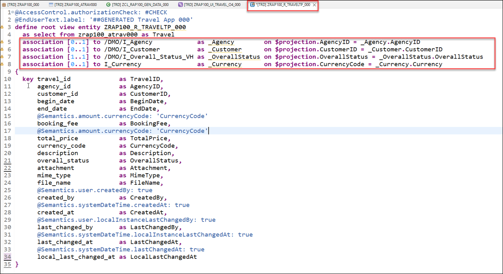
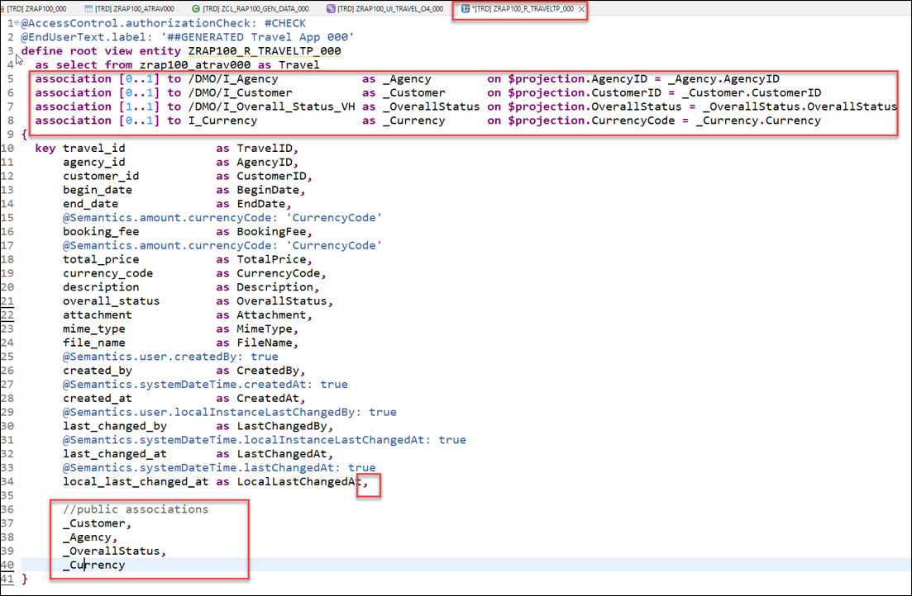
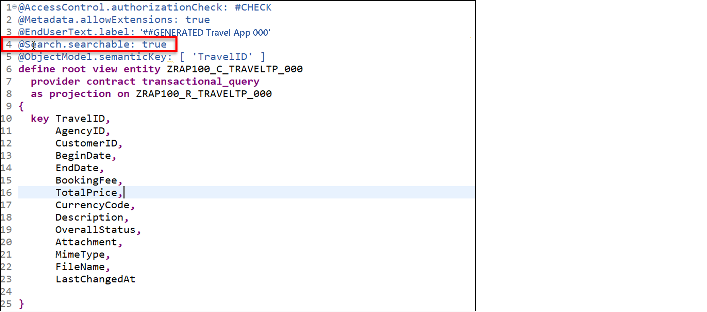
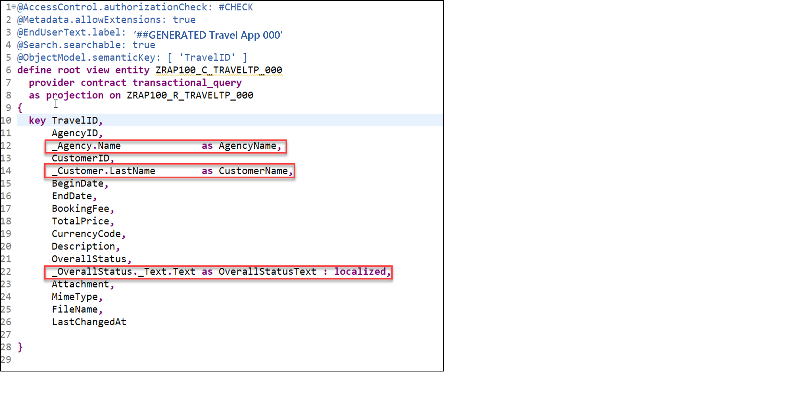
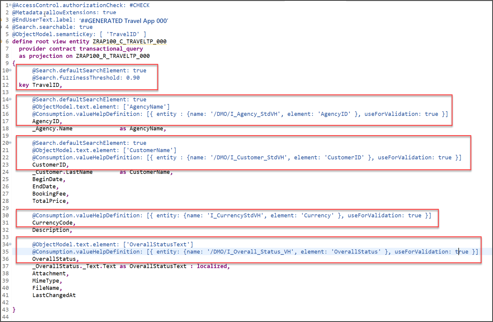
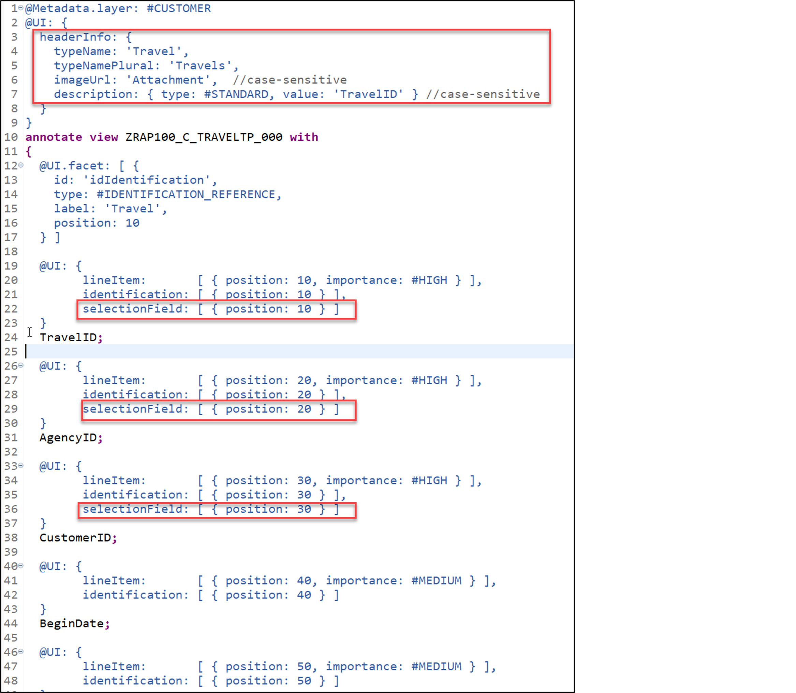
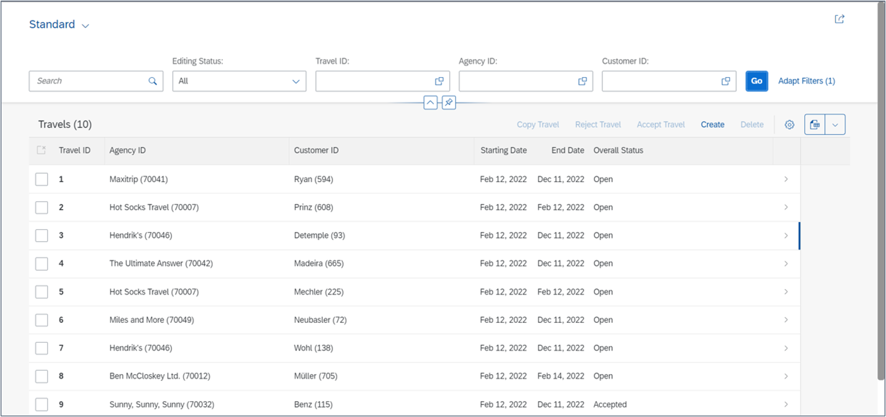
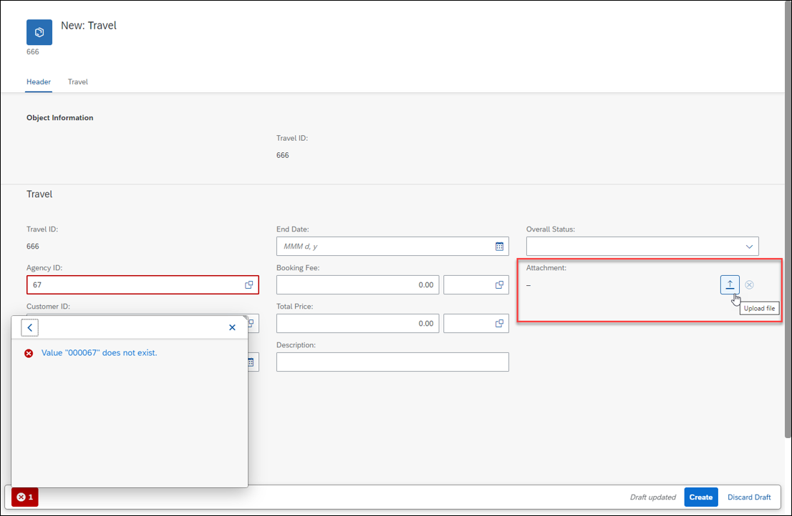
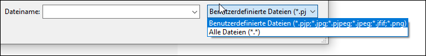

# Enhance the Business Object Data Model and Enable OData Streams
<!-- description --> Enhance the business object data model and enable OData streams with SAP BTP ABAP environment.
 
## Prerequisites
- You need to have access to an SAP BTP, ABAP environment, or SAP S/4HANA Cloud, ABAP environment or SAP S/4HANA (release 2021 or higher) system.
For example, you can create [free trial user on SAP BTP, ABAP environment](abap-environment-trial-onboarding).
- You have downloaded and installed the [latest ABAP Development Tools (ADT)] (https://tools.hana.ondemand.com/#abap) on the latest Eclipse© platform.


## You will learn   
  - How to enhance base business object data model
  - How to enhance projected business object data model
  - How to enhance metadata extension to adjust UI semantics
  - How to preview and test enhanced travel app

  In the previous exercise, you've created a database table for storing Travel data and generated your UI service - comprising the business object (BO) entity Travel - on top of it.

  In this exercise, you will enhance the base BO data model as well as the projected BO data model and its metadata extension, and test the enhanced Fiori elements Travel app. These enhancements will include the definition of new associations, elements, view annotations, and element annotations.

---

## Intro
>Reminder: Do not forget to replace the suffix placeholder ### with your chosen or assigned group ID in the exercise steps below.


### Enhance base business object data model

Define and expose new associations in the base BO data model defined in the CDS view entity **`ZRAP100_R_TRAVELTP_###`**:  

  - Associations to the business entities `/DMO/I_Customer` and `/DMO/I_Agency` 

  - Associations to the value help views  `I_Currency` and `/DMO/I_Overall_Status_VH` 
   
  1. Define the new associations **`_Agency`**, **`_Customer`**, **`_OverallStatus`**, and **`_Currency`**. Open your data definition  **`ZRAP100_R_TRAVELTP_###`** and insert the following code snippet after the `select` statement as shown on the screenshot below. Format the source code with **Pretty Printer** **(Shift+F1)**.   

    ```ABAP
    association [0..1] to /DMO/I_Agency            as _Agency        on $projection.AgencyID = _Agency.AgencyID
    association [0..1] to /DMO/I_Customer          as _Customer      on $projection.CustomerID = _Customer.CustomerID
    association [1..1] to /DMO/I_Overall_Status_VH as _OverallStatus on $projection.OverallStatus = _OverallStatus.OverallStatus
    association [0..1] to I_Currency               as _Currency      on $projection.CurrencyCode = _Currency.Currency
    ```

    Your source code should look like this: 
    
    
    

  2. Expose the defined associations **`_Agency`**, **`_Customer`**, **`_OverallStatus`** and **`_Currency`** in the selection list. For that, insert the code snippet provided below in the selection list between the curly brackets (`{...}`) as shown on the screenshot.

    ```ABAP
    ,
    //public associations
    _Customer,
    _Agency,
    _OverallStatus,
    _Currency
    ```

    

  3. Save  and activate  the changes.

### Enable the handling of large objects (aka OData streams)

Adjust the data model of the base RAP BO to enable the handling large objects (aka OData stream) in your SAP Fiori elements app. By doing that, you will give end-users the option to upload and download images from your travel app.

The only things you will have to do in the RAP business object, is to specify the appropriate semantics annotations for the relevant fields: attachment, `mimeType`, and `fileName`. You will also have to adjust the UI semantics in the CDS metadata extension for the appearance in the travel app.

>**Hint:** Further reading: [Working with Large Objects](https://help.sap.com/docs/BTP/923180ddb98240829d935862025004d6/10a3eb645b83413cbbebe4fc1d879a62.html)

  1. Remain in the CDS data definition `ZRAP100_R_TRAVELTP_###` and have a look at following elements in the select list:   
    - Attachment - It will be used to store the MIME object (stream). It must be annotated appropriately using the CDS annotation `@Semantics.largeObject`.
    - `MimeType` - It will be used to store the MIME type of the mime object (stream) It must be tagged appropriately using the CDS annotation `@Semantics.mimeType`.
    - `FileName` - It will be used to store the file name of the mime object (stream). No specific annotation is needed for this element.

  2. Use the code snippets provided below and annotate the elements as shown on the screenshot.

    For element `MimeType`:
    ```ABAP
    @Semantics.mimeType: true
    ```

    For element `Attachment`:
    ```ABAP
    @Semantics.largeObject: { mimeType: 'MimeType',   //case-sensitive
                           fileName: 'FileName',   //case-sensitive
                           acceptableMimeTypes: ['image/png', 'image/jpeg'],
                           contentDispositionPreference: #ATTACHMENT }
    ```

    

    Short explanation: The attributes of the annotation `@Semantics.largeObject`

    - `mimeType`: It indicates the name of the field containing the type of a MIME object. ⚠ The value is case sensitive.
    - `fileName`: It indicates the name of the field containing the file name of a MIME object. ⚠ The value is case sensitive.
    - `acceptableMimeTypes`: It provides the list of acceptable MIME types for the related stream property to restrict or verify the user entry accordingly. If any subtype is accepted, this can be indicated by *.
    - `contentDispositionPreference`: It indicates whether the content is expected to be displayed inline in the browser, i.e., as a Web page or as part of a Web page, or as an attachment, i.e., downloaded and saved locally.

  3. Save  and activate  the changes.


### Enhance projected business object data model

Enhance the projected BO data model defined in the CDS projection view  **`ZRAP100_C_TRAVELTP_###`**, aka consumption view.   
For example, you will allow the full-text search on some elements, add new elements for language-dependent descriptive texts, and define value helps.

  1. Open your data definition  **`ZRAP100_C_TRAVELTP_###`** and format the generated source code with the pretty printer (Shift+F1). Specify the projection view as searchable by adding the following view annotation as shown on the screenshot below:

    ```ABAP
    @Search.searchable: true
    ```

    >**Info:** In the generated data definition, the element `TravelID` is specified as the semantic key of the Travel entity with the view annotation @ObjectModel.semanticKey: [`TravelID`] and the CDS projection view is specified as business object projections with the addition provider contract `transactional_query` in the `DEFINE ROOT VIEW ENTITY` statement.

    Replace the end-user label text:

    ```ABAP
    @EndUserText.label: '##GENERATED Travel App (###)'
    ```

    Your source code should look like this:

    

  2. If not yet done, please format your source code with the pretty printer (Shift+F1).

  3. Enhance the selection list between the curly brackets (`{...}`) with the agency name, the customer name, and the descriptive text of the overall status.

    Agency Name:  
    ```ABAP
    _Agency.Name              as AgencyName,
    ```

    Customer Name:
    ```ABAP
    _Customer.LastName        as CustomerName,
    ```

    Overall Status Text:
    ```ABAP
    _OverallStatus._Text.Text as OverallStatusText : localized,   
    ```

    > Note: The keyword `localized` is used to display text elements in the current system language.

    Your source code should look like this:

    

  4. Use the provided code snippets to specify various element annotations for the elements **`TravelID`**, **`AgencyID`**, **`CustomerID`**, **`Currency Code`**, and **`OverallStatus`** between the curly brackets as shown on the screenshot below.

    For the element **`TravelID`**: Enable the full-text search with a specific fuzziness (error tolerance).

    ```ABAP
    @Search.defaultSearchElement: true
    @Search.fuzzinessThreshold: 0.90    
    ```

    For element **`AgencyID`**: Enable the full-text search, define a value help, and specified **`AgencyName`** as associated text.

    ```ABAP
    @Search.defaultSearchElement: true
    @ObjectModel.text.element: ['AgencyName']
    @Consumption.valueHelpDefinition: [{ entity : {name: '/DMO/I_Agency', element: 'AgencyID' } }]
    ```

    For element **`CustomerID`**: Enable the full-text search, define a value help, and specified **`CustomerName`** as associated text.

    ```ABAP
    @Search.defaultSearchElement: true
    @ObjectModel.text.element: ['CustomerName']
    @Consumption.valueHelpDefinition: [{ entity : {name: '/DMO/I_Customer', element: 'CustomerID'  } }]
    ```

    For  element **`Currency Code`**: Define a value help.

    ```ABAP
    @Consumption.valueHelpDefinition: [{ entity: {name: 'I_Currency', element: 'Currency' } }]
    ```

    For element **`OverallStatus`**: Define a value help and specified **`OverallStatusText`** as associated text.

    ```ABAP
    @ObjectModel.text.element: ['OverallStatusText']
    @Consumption.valueHelpDefinition: [{ entity: {name: '/DMO/I_Overall_Status_VH', element: 'OverallStatus' } }]
    ```

    Alternatively, you can simply replace the source code of your BO projection view  **`ZRAP100_C_RAP_TRAVEL_###`** with the code provided in the source code document linked below and replace all occurrences of the placeholder **`###`** with your group ID using **CTRL+F**.

     **Source code document**: [CDS projection view ZRAP100_C_TRAVELTP_###](EX2_DDLS_ZRAP100_C_TRAVELTP.txt). Format your source code with the ABAP Pretty Printer (Shift+F1). Your source code should look like this:

      

    >**Hint**: Frontend Validations
    Validations are used to ensure the data consistency.
    As the name suggests, frontend validations are performed on the UI. They are used to improve the user experience by providing faster feedback and avoiding unnecessary server roundtrips. In the RAP context, front-end validations are defined using CDS annotation (e.g. `@Consumption.valueHelpDefinition.useForValidation: true`) or UI logic.

  4. Save  and activate  the changes.


### Enhance metadata extension to adjust UI semantics

Enhance the metadata extension to change the appearance of the generated UI **Travel App**.

  1. Open your metadata extension  **`ZRAP100_C_TRAVELTP_###`** and adjust the UI annotations to achieve the following changes on the Fiori elements based UI of the **Travel App**.

    - Element **`TravelID`** - should also be a selection criteria in the filter bar and have high display importance on small windows.
    - Element **`AgencyID`** - should also be a selection criteria in the filter bar and have high display importance on small windows.
    - Element **`CustomerID`** - should also be a selection criteria in the filter bar and have high display importance on small windows.
    - Element **`BeginDate`** - (no changes)
    - Element **`EndDate`** - (no changes)
    - Element **`BookingFee`** - should not be displayed in the list table.
    - Element **`TotalPrice`** - should not be displayed in the list table.
    - Element **`CurrencyCode`** - should not be explicitly displayed, neither in the list table nor on the object page.
       **Hint:** The currency code will be automatically displayed on the UI thanks to `@consumption` annotations specified for the element `CurrencyCode` in the BO projection view.
    
    - Element **`Description`** - should not be displayed in the list table.
    - Element **`OverallStatus`** - should have a high display importance on small windows and only its associated descriptive text should be displayed on the UI.
    - Element Attachment - should only be displayed on the object page - not in the list table.
    - Element `MimeType` - should be hidden.
    - Element `FileName` - should be hidden.

    For that, replace the generated source code of the metadata extension with the code provided in the source code document linked below and replace all occurrence of the placeholder **`###`** with your group ID using **CTRL+F**.

     **Source code document**: [CDS metadata extension `ZRAP100_C_TRAVELTP_###`](EX2_DDLX_ZRAP100_C_TRAVELTP.txt)

    

   2. Save  and activate  the changes.

 

### Preview and test enhanced travel app

Test the enhanced SAP Fiori elements application.

  1. Open your service binding  **`ZRAP100_UI_TRAVEL_O4_###`** and double-click the **Travel** entity set to open the SAP Fiori elements preview.

    

  2. Click **Go** on the app and check the result.

  3. Play around in the app, e.g. filter the entries and test the defined value helps by creating a new entry or editing an existing one.

    a. You will notice, that on the list report page there are nice descriptions and options to filter the result.

    

    b. When you create a new entry or change an existing one you see that the values helps for the fields `Agency ID` and `Customer ID` offer an out of the box fronted validation.

    

    c. In addition your application allows you to upload pictures of type **`jpg`** and **`png`**.

    

### Test yourself


---
