# Create Database Table and Generate UI Service
<!-- description --> Create a database table and generate UI services with SAP BTP ABAP environment.

## Prerequisites
- You need an SAP BTP, ABAP environment [trial user](abap-environment-trial-onboarding) or a license.
- You have downloaded and installed the [latest ABAP Development Tools (ADT)] (https://tools.hana.ondemand.com/#abap).

## You will learn  
  - How to create an ABAP package
  - How to create a database table
  - How to create a data generator class
  - How to generate transactional UI services
  - How to preview the travel app

## Intro
In this exercise, you will create an ABAP package and database table. In your database table you will define all important fields. To fill all your database table fields, you will create an ABAP class and run it. With the transactional UI services you will be able to define all your UI services in one step. This includes the data model, projection view, service definition and service binding. Afterwards you will check your Travel application with the SAP Fiori elements preview.


---

### Create Package

Create your exercise package. This ABAP package will contain all the artefacts you will be creating in the different exercises of this tutorial.

 1. In ADT, go to the **Project Explorer**, right-click on the package `ZLOCAL`, and select **New** > **ABAP Package** from the context menu.

 2. Maintain the required information (`###` is your group ID):

    - Name: `ZRAP100_###`
    - Description: RAP100 Package `###`
    Select the box Add to favorites package

    Click **Next >**.

 3. Select a transport request, maintained a description (e.g. `RAP100 Package ###`), and click **Finish**.

      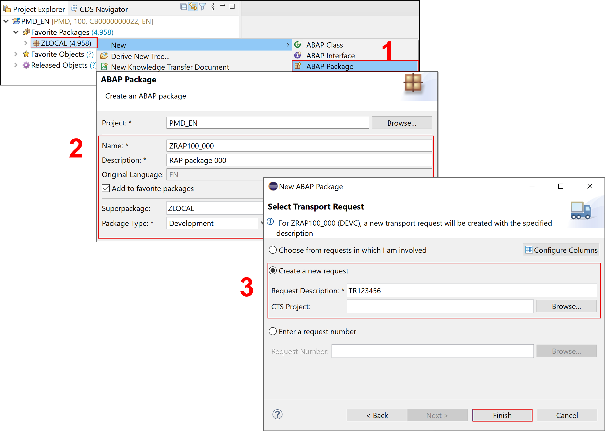


### Create database table


Create a database table to store the **Travel** data.   
A Travel entity defines general travel data, such as the agency ID or customer ID, overall status of the travel booking, and the price of travel.

 1. Right-click on your ABAP package **`ZRAP100_###`** and select **New** > **Other ABAP Repository Object** from the context menu.

 2. Search for **database table**, select it, and click **Next >**.

 3. Maintain the required information (`###` is your group ID) and click **Next >**.
    - Name: **`ZRAP100_ATRAV###`**
    - Description: **Travel data**                  

    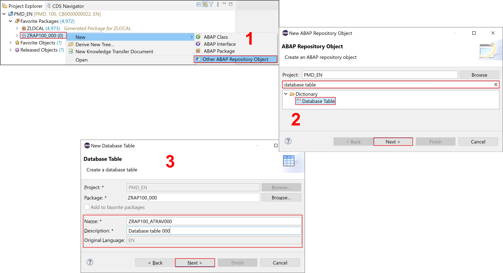

 4. Select a transport request, and click **Finish** to create the database table.

 5. Replace the default code with the code snippet provided below and replace all occurrences of the placeholder **`###`** with your group ID using the **Replace All** function (CTRL+F).

    ```ABAP
    @EndUserText.label : 'Travel data'
    @AbapCatalog.enhancement.category : #NOT_EXTENSIBLE
    @AbapCatalog.tableCategory : #TRANSPARENT
    @AbapCatalog.deliveryClass : #A
    @AbapCatalog.dataMaintenance : #RESTRICTED
    define table zrap100_atrav### {
      key client            : abap.clnt not null;
      key travel_id         : /dmo/travel_id not null;
      agency_id             : /dmo/agency_id;
      customer_id           : /dmo/customer_id;
      begin_date            : /dmo/begin_date;
      end_date              : /dmo/end_date;
      @Semantics.amount.currencyCode : 'zrap100_atrav###.currency_code'
      booking_fee           : /dmo/booking_fee;
      @Semantics.amount.currencyCode : 'zrap100_atrav###.currency_code'
      total_price           : /dmo/total_price;
      currency_code         : /dmo/currency_code;
      description           : /dmo/description;
      overall_status        : /dmo/overall_status;
      attachment            : /dmo/attachment;
      mime_type             : /dmo/mime_type;
      file_name             : /dmo/filename;
      created_by            : abp_creation_user;
      created_at            : abp_creation_tstmpl;
      last_changed_by       : abp_locinst_lastchange_user;
      last_changed_at       : abp_locinst_lastchange_tstmpl;
      local_last_changed_at : abp_lastchange_tstmpl;
    }      
    ```

 6. Save  and activate  the changes.


### Create data generator class


Create an ABAP class to generate demo **travel** data.

  1. Right-click your ABAP package **`ZRAP100_###`** and select **New** > **ABAP Class** from the context menu.

  2. Maintain the required information (`###` is your group ID) and click **Next >**.
      - Name: **`ZCL_RAP100_GEN_DATA_###`**
      - Description: **Generate demo data**      

      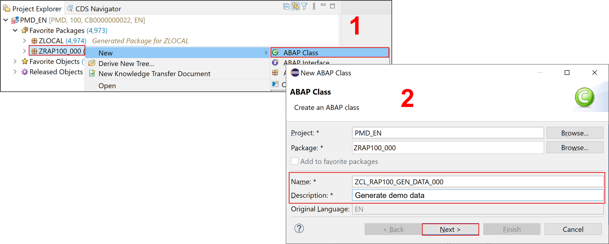

  3. Select a transport request and click **Finish** to create the class.

  4. Replace the default code with the code snippet provided in the source code document **`ZRAP100_GEN_DATA_###`** linked below and replace all occurrences of the placeholder **`###`** with your group ID using the **Replace All** function (CTRL+F).

    ```ABAP
    CLASS zcl_rap100_gen_data_### DEFINITION
     PUBLIC
      FINAL
      CREATE PUBLIC .

      PUBLIC SECTION.

        INTERFACES if_oo_adt_classrun.
      PROTECTED SECTION.
      PRIVATE SECTION.
    ENDCLASS.

    CLASS zcl_rap100_gen_data_### IMPLEMENTATION.

      METHOD if_oo_adt_classrun~main.
        DATA:
          group_id   TYPE string VALUE '###',
          attachment TYPE /dmo/attachment,
          file_name  TYPE /dmo/filename,
          mime_type  TYPE /dmo/mime_type.

    *   clear data
        DELETE FROM zrap100_atrav###.
    *    DELETE FROM zrap100_dtrav###.

        "insert travel demo data
        INSERT zrap100_atrav###  FROM (
            SELECT
              FROM /dmo/travel AS travel
              FIELDS
                travel~travel_id        AS travel_id,
                travel~agency_id        AS agency_id,
                travel~customer_id      AS customer_id,
                travel~begin_date       AS begin_date,
                travel~end_date         AS end_date,
                travel~booking_fee      AS booking_fee,
                travel~total_price      AS total_price,
                travel~currency_code    AS currency_code,
                travel~description      AS description,
                CASE travel~status    "[N(New) | P(Planned) | B(Booked) | X(Cancelled)]
                  WHEN 'N' THEN 'O'
                  WHEN 'P' THEN 'O'
                  WHEN 'B' THEN 'A'
                  ELSE 'X'
                END                     AS overall_status,
                @attachment             AS attachment,
                @mime_type              AS mime_type,
                @file_name              AS file_name,
                travel~createdby        AS created_by,
                travel~createdat        AS created_at,
                travel~lastchangedby    AS last_changed_by,
                travel~lastchangedat    AS last_changed_at,
                travel~lastchangedat    AS local_last_changed_at
                ORDER BY travel_id UP TO 10 ROWS
          ).
        COMMIT WORK.
        out->write( |[RAP100] Demo data generated for table ZRAP100_ATRAV{ group_id }. | ).
      ENDMETHOD.
    ENDCLASS.
    ```

  5. Save  and activate  the changes.

  6. Run your console application. For that, select your ABAP class  **`ZCL_RAP100_GEN_DATA_###`**, select the run button > **Run As** > **ABAP Application (Console) F9** or press **F9**. A message will be displayed **ABAP Console**.

      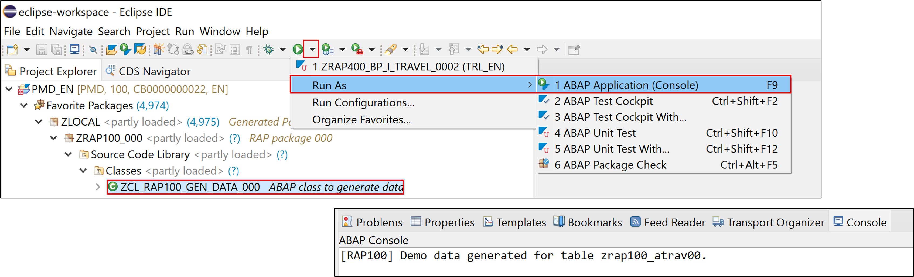  

  7. Open your database table  **`ZRAP100_ATRAV###`** and press **F8** to start the data preview and display the filled database entries, i.e. **travel** data.

      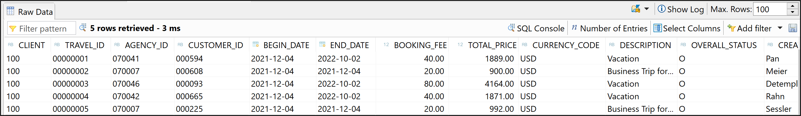   


### Generate transactional UI services


Create your OData v4 based UI services with the built-in ADT generator.   
The generated business service will be transactional, draft-enabled, and enriched with UI semantics for the generation of the Fiori elements app.


 1. Right-click your database table  **`ZRAP100_ATRAV###`**  and select **Generate ABAP Repository Objects** from the context menu.  

 2. Maintain the required information  (`###` is your group ID) and click **Next >**:
      - Description: **`Travel App ###`**
      - Generator: **`ABAP RESTful Application Programming Model: UI Service`**

    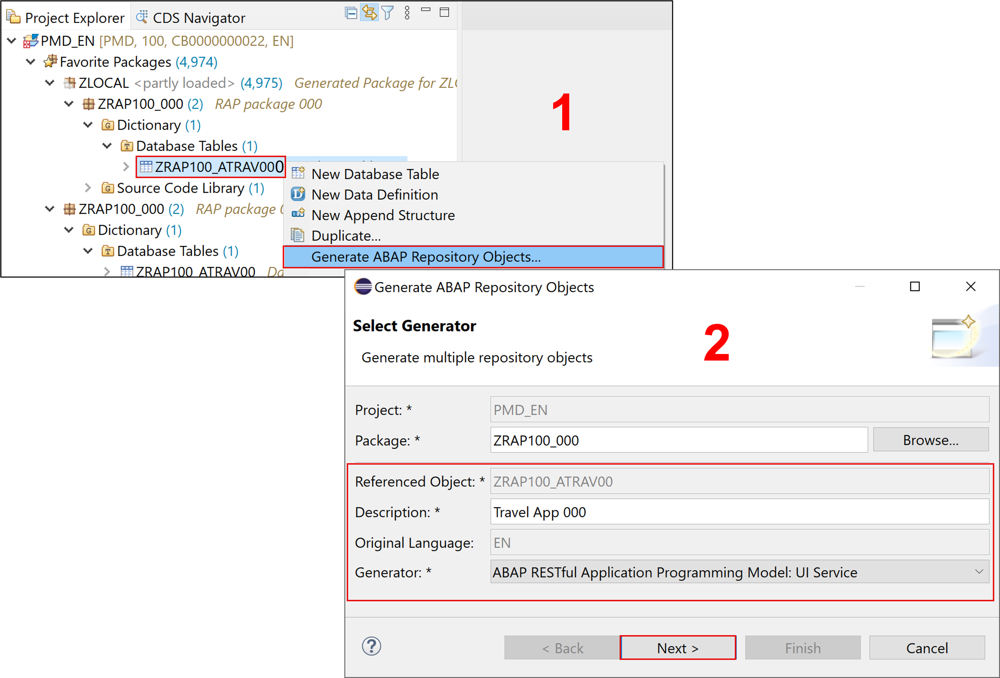

 3. Maintain the required information on the **Configure Generator** dialog to provide the name of your data model and generate them.         

    For that, navigate through the wizard tree **(Business Objects, Data Model, etc...)**, maintain the artefact names provided in the table below,
    and press **Next >**.

    Verify the maintained entries and press **Next >** to confirm. The needed artifacts will be generated.

    > **Please note**: Error Invalid XML format  
    > If you receive an error message **Invalid XML format of the response**, this may be due to a bug in version 1.26 of the ADT tools.  
    > An update of your ADT plugin to version 1.26.3 will fix this issue.

    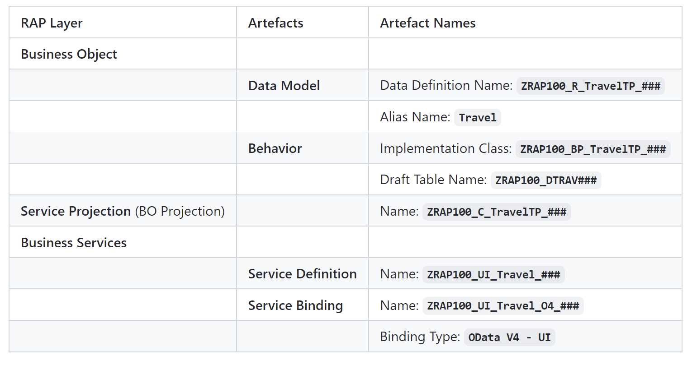  

    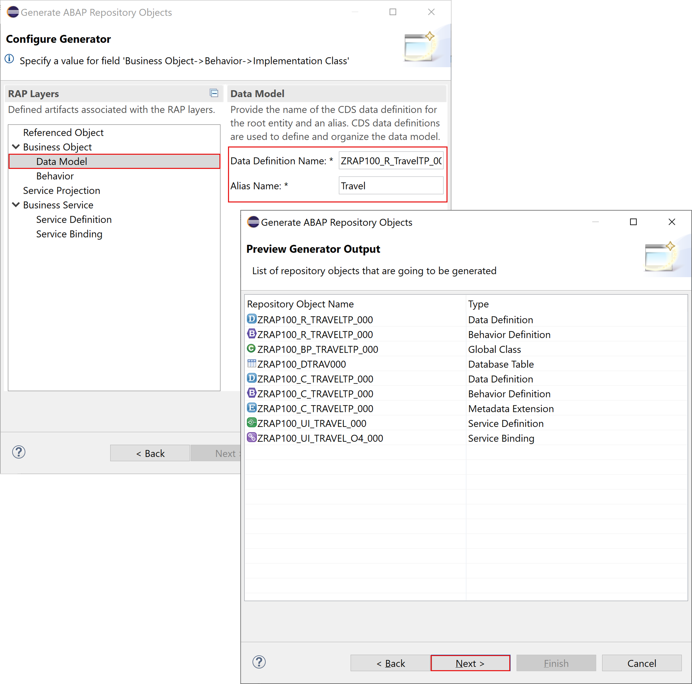                    


 4. Go to the **Project Explorer**, select your package  **`ZRAP100_###`**, refresh it by pressing **F5**, and check all generated ABAP repository objects

    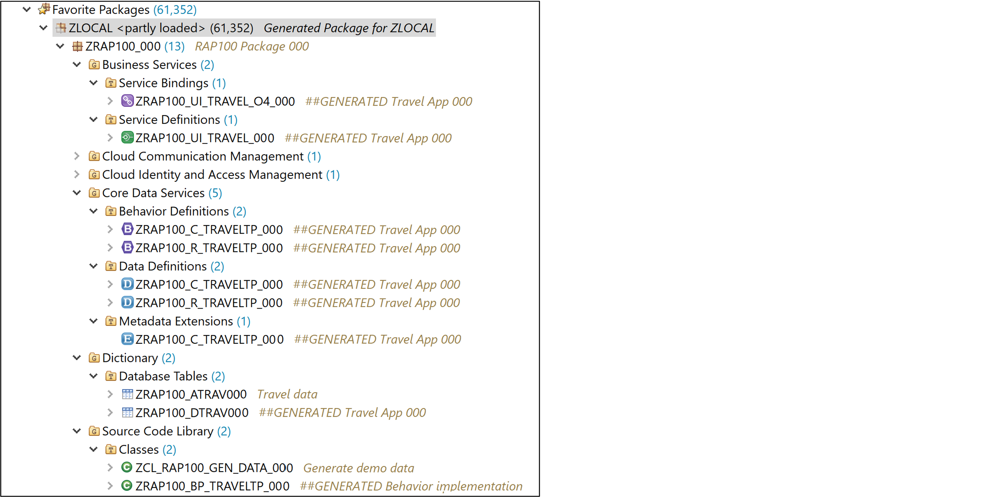

    Below is a brief explanation of the generated artefacts for the different RAP layers: Base BO, BO Projection, and Business Service.

    **Base Business Object (BO) `ZRAP100_I_TRAVEL_###`**

      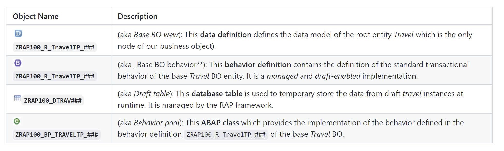

    **BO Projection `ZRAP100_C_TRAVEL_###`**

    The BO projection represents the consumption specific view on the BO data model and behavior.

      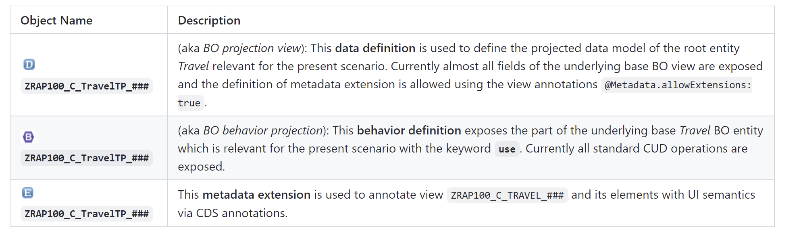

    **Business Service**

      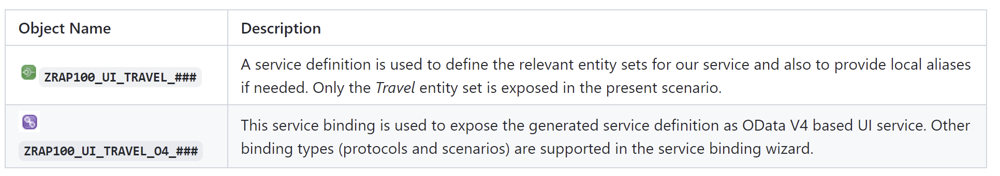


### Preview travel app


Publish the local service endpoint of your service binding  and start the **Fiori elements App Preview**.


 1. Open your service binding  **`ZRAP100_UI_TRAVEL_O4_###`** and click **Publish**.

 2. Double-click on the entity **Travel** in the **Entity Set and Association** section to open the **Fiori elements App Preview**.

     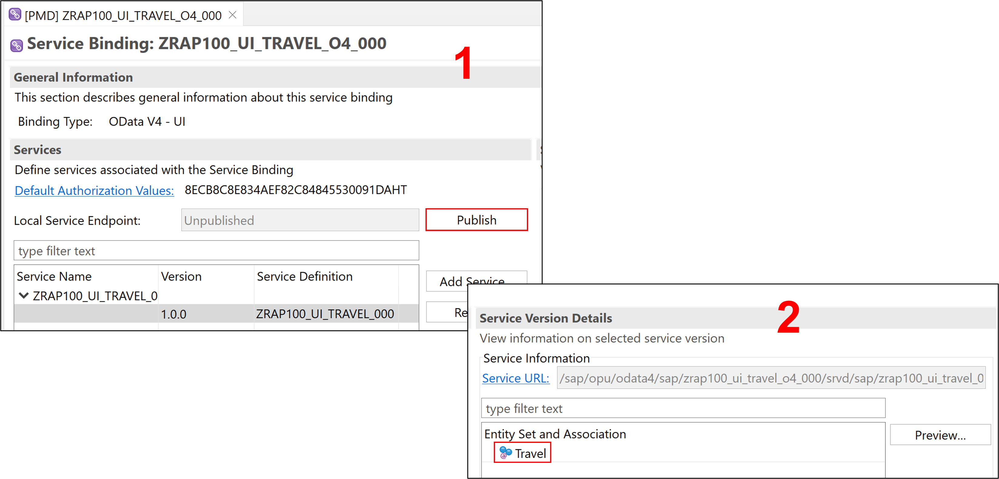

 3. Click the button on the **Travel** app **Go** to load the data.

 4. Check your result.

     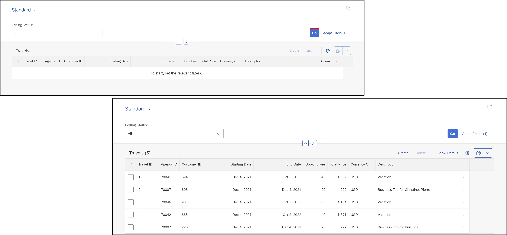


### Test yourself


---
