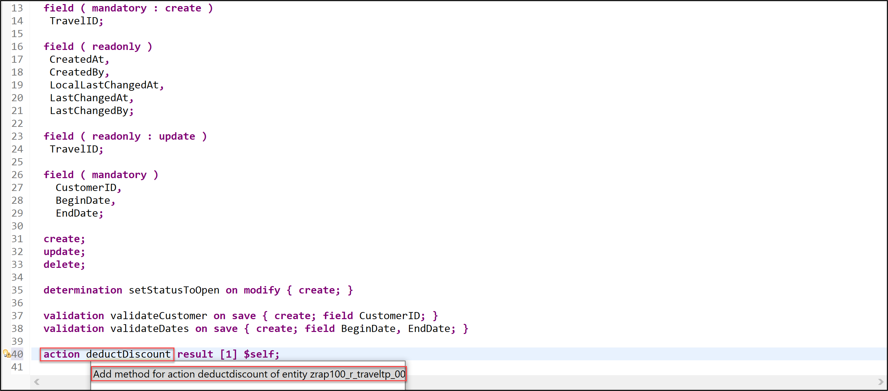
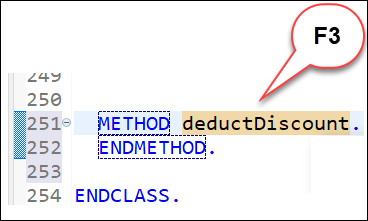

# Enhance the Business Object Behavior With Instance Action
<!-- description --> Enhance the business object behavior using instance action with SAP BTP ABAP environment.

## Prerequisites
- You need an SAP BTP, ABAP environment [trial user](abap-environment-trial-onboarding) or a license.
- You have downloaded and installed the [latest ABAP Development Tools (ADT)] (https://tools.hana.ondemand.com/#abap).

## You will learn  
  - How to define actions
  - How to implement actions
  - How to preview and test enhanced travel app

  In the previous exercise, you've defined and implemented two validations.

  In the present exercise, you will learn how to add different instance-bound actions (aka instance actions) to your application: instance non-factory actions w/o input parameters, instance non-factory action with input parameters, and instance-bound factory actions. For simplification reasons, `_non-factory actions_` will be called `_actions_` in the exercise description.

## Intro
> **Please note**: The purpose of the different exercises is to show you how to implement the different instance action types - and less on having the perfect business scenario.

---

>Reminder: Do not forget to replace the suffix placeholder ### with your chosen or assigned group ID in the exercise steps below.
>
>**About: Actions**  
>
> In the RAP context, an action is a non-standard operation that change the data of a BO instance. They are self-implemented operations.   
> Two main categories of actions can be implemented in RAP:  
>
> - **Non-factory actions**: Defines a RAP action which offers non-standard behavior. The custom logic must be implemented in the RAP handler method `FOR MODIFY`. An action per default relates to a RAP BO entity instance and changes the state of the instance.  An action is related to an instance by default. If the optional keyword `static` is used, the action is defined as static action. Static actions are not bound to any instance of a RAP BO entity but relate to the complete entity.
>
> - **Factory actions**: Factory actions are used to create RAP BO entity instances. Factory actions can be instance-bound (default) or static. Instance-bound factory actions can copy specific values of an instance. Static factory actions can be used to create instances with `prefilled` default values.
>
> **Further reading**: [Actions](https://help.sap.com/viewer/923180ddb98240829d935862025004d6/Cloud/en-US/83bad707a5a241a2ae93953d81d17a6b.html) **|** [CDS BDL - non-standard operations](https://help.sap.com/doc/abapdocu_cp_index_htm/CLOUD/en-US/index.htm?file=abenbdl_nonstandard.htm) **|** [Implicit Response Parameters](https://help.sap.com/viewer/923180ddb98240829d935862025004d6/Cloud/en-US/aceaf8453d4b4e628aa29aa7dfd7d948.html) **|** [ABAP EML - `response_param`](https://help.sap.com/doc/abapdocu_cp_index_htm/CLOUD/en-US/index.htm?file=abapeml_response.htm)

### Define an instance action

You will now define, implement, and expose the action `deductDiscount`, a non-factory instance-bound action returning itself. The action offers the possibility to deduct a certain percentage from the booking fee ( `BookingFee` ) of a travel instance.

The discount percentage can either be fix (30% in the present exercise) in the action implementation or be freely specified by the end-user or the calling APIs by offering an action with input parameters.

You will get familiar with both action implementations, i.e. action without and action with input parameters in the present exercise.

>**Hint:** First, define the non-factory, instance action `deductDiscount` in the behavior definition of the Travel entity. This action has no input parameter.

  1. Go to your behavior definition  **`ZRAP100_R_TRAVELTP_###`**  define the instance action without input parameter. For that, insert the following code snippet after the defined validations as shown on the screenshot below.

    ```ABAP
    action deductDiscount result [1] $self; 
    ```      

           

     **Short explanation**:  
     - The name of the instance action is specified after the keyword **action**

     - The keyword **result** defines the output parameter of the action.

        - Its cardinality is specified between the square brackets (`[cardinality]`). It is a mandatory addition.  

        - **`$self`** specifies that the type of the result parameter is the same type as the entity for which the action or function is defined - i.e. the **Travel** entity type in the present exercise. The return type of the result parameter can be an entity or a structure.     

      - **Note**: The output parameter **result** can be used to store the result of an action or function in an internal table. However, it does not affect the result of an action or function that is committed to the database.   

      **Further reading**: [Action Definition](https://help.sap.com/viewer/923180ddb98240829d935862025004d6/Cloud/en-US/14ddc6b2442b4b97842af9158a1c9c44.html)

  2. Save  and activate  the changes.

  3. Now, declare the required method in behavior implementation class with the ADT Quick Fix. Set the cursor on the `deductDiscount`, and press `Ctrl+1` to open the Quick Assist view. 

     Select the entry Add method for action `deductDiscount` of entity `zrap100_r_traveltp_###` ... in the view to add the required method to the local handler class.

     The result should look like this:
 
     

  4. Save  the changes.

  5. Set the cursor on the method name, `deductDiscount`, press F3 to navigate to the declaration part of the local handler class of the behavior pool `ZRAP100_BP_TRAVELTP_###`.

     

  6. In the declaration part set the cursor on the method name `deductDiscount`, press F2, and examine the full method interface.
  
     

      Short explanation:

      The addition FOR MODIFY after the method name, together with the addition FOR ACTION after the importing parameter, indicates that this method provides the implementation of an action. Method signature for the non-factory instance action `deductDiscount`:

       - IMPORTING parameter keys - a table containing the keys of the instances on which the action must be executed
       - Implicit CHANGING parameters (aka implicit response parameters):
        - result - used to store the result of the performed action.
        - mapped - table providing the consumer with ID mapping information.
        - failed - table with information for identifying the data set where an error occurred.
        - reported - table with data for instance-specific messages.

        >Please note:
        An action is implemented in a FOR MODIFY method with the addition FOR ACTION. The signature of an action method always depends on the type of action: factory or non-factory, and instance or static. The rules for implementing an action operation in a RAP business object are explained in the respective Implementation Contract.

        >**Hint:** Further reading: [Action Implementation](https://help.sap.com/docs/BTP/923180ddb98240829d935862025004d6/6edad7d113394602b4bfa37e07f37764.html?locale=en-US)| [Implementation Contract: Action](https://help.sap.com/docs/BTP/923180ddb98240829d935862025004d6/de6569d4b92e40a0911c926170140beb.html?locale=en-US)

      Go ahead with the implementation of the action method.


### Implement the action method

Now implement the required action methods in the behavior pool of the **Travel** entity.

 1. Implement the action method `deductDiscount`. 

        

    The main steps of the implemented business logic:

      - Implement the custom logic to determine the new values: The discounted booking fee must be calculated for each instance.
      - The discount percentage is fix at the current stage: 30%.
      - Modify the relevant fields of the instances with the EML statement `MODIFY`: Here only the field `BookingFee` must be updated.
      - Read the data from the buffer with the EML statement READ to fill the action result parameter result.
      - The implicit response parameters are filled where necessary:
          - failed - with information for identifying the data set where an error occurred.
          - mapped - table providing the consumer with ID mapping information.
          - reported - with data for instance-specific messages in case of failure.

    Replace the current method implementation with the code snippet provided below and replace all occurrences of the placeholder ### with your group ID.

    You can use the ABAP Pretty Printer (Ctrl+F1) to format your source code. 

    ```ABAP  
    **************************************************************************
    * Instance-bound non-factory action:
    * Deduct the specified discount from the booking fee (BookingFee)
    **************************************************************************
    METHOD deductDiscount.
      DATA travels_for_update TYPE TABLE FOR UPDATE ZRAP100_R_TravelTP_###.
      DATA(keys_with_valid_discount) = keys.   

      " read relevant travel instance data (only booking fee)
      READ ENTITIES OF ZRAP100_R_TravelTP_### IN LOCAL MODE
          ENTITY Travel
          FIELDS ( BookingFee )
          WITH CORRESPONDING #( keys_with_valid_discount )
          RESULT DATA(travels).

      LOOP AT travels ASSIGNING FIELD-SYMBOL(<travel>).  
          DATA(reduced_fee) = <travel>-BookingFee * ( 1 - 3 / 10 ) .  

          APPEND VALUE #( %tky       = <travel>-%tky
                        BookingFee = reduced_fee
                      ) TO travels_for_update.
      ENDLOOP.

      " update data with reduced fee
      MODIFY ENTITIES OF ZRAP100_R_TravelTP_### IN LOCAL MODE
          ENTITY Travel
          UPDATE FIELDS ( BookingFee )
          WITH travels_for_update.

      " read changed data for action result
      READ ENTITIES OF ZRAP100_R_TravelTP_### IN LOCAL MODE
          ENTITY Travel
          ALL FIELDS WITH
          CORRESPONDING #( travels )
          RESULT DATA(travels_with_discount).

      " set action result
      result = VALUE #( FOR travel IN travels_with_discount ( %tky   = travel-%tky
                                                                %param = travel ) ).
    ENDMETHOD.
    ```

    The result should look like this:

     

     Short explanation:

       - The provided implementation is mass-enabled. This is recommended.
       - The EML statement MODIFY ENTITIES ... UPDATE FIELDS is used to update specific fields of the instances.
       - The internal tables are filled inline using the constructor operator VALUE which made the need for explicit declaration obsolete.
       - The EML statement READ ENTITIES ... ALL FIELDS WITH CORRESPONDING is used to read all fields of the updated instances from the buffer to fill the input paramter result.

 2. Save  and activate  the changes.

 
### Expose and test action

In contrary to determinations and validations which are automatically called by the RAP runtime at the specified trigger time, actions must be explicitly exposed on the BO projection layer and called by a consumer, e.g. on the UI or directly via EML statements.

Now, you will expose the actions in the BO behavior projection and enrich the UI semantics in the CDS metadata extension to add appropriate button to the **travel** App.

 1. Expose the actions in the BO behavior projection.

    Go to your behavior projection  **`ZRAP100_C_TRAVELTP_###`** and insert the following code snippet as shown on the screenshot below. The keyword **`use action`** indicates that a behavior of the base BO is used on the projection layer.

    ```ABAP  
    use action deductDiscount;
    ```

    Your source code should look like this:

    

 2. Save  and activate  the changes.

    The actions are yet ready to be consumed on the UI, but they also need to be explicitly placed on the UI.

 3. Enhance UI semantics of the UI service to make the action `deductDiscount` only visible on the object page with the label `Deduct Discount`. with the labels **Accept Travel** and **Reject Travel** specified.

    For that, go to your CDS metadata extension  **`ZRAP100_C_TRAVELTP_###`** and replace the existing all `@UI` annotations placed before the element **`OverallStatus`** with the code snippet provided below as shown on the screenshot below. The semantic of the annotation `@UI.identification` will be enhanced for the purpose.

    **Please note**: Some lines in the provided code snippet are commented out using **`//`**. **DO NOT remove them**. You will uncomment these lines in the following exercise steps.

    ```ABAP
      @UI: {
      lineItem:       [ { position: 100, importance: #HIGH }                          
                        //,{ type: #FOR_ACTION, dataAction: 'copyTravel', label: 'Copy Travel' } 
                        //,{ type: #FOR_ACTION, dataAction: 'acceptTravel', label: 'Accept Travel' }
                        //,{ type: #FOR_ACTION, dataAction: 'rejectTravel', label: 'Reject Travel' }
           ],
      identification: [ { position: 100 }                          
                       ,{ type: #FOR_ACTION, dataAction: 'deductDiscount', label: 'Deduct Discount' } 
                       //,{ type: #FOR_ACTION, dataAction: 'acceptTravel', label: 'Accept Travel' }
                       //,{ type: #FOR_ACTION, dataAction: 'rejectTravel', label: 'Reject Travel' }
           ],
        textArrangement: #TEXT_ONLY
      }
    ```

    Your source code should look like this:

    

 4. Save  and activate  the changes.

 5. Preview and test the enhanced SAP Fiori elements App.

    For example, select a travel entry, navigate to the object page, and click on the new action button `Deduct Discount`. Check the action result: the booking fee must have been reduced by the percentage specified in the action method.

    

    If you wish, you can also define the button on the list report page in the CDS metadata extension, activate the changes, and re-test the app.

### Add an input parameter

You will enhance the action `deductDiscount` with an input parameter ( `discount_percent` ) to allow end-users or calling APIs to freely specify the percentage to be deducted from the booking fee ( `BookingFee` ) of a travel instance at runtime.

Action input parameters are modelled with abstract CDS entities (abstract entities). In the present example, we will use the abstract entity `/dmo/a_travel_discount` which defines a structure containing only one field, `discount_percent`, for the purpose. It is located in the package `/DMO/FLIGHT_DRAFT` of the flight reference scenario.

An abstract CDS entity defines the type properties of a CDS entity. Consequently, it provides metadata on element level or parameter level using CDS annotations and does not have a corresponding implementation nor an underlying persistency.

 1. Let's have a look at the abstract entity defined in the data definition `/DMO/A_Travel_Discount`. You can use the shortcut `Ctrl+Shift+A` to open the data definition.

    

    Short explanation:

    - An abstract entity is defined by the statement define abstract entity followed by the CDS entity name.
    - The current abstract entity defines a structure with only one field or element; The element name ( `discount_percent` ) and the element type ( `abap.int1` ) are specified.
    - It is not here the case, but if required, it is possible to...
      - specify a label using the element annotation `@EndUserText.label`.
      - specify a value help using the element annotation `@Consumption.valueHelpDefinition`.
      - hide an element using the element `annotation @UI.hidden`.


 2. Go to the behavior definition `ZRAP100_R_TRAVELTP_###` and add the addition parameter `/dmo/a_travel_discount` to the action definition.    
    
    The source code should now look as follows:

    ```ABAP 
    action deductDiscount parameter /dmo/a_travel_discount result [1] $self;
    ```
    
    The abstract entity `/dmo/a_travel_discount` is used after the keyword parameter to specify the parameter structure. The present action will only have one parameter ( `discount_percent` ) as defined in the abstract entity.

 3. Save  and activate  the changes.


### Adjust the action method

You will now adjust the implementation of the business logic for the instance non-factory action `deductDiscount` with the input parameter `deduct_discount` in the behavior pool `ZRAP100_BP_TRAVELTP_###`.

Only entered values greater than 0 and lower than 100 will be allowed.

Depending on the type of action, the importing parameter keys has different components. The parameter structure `%param` for parameter input is imported by action with parameters. The parameter structure is used to access the passed values of the input parameters: `deduct_discount` in the present scenario - i.e. `%param-deduct_discount`.

 1. Go to your behavior pool `ZRAP100_BP_TRAVELTP_###` and adjust the action method `deductDiscount`.

    The required adjustments of the current business logic: 

    For all passed Travel instances: Read and check the validity of the specified discount values from the parameter structure `%param`, and remove invalid ones: `0 < %param-deduct_discount <= 100`   
    Implement the custom logic to determine the new values: The discounted booking must be calculated for each instance according to the respective `%param-deduct_discount value - instead of the fix discount (30%)`.
    
    Replace the current method implementation with the code snippet provided below. Do not forget to replace all occurrences of the placeholder `###` with your group ID.

    You can use the **ABAP Pretty Printer (Ctrl+F1)** to format your source code.

    ```ABAP 
    **************************************************************************
    * Instance-bound non-factory action with parameter `deductDiscount`:
    * Deduct the specified discount from the booking fee (BookingFee)
    **************************************************************************
    METHOD deductDiscount.
      DATA travels_for_update TYPE TABLE FOR UPDATE ZRAP100_R_TravelTP_###.
      DATA(keys_with_valid_discount) = keys.

      " check and handle invalid discount values
      LOOP AT keys_with_valid_discount ASSIGNING FIELD-SYMBOL(<key_with_valid_discount>)
        WHERE %param-discount_percent IS INITIAL OR %param-discount_percent > 100 OR %param-discount_percent <= 0.

        " report invalid discount value appropriately
        APPEND VALUE #( %tky                       = <key_with_valid_discount>-%tky ) TO failed-travel.

        APPEND VALUE #( %tky                       = <key_with_valid_discount>-%tky
                        %msg                       = NEW /dmo/cm_flight_messages(
                                                          textid = /dmo/cm_flight_messages=>discount_invalid
                                                          severity = if_abap_behv_message=>severity-error )
                        %element-TotalPrice        = if_abap_behv=>mk-on     
                        %op-%action-deductDiscount = if_abap_behv=>mk-on
                      ) TO reported-travel.

        " remove invalid discount value
        DELETE keys_with_valid_discount.
      ENDLOOP.

      " check and go ahead with valid discount values
      CHECK keys_with_valid_discount IS NOT INITIAL.

      " read relevant travel instance data (only booking fee)
      READ ENTITIES OF ZRAP100_R_TravelTP_### IN LOCAL MODE
        ENTITY Travel
          FIELDS ( BookingFee )
          WITH CORRESPONDING #( keys_with_valid_discount )
        RESULT DATA(travels).

      LOOP AT travels ASSIGNING FIELD-SYMBOL(<travel>).
        DATA percentage TYPE decfloat16.
        DATA(discount_percent) = keys_with_valid_discount[ key draft %tky = <travel>-%tky ]-%param-discount_percent.
        percentage =  discount_percent / 100 .
        DATA(reduced_fee) = <travel>-BookingFee * ( 1 - percentage ) .

        APPEND VALUE #( %tky       = <travel>-%tky
                        BookingFee = reduced_fee
                      ) TO travels_for_update.
      ENDLOOP.

      " update data with reduced fee
      MODIFY ENTITIES OF ZRAP100_R_TravelTP_### IN LOCAL MODE
        ENTITY Travel
          UPDATE FIELDS ( BookingFee )
          WITH travels_for_update.

      " read changed data for action result
      READ ENTITIES OF ZRAP100_R_TravelTP_### IN LOCAL MODE
        ENTITY Travel
          ALL FIELDS WITH
          CORRESPONDING #( travels )
        RESULT DATA(travels_with_discount).

      " set action result
      result = VALUE #( FOR travel IN travels_with_discount ( %tky   = travel-%tky
                                                              %param = travel ) ).
    ENDMETHOD.
    ```

    The result should look like this:


    


 2. Save  and activate  the changes.


### Test the action with parameter

You can now test the new behavior of the action button `Deduct Discount` on the enhanced travel app.

 1. Preview and test the enhanced Fiori elements travel app. Go to the object page of a given entry, click on the new action button Deduct Discount. A dialog will now be prompted for you to enter a valid discount value, i.e. `> 0 and <= 100`, and confirm.

    Check the result.

    

    You can also repeat the test with an invalid value.

    


### Test yourself


---
 