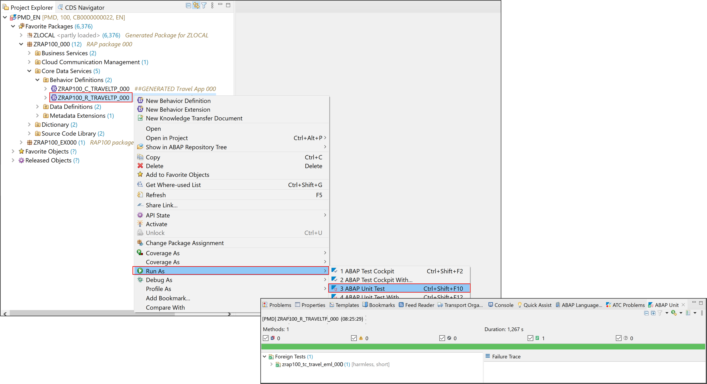

# Write an ABAP Unit Test for the RAP Business Object
<!-- description --> Write an ABAP Unit Test for the RAP business object.

## Prerequisites
- You need to have access to an SAP BTP, ABAP environment, or SAP S/4HANA Cloud, ABAP environment or SAP S/4HANA (release 2021 or higher) system.
For example, you can create [free trial user on SAP BTP, ABAP environment](abap-environment-trial-onboarding).
- You have downloaded and installed the [latest ABAP Development Tools (ADT)] (https://tools.hana.ondemand.com/#abap) on the latest Eclipse© platform.


## You will learn   
  - How to create ABAP unit test class
  - How to enhance test class definition
  - How to implement special methods
  - How to implement test method
  - How to run your ABAP unit test

## Intro
In the previous exercise, you've implemented the dynamic instance feature control for some of the standard and non-standard operations of the Travel entity.

In the present exercise, you will write scenario tests for your business object to verify its transactional behavior as a whole. You will write an ABAP Unit test with the Entity Manipulation Language (EML). The scenario to be tested in the present exercise is the creation and manipulation of a new travel instance.

---

>Reminder: Do not forget to replace the suffix placeholder ### with your chosen or assigned group ID in the exercise steps below.
>
> **About:  ABAP Unit Testing**
>
Ensuring the high quality of applications has a very high priority in the whole software development lifecycle. As an application developer, you want to be able to write, for example, unit, scenario and integration tests to verify the application behavior as a whole. The ABAP platform offers different mechanisms and frameworks to achieve this. The main options here are ABAP Unit Tests and the ABAP Test Cockpit.

>Writing ABAP Unit tests is the way to provide high quality software, which can be easily evolved over time without introducing regressions. In methodologies, like extreme programming and test driven development, the role of unit testing is even more important.

>ABAP Unit is the state-of-the-art unit testing framework for ABAP. It's embedded into the ABAP programming language which supports you in writing unit tests. In ADT you have various possibilities to execute the unit tests and to evaluate the results concerning functional correctness and code coverage.

>Further reading : [Test@RAP Development Guide](https://help.sap.com/docs/PRODUCT_ID/923180ddb98240829d935862025004d6/1fa88de357464d98a08165cb5830c0ad.html?state=PRODUCTION&version=Cloud&locale=en-US) | [Testing the RAP Business Object](https://help.sap.com/docs/BTP/923180ddb98240829d935862025004d6/600245bbe0204b34b4cd7626339fd56b.html?locale=en-US) | [Ensuring Quality of ABAP Code](https://help.sap.com/docs/BTP/5371047f1273405bb46725a417f95433/4ec7641e6e391014adc9fffe4e204223.html?locale=en-US)

>**About: Simplified Runtime flow of ABAP Unit Test Classes**
>
>The ABAP Unit framework has standard special methods which needs to be implemented to set up and destroy a given test configuration.
>
>The standard special static methods of the test configuration `class_setup()` and `class_teardown()`, `class_setup()`: This setup method is executed once before all tests of the class. It is used to setup the test environment.
>
>`class_teardown()`: This `teardown` method is executed once after all tests of the test class are executed. It is used to destroy the test environment.
>
>The standard special instance methods of the test configuration: `setup()` and `teardown()`.
`setup()`: This method is executed before each individual test or before each execution of a test method. It is used, for example, to reset the test doubles before the execution of each test method.
>
>`teardown()`: This method is executed after each individual test or after each execution of a test method. It will be used to rollback any changes in involved entities
Below is a simplified representation of the runtime flow of ABAP Unit test classes.
>
>ABAP Unit test methods: <test method>() represents each unit test method for a given code under test (CUT). Such method is identifiable by the addition FOR TESTING in the method interface.

>  

### Create ABAP unit test class


Create the test class  **`ZRAP100_TC_TRAVEL_EML_###`** in your previously exercise package.

  1. Right-click on your package  **`ZRAP100_EX###`** and choose **New > ABAP Class** from the context menu.      

  2. Maintain the required information (`###` is your group ID) and click **Next >**.
     - Name: **`ZRAP100_TC_TRAVEL_EML_###`**
     - Description: _**`BO Test with EML`**_    

  3. Assign a transport request and choose **Finish** to create the new ABAP class.
 
     

  4. Specify the new global ABAP class as an ABAP Unit test class and also specify the test relation to the behavior definition (`BDEF`) of your **Travel** BO entity **`ZRAP100_R_TravelTP_###`**. For that, insert the addition **`FOR TESTING RISK LEVEL HARMLESS DURATION SHORT`** after the addition **`CREATE PPUBLIC`** (just before the **`.`**) of the class definition to enable the class for ABAP Unit testing.

    ```ABAP   
    FOR TESTING
    RISK LEVEL HARMLESS
    DURATION SHORT   
    ```

    Then add the ABAP Doc comment provided as code snippet below at the top of class editor to specify the test relation with your behavior definition **`ZRAP100_R_TravelTP_###`** (TADIR entry: `R3TR BDEF`). Replace the placeholder `###` with your group ID.

    >**Info**: In ABAP Unit testing, test relations allow the tests of a given object to be executed from the referenced object. In the present example, you will execute the test for your RAP BO in the separate test class. It is also possible to write ABAP Unit tests directly in the behavior implementation classes.

    ```ABAP
    "! @testing BDEF:ZRAP100_R_TravelTP_###
    ```

    Your source code should look like this:

     

  5. Save  the changes.


### Enhance test class definition

Enhance the ABAP Unit test class definition with all the needed methods.  
You will declare the needed special ABAP unit instance and static methods, and the test method for the code under test **(CUT)**.

  1. Insert the code snippet provided below under the **PRIVATE SECTION.** statement in the class definition.  

    ```ABAP
    CLASS-DATA:
      cds_test_environment TYPE REF TO if_cds_test_environment,
      sql_test_environment TYPE REF TO if_osql_test_environment,
      begin_date           TYPE /dmo/begin_date,
      end_date             TYPE /dmo/end_date,
      agency_mock_data     TYPE STANDARD TABLE OF /dmo/agency,
      customer_mock_data   TYPE STANDARD TABLE OF /dmo/customer,
      carrier_mock_data    TYPE STANDARD TABLE OF /dmo/carrier,
      flight_mock_data     TYPE STANDARD TABLE OF /dmo/flight.

    CLASS-METHODS:
      class_setup,    " setup test double framework
      class_teardown. " stop test doubles
     METHODS:
      setup,          " reset test doubles      
      teardown.       " rollback any changes

     METHODS:
      " CUT: create with action call and commit
      create_with_action FOR TESTING RAISING cx_static_check.
    ```

    An error will be displayed in the ABAP editor due to the missing method bodies in the class implementations.  

  2. Add the method bodies via ADT quick fix.    

    For that, set your cursor on the method name **`class_setup`**, press **Ctrl+1** to display the **Quick Assist** view, and select the entry **+ Add 5 unimplemented methods** from the pop-up menu to add the empty method bodies in the class implementation section.

    Your source code should now look like:

    

    **Short explanation**:

    Various static attributes for the test doubles and the mock data  

      -	`cds_test_environment`: The reference object for the CDS TDF (`if_cds_test_environment`) which is used to provide test doubles for the **travel** CDS entity of the base BO view. The CDS test doubles will be used for **read** operations.

      -	`sql_test_environment`: The reference object for the ABAP SQL TDF (`if_osql_test_environment`) is used for stubbing the additional needed database tables. The database test doubles will be used for **write** operations.          
        - The ABAP unit framework standard special methods of the test configuration are specified: `setup`, `teardown`, `class_setup`, and `class_teardown`.
        -  The method `create_with_action()` is the unit test method for our CUT. Test methods are easily identifiable by the addition `FOR TESTING` in the method signature.

  3. Save  the changes.


### Implement special methods

Implement the special static methods **`class_setup`** and **`class_teardown`**,  and the special instance method **`setup`** required by the ABAP unit framework.

  1. Implement the static method **`class_setup`** which is used to setup the test doubles environment and prepare the test data.       

    Replace the method body with the code snippet below and replace all occurrences of the placeholder **`###`** with your group ID.

    Use the **Pretty Printer** (Shift+F1) to format your source code and save  the changes.

    ```ABAP
     METHOD class_setup.
       " create the test doubles for the underlying CDS entities
       cds_test_environment = cl_cds_test_environment=>create_for_multiple_cds(
                         i_for_entities = VALUE #(
                           ( i_for_entity = 'ZRAP100_R_TravelTP_###' ) ) ).

       " create test doubles for additional used tables.
       sql_test_environment = cl_osql_test_environment=>create(
       i_dependency_list = VALUE #( ( '/DMO/AGENCY' )
                                    ( '/DMO/CUSTOMER' )
                                    ( '/DMO/CARRIER' )
                                    ( '/DMO/FLIGHT' ) ) ).

       " prepare the test data
       begin_date = cl_abap_context_info=>get_system_date( ) + 10.
       end_date   = cl_abap_context_info=>get_system_date( ) + 30.

       agency_mock_data   = VALUE #( ( agency_id = '070041' name = 'Agency 070041' ) ).
       customer_mock_data = VALUE #( ( customer_id = '000093' last_name = 'Customer 000093' ) ).
       carrier_mock_data  = VALUE #( ( carrier_id = '123' name = 'carrier 123' ) ).
       flight_mock_data   = VALUE #( ( carrier_id = '123' connection_id = '9876' flight_date = begin_date
                                       price = '2000' currency_code = 'EUR' ) ).
     ENDMETHOD.   
    ```   

    Your source code should look like this:

        

  2. Save  the changes.

  3. Implement the ABAP Unit framework standard static method **`class_teardown`** which is used to stop the test doubles at the end of the test class execution.

    Replace the method body with the code snippet provided below, format your code your source code, and save  the changes.

    ```ABAP
     METHOD class_teardown.
       " remove test doubles
       cds_test_environment->destroy(  ).
       sql_test_environment->destroy(  ).
     ENDMETHOD.
    ```   

    Your source code should look like this:

    


  4. Implement the special instance method **`setup`** which is used to reset the test doubles and insert the test data before the execution of the test method - or of each test method of a test class in general.    

    Insert the code snippet below in the appropriate method implementation as shown on the screenshot.

    ```ABAP
    METHOD setup.
      " clear the test doubles per test
      cds_test_environment->clear_doubles(  ).
      sql_test_environment->clear_doubles(  ).
      " insert test data into test doubles
      sql_test_environment->insert_test_data( agency_mock_data   ).
      sql_test_environment->insert_test_data( customer_mock_data ).
      sql_test_environment->insert_test_data( carrier_mock_data  ).
      sql_test_environment->insert_test_data( flight_mock_data   ).
    ENDMETHOD.
    ```

    The source code should look like this:

    


  5. Implement the special instance method **`teardown`** which is used to rollback any changes in the involved entities after the execution the test method.

    Replace the method body with the code snippet provided below and format your code your source code.

    ```ABAP
    METHOD teardown.
     " clean up any involved entity
     ROLLBACK ENTITIES.    
    ENDMETHOD.    
    ```

     The source code should look like follows.

     


  6. Save  the changes.


### Implement test method 
 

Implement your BO test. The present code under test (CUT) is an EML statement that will create a **Travel** instance and execute the action `acceptTravel` on it. This scenario will include CREATE, EXECUTE and COMMIT EML statements.

  1. Implement the test method `create_with_action`.  

    Insert the code snippet provided below in the method body and replace all occurrences of **`###`** with your group ID.

    ```ABAP   
    METHOD create_with_action.
       " create a complete composition: Travel (root)
       MODIFY ENTITIES OF ZRAP100_R_TravelTP_###
        ENTITY Travel
        CREATE FIELDS ( AgencyID CustomerID BeginDate EndDate Description TotalPrice BookingFee CurrencyCode )
          WITH VALUE #( (  %cid = 'ROOT1'
                           AgencyID      = agency_mock_data[ 1 ]-agency_id
                           CustomerID    = customer_mock_data[ 1 ]-customer_id
                           BeginDate     = begin_date
                           EndDate       = end_date
                           Description   = 'TestTravel 1'
                           TotalPrice    = '1100'
                           BookingFee    = '20'
                           CurrencyCode  = 'EUR'
                        ) )

        " execute action `acceptTravel`
        ENTITY Travel
          EXECUTE acceptTravel
            FROM VALUE #( ( %cid_ref = 'ROOT1' ) )

       " execute action `deductDiscount`
        ENTITY Travel
          EXECUTE deductDiscount
            FROM VALUE #( ( %cid_ref = 'ROOT1'
                            %param-discount_percent = '20' ) )   "=> 20%

        " result parameters
        MAPPED   DATA(mapped)
        FAILED   DATA(failed)
        REPORTED DATA(reported).

       " expect no failures and messages
       cl_abap_unit_assert=>assert_initial( msg = 'failed'   act = failed ).
       cl_abap_unit_assert=>assert_initial( msg = 'reported' act = reported ).

       " expect a newly created record in mapped tables
       cl_abap_unit_assert=>assert_not_initial( msg = 'mapped-travel'  act = mapped-travel ).

       " persist changes into the database (using the test doubles)
       COMMIT ENTITIES RESPONSES
         FAILED   DATA(commit_failed)
         REPORTED DATA(commit_reported).

       " no failures expected
       cl_abap_unit_assert=>assert_initial( msg = 'commit_failed'   act = commit_failed ).
       cl_abap_unit_assert=>assert_initial( msg = 'commit_reported' act = commit_reported ).

       " read the data from the persisted travel entity (using the test doubles)
       SELECT * FROM ZRAP100_R_TravelTP_### INTO TABLE @DATA(lt_travel). "#EC CI_NOWHERE         
       " assert the existence of the persisted travel entity      
       cl_abap_unit_assert=>assert_not_initial( msg = 'travel from db' act = lt_travel ).
       " assert the generation of a travel ID (key) at creation
       cl_abap_unit_assert=>assert_not_initial( msg = 'travel-id' act = lt_travel[ 1 ]-TravelID ).
       " assert that the action has changed the overall status
       cl_abap_unit_assert=>assert_equals( msg = 'overall status' exp = 'A' act = lt_travel[ 1 ]-OverallStatus ).
       " assert the discounted booking_fee
       cl_abap_unit_assert=>assert_equals( msg = 'discounted booking_fee' exp = '16' act = lt_travel[ 1 ]-BookingFee ).

    ENDMETHOD.
    ```

    The source code should look like this:

    

    **Short explanation:**  

      - The complete CUT is a complex EML Statement comprising a `MODIFY ENTITIES` statement `CREATE` and `EXECUTE` additions, and a `COMMIT ENTITIES` statement.

      - The class `CL_ABAP_UNIT_ASSERT` is used in test method implementations to check/assert the test assumptions. It offers various static methods for the purposes - e.g. `assert_equals()`, `assert_initial()`, `assert_not_initial()`, and `assert_differs()`.

      - Block (1)
        CUT: `MODIFY ENTITIES` statement, including the following
          - a `CREATE` addition which creates a **travel** instance (root).
          - an `EXECUTE` addition which calls the action `acceptTravel` on the **travel** instance.
          - an `EXECUTE` addition which calls the action `deductDiscount` on the **travel** instance.
        First assertion block on the result parameters - before committing the changes
          - An assertion used to check for eventual failures and messages during the creation of the instances and the execution of the action.
          - An assertion used to check the returned `mapped` table for the created **travel** and **booking** instances.

      - Block (2)
           - CUT: `COMMIT ENTITIES` statement which persists the changes to the database (test doubles).
           - The second assertion block checks for an eventual failure of the performed commit by examining the return parameters `commit_failed` and `commit_reported`.
      - Block (3)
           - Third assertion block to check the successful persistence of the data in the test doubles.
           - For that, the committed data is first read via a `SELECT` statement on the base BO view **`ZRAP100_R_TravelTP_####`**; The data is read from the configure test double.
           - Various assertion checks are performed. Please read the comment lines in the code snippet for more explanation.

  2. Save  and activate  the changes.

  You are through with writing your BO test. Go ahead and execute it.


### Run your ABAP unit test

Run your implemented ABAP Unit test.

  1. Execute the implemented unit test.   

     For that, right-click on either the test method name `create_with_action` or the test class name in the **Outline** or **Project Explorer** view, and select **Run as > ABAP Unit Test** from the context menu or simply press **Ctrl+Shift+F10**.  

     Your result should look like this:

     

  10. Now, run the unit test from the related behavior definition **`ZRAP100_R_TravelTP_###`**.

      In the [8.1 - Create the ABAP Unit Test Class](#exercise-81-create-the-abap-unit-test-class) of this document, you've specified the test relation to your behavior definition **`ZRAP100_R_TravelTP_###`** using the special ABAP Doc comment **`"! @testing BDEF:ZRAP100_R_TravelTP_###`**, where **`###`** is your group ID.   

      This means that every ABAP Unit tests implemented in this test class can be executed from the behavior definition  **`ZRAP100_R_TravelTP_####`**.

      Select your BO behavior definition  **`ZRAP100_R_TravelTP_###`** in the **Project Explorer**, right-click on it, and select **Run as > ABAP Unit Test** **(Ctrl+Shift+F10)** from the context menu to executed all its related unit tests; Currently only one.

      All units tests related to this behavior definition are executed and displayed under **Foreign Tests** in the **ABAP Unit** view.

      

      That's it for this exercise!     


### Test yourself


---
