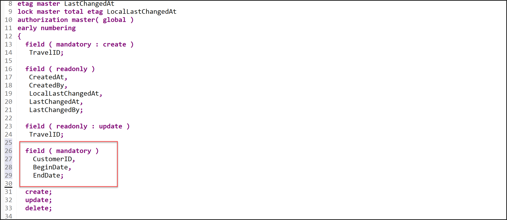
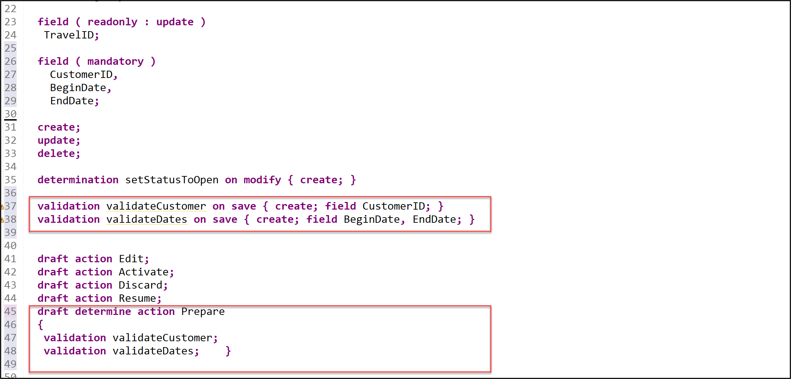
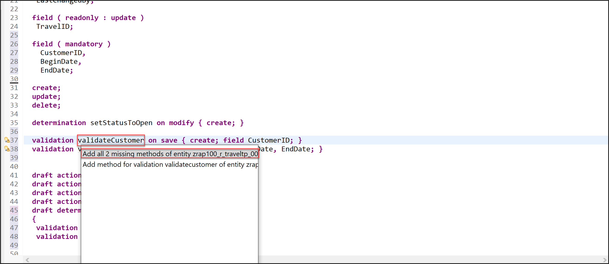
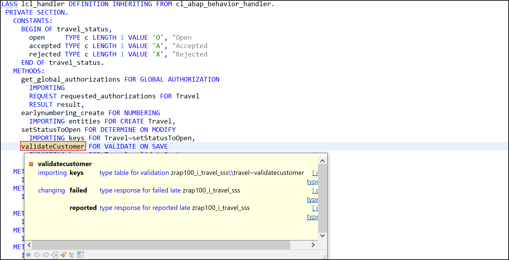
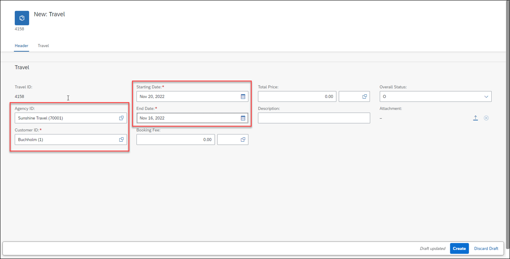
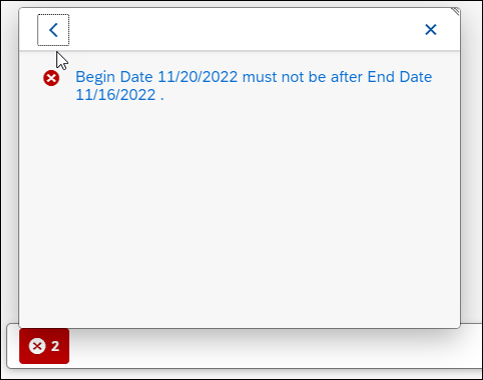

# Enhance the Business Object Behavior With Validations
<!-- description --> Enhance the business object behavior using validation with SAP BTP ABAP environment.

## Prerequisites
- You need to have access to an SAP BTP, ABAP environment, or SAP S/4HANA Cloud, ABAP environment or SAP S/4HANA (release 2021 or higher) system.
For example, you can create [free trial user on SAP BTP, ABAP environment](abap-environment-trial-onboarding).
- You have downloaded and installed the [latest ABAP Development Tools (ADT)] (https://tools.hana.ondemand.com/#abap) on the latest Eclipse© platform.


## You will learn  
  - How to define validations 
  - How to implement validations
  - How to preview and test enhanced travel app

  In the previous exercise, you've defined and implemented a determination for setting the initial value of the field `OverallStatus` to **Open** **(O)** during the creation of new instances of business object entity **Travel**.

  In the present exercise, you're going to define and implement two back-end validations, `validateCustomer` and `validateDates`, to respectively check if the `customer ID` that is entered by the consumer is valid and if the begin date is in the future and if the value of the end date is after the begin date. These validations are only performed in the back-end (not on the UI) and are triggered independently of the caller, i.e. Fiori UIs or EML APIs.
  
  **Hint: Frontend validation & Backend validations**
  Validations are used to ensure the data consistency. As the name suggests, frontend validations are performed on the UI. They are used to improve the user experience by providing faster feedback and avoiding unnecessary roundtrip. In the RAP context, front-end validations are defined using CDS annotation or UI logic. On the other hand, backend validations are performed on the back-end. They are defined in the business object behavior definition and implemented in the respective behavior pools. Frontend validations can be easily bypassed - e.g. by using EML APIs in the RAP context. Therefore, backend validations are a MUST to ensure the data consistency.

---
 
## Intro
>Reminder: Do not forget to replace the suffix placeholder ### with your chosen or assigned group ID in the exercise steps below.
>
>**About: Validations**  
>
>A validation is an optional part of the business object behavior that checks the consistency of business object instances based on trigger conditions.

>A validation is implicitly invoked by the business object's framework if the trigger condition of the validation is fulfilled. Trigger conditions can be `MODIFY` operations and modified fields. The trigger condition is evaluated at the trigger time, a predefined point during the BO runtime. An invoked validation can reject inconsistent instance data from being saved by passing the keys of failed instances to the corresponding table in the `FAILED` structure. Additionally, a validation can return messages to the consumer by passing them to the corresponding table in the `REPORTED` structure.

> **Further reading**: [Validations](https://help.sap.com/viewer/923180ddb98240829d935862025004d6/Cloud/en-US/171e26c36cca42699976887b4c8a83bf.html)


### Define the Validations validateCustomer and validateDates

Define the validations `validateCustomer` and `validateDates`.  

  1. Open your behavior definition  **`ZRAP100_R_TRAVELTP_###`**.
  
  2. Because empty values will not be accepted for the fields `CustomerID`, `BeginDate`, and `EndDate`, specify them as mandatory field by adding the following code snippet after the determination as shown on the screenshot below.

    ```ABAP
    field ( mandatory )
    CustomerID,
    BeginDate,
    EndDate; 
    ```    

    Your source code should look like this:

       

  3. Define the validations **`validateCustomer`** and **`validateDates`**. For that, add the following code snippet after the determination.

    ```ABAP
    validation validateCustomer on save { create; field CustomerID; }
    validation validateDates on save { create; field BeginDate, EndDate; }
    ```         

  4. In order to have draft instances being checked and determinations being executed before they become active, they have to be specified for the **`draft determine action prepare`** in the behavior definition.

    Replace the code line **`draft determine action Prepare;`** with the following code snippet as shown on the screenshot below

    ```ABAP
    draft determine action Prepare
    { 
    validation validateCustomer;
    validation validateDates;    }
    ```    

    Your source code should look like this:

               

    **Short explanation**:    

     - Validations are always invoked during the save and specified with the keyword `validateCustomer on save`.   

     - `validateCustomer` is a validation with trigger operation `create` and trigger field `CustomerID`.    

     - `validateDates` is a validation with trigger operation `create` and trigger fields `BeginDate` and `EndDate`.            

    >**Hint:** In case a validation should be invoked at every change of the BO entity instance, then the trigger conditions createand update must be specified: e.g. validation `validateCustomer on save { create; update; }`

  5. Save  and activate  the changes.

  6. Add the appropriate **`FOR VALIDATE ON SAVE`** methods to the local handler class of the behavior pool of the **Travel** BO entity via quick fix.  

     For that, set the cursor on one of the validation names and press **Ctrl+1** to open the **Quick Assist** view and select the entry **Add all 2 missing methods of entity `zrap100_i_travel_###`**.

     As a result, the **`FOR VALIDATE ON SAVE`** methods **`validateCustomer`** and **`validateDates`** will be added to the local handler class `lcl_handler` of the behavior pool of the **Travel** BO entity  `ZRAP100_BP_TRAVELTP_###`.       
 
       

  7. Save  and activate  the changes.

    >**Hint:** If you get an error message in the behavior implementation The entity `ZRAP100_R_TRAVELTP_###` does not have a validation `VALIDATECUSTOMER`. try to activate the behavior definition once again.

 

### Implement the Validation validateCustomer

Implement the validation `validateCustomer` which checks if the customer ID (`CustomerID`) that is entered by the consumer is valid.   
An appropriate message should be raised and displayed on the UI for each invalid value.

 1. First, check the interface of the new methods in the declaration part of the local handler class `lcl_handler` of the behavior pool of the **Travel** BO entity  **`ZRAP100_BP_TRAVEL_###`**.

    For that, set the cursor on the method name, **`validateCustomer`**, press **F2** to open the **ABAP Element Info** view, and examine the full method interface.

      

     **Short explanation**:  

      - The addition **`FOR VALIDATE ON SAVE`** indicates that the method provides the implementation of a validation executed on save. Validations are always executed on save.

      -  Method signature for the validation method:

      - `IMPORTING` parameter `keys` - an internal table containing the keys of the instances on which the validation should be performed.

      - Implicit `CHANGING` parameters (aka `_implicit response parameters_`):  

        - **failed**   - table with information for identifying the data set where an error occurred

        - **reported** - table with data for instance-specific messages

     You can go ahead and implement the validation method.

 2. Now implement the method `validateCustomer` in the implementation part of the class.

    The logic consists of the following main steps:   
      - Read the travel instance(s) of the transferred keys (`keys`) using the EML statement `READ ENTITIES`.   

      - The addition `FIELDS` is used to specify the fields to be read. Only `CustomerID` is relevant for the present validation.  

    The addition `ALL FIELDS` can be used to read all fields.

      - The addition `IN LOCAL MODE` is used to exclude feature controls and authorization checks.

      - Read all the transferred (distinct, non-initial) customer IDs and check if they exist.  

      - Prepare/raise messages for all transferred **travel** instances with initial and non-existing customer ID (`CustomerID`)  
        and set the changing parameter **reported**

      - In the context of Draft, state-messages are used for reporting problems.  A  `REPORTED`-entry becomes a state-message by filling the `%STATE_AREA`.  
      State-messages are stored together with the state of the draft. As a consequence they need to be cleared before the corresponding check is executed again.

    Replace the current method implementation of `validateCustomer` with following code snippet and replace all occurrences of the placeholder **`###`** with your group ID.

    You can use the **F1 Help** to get detailed information on the different ABAP and EML statements.  

    ```ABAP
    **********************************************************************
    * Validation: Check the validity of the entered customer data
    **********************************************************************
      METHOD validateCustomer.
          "read relevant travel instance data
          READ ENTITIES OF ZRAP100_R_TravelTP_### IN LOCAL MODE
          ENTITY Travel
           FIELDS ( CustomerID )
           WITH CORRESPONDING #( keys )
          RESULT DATA(travels).

          DATA customers TYPE SORTED TABLE OF /dmo/customer WITH UNIQUE KEY customer_id.

          "optimization of DB select: extract distinct non-initial customer IDs
          customers = CORRESPONDING #( travels DISCARDING DUPLICATES MAPPING customer_id = customerID EXCEPT * ).
          DELETE customers WHERE customer_id IS INITIAL.
          IF customers IS NOT INITIAL.

            "check if customer ID exists
            SELECT FROM /dmo/customer FIELDS customer_id
                                      FOR ALL ENTRIES IN @customers
                                      WHERE customer_id = @customers-customer_id
              INTO TABLE @DATA(valid_customers).
          ENDIF.

          "raise msg for non existing and initial customer id
          LOOP AT travels INTO DATA(travel).

            APPEND VALUE #(  %tky                 = travel-%tky
                             %state_area          = 'VALIDATE_CUSTOMER'
                           ) TO reported-travel.

            IF travel-CustomerID IS  INITIAL.
              APPEND VALUE #( %tky = travel-%tky ) TO failed-travel.

              APPEND VALUE #( %tky                = travel-%tky
                              %state_area         = 'VALIDATE_CUSTOMER'
                              %msg                = NEW /dmo/cm_flight_messages(
                                                                      textid   = /dmo/cm_flight_messages=>enter_customer_id
                                                                      severity = if_abap_behv_message=>severity-error )
                              %element-CustomerID = if_abap_behv=>mk-on
                            ) TO reported-travel.

            ELSEIF travel-CustomerID IS NOT INITIAL AND NOT line_exists( valid_customers[ customer_id = travel-CustomerID ] ).
              APPEND VALUE #(  %tky = travel-%tky ) TO failed-travel.

              APPEND VALUE #(  %tky                = travel-%tky
                               %state_area         = 'VALIDATE_CUSTOMER'
                               %msg                = NEW /dmo/cm_flight_messages(
                                                                      customer_id = travel-customerid
                                                                      textid      = /dmo/cm_flight_messages=>customer_unkown
                                                                      severity    = if_abap_behv_message=>severity-error )
                               %element-CustomerID = if_abap_behv=>mk-on
                            ) TO reported-travel.
            ENDIF.

          ENDLOOP.
      ENDMETHOD.      
    ```  

 3. Save  and activate  the changes.


### Implement the Validation validateDates

Implement the validation `validateDates` which checks the validity of entered begin dates (`BeginDate`) and end dates (`EndDate`).
An appropriate messages should be raised and displayed on the UI for each invalid value.

 1. In your implementation class  **`ZRAP100_BP_TRAVELTP_###`**, replace the current method implementation of **`validateDates`** with following code snippet and replace all occurrences of the placeholder **`###`** with your group ID.

    The main implementation steps are similar to the one of method **`validateCustomer`**.

    This validation is performed on the fields **`BeginDate`** and **`EndDate`**. It checks if the entered begin date (`BeginDate`) is in the future and if the value of the entered end date (`EndDate`) is after the begin date (`BeginDate`).   

    ```ABAP
    **********************************************************************
    * Validation: Check the validity of begin and end dates
    **********************************************************************
      METHOD validateDates.

        READ ENTITIES OF ZRAP100_R_TravelTP_### IN LOCAL MODE
          ENTITY Travel
            FIELDS (  BeginDate EndDate TravelID )
            WITH CORRESPONDING #( keys )
          RESULT DATA(travels).

        LOOP AT travels INTO DATA(travel).

          APPEND VALUE #(  %tky               = travel-%tky
                           %state_area        = 'VALIDATE_DATES' ) TO reported-travel.

          IF travel-BeginDate IS INITIAL.
            APPEND VALUE #( %tky = travel-%tky ) TO failed-travel.

            APPEND VALUE #( %tky               = travel-%tky
                            %state_area        = 'VALIDATE_DATES'
                             %msg              = NEW /dmo/cm_flight_messages(
                                                                    textid   = /dmo/cm_flight_messages=>enter_begin_date
                                                                    severity = if_abap_behv_message=>severity-error )
                          %element-BeginDate = if_abap_behv=>mk-on ) TO reported-travel.
          ENDIF.
          IF travel-BeginDate < cl_abap_context_info=>get_system_date( ) AND travel-BeginDate IS NOT INITIAL.
            APPEND VALUE #( %tky               = travel-%tky ) TO failed-travel.

            APPEND VALUE #( %tky               = travel-%tky
                            %state_area        = 'VALIDATE_DATES'
                             %msg              = NEW /dmo/cm_flight_messages(
                                                                    begin_date = travel-BeginDate
                                                                    textid     = /dmo/cm_flight_messages=>begin_date_on_or_bef_sysdate
                                                                    severity   = if_abap_behv_message=>severity-error )
                            %element-BeginDate = if_abap_behv=>mk-on ) TO reported-travel.
          ENDIF.
          IF travel-EndDate IS INITIAL.
            APPEND VALUE #( %tky = travel-%tky ) TO failed-travel.

            APPEND VALUE #( %tky               = travel-%tky
                            %state_area        = 'VALIDATE_DATES'
                             %msg                = NEW /dmo/cm_flight_messages(
                                                                    textid   = /dmo/cm_flight_messages=>enter_end_date
                                                                   severity = if_abap_behv_message=>severity-error )
                            %element-EndDate   = if_abap_behv=>mk-on ) TO reported-travel.
          ENDIF.
          IF travel-EndDate < travel-BeginDate AND travel-BeginDate IS NOT INITIAL
                                               AND travel-EndDate IS NOT INITIAL.
            APPEND VALUE #( %tky = travel-%tky ) TO failed-travel.

            APPEND VALUE #( %tky               = travel-%tky
                            %state_area        = 'VALIDATE_DATES'
                            %msg               = NEW /dmo/cm_flight_messages(
                                                                    textid     = /dmo/cm_flight_messages=>begin_date_bef_end_date
                                                                    begin_date = travel-BeginDate
                                                                    end_date   = travel-EndDate
                                                                    severity   = if_abap_behv_message=>severity-error )
                            %element-BeginDate = if_abap_behv=>mk-on
                            %element-EndDate   = if_abap_behv=>mk-on ) TO reported-travel.
          ENDIF.
        ENDLOOP.

      ENDMETHOD.
    ```

 2. Save  and activate  the changes.


### Preview and test the enhanced travel app

Now the SAP Fiori elements app can be tested.

You can either refresh your application in the browser using **F5** if the browser is still open - or go to your service binding **`ZRAP100_UI_TRAVEL_O4_###`** and start the Fiori elements App preview for the **Travel** entity set.

  1. Click **Create** to create a new entry.

  2. Select an `Sunshine Travel (70001)` as Agency ID,  **12345** as Customer ID, Mar 16, 2022 as starting date and Mar 14, 2022 as end date and click **Create**.

       

  3. You should get following message displayed.

      


### Test yourself 


---
