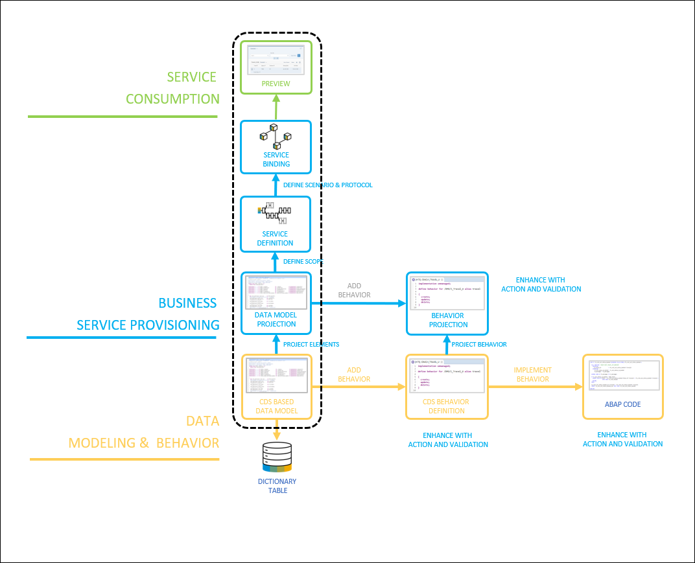
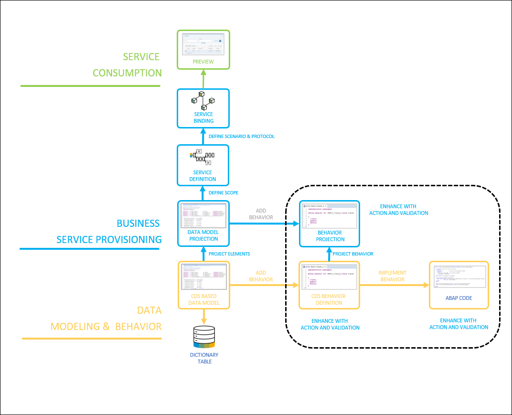
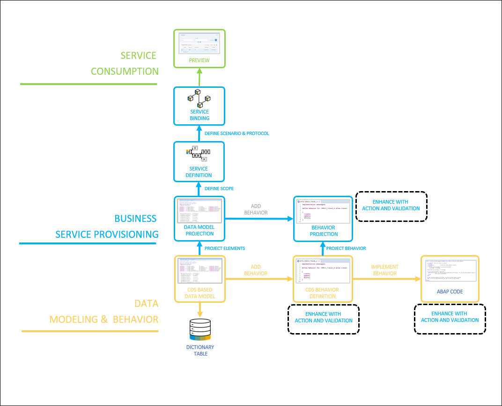

## Details
### You will learn  
  - How the ABAP RESTful Application Programming Model is structured
  - How the development flow is organized

In the course of the following tutorials you will be able to build a travel booking example with the help of the ABAP RESTful Application Programming Model.

Start to have a closer look to the ABAP RESTful Application Programming Model and the relationships.

After this tutorial, you'll understand the theory behind the ABAP RESTful Application Programming Model and apply it to the flight model example in the upcoming tutorials.

---

[ACCORDION-BEGIN [Step 1: ](Get to know the ABAP RESTful Application Programming Model overview)]
The ABAP RESTful Application Programming Model consists of three main layers:

 - Data Modeling & Behavior
 - Business Services Provisioning
 - Service Consumption  

The **data modeling and behavior layer** contains domain-specific business objects, that are defined with Core Data Services (CDS) and transactional behavior.

The **business service provisioning layer** consists of projection views with their projection behavior to focus on a particular aspect of the data model which is exposed as business services through the OData protocol.

The **service consumption** layer allows you to consume all types of OData services as well as OData Web APIs.

[DONE]
[ACCORDION-END]

[ACCORDION-BEGIN [Step 2: ](Get to know the database layer)]
Now investigate how the development flow (creation of artifacts etc.) looks in more detail. The **database layer** is defined by the definition of dictionary tables. The dictionary tables are the basis of the travel booking data model.

[DONE]
[ACCORDION-END]

[ACCORDION-BEGIN [Step 3: ](Get to know the CDS based data model)]
Our semantic data model is defined by **Core Data Services** (CDS). Core Data Services are views on top of the dictionary tables.

In the **CDS layer** you can use and manipulate data that is persisted in the database.

The **projection** is a subset of the fields of the underlying data model, that are relevant for the application. For example UI annotations would be part of a projection view.

With the **service definition** you are able to define which data is exposed as a business service.

**Service bindings** allow you to bind service definitions to a client-server communication protocol such as OData. The service binding is used to start the SAP Fiori Elements App Preview, which makes the application visible on the UI.

To develop a read-only application you need to carry out the steps contain in the dashed rectangle.

[DONE]
[ACCORDION-END]

[ACCORDION-BEGIN [Step 4: ](Get to know the transactional behavior)]
The **behavior definition** determines the create, update and delete functionality.

The **behavior implementation** provides the implementation of a behavior. In the managed approach (Greenfield implementation), the implementation of create, update and delete is done automatically.

To develop a full transactional application the steps in the dashed rectangle are required in addition.

[DONE]
[ACCORDION-END]

[ACCORDION-BEGIN [Step 5: ](Learn how to enhance behavior)]
You are able to check the data consistency of an existing instance of an entity by adding **validations**.

**Actions** can be used as part of the business logic to execute non-standard operations, such as status change.

To develop additional custom logic such as validations and actions the steps in the dashed rectangle need to be carried out.

[DONE]
[ACCORDION-END]

[ACCORDION-BEGIN [Step 6: ](Test yourself)]

[VALIDATE_1]
[ACCORDION-END]

---
