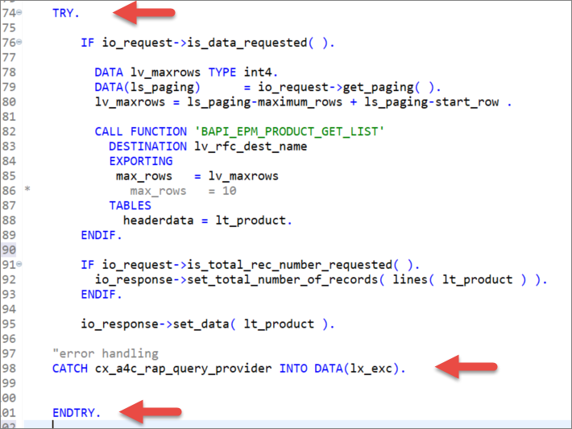
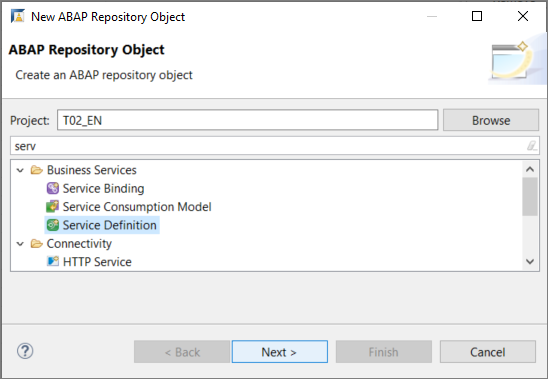
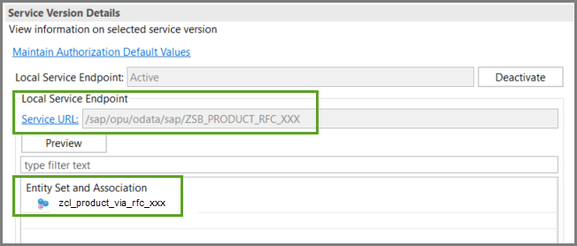

## Prerequisites

## Details
### You will learn
  - How to create a suitable custom entity to get data from a remote system
  - How to implement a query provider class to get the data, using a BAPI (Business Application Programming Interface)
  - How to expose the custom entity as a business service
  - How to display the data in a Fiori Elements Preview, using the service binding

A BAPI is a standard interface to a business object model, implemented as a function module. For more information, see: [BAPI](https://help.sap.com/viewer/166400f6be7b46e8adc6b90fd20f3516/1709%20002/en-US)

Custom entities are used for data models whose runtime is implemented manually. There is no SELECT statement on the data source. Rather, you define the elements and their types in the custom entity. Then you implement the data retrieval logic in an ABAP class, which is referenced in an entity annotation.
Custom entities allow you to get data using an OData service or, as here, using RFC.

For more information on CDS custom entities, see [SAP Help Portal: Using a CDS Custom Entity to Define the Data Model for an OData Service](https://help.sap.com/viewer/c0d02c4330c34b3abca88bdd57eaccfc/Cloud/en-US/6a064c09c508435a81357898e8e65d06.html)

To see this tutorial group as a blog series by Andre Fischer, see: [How to call a remote function module in your on-premise SAP system from SAP Cloud Platform – ABAP Environment](https://blogs.sap.com/2019/02/28/how-to-call-a-remote-function-module-in-your-on-premise-sap-system-from-sap-cloud-platform-abap-environment/)

This includes a longer class code sample, which implements filtering.

---

[ACCORDION-BEGIN [Step 1: ](Create a class)]
First, you create the class that implements the data retrieval logic.

1. In ADT, open your ABAP package and choose **New > Class**.

    

2. Enter a name and description:
    - `zcl_product_via_rfc_xxx`
    - Read product data via `RFC`

3. Choose the transport request, then choose **Finish**.


[DONE]
[ACCORDION-END]

[ACCORDION-BEGIN [Step 2: ](Add the interfaces statement)]
The signature of the method `IF_A4C_RAP_QUERY_PROVIDER~SELECT` contains the import parameter `io_request`. This parameter represents the OData query options that are delegated from the UI and used as input for the SELECT method. Whenever the OData client requests data, the query implementation class must return the data that matches the request, or throw an exception if the request cannot be fulfilled.

1. Implement the interface by adding this statement to the public section:

    `interfaces if_a4c_rap_query_provider.`

2. Choose **Quick Fix (`Ctrl+1`)**, then choose **Implement the SELECT method...**.

Later in this tutorial, you will implement the SELECT method of the interface.

[DONE]
[ACCORDION-END]

[ACCORDION-BEGIN [Step 3: ](Create a custom entity (CDS View) )]
1. Now choose **New >  Other... > Core Data Services > Data Definition**.

2. Enter a name and description:
    - `z_product_via_rfc_xxx`
    - Read product data via `RFC` from On-Premise

3. Choose the transport request, then choose **Next**. Do **not** choose **Finish**, yet!

4. Choose **Define Custom Entity with Parameters**, then choose **Finish**.

    

[DONE]
[ACCORDION-END]

[ACCORDION-BEGIN [Step 4: ](Specify the class in the CDS view)]
Add the following annotation to the view:

```ABAP

@QueryImplementedBy: 'zcl_product_via_rfc_xxx'

```

[DONE]
[ACCORDION-END]

[ACCORDION-BEGIN [Step 5: ](Define the CDS view)]
Add the following to the view, after the `@QueryImplementedBy` annotation:

```ABAP

@UI: {
  headerInfo: {
  typeName: 'Product',
  typeNamePlural: 'Products'
  }
}

define root custom entity ZJP_PRODUCT_VIA_RFC_5
{

      @UI.facet     : [
        {
          id        :       'Product',
          purpose   :  #STANDARD,
          type      :     #IDENTIFICATION_REFERENCE,
          label     :    'Product',
          position  : 10 }
      ]
      // DDL source code for custom entity for BAPI_EPM_PRODUCT_HEADER
      // generated on: 20190214 at:142338
      @UI           : {
      lineItem      : [{position: 10, importance: #HIGH}],
      identification: [{position: 10}],
      selectionField: [{position: 10}]
      }
  key ProductId     : abap.char( 10 );
      TypeCode      : abap.char( 2 );
      @UI           : {
      lineItem      : [{position: 20, importance: #HIGH}],
      identification: [{position: 20}],
      selectionField: [{position: 20}]
      }
      Category      : abap.char( 40 );
      @UI           : {
      lineItem      : [{position: 30, importance: #HIGH}],
      identification: [{position: 30}]
      }
      Name          : abap.char( 255 );
      @UI           : {
      identification: [{position: 40}]
      }
      Description   : abap.char( 255 );
      SupplierId    : abap.char( 10 );
      SupplierName  : abap.char( 80 );
      TaxTarifCode  : abap.int1;
      @Semantics.unitOfMeasure: true
      MeasureUnit   : abap.unit( 3 );
      @Semantics.quantity.unitOfMeasure: 'WeightUnit'
      WeightMeasure : abap.quan( 13, 3 );
      @Semantics.unitOfMeasure: true
      WeightUnit    : abap.unit( 3 );
      @UI           : {
      lineItem      : [{position: 50, importance: #HIGH}],
      identification: [{position: 50}]
      }
      Price         : abap.dec( 23, 4 );
      @Semantics.currencyCode: true
      CurrencyCode  : abap.cuky( 5 );
      @Semantics.quantity.unitOfMeasure: 'DimUnit'
      Width         : abap.quan( 13, 3 );
      @Semantics.quantity.unitOfMeasure: 'DimUnit'
      Depth         : abap.quan( 13, 3 );
      @Semantics.quantity.unitOfMeasure: 'DimUnit'
      Height        : abap.quan( 13, 3 );
      @Semantics.unitOfMeasure: true
      DimUnit       : abap.unit( 3 );
      ProductPicUrl : abap.char( 255 );

}

```

You will now implement the data retrieval logic in the class

[DONE]
[ACCORDION-END]

[ACCORDION-BEGIN [Step 6: ](Define some variables in the class)]
Go back to the class. You will start by defining an local internal table and structure, which you will fill by retrieving the data from the back end.

```ABAP
DATA lt_product TYPE STANDARD TABLE OF zjp_product_via_rfc_5.
DATA ls_product TYPE zjp_product_via_rfc_5 .

```

[DONE]
[ACCORDION-END]

[ACCORDION-BEGIN [Step 7: ](Define the connection)]
1. Define the connection as follows, replacing `XXX` in both `i_name` and `i_service_instance_name`.

    ```ABAP

    DATA(lo_rfc_dest) = cl_rfc_destination_provider=>create_by_cloud_destination(
                               i_name = |S4TEST_RFC_XXX|
                               i_service_instance_name = |OutboundComm_for_RFCDemo_XXX| ).

    DATA(lv_rfc_dest_name) = lo_rfc_dest->get_destination_name( ).

    ```

2. Wrap this block in a TRY...CATCH...ENDTRY block.

    ```ABAP

    TRY.
    ...

      CATCH cx_rfc_dest_provider_error INTO DATA(lx_dest).

    ENDTRY.

    ```

[DONE]
[ACCORDION-END]

[ACCORDION-BEGIN [Step 8: ](Call the remote BAPI)]
1. Check whether data is being requested.

    ```ABAP

    IF io_request->is_data_requested( ).

    ENDIF.
    ```

2. If so, call the BAPI.

    ```ABAP

    DATA lv_maxrows TYPE int4.
    DATA(ls_paging)      = io_request->get_paging( ).
    lv_maxrows = ls_paging-maximum_rows + ls_paging-start_row .

    CALL FUNCTION 'BAPI_EPM_PRODUCT_GET_LIST'
      DESTINATION lv_rfc_dest_name
      EXPORTING
         max_rows   = lv_maxrows

      TABLES
        headerdata = lt_product.

    ```

[DONE]
[ACCORDION-END]

[ACCORDION-BEGIN [Step 9: ](Set the total number of records)]
Set the total number of records requested.

```ABAP

IF io_request->is_total_rec_number_requested( ).
io_response->set_total_number_of_records( lines( lt_product ) ).
ENDIF.

```

[DONE]
[ACCORDION-END]

[ACCORDION-BEGIN [Step 10: ](Return the data)]
1. Return the data in the internal table.

    ```ABAP

    io_response->set_data( lt_product ).

    ```

2. Again, wrap the `BAPI` call in a TRY...CATCH block:

```ABAP

CATCH cx_a4c_rap_query_provider INTO DATA(lx_exc).

```



[DONE]
[ACCORDION-END]

[ACCORDION-BEGIN [Step 11: ](Check the code for your class)]

```ABAP

CLASS zcl_product_via_rfc_xxx DEFINITION
  PUBLIC
  FINAL
  CREATE PUBLIC .

  PUBLIC SECTION.
    INTERFACES if_a4c_rap_query_provider.
  PROTECTED SECTION.
  PRIVATE SECTION.
ENDCLASS.


CLASS zcl_jp_product_via_rfc_6 IMPLEMENTATION.
  METHOD if_a4c_rap_query_provider~select.

    "variables needed to call BAPIs - z_product_via_rfc_xxx = the CDS View
    DATA lt_product TYPE STANDARD TABLE OF z_product_via_rfc_xxx.
    DATA ls_product TYPE z_product_via_rfc_xxx .

    TRY.
        DATA(lo_rfc_dest) = cl_rfc_destination_provider=>create_by_cloud_destination(
                                   i_name = |S4TEST_RFC_XXX|
                                   "
                                   i_service_instance_name = |OutboundComm_for_RFCDemo_XXX| ).

        DATA(lv_rfc_dest_name) = lo_rfc_dest->get_destination_name( ).

      CATCH cx_rfc_dest_provider_error INTO DATA(lx_dest).

    ENDTRY.

    TRY.

        IF io_request->is_data_requested( ).

          DATA lv_maxrows TYPE int4.
          DATA(ls_paging)      = io_request->get_paging( ).
          lv_maxrows = ls_paging-maximum_rows + ls_paging-start_row .

          CALL FUNCTION 'BAPI_EPM_PRODUCT_GET_LIST'
            DESTINATION lv_rfc_dest_name
            EXPORTING
             max_rows   = lv_maxrows
    *              max_rows   = 10
            TABLES
              headerdata = lt_product.
        ENDIF.

        IF io_request->is_total_rec_number_requested( ).
          io_response->set_total_number_of_records( lines( lt_product ) ).
        ENDIF.

        io_response->set_data( lt_product ).

    "error handling
    CATCH cx_a4c_rap_query_provider INTO DATA(lx_exc).


    ENDTRY.
  ENDMETHOD.
ENDCLASS.

```

[DONE]
[ACCORDION-END]

[ACCORDION-BEGIN [Step 12: ](Create a service definition)]
Now that you have defined your view, you can expose it as a service. A service consists of a definition and a binding. This allows you to provide several bindings for the same definition, e.g. to expose the service to a UI, and to an `A2X` provider. Start with the definition:

1. From your package, choose **New > Other... > Service Definition** from the context menu, then choose **Next**.

    

2. Choose a name and description:
    - `ZSD_A4C_RFC_XXX`
    - Read product data via RFC

3. Choose the transport request; choose **Next**.

4. Use the selected template; choose **Finish**.

[DONE]
[ACCORDION-END]

[ACCORDION-BEGIN [Step 13: ](Specify the view name)]
In the editor that appears, replace `entity_name` with the name of your custom entity.

```ABAP

@EndUserText.label: 'Read product data'
define service ZSD_A4C_RFC_XXX {
  expose zcl_product_via_rfc_xxx;

}

```


[DONE]
[ACCORDION-END]

[ACCORDION-BEGIN [Step 14: ](Create the service binding)]
1. From your package, choose **New > Other... > Service Binding** from the context menu, then choose **Next**.

2. Choose:
    - Name = `ZSB_A4C_RFC_XXX`
    - Description = Read product data via RFC
    - Binding Type = ODATA V2 (UI...)
    - Service Definition = `ZSD_A4C_RFC_XXX`

    

3. Choose the transport request; choose **Next**.

4. Use the selected template; choose **Finish**.

[DONE]
[ACCORDION-END]

[ACCORDION-BEGIN [Step 15: ](Activate the service binding; )]
1. In the editor that appears, choose **Activate**.

    

2. You can now see the Service URL and Entity Set.

    

[DONE]
[ACCORDION-END]

[ACCORDION-BEGIN [Step 16: ](Display the Fiori Elements Preview)]
1. Select the entity set and choose **Preview**.

    

2. Log in using your ABAP Environment user and password; the Fiori Elements Preview appears.

3. Display the data by choosing **Go**.

    

[DONE]
[ACCORDION-END]

[ACCORDION-BEGIN [Step 17: ](Test yourself)]

[VALIDATE_1]
[ACCORDION-END]

[ACCORDION-BEGIN [Step 18: ](Troubleshooting: Test data retrieval using the ABAP Console)]
If the data does not display, check that the BAPI is retrieving the data, as follows:

1. Open the class you created in [Test the Connection to the Remote System](abap-environment-test-rfc).

2. Replace the type `ty_bapi_epm_product_header`:

    ```ABAP

    DATA lt_product TYPE STANDARD TABLE OF  ty_bapi_epm_product_header.
    DATA ls_product TYPE ty_bapi_epm_product_header.

    ```

with the type of your custom entity:

    ```ABAP

    DATA lt_product TYPE STANDARD TABLE OF z_product_via_rfc_xxx.
    DATA ls_product TYPE z_product_via_rfc_xxx.

    ```

The console output should look like this:


[DONE]
[ACCORDION-END]

---
